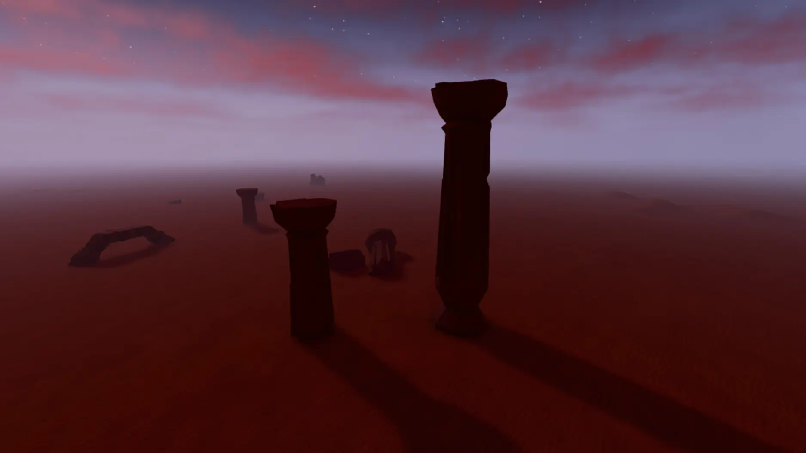
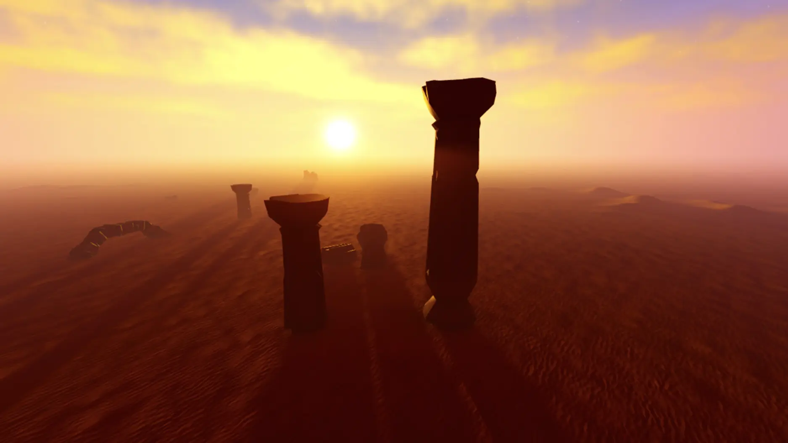
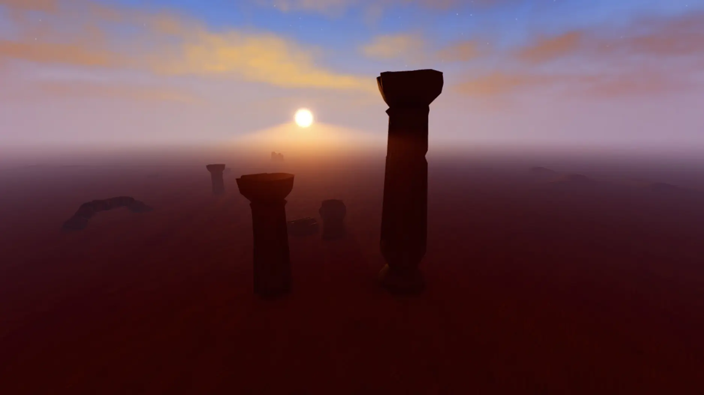
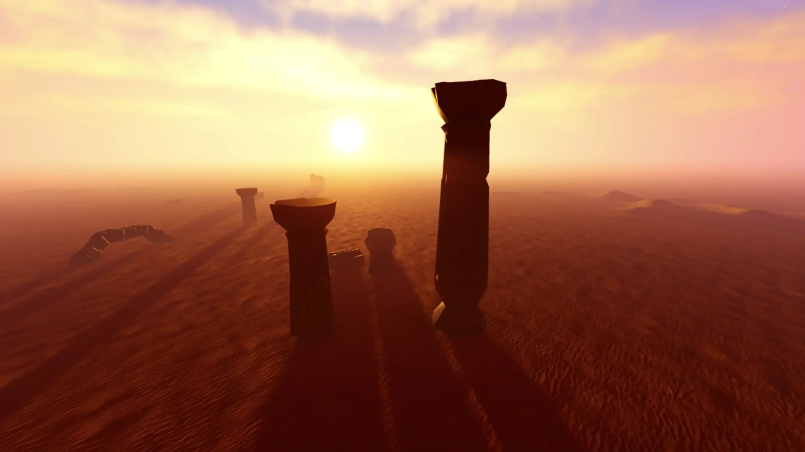
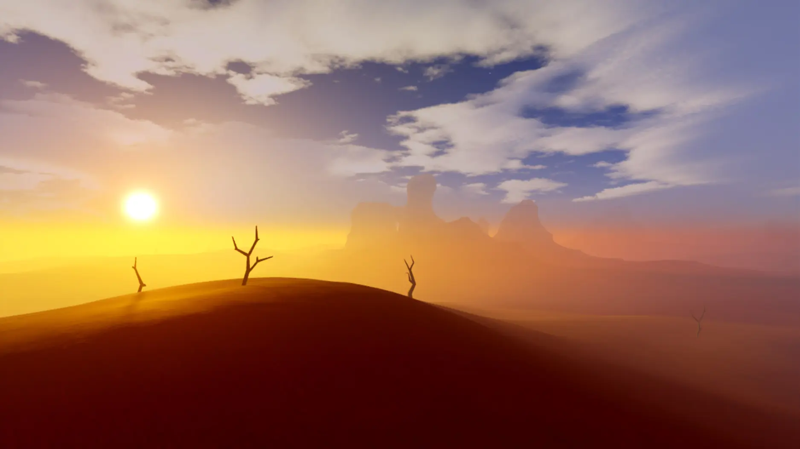
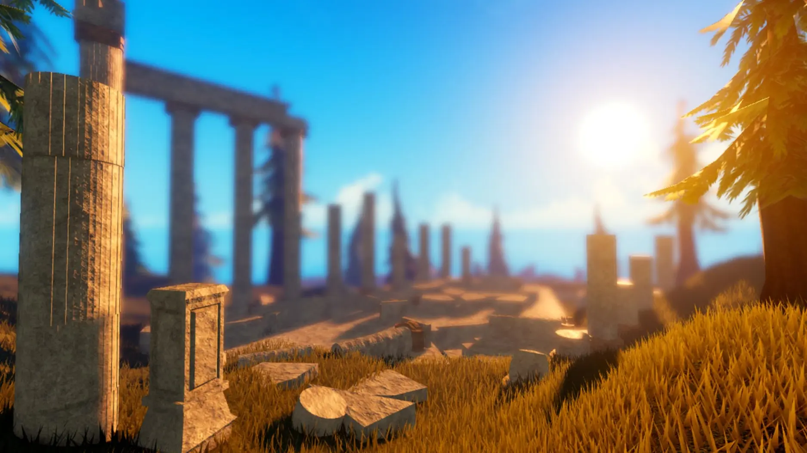

# Lighting and Effects

## 목차
- [Lighting and Effects](#lighting-and-effects)
  - [목차](#목차)
  - [글로벌 조명](#글로벌-조명)
  - [대기 효과](#대기-효과)
  - [구름과 하늘](#구름과-하늘)
  - [후처리 효과](#후처리-효과)
  - [출처](#출처)
  - [다음](#다음)

---

`Lighting` 컨테이너 서비스는 조명, 대기 효과 및 구름과 같은 경험의 환경을 제어하고 사용자 정의할 수 있게 해줍니다. 또한 후처리 효과를 적용하여 화면에 나타나는 경험의 모습을 조정할 수 있습니다.

## 글로벌 조명

`Lighting` 서비스에는 `ClockTime` 및 `Brightness`와 같은 속성을 조정하여 경험의 글로벌 조명을 업데이트할 수 있는 속성이 포함되어 있습니다.

<Tabs>
<TabItem label="ClockTime = 0">

</TabItem>
<TabItem label="ClockTime = 6.3">

</TabItem>
<TabItem label="Brightness = 0.5">

</TabItem>
<TabItem label="Brightness = 3.75">

</TabItem>
</Tabs>

<Alert severity="info">
글로벌 조명 외에도, 광원을 파트 또는 어태치먼트에 생성하고 부착하여 램프, 횃불, 스포트라이트 또는 TV 화면과 같은 물체를 시뮬레이션할 수 있습니다.
</Alert>

## 대기 효과

대기 효과는 고유한 방식으로 태양광을 산란시켜 현실적인 환경을 시뮬레이션합니다. `Lighting` 서비스의 `Atmosphere` 객체를 사용하여 공기 입자 밀도를 제어하고, 안개 또는 눈부심을 시뮬레이션하거나 대기의 색상을 설정하는 등 다양한 작업을 수행할 수 있습니다.

<figure>

<figcaption>멋진 일몰 장면을 렌더링하는 데 사용된 대기 효과</figcaption>
</figure>

## 구름과 하늘

기본적으로 `Sky` 객체는 태양, 달 및 별과 같은 천체가 포함된 스카이박스를 형성합니다. 또한, `Clouds` 객체의 구름 덮개, 밀도 및 색상 속성을 조정하여 글로벌 바람을 통해 하늘을 천천히 떠다니는 현실적인 동적 구름을 렌더링할 수 있습니다.

<figure>
<video src="../img/05_Lighting_and_Effects/Showcase.mp4" controls width="800" alt="바람이 하늘을 가로질러 구름을 불어가는 비디오"></video>
<figcaption>바람이 하늘을 가로질러 구름을 불어가는 모습</figcaption>
</figure>

## 후처리 효과

후처리 효과는 경험의 비주얼을 빠르게 향상시킬 수 있는 사용자 정의 필터입니다. `Lighting` 서비스나 `Camera`에 있는 후처리 효과 객체를 사용하여 다음 작업을 수행할 수 있습니다:

- 밝은 빛을 보는 카메라를 시뮬레이션하고 그 빛의 빛남을 과장합니다
- 경험 전체에 가우시안 블러를 적용하거나 초점이 맞지 않는 경험의 일부에 블러를 추가합니다.
- 특정 분위기를 만들기 위해 색조를 통해 환경의 외관을 향상시킵니다.
- 태양과 함께 움직이는 빛의 후광을 렌더링합니다.

<figure>

<figcaption>거리를 흐리게 하는 깊이 감지 효과가 적용된 풍경</figcaption>
</figure>

---
## 출처
 - [Lighting and Effects](https://create.roblox.com/docs/ko-kr/environment)

---
## [다음](./05_01_Global_Lighting.md)