# Atmospheric Effects

## 목차
- [Atmospheric Effects](#atmospheric-effects)
  - [목차](#목차)
  - [대기 속성](#대기-속성)
    - [Density](#density)
    - [Offset](#offset)
    - [Haze](#haze)
    - [Color](#color)
    - [Glare](#glare)
    - [Decay](#decay)
  - [출처](#출처)
  - [다음](#다음)

---

**대기 효과**는 공기 입자를 제어하는 [속성](#대기-속성)에 따라 햇빛을 독특한 방식으로 산란시켜 현실감 있는 환경을 시뮬레이션합니다. `Atmosphere` 객체를 사용하면 다음과 같은 작업을 수행할 수 있습니다:

- 입자 [밀도](#density) 제어.
- 실루엣을 만들거나 먼 물체를 블렌딩([오프셋](#offset)).
- [안개](#haze) 또는 [섬광](#glare) 시뮬레이션.
- 대기의 [색상](#color) 또는 [감쇠](#decay) 설정.

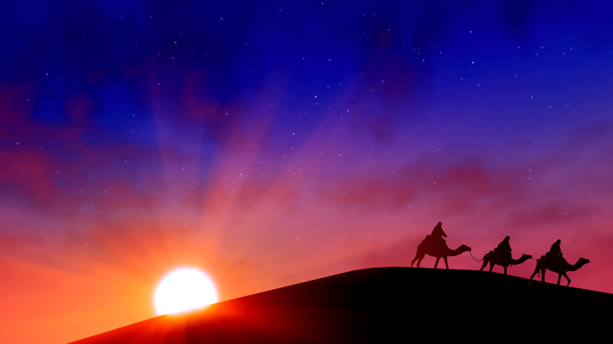

## 대기 속성

`Lighting` 서비스 내의 `Atmosphere` 객체의 모든 속성은 경험의 전체적인 비전, 테마 및 분위기를 지원하기 위해 함께 작동합니다.

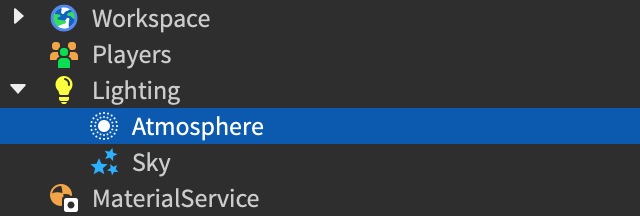

### Density

`Density` 속성은 경험의 공기 중에 존재하는 입자의 양을 제어합니다. 밀도가 높을수록 더 많은 입자가 존재하여 플레이어의 물체 및 지형 시야를 방해합니다.

<Tabs>
  <TabItem label="0">
    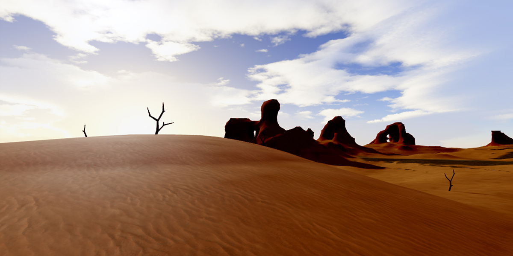
  </TabItem>
  <TabItem label="0.35">
    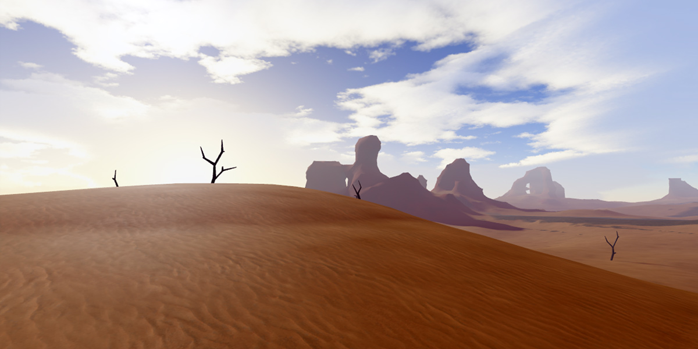
  </TabItem>
</Tabs>

<Alert severity="info">
Density는 물체와 지형에만 직접 영향을 미칩니다. 그러나 이러한 물체와 지형을 통해 스카이박스를 보기 때문에 스카이박스의 가시성에도 영향을 미칩니다.
</Alert>

### Offset

`Offset` 속성은 카메라와 하늘 배경 사이의 빛 전송을 제어합니다. 이 값을 증가시키면 수평선 실루엣을 생성하고, 값을 감소시키면 먼 물체를 하늘과 블렌딩하여 끝없는 무한의 세계를 시뮬레이션합니다.

<Tabs>
  <TabItem label="0">
    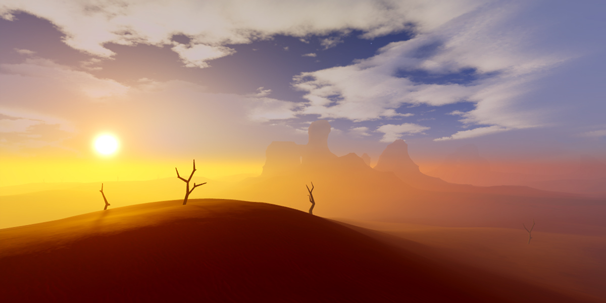
  </TabItem>
  <TabItem label="1">
    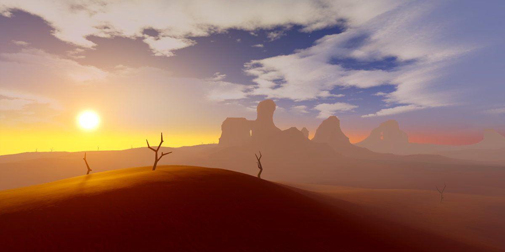
  </TabItem>
</Tabs>

<Alert severity="warning">
`Offset` 속성을 `Density` 속성과 신중하게 균형을 맞추세요. 오프셋 값이 낮으면 스카이박스가 물체와 지형을 통해 보일 수 있으며, 오프셋 값이 높으면 먼 물체와 지형이 원하는 조명 효과에 비해 너무 많은 디테일을 가질 수 있습니다.
</Alert>

### Haze

`Haze` 속성은 대기의 흐림 정도를 제어하여 수평선 위와 카메라에서 먼 거리까지의 가시적인 효과를 생성합니다. 이 속성을 [Color](#color) 속성과 결합하여 오염된 외계 행성의 연기 띠나 음침한 경험을 위한 안개 낀 파란색 띠와 같은 환경 분위기를 조성할 수 있습니다.

<Tabs>
  <TabItem label="1">
    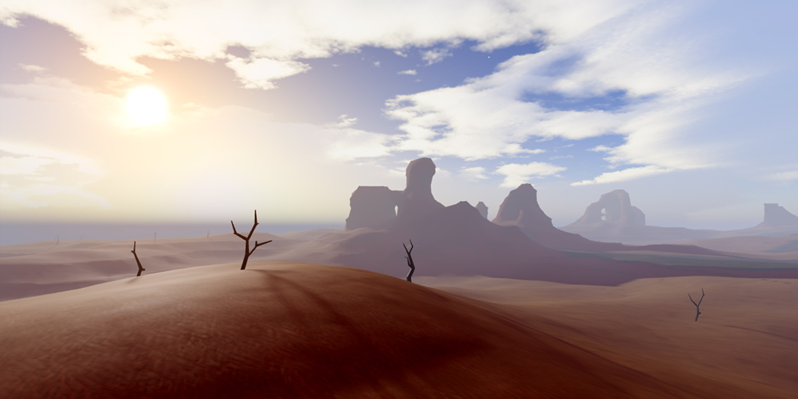
  </TabItem>
  <TabItem label="2.8">
    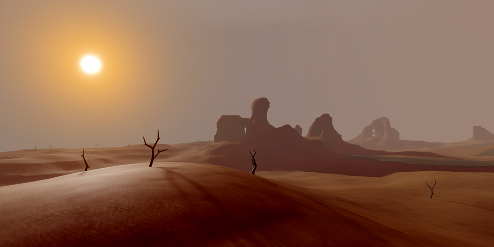
  </TabItem>
</Tabs>

### Color

`Color` 속성은 미묘한 환경 분위기와 테마를 위한 대기의 색조를 설정합니다. 이 속성의 가시적인 효과를 확장하려면 높은 [Haze](#haze) 속성 값과 결합하세요.

<Tabs>
  <TabItem label="[255, 255, 255]">
    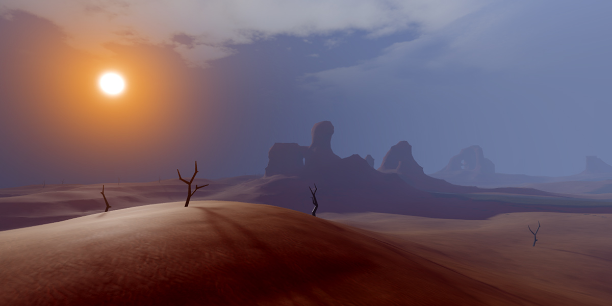
  </TabItem>
  <TabItem label="[255, 200, 255]">
    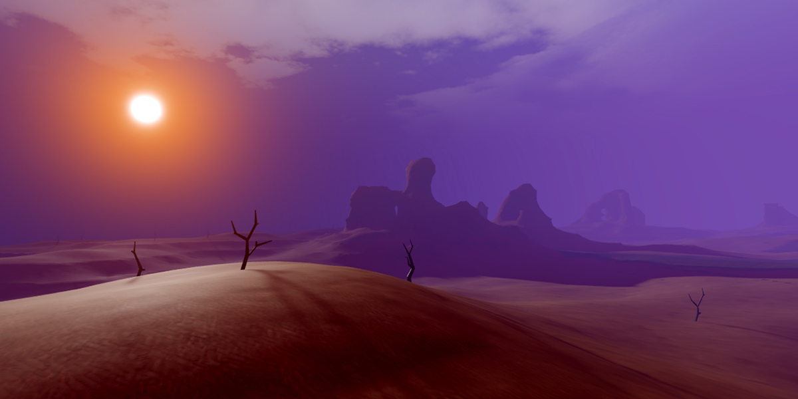
  </TabItem>
</Tabs>

### Glare

`Glare` 속성은 태양 주위의 대기 섬광을 설정합니다. 값이 높을수록 하늘과 경험에 비치는 햇빛의 효과가 증가합니다. 이 속성의 가시적인 효과를 보려면 반드시 0보다 높은 [Haze](#haze) 값을 가진 섬광과 결합해야 합니다.

<Tabs>
  <TabItem label="0">
    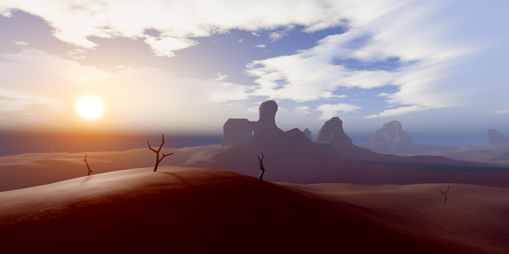
  </TabItem>
  <TabItem label="1">
    
  </TabItem>
</Tabs>

### Decay

`Decay` 속성은 태양에서 멀어지는 대기의 색조를 설정하여 [Color](#color)에서 이 값으로 점진적으로 감소합니다. 이 속성의 가시적인 효과를 보려면 반드시 0보다 높은 [Haze](#haze) 및 [Glare](#glare) 값을 가진 섬광과 결합해야 합니다.

<Tabs>
  <TabItem label="[255, 255, 255]">
    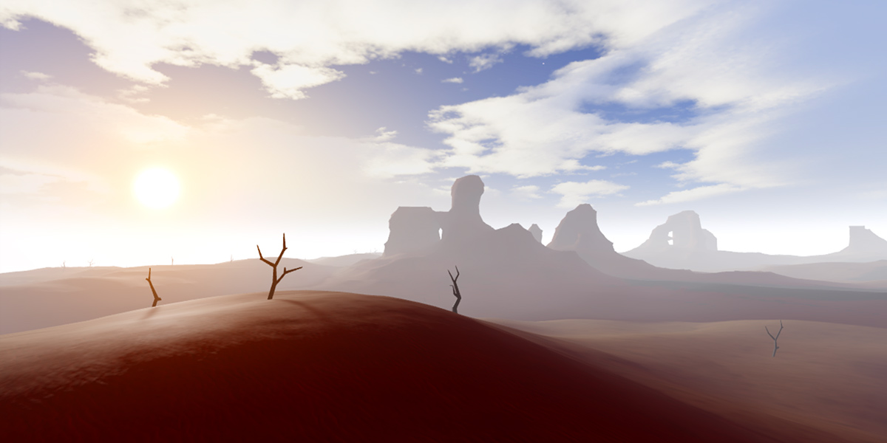
  </TabItem>
  <TabItem label="[255, 90, 80]">
    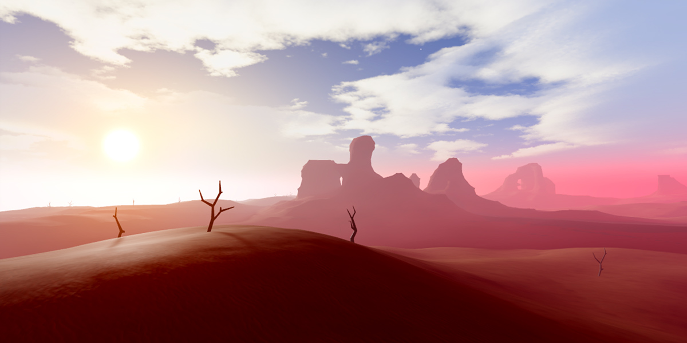
  </TabItem>
</Tabs>

---
## 출처
 - [Atmospheric Effects](https://create.roblox.com/docs/environment/atmosphere)

---
## [다음](./05_03_Clouds.md)