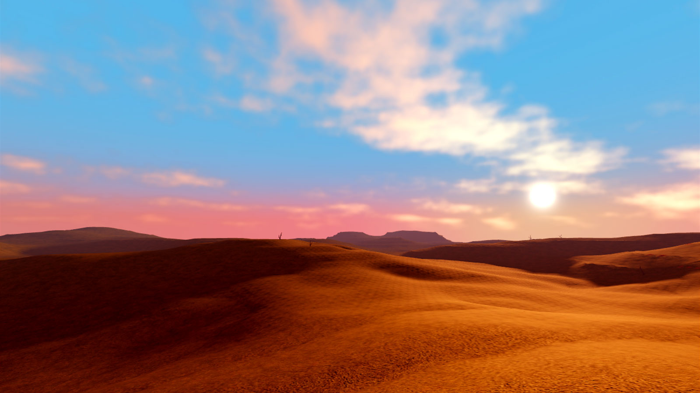
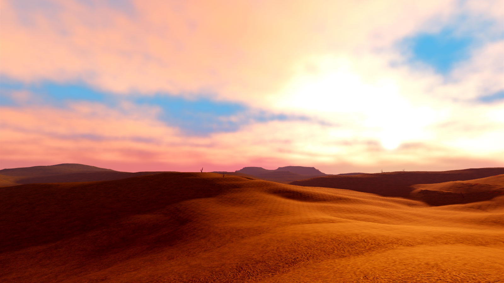
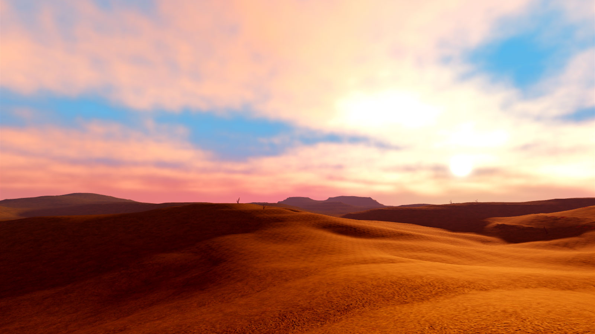
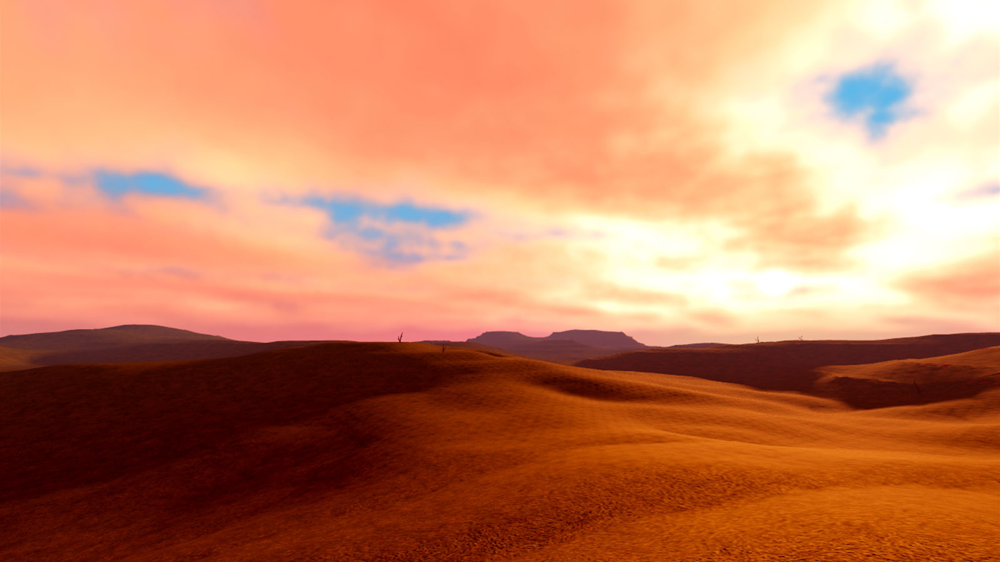
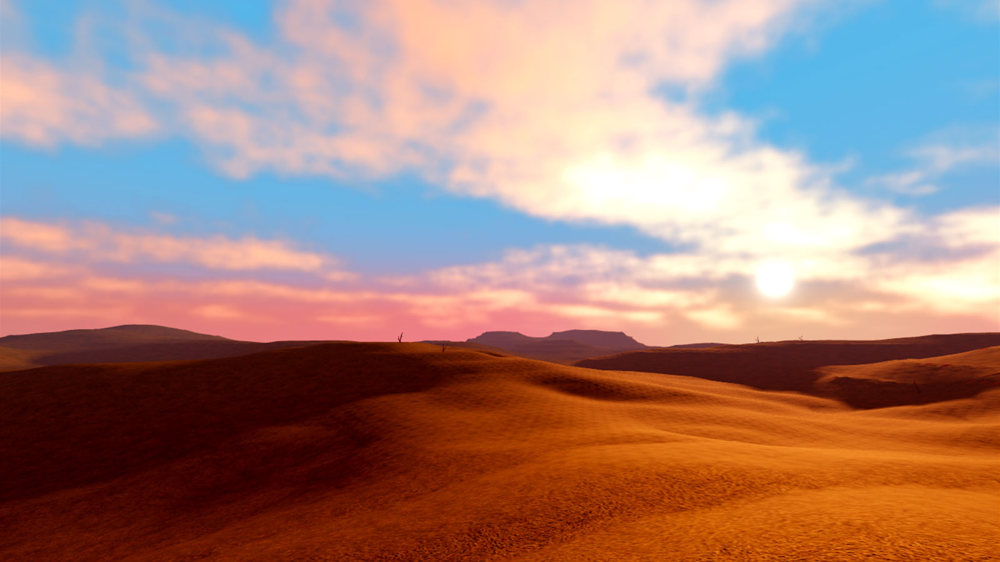
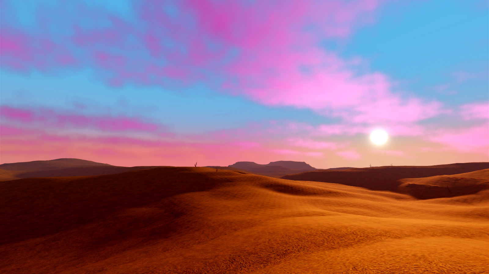

# Dynamic Clouds

## 목차
- [Dynamic Clouds](#dynamic-clouds)
  - [목차](#목차)
  - [구름 활성화](#구름-활성화)
  - [구름 속성](#구름-속성)
    - [Cover](#cover)
    - [Density](#density)
    - [Color](#color)
  - [출처](#출처)
  - [다음](#다음)

---

Roblox의 **동적 구름**은 하늘을 천천히 떠다니는 현실감 있는 구름입니다. `Clouds` 객체를 통해 구름의 외관을 조정하여 폭풍우가 몰아치는 하늘, 놀라운 일몰, 외계 세계와 같은 독특한 분위기를 만들 수 있습니다. 또한 `전역 바람`을 통해 구름의 방향과 속도를 맞춤 설정할 수 있습니다.

<video src="../img/05_03_Clouds/Showcase.mp4" controls width="100%" alt="하늘을 가로질러 동적 구름을 날리는 바람을 보여주는 동영상"></video>

## 구름 활성화

경험에서 `Clouds` 객체를 통해 동적 구름을 관리할 수 있습니다. 이 객체를 조직이나 복제 목적으로 어디에나 배치할 수 있지만, 객체를 `Terrain` 클래스 아래에 두어야 구름이 렌더링됩니다.

동적 구름을 활성화하려면 다음 단계를 따르세요:

1. Explorer 창에서 **Terrain** 위로 마우스를 이동하고 &CirclePlus; 버튼을 클릭합니다. 상황에 맞는 메뉴가 표시됩니다.
2. 메뉴에서 **Clouds**를 삽입합니다.

   

3. 새 객체의 [속성](#구름-속성)을 통해 구름의 외관을 조정하고, 원하는 경우 `전역 바람`을 통해 구름을 이동시킵니다.

## 구름 속성

`Terrain` 아래의 `Clouds` 객체에서 속성 창을 통해 구름의 외관을 조정할 수 있습니다.

### Cover

`Cover` 속성은 전체 하늘층을 가로지르는 구름의 범위를 0(구름이 드문드문함)에서 1(구름이 빽빽함)까지의 값으로 제어합니다.

<Tabs>
  <TabItem label="0.65">
    
  </TabItem>
  <TabItem label="0.8">
    
  </TabItem>
</Tabs>

### Density

`Density` 속성은 각 구름을 구성하는 입자의 강도를 제어하여 주로 구름의 투명도에 영향을 미칩니다. 예를 들어, 낮은 값은 가볍고 반투명한 구름을 생성하고, 높은 값은 무겁고 어두운 구름을 생성하여 폭풍우가 몰아치는 외관을 만듭니다.

<Tabs>
  <TabItem label="0.1">
    
  </TabItem>
  <TabItem label="0.3">
    
  </TabItem>
</Tabs>

### Color

`Color` 속성은 구름 입자의 색상을 제어합니다. 여러 `Lighting` 및 `Atmosphere` 속성도 구름 색상에 영향을 미치므로 특정 분위기를 시뮬레이션하려면 원하는 효과를 얻을 때까지 여러 속성을 실험해 보세요.

<Tabs>
  <TabItem label="[255, 255, 255]">
    
  </TabItem>
  <TabItem label="[75, 50, 255]">
    
  </TabItem>
</Tabs>

---
## 출처
 - [Dynamic Clouds](https://create.roblox.com/docs/environment/clouds)

---
## [다음](./05_04_wind.md)