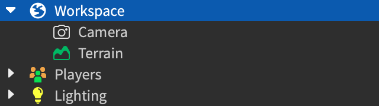
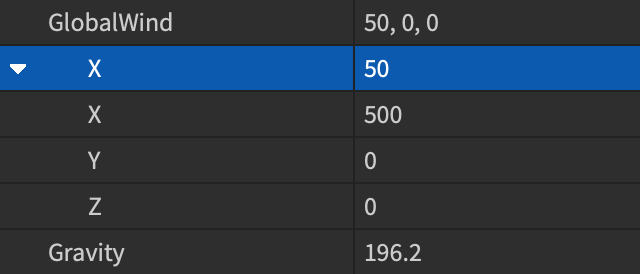
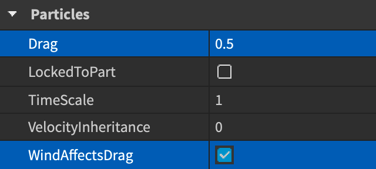
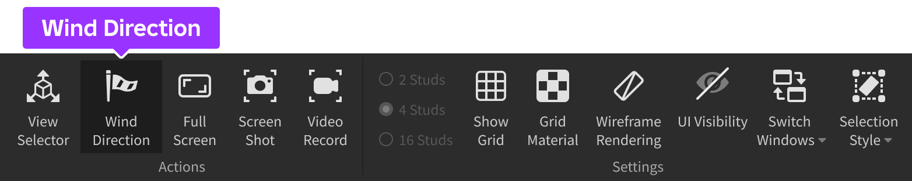
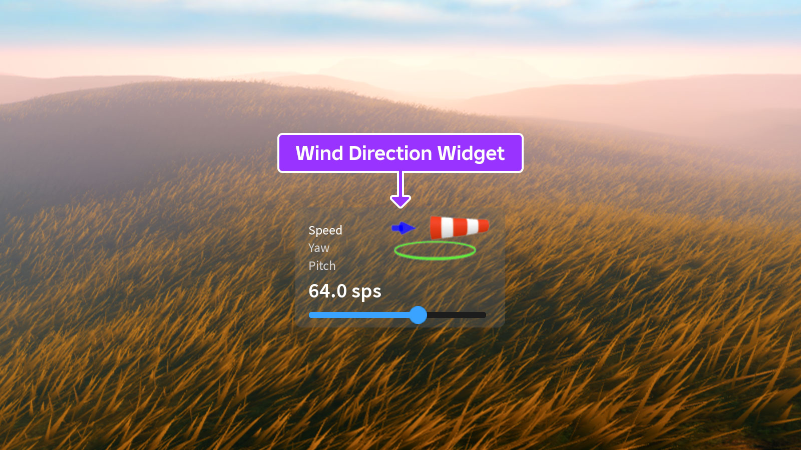

# Global Wind

## 목차
- [Global Wind](#global-wind)
  - [목차](#목차)
  - [전역 바람 벡터](#전역-바람-벡터)
  - [입자 영향](#입자-영향)
  - [바람 방향 위젯](#바람-방향-위젯)
  - [스크립팅 효과](#스크립팅-효과)
  - [출처](#출처)
  - [다음](#다음)

---

`GlobalWind` 벡터는 경험에서 바람이 부는 방향과 강도를 설정하여 `지형 잔디`와 `동적 구름`에 영향을 줍니다. 이를 `상수 벡터`로 설정하거나 `스크립팅`을 통해 주기적인 바람의 돌풍을 생성할 수 있습니다. 또한, `입자`에 전역 바람 벡터를 따르도록 영향을 줄 수 있습니다.

<video src="../img/05_04_wind/Global-Wind-Showcase.mp4" controls width="100%" alt="3D 세계에서 구름과 잔디를 휘몰아치는 바람을 보여주는 비디오"></video>

<Alert severity="warning">
경험에서 전역 바람의 효과를 보려면 애니메이션 지형 잔디 및/또는 동적 구름을 활성화해야 합니다.
</Alert>

## 전역 바람 벡터

전역 바람은 `Workspace`의 속성인 `GlobalWind` 벡터를 통해 제어되며, Studio에서 직접 편집하거나 `스크립팅`을 통해 설정할 수 있습니다.

Studio에서 전역 바람 벡터를 설정하려면 다음 단계를 따르세요:

1. Explorer 창에서 최상위 **Workspace** 객체를 선택합니다.

   

2. Properties 창에서 **GlobalWind** 속성을 찾아 방향과 강도에 대한 **X**, **Y**, **Z** 값을 설정합니다.

   

## 입자 영향

`ParticleEmitter`에서 방출된 입자는 방출기의 `WindAffectsDrag` 속성이 활성화되어 있고 `Drag` 속성이 0보다 큰 경우 전역 바람 벡터를 따릅니다. `Fire`와 `Smoke` 인스턴스는 기본적으로 바람 벡터를 따릅니다.



<video src="../img/05_04_wind/Global-Wind-Particles.mp4" controls width="800" alt="ParticleEmitter에서 방출된 입자를 날리는 바람을 보여주는 비디오"></video>

## 바람 방향 위젯

전역 바람을 더 쉽게 조정하기 위해 **Wind Direction** 위젯을 사용할 수 있습니다. 이 위젯은 `View` 탭에서 접근할 수 있습니다. 이 위젯을 사용하여 "바람 자루" 모델을 통해 바람이 부는 방향을 시각화할 수 있으며, **Speed**, **Yaw**, **Pitch**를 설정할 수 있습니다. 원하는 측면 이름을 클릭하고 슬라이더를 조정하거나 애니메이션 부분의 녹색 링과 파란색 화살표를 조작하여 조정할 수 있습니다. 또한, 위젯을 3D 뷰포트에서 원하는 위치로 드래그하여 이동할 수 있습니다.





## 스크립팅 효과

`GlobalWind` 속성의 스크립팅을 통해 다양한 가능성을 열 수 있습니다. 예를 들어, 다음 코드 샘플을 사용하여 `math.sin()` 함수를 사용하여 점진적으로 바람의 돌풍을 일으킬 수 있습니다.

```lua title="Script - Cyclical Wind Gusts"
local gustCycleDelay = 5  -- Max duration between gust cycles in seconds
local gustCycleDuration = 3.5  -- Duration of each gust cycle in seconds

-- During each gust cycle, a portion of "gust" will be added to "baseWind" in a ramped fashion
local baseWind = Vector3.new(5, 0, 2)  -- Base wind speed and direction
local gust = Vector3.new(25, 0, 10)  -- Gust speed and direction
local gustIntervals = 100  -- Number of iterations used to calculate each gust interval
local dg = gustCycleDuration / gustIntervals
local dgf = dg / gustCycleDuration

-- Set global wind to base wind initially
workspace.GlobalWind = baseWind

-- Wait delay amount before starting gusts
task.wait(gustCycleDelay)

while true do
	for i = 1, gustIntervals do
		local f = math.sin(math.pi * dgf * i)  -- Use sin() function to ramp gust
		workspace.GlobalWind = baseWind + f * gust  -- Set global wind to base wind + gust
		task.wait(dg)
	end
	workspace.GlobalWind = baseWind  -- Reset global wind to base wind at end of gust cycle
	task.wait(math.random() * gustCycleDelay)  -- Wait a random fraction of delay before next gust cycle
end
```

<video src="../img/05_04_wind/Global-Wind-Gusts.mp4" controls width="800" alt="3D 세계에서 구름과 잔디를 휘몰아치는 바람을 보여주는 비디오"></video>

---
## 출처
 - [Global Wind](https://create.roblox.com/docs/environment/global-wind)

---
## [다음](./05)