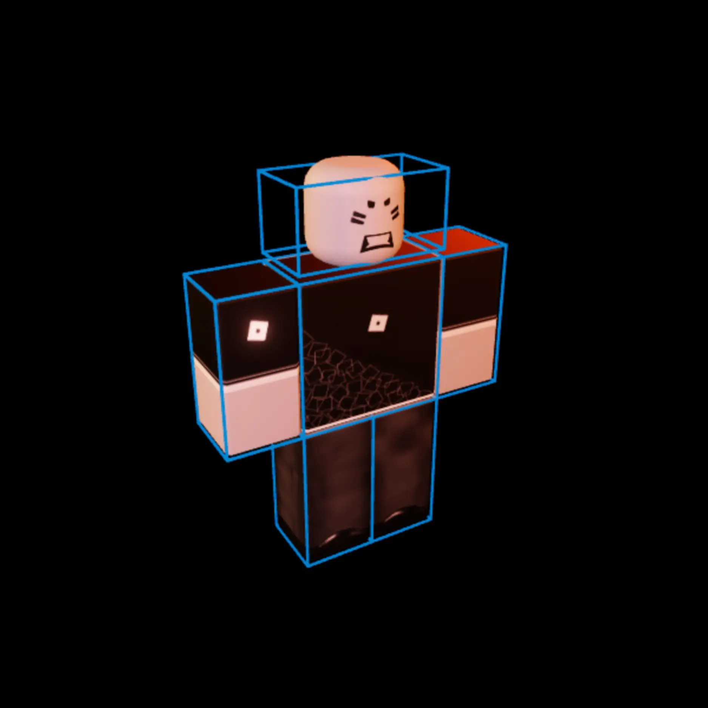
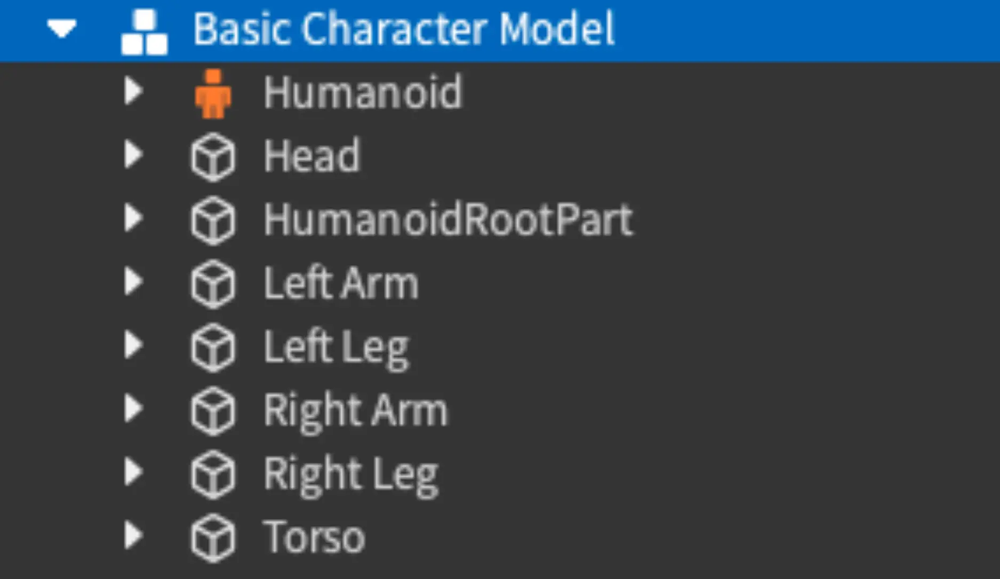
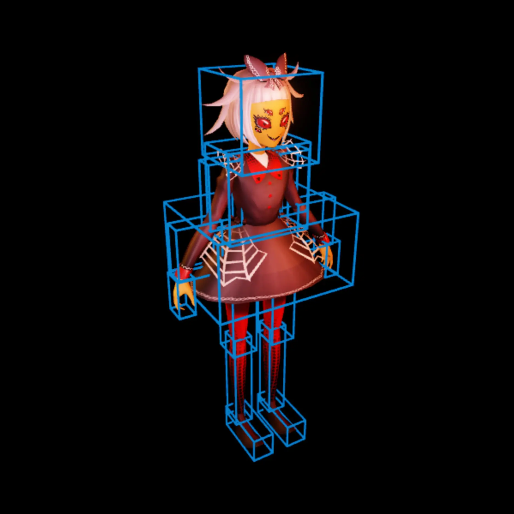
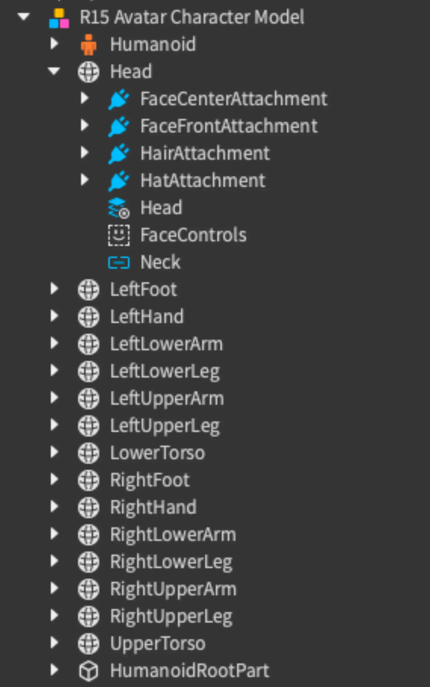

# Characters

## 목차
- [Characters](#characters)
  - [목차](#목차)
  - [기본 캐릭터](#기본-캐릭터)
  - [아바타 캐릭터](#아바타-캐릭터)
  - [출처](#출처)
  - [다음](#다음)

---

**캐릭터**는 일반적으로 세계 또는 다른 사용자와 상호작용하는 `Model` 객체를 의미합니다. 캐릭터는 사용자와 소통하고 상호작용하는 빛나는 구체처럼 간단할 수 있지만, 캐릭터는 종종 몰입감과 현실감을 높이기 위해 추가적인 표현 수단을 갖춘 인간형 모델입니다.

캐릭터는 **기본** 캐릭터(예: 간단한 비 플레이어 캐릭터(NPC)) 또는 이동, 애니메이션, 화장 기능을 포함한 고급 기능을 갖춘 사용자 제어 모델인 **아바타** 캐릭터로 나뉩니다.

모든 Roblox 사용자는 계정 기반 아바타 캐릭터와 연관됩니다. 이 아바타 캐릭터와 함께 Roblox는 사용자들을 데이터 모델 내에서 **플레이어**로 나타내어 개발자들이 추가적인 캐릭터 커스터마이징 속성, 소셜 기능 및 관련 게임 플레이와 계정 정보를 사용할 수 있도록 합니다. 계정 특정 플레이어 기능에 대한 자세한 내용은 플레이어를 참조하세요.

## 기본 캐릭터

기본 캐릭터는 종종 NPC로 사용되며, 일반적으로 하나 또는 두 개의 간단한 작업을 수행합니다. 기본 캐릭터의 일반적인 구성 요소에는 표시 이름, 체력, 기본 이동이 포함됩니다.

다음 구성 요소를 `Model` 객체 내에서 사용하여 이러한 기본 기능을 활성화할 수 있습니다:

- 다음을 포함하는 부품 그룹 또는 어셈블리:
  - 어셈블리의 루트 부품을 나타내는 `HumanoidRootPart` 이름의 컬렉션.
  - 표시 이름을 표시할 `Head` 이름의 부품.
  - 인간형 모델에 사용되는 6(R6) 또는 15(R15) 신체 부품을 일반적으로 포함하는 개별 신체 부품을 구성하는 추가 부품.
  - 각 신체 부품을 어셈블리로 연결하는 `Bone` 또는 `Motor6D`와 같은 조인트.
- 모델에 일반적인 캐릭터 속성을 빠르게 추가할 수 있는 `Humanoid` 인스턴스.

<GridContainer numColumns="2">
  <figure>
    
    <figcaption>기본 캐릭터 예시 (R6)</figcaption>
  </figure>
  <figure>
    
    <figcaption>데이터 모델</figcaption>
  </figure>
</GridContainer>

이러한 구성 요소를 사용하면 캐릭터 모델은 `Humanoid.DisplayName`을 표시하고, 체력을 가지며, `Humanoid.Move()`를 사용하여 이동할 수 있습니다. 표시 및 체력 요소의 추가 구성에 대한 자세한 내용은 [이름/체력 표시]를 참조하세요.

## 아바타 캐릭터

아바타 캐릭터는 신체 및 얼굴 애니메이션을 사용할 수 있고, 의류 및 액세서리를 착용할 수 있는 표준화된 캐릭터 구성 요소 세트를 사용합니다. 구성 요소를 표준화하면 모든 아바타 캐릭터 모델은 플레이어가 제어하는지 NPC인지에 관계없이 이러한 기능에 접근할 수 있습니다.

기본적으로 모든 사용자는 저장된 Roblox 아바타로 경험에 참여하며, 이미 아바타 캐릭터의 모든 구성 요소를 포함하고 있습니다. 완전한 아바타 캐릭터는 `Model`에 다음과 같은 구성 요소를 포함합니다:

- `MeshPart` 객체의 어셈블리:
  - 어셈블리의 루트 부품을 나타내는 `HumanoidRootPart` 이름의 부품.
  - 표시 이름을 표시할 `Head` 이름의 부품.
  - R15 인간형 모델에 사용되는 표준 15개 신체 부품을 포함하는 추가 부품.
  - 각 부품을 연결하고 표준 조인트 계층 구조를 따르는 `Bone` 또는 `Motor6D`와 같은 조인트.
- 일반적인 캐릭터 속성을 구현하고 접근할 수 있는 `Humanoid` 인스턴스.
- 의류 및 기타 레이어 가능한 화장품을 착용할 수 있는 모델의 각 신체 부품에 대한 `WrapLayer` 객체.
- 캐릭터의 머리에 대한 얼굴 표정 및 포즈를 가능하게 하는 `FaceControls`.
- 캐릭터 몸의 표준 부착 지점마다 `Attachment` 객체.

<GridContainer numColumns="2">
  <figure>
    
    <figcaption>아바타 캐릭터 예시 (R15)</figcaption>
  </figure>
  <figure>
    
    <figcaption>데이터 모델</figcaption>
  </figure>
</GridContainer>

<Alert severity = 'info'>
자신만의 맞춤형 아바타 캐릭터를 만들고자 하는 경우, 모델을 Studio에 가져오기 전에 Blender 또는 Maya와 같은 서드 파티 모델링 도구에서 캐릭터 모델의 구성 요소를 구성해야 합니다.

아바타 구성 요소의 생성, 생성 가이드 및 마켓플레이스 정보에 대한 자세한 내용은 아바타]를 참조하세요.
</Alert>

경험 내 기존 캐릭터를 수정하고 커스터마이징하는 방법에 대한 정보는 캐릭터 외관을 참조하세요.

---
## 출처
 - [Characters](https://create.roblox.com/docs/ko-kr/characters)

---
## [다음](./07_Users_and_Players.md)