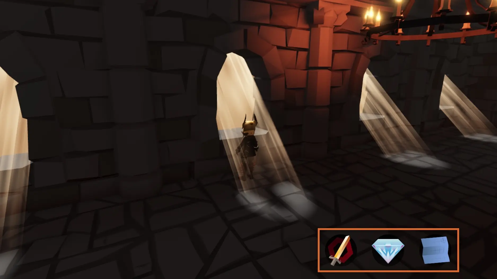
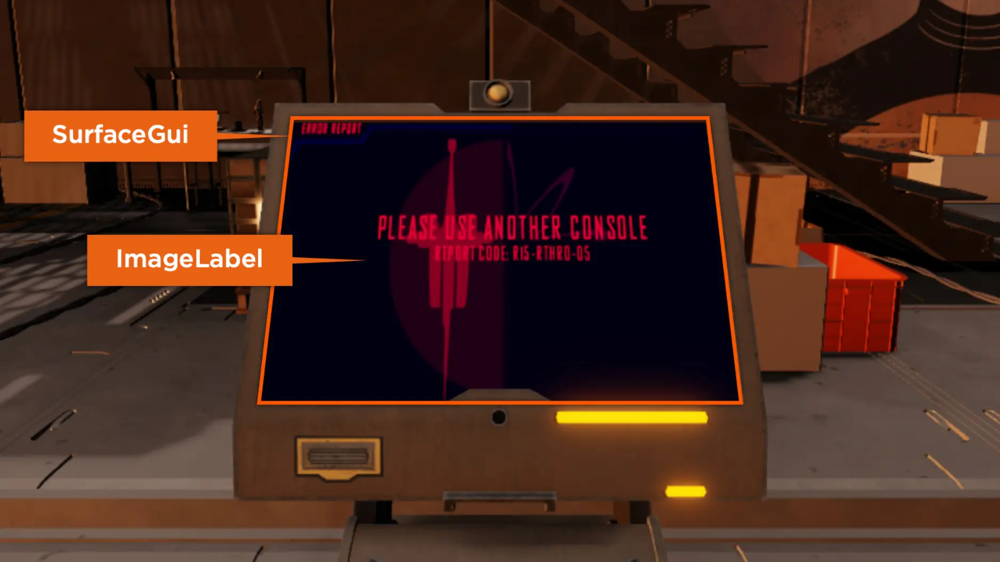
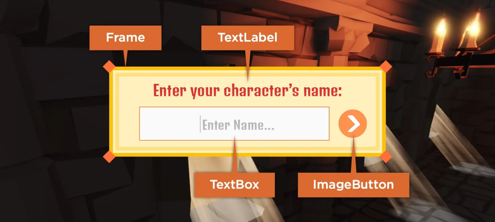
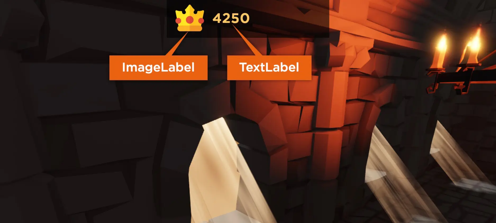
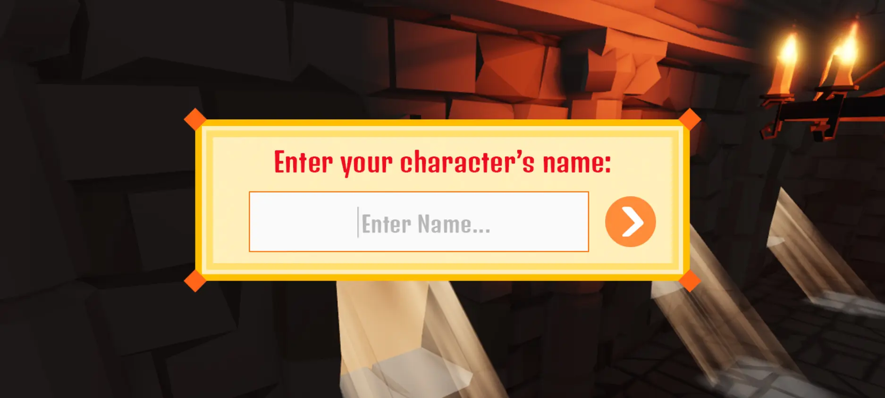
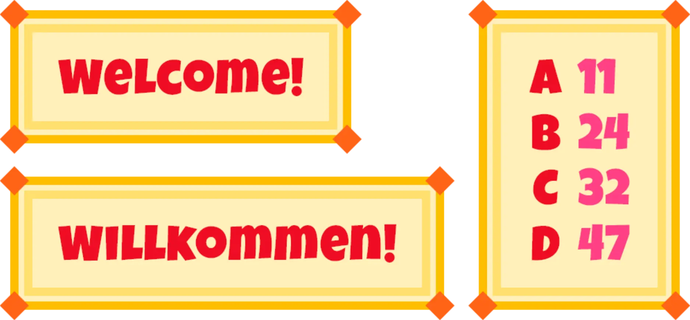
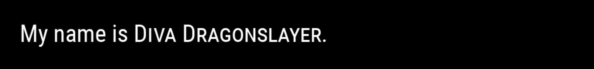

# UI

## 목차
- [UI](#ui)
	- [목차](#목차)
	- [화면 UI](#화면-ui)
	- [경험 내 UI](#경험-내-ui)
	- [객체](#객체)
		- [프레임](#프레임)
		- [레이블](#레이블)
		- [버튼 및 텍스트 입력](#버튼-및-텍스트-입력)
		- [근접 프롬프트](#근접-프롬프트)
		- [드래그 감지기](#드래그-감지기)
	- [레이아웃 및 디자인](#레이아웃-및-디자인)
		- [9-Slice 디자인](#9-slice-디자인)
		- [리치 텍스트 마크업](#리치-텍스트-마크업)
	- [출처](#출처)
	- [다음](#다음)

---

기본 UI 객체를 사용하여 최소한의 스크립팅 요구 사항으로 고품질의 그래픽 사용자 인터페이스를 빠르게 만들 수 있습니다. 생성 위치에 따라 UI는 화면에 표시되거나 경험의 3D 세계 내에 렌더링됩니다.

## 화면 UI

화면 컨테이너는 사용자의 화면에 표시하려는 UI 객체를 보유합니다. 모든 화면 UI 객체 및 코드는 클라이언트에 저장되고 변경됩니다.

## 경험 내 UI

`SurfaceGuis` 및 `BillboardGuis`와 같은 경험 내 컨테이너는 경험의 3D 세계 내에서 표시하려는 UI 객체를 보유합니다.

## 객체

대부분의 UI 요소는 컨테이너에 포함할 수 있는 2D 그래픽 사용자 인터페이스 객체인 `GuiObjects`입니다. 가장 일반적인 네 가지는 프레임, 레이블, 버튼, 텍스트 입력 객체입니다.

`Position`, `Size`, `AnchorPoint`, `ZIndex` 속성을 사용하여 `GuiObjects`의 위치, 크기, 레이어를 완전히 제어할 수 있습니다. 또한 트윈을 사용하여 `GuiObject`를 한 상태에서 다른 상태로 부드럽게 전환하고 동적 시각적 피드백을 제공할 수 있습니다.

### 프레임

프레임은 레이블 또는 버튼과 같은 다른 `GuiObjects`의 컨테이너 역할을 합니다. 프레임을 조작할 때 프레임이 포함하는 객체도 함께 조작됩니다.

### 레이블

레이블을 사용하여 사용자 정의 가능한 텍스트 및 이미지를 표시할 수 있습니다.

### 버튼 및 텍스트 입력

버튼 객체는 사용자가 동작을 유도할 수 있도록 하고, 텍스트 입력 객체는 사용자가 텍스트를 입력할 수 있게 합니다. 이러한 객체를 사용자 정의하여 사용자가 수행하고자 하는 작업에 대한 컨텍스트와 프롬프트를 제공할 수 있습니다.

### 근접 프롬프트

근접 프롬프트는 문, 조명 스위치 및 버튼과 같은 경험 내 객체에 접근할 때 동작을 유도하는 고유한 내장 UI 객체입니다.

<video src="../img/10_UI/Showcase.mp4" controls width="80%" alt="Proximity prompts used in a variety of implementations in the 3D world"></video>

### 드래그 감지기

드래그 감지기는 문과 서랍을 여는 것, 파트를 슬라이딩하는 것, 볼링 공을 잡아 던지는 것, 새총을 당겨 쏘는 등 경험 내 객체와의 물리적 상호 작용을 장려합니다.

<video src="../img/10_UI/Showcase2.mp4" controls width="80%" alt="Drag detectors used in a variety of implementations in the 3D world"></video>

## 레이아웃 및 디자인

위치와 크기 조정에 대한 기본 속성 외에도 Roblox는 UI를 더 정교하게 만드는 레이아웃, 제약 조건 및 외관 객체를 제공합니다. 또한 속성 값을 부드럽게 전환하여 UI를 애니메이션화할 수 있습니다.

### 9-Slice 디자인

9-Slice 디자인 접근 방식을 사용하면 단일 Roblox 이미지 자산을 서로 다른 스케일링 규칙을 가진 아홉 개의 하위 이미지로 나눌 수 있습니다. 이를 통해 테두리나 모서리를 왜곡하지 않고 다양한 크기의 UI 요소를 만들 수 있습니다.

<figure>
  
  <figcaption>다양한 크기의 UI 요소에 사용된 동일한 테두리 디자인</figcaption>
</figure>

### 리치 텍스트 마크업

UI 리치 텍스트는 단순한 마크업 태그를 사용하여 문자열의 일부를 굵게, 기울임꼴, 밑줄, 채우기 색상, 스트로크 변형 등으로 스타일링합니다. `TextLabel`, `TextButton`, `TextBox` 객체에 스타일링 태그를 적용할 수 있습니다.

<GridContainer numColumns="2">
  
  
  
  
</GridContainer>

---
## 출처
 - [UI](https://create.roblox.com/docs/ko-kr/ui)

---
## [다음](./11_Animation.md)