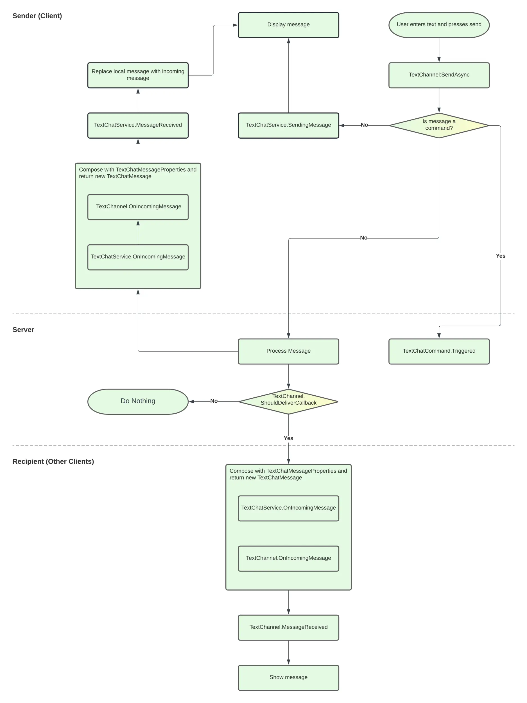
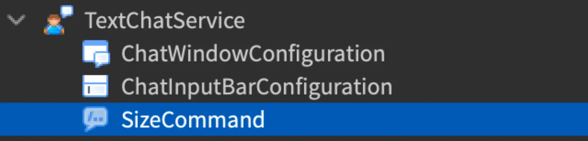
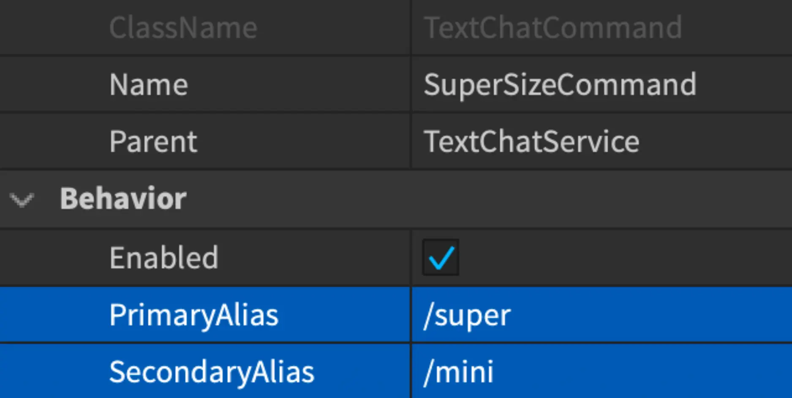
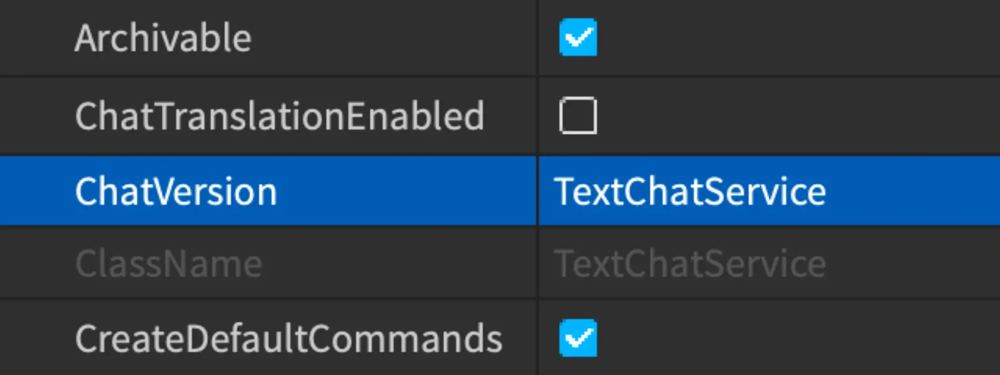

# In-Experience Text Chat System

## 목차
- [In-Experience Text Chat System](#in-experience-text-chat-system)
	- [목차](#목차)
	- [채팅 API 및 워크플로](#채팅-api-및-워크플로)
		- [변경 가능한 채팅 API](#변경-가능한-채팅-api)
		- [변경할 수 없는 채팅 객체](#변경할-수-없는-채팅-객체)
		- [텍스트 채팅 워크플로](#텍스트-채팅-워크플로)
	- [메시지 전달 동작 사용자 정의](#메시지-전달-동작-사용자-정의)
		- [근접 기반 채팅 지원](#근접-기반-채팅-지원)
	- [사용자 정의 명령 생성](#사용자-정의-명령-생성)
	- [레거시 채팅에서의 마이그레이션](#레거시-채팅에서의-마이그레이션)
		- [기본 채팅 기능](#기본-채팅-기능)
		- [채팅 메시지 필터링](#채팅-메시지-필터링)
		- [채팅 창 및 말풍선 채팅](#채팅-창-및-말풍선-채팅)
	- [출처](#출처)
	- [다음](#다음)

---

**경험 내 텍스트 채팅** 시스템을 사용하여 Roblox에서 사용자가 라이브 세션 중 텍스트 기반 메시지로 서로 소통할 수 있도록 할 수 있습니다. 이 시스템은 사용자 몰입도와 참여를 높이기 위해 채팅 기능을 확장하고 사용자 정의할 수 있는 다양한 메서드와 이벤트를 제공합니다. 예를 들어, 맞춤 요구 사항에 따라 메시지를 전달하거나, 특정 사용자에게 특별한 권한이나 중재를 추가하거나, 특정 작업을 수행하는 사용자 정의 명령을 만들 수 있습니다.

이 가이드는 채팅 워크플로와 경험 내 텍스트 채팅 시스템의 기능을 확장하는 데 사용할 수 있는 API 사용법을 다룹니다. 채팅 사용자 인터페이스(UI)를 사용자 정의하는 방법에 대한 자세한 내용은 경험 내 텍스트 채팅 사용자 정의를 참조하십시오.

## 채팅 API 및 워크플로

경험 내 텍스트 채팅 시스템은 채팅 전달 동작을 사용자 정의할 수 있는 변경 가능한 API와 변경할 수 없는 데이터 객체로 구성됩니다. 이 데이터 객체는 변경 가능한 API에서 반환되는 특정 채팅 요소를 나타냅니다.

### 변경 가능한 채팅 API

경험 내 텍스트 채팅 시스템은 다음과 같은 변경 가능한 API를 제공합니다:

- `TextChatService` — 이 싱글톤 클래스는 채팅 메시지 필터링, 중재 및 사용자 권한을 처리하는 등 전체 채팅 시스템을 관리하는 역할을 합니다. 서버에서 액세스할 수 있으며, 다른 텍스트 채팅 API나 사용자 작업이 채팅 전달 워크플로를 통해 호출할 수 있는 다양한 메서드와 이벤트를 제공합니다.
- `TextChannel` — 이 클래스는 텍스트 채팅 채널을 나타내며, 사용자가 보낸 채팅 메시지를 클라이언트에서 서버로 전달하고 권한에 따라 다른 사용자에게 표시합니다. 이를 사용하여 경험 내에서 텍스트 채널을 생성, 수정 및 관리할 수 있습니다. 또한, 사용자가 그룹 멤버와만 채팅할 수 있도록 여러 텍스트 채널을 생성할 수 있습니다.
- `TextChatCommand` — 이 클래스는 사용자가 특별한 문자를 입력한 후 명령 이름을 입력하여 특정 작업이나 동작을 실행할 수 있는 사용자 정의 채팅 명령을 만들 수 있도록 합니다. 채팅 명령은 채팅 경험에 추가 기능과 상호작용을 추가하는 데 유용합니다. 또한, 단축키를 사용하여 경험을 관리하고 중재할 수 있는 관리자 명령을 만들 수도 있습니다.

### 변경할 수 없는 채팅 객체

경험 내 텍스트 채팅 시스템은 읽기 전용 속성을 가진 다음과 같은 변경할 수 없는 객체를 포함합니다:

- `TextChatMessage` — 이 객체는 텍스트 채팅 채널의 단일 채팅 메시지를 나타내며, 메시지 발신자, 원본 메시지, 필터링된 메시지 및 생성 타임스탬프와 같은 기본 정보를 포함합니다.
- `TextSource` — 이 객체는 텍스트 채팅 채널에서 메시지 발신자를 나타내며, 채널 내 사용자의 자세한 권한을 제공합니다. 사용자가 여러 텍스트 채팅 채널에 있는 경우, 여러 텍스트 소스를 가질 수 있습니다.

### 텍스트 채팅 워크플로

채팅 메시지 전송 및 전달 프로세스를 통해 변경 가능한 채팅 클래스의 메서드, 콜백 및 이벤트는 클라이언트-서버 모델의 세 가지 측면에서 발생합니다:

- 메시지를 보내는 사용자의 로컬 장치인 전송 클라이언트.
- 다른 사용자의 로컬 장치인 수신 클라이언트.
- 메시지를 전송 클라이언트로부터 수신하고 수신 클라이언트로 전달을 처리하는 중앙 프로세서인 서버.



순서도에서 보여지듯이, 경험 내 텍스트 채팅 시스템은 다음 단계를 통해 채팅 메시지를 처리합니다:

1. 사용자가 자신의 로컬 장치에서 메시지를 보내면 `TextChannel:SendAsync()` 메서드가 트리거됩니다. 이 메서드는 메시지를 처리하고, 그것이 채팅 명령인지 일반 채팅 메시지인지 결정합니다.
1. 사용자 입력이 채팅 명령인 경우, `TextChatCommand.Triggered` 이벤트가 발생하여 명령에 정의된 작업을 수행합니다.
1. 사용자 입력이 일반 채팅 메시지인 경우, `TextChatService.SendingMessage` 이벤트가 발생하여 전송 클라이언트의 발신자에게 원본 메시지를 표시합니다. 동시에 `TextChannel:SendAsync()`가 메시지를 서버로 전달합니다.
1. 서버는 `TextChannel.ShouldDeliverCallback`을 트리거하여 설정한 권한 및 Roblox 커뮤니티 필터링 요구 사항에 따라 메시지를 다른 사용자에게 전달할지 여부를 결정합니다.
1. `TextChannel.ShouldDeliverCallback`이 메시지가 다른 사용자에게 전달될 수 있음을 결정하면, 서버는 필터를 적용하고 `TextChannel.OnIncomingMessage`를 두 번 트리거합니다:
   1. 처음에는 서버가 메시지를 처리 중임을 알리기 위해 전송 클라이언트에서 `TextChatService.MessageReceived` 이벤트를 신호로 보냅니다. 이는 수신 클라이언트에 표시되는 메시지로 로컬 메시지를 대체합니다. 원본 메시지가 필터링을 필요로 하지 않는 경우 메시지는 동일할 수 있습니다.
   1. 두 번째는 수신 클라이언트에서 `TextChatService.MessageReceived` 이벤트를 트리거하여 메시지를 다른 사용자에게 표시합니다.

채팅 시스템 워크플로의 여러 영역에서 동작을 확장하고 사용자 정의할 수 있지만, 시스템이 작동하는 단계는 동일하게 유지됩니다.

## 메시지 전달 동작 사용자 정의

기본 채팅 메시지 전달 동작을 유지하는 것 외에도, `TextChannel.ShouldDeliverCallback`을 사용하여 사용자 참여를 맞춤화하기 위해 권한 및 특정 동작을 추가하여 사용자가 메시지를 받을 수 있는지 여부를 결정할 수 있습니다. 예를 들어:

- 같은 그룹 또는 스쿼드에 있는 사용자만 소통할 수 있는 그룹 기반 채팅 지원.
- 가까운 위치에 있는 사용자만 메시지를 보낼 수 있는 근접 기반 채팅 지원.
- 특정 속성을 가진 사용자가 다른 사용자에게 메시지를 보내지 못하도록 방지. 예를 들어, 사망 상태의 사용자가 살아 있는 사용자에게 메시지를 보내지 못하도록 설정.
- 채팅에서 정답을 다른 사용자에게 보이지 않게 하는 퀴즈 기능 추가.

### 근접 기반 채팅 지원

다음 예제는 특정 위치에서 가까운 사용자끼리만 사용할 수 있는 채팅을 구현하는 방법을 보여줍니다. 이 예제는 잠재적 메시지 수신자의 위치를 식별하기 위해 `TextSource`를 사용하는 함수를 확장합니다. 이 함수가 false를 반환하면, 이는 사용자가 메시지 발신자로부터 설정된 유효 범위 이상 떨어져 있음을 의미하므로 시스템은 해당 사용자에게 메시지를 전달하지 않습니다.

```lua
-- 텍스트 채팅 및 플레이어 서비스 가져오기
local TextChatService = game:GetService("TextChatService")
local Players = game:GetService("Players")

-- 근접 기반 채팅을 위한 채팅 채널 가져오기.
-- 이 예제에서는 일반 채널을 사용합니다. 이 채널을 전용 채널로 교체할 수 있습니다.
local generalChannel: TextChannel = TextChatService:WaitForChild("TextChannels").RBXGeneral

-- 사용자의 캐릭터 위치를 가져오는 함수를 정의합니다.
local function getPositionFromUserId(userId: number)
	-- 주어진 userId와 관련된 플레이어를 가져옵니다.
	local targetPlayer = Players:GetPlayerByUserId(userId)

	-- 플레이어가 존재하면 캐릭터의 위치를 가져옵니다.
	if targetPlayer then
		local targetCharacter = targetPlayer.Character
		if targetCharacter then
			return targetCharacter:GetPivot().Position
		end
	end

	-- 플레이어 또는 캐릭터를 찾을 수 없는 경우 기본 위치를 반환합니다.
	return Vector3.zero
end

-- 일반 채널의 ShouldDeliverCallback을 설정하여 메시지 전달을 제어합니다.
generalChannel.ShouldDeliverCallback = function(textChatMessage: TextChatMessage, targetTextSource: TextSource)
	-- 메시지 발신자와 대상의 위치를 가져옵니다.
	local sourcePos = getPositionFromUserId(textChatMessage.TextSource.UserId)
	local targetPos = getPositionFromUserId(targetTextSource.UserId)

	-- 발신자와 대상 간의 거리가 50 유닛 미만인 경우 메시지를 전달합니다.
	return (targetPos - sourcePos).Magnitude < 50
end
```

## 사용자 정의 명령 생성

경험 내 텍스트 채팅 시스템에는 팀 기반 채팅 채널 생성 및 아바타 이모티콘 재생과 같은 일반적인 용도의 기본 채팅 명령이 포함되어 있습니다. 이 명령은 스크립팅이나 Studio 설정에서 `TextChatService.CreateDefaultCommands`와 `TextChatService.CreateDefaultTextChannels`를 true로 설정하여 활성화할 수 있습니다. 또한, `TextChatCommand`를 사용하여 사용자 정의 명령을 추가할 수도 있습니다. 사용자가 채팅 입력창에 정의된 명령을 입력하면 `TextChatCommand.Triggered`로 정의된 콜백이 트리거되어 사용자 정의 작업을 수행합니다.

다음 예제는 사용자가 `/super` 또는 `/mini`를 입력하면 캐릭터의 크기를 증가 또는 감소시킬 수 있는 채팅 명령을 생성하는 방법을 보여줍니다.

1. `TextChatService` 안에 `TextChatCommand` 인스턴스를 삽입합니다.
1. 이름을 **SizeCommand**로 변경합니다.

   

1. **PrimaryAlias** 속성을 `/super`로 설정하고 **SecondaryAlias**를 `/mini`로 설정합니다.

   

1. `ServerScriptService` 안에 다음 `Script`를 삽입하여 채팅 명령의 콜백을 정의하고 캐릭터의 크기를 조정합니다.

   ```lua title='Script' highlight='4,6'
   local TextChatService = game:GetService("TextChatService")
   local Players = game:GetService("Players")

   local sizeCommand: TextChatCommand = TextChatService:WaitForChild("SizeCommand")

   sizeCommand.Triggered:Connect(function(textSource, message)
   	local scaleMult = 1
   	local messageWords = string.split(message, " ")
   	if messageWords[1] == "/super" then
   		scaleMult = 2
   	elseif messageWords[1] == "/mini" then
   		scaleMult = 0.5
   	end

   	local player = Players:GetPlayerByUserId(textSource.UserId)
   	if player then
   		local character = player.Character
   		if character then
   			local humanoid = character:FindFirstChildWhichIsA("Humanoid")
   			if humanoid then
   				for _, child in humanoid:GetChildren() do
   					if child:IsA("NumberValue") then
   						child.Value *= scaleMult
   					end
   				end
   			end
   		end
   	end
   end)
   ```

   <video controls src="../img/12_chat/Text-Custom-Command.mp4" width="90%"></video>

## 레거시 채팅에서의 마이그레이션

이 섹션은 기존 채팅 시스템에서 레거시 채팅 시스템으로 전환하는 방법을 도와줍니다. 여기에는 일반 채팅 기능 및 동작을 경험 내 텍스트 채팅 시스템을 사용하여 구현하기 위한 대체 방법이 포함됩니다.

기존 경험의 채팅 시스템을 레거시 채팅 시스템에서 경험 내 텍스트 채팅 시스템으로 전환하려면:

1. Explorer 창에서 **TextChatService**를 선택합니다.
2. Properties 창에서 **ChatVersion** 드롭다운을 찾아 **TextChatService**를 선택합니다.

   

### 기본 채팅 기능

두 시스템 모두 기본 채팅 기능을 공유하지만, 경험 내 텍스트 채팅 시스템 구현은 일반적으로 더 지속 가능하고 반복하기 쉽습니다.

<table>
  <thead>
    <tr>
      <th>기능</th>
      <th>레거시 채팅</th>
      <th>경험 내 텍스트 채팅</th>
      <th>차이점</th>
    </tr>
  </thead>
  <tbody>
    <tr>
      <td>채팅 메시지 보내기</td>
      <td>`Players:Chat()`</td>
      <td>`TextChannel:SendAsync()`</td>
      <td>`TextChatService:SendAsync()` 메서드는 리치 텍스트 형식 및 메시지 우선 순위와 같은 더 고급 채팅 기능을 지원합니다. 또한 부적절한 메시지가 전송되지 않도록 하기 위해 내장된 필터링을 포함합니다.</td>
    </tr>
    <tr>
      <td>메시징 콜백 구현</td>
      <td>`Chat:InvokeChatCallback()`<br />`Chat:RegisterChatCallback()`</td>
      <td>`TextChatService.SendingMessage`<br />`TextChatService.OnIncomingMessage`</td>
      <td>레거시 채팅 시스템은 메시지 전달을 위한 채팅 시스템 이벤트에 함수를 바인딩합니다. 경험 내 텍스트 채팅 시스템의 두 메서드는 더 많은 유연성과 사용자 정의 옵션을 제공합니다.</td>
    </tr>
    <tr>
      <td>사용자 정의 채팅 명령 추가</td>
      <td>`ChatService/ChatCommand` 모듈</td>
      <td>`TextChatCommand`</td>
      <td>경험 내 텍스트 채팅 시스템은 텍스트 명령을 나타내는 전용 클래스를 사용하여 사용자 정의가 가능하도록 합니다.</td>
    </tr>
    <tr>
      <td>시스템 메시지 표시</td>
      <td>사용자 정의 관리자 명령 라이브러리</td>
      <td>`TextChannel:DisplaySystemMessage()`</td>
      <td></td>
    </tr>
    <tr>
      <td>채팅 비활성화</td>
      <td>Studio의 [게임 설정](../studio/game-settings.md) 및 채팅 창 숨기기를 위한 `ChatWindow/ChatSettings` 모듈</td>
      <td>`ChatWindowConfiguration.Enabled`</td>
    </tr>
  </tbody>
</table>

### 채팅 메시지 필터링

경험 내 텍스트 채팅 시스템은 각 사용자의 계정 정보를 기반으로 채팅 메시지를 자동으로 필터링하므로 모든 종류의 채팅 메시지에 대한 텍스트 필터링을 수동으로 구현할 필요가 없습니다.

<table>
  <thead>
    <tr>
      <th>기능</th>
      <th>레거시 채팅</th>
      <th>경험 내 텍스트 채팅</th>
    </tr>
  </thead>
  <tbody>
    <tr>
      <td>개별 사용자에 대한 메시지 필터링</td>
      <td>`Chat:FilterStringAsync()`</td>
      <td>해당 없음</td>
    </tr>
    <tr>
      <td>방송 메시지 필터링</td>
      <td>`Chat:FilterStringForBroadcast()`</td>
			<td>해당 없음</td>
    </tr>
  </tbody>
</table>

### 채팅 창 및 말풍선 채팅

경험 내 텍스트 채팅 시스템의 채팅 창 및 말풍선 채팅 동작과 사용자 정의 옵션은 레거시 채팅 시스템과 동일합니다. 레거시 채팅 시스템은 채팅 모듈이나 `Players` 컨테이너를 사용하여 사용자 정의할 수 있지만, 경험 내 텍스트 채팅 시스템은 `ChatWindowConfiguration` 및 `BubbleChatConfiguration`과 같은 전용 클래스를 제공하여 각각 모든 채팅 창 및 말풍선 채팅 속성을 관리합니다. 또한, Studio 설정을 사용하여 말풍선 채팅의 외관과 동작 속성을 쉽게 조정하고 미리 볼 수 있으므로 모든 것을 스크립팅할 필요가 없습니다.

<table>
  <thead>
    <tr>
      <th>기능</th>
      <th>레거시 채팅</th>
      <th>경험 내 텍스트 채팅</th>
    </tr>
  </thead>
  <tbody>
    <tr>
      <td>채팅 창 활성화</td>
      <td>`Chat.LoadDefaultChat`<br />`Players.ClassicChat`</td>
      <td>`ChatWindowConfiguration.Enabled`</td>
    </tr>
    <tr>
      <td>말풍선 채팅 활성화</td>
      <td>`Chat.BubbleChatEnabled`<br />`Players.BubbleChat`</td>
      <td>`BubbleChatConfiguration.Enabled`</td>
    </tr>
    <tr>
      <td>채팅 창 속성 설정</td>
      <td>`Players:SetChatStyle()`</td>
      <td>`ChatWindowConfiguration`</td>
    </tr>
    <tr>
      <td>말풍선 채팅 속성 설정</td>
      <td>`Chat:SetBubbleChatSettings()`<br />`Chat.BubbleChatSettingsChanged()`<br />`Players.BubbleChat`<br />`Players:SetChatStyle()`</td>
      <td>`BubbleChatConfiguration`</td>
    </tr>
    <tr>
      <td>NPC 말풍선 활성화</td>
      <td>`Chat:Chat()`</td>
      <td>`TextChatService:DisplayBubble()`</td>
    </tr>
  </tbody>
</table>

---
## 출처
 - [In-Experience Text Chat System](https://create.roblox.com/docs/ko-kr/chat/in-experience-text-chat)

---
## [다음]()