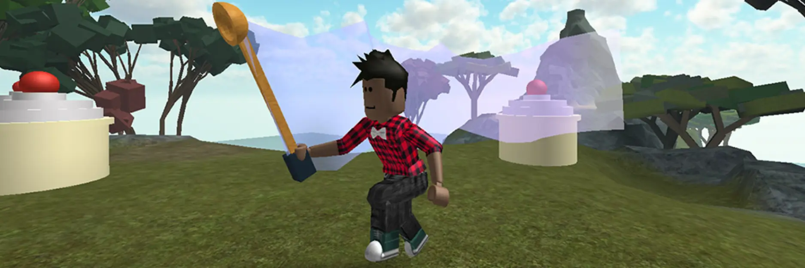
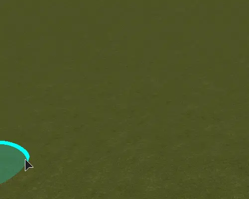
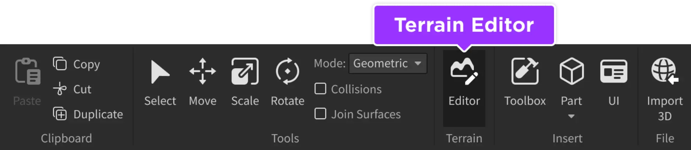
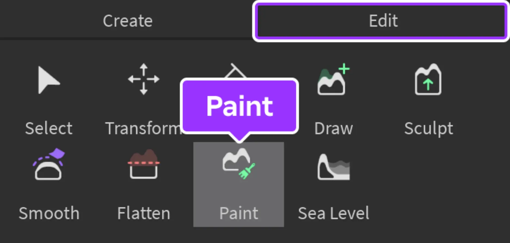
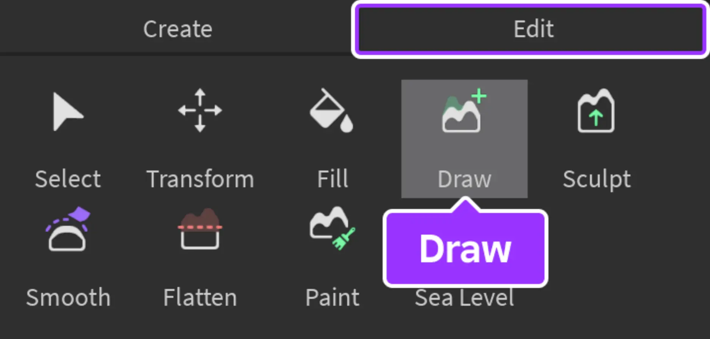
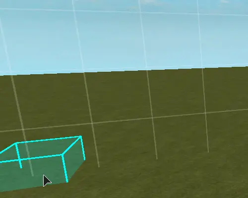
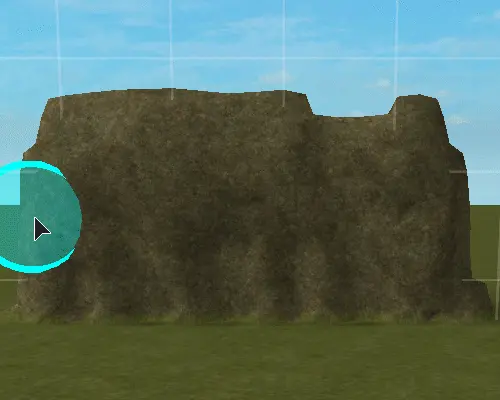
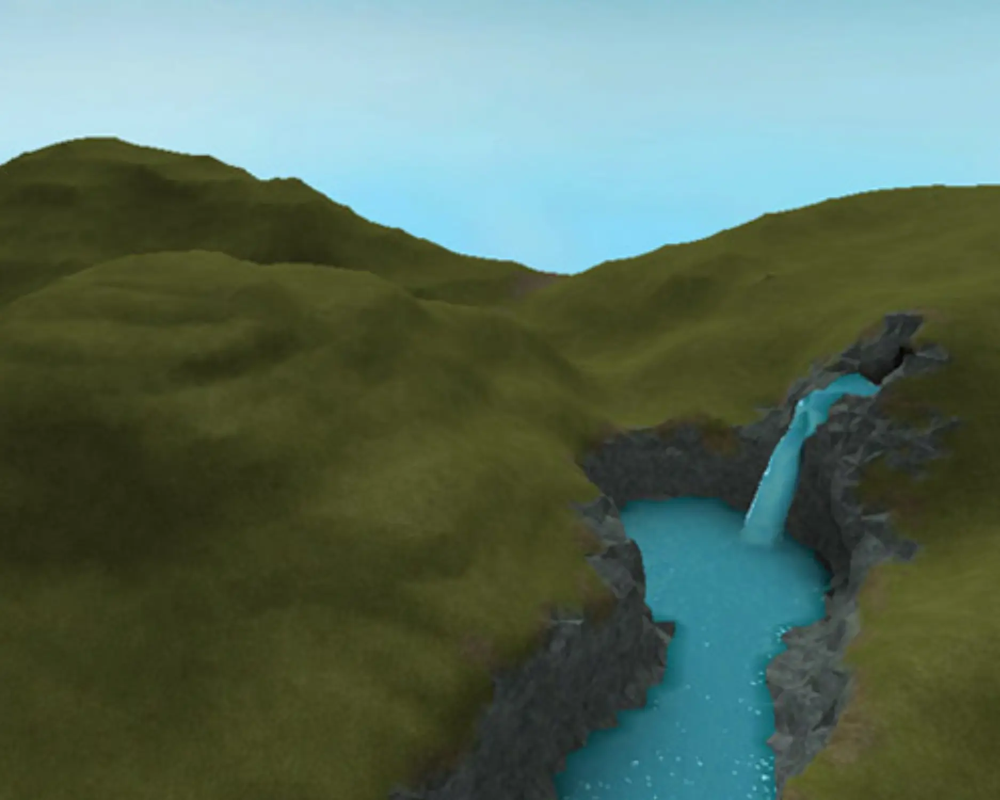

# Create the Map

## 목차
- [Create the Map](#create-the-map)
  - [목차](#목차)
    - [시리즈 설명](#시리즈-설명)
  - [프로젝트 계획하기](#프로젝트-계획하기)
    - [게임 디자인 문서 작성하기](#게임-디자인-문서-작성하기)
    - [게임 루프 프롬프트](#게임-루프-프롬프트)
    - [지도 레이아웃](#지도-레이아웃)
  - [환경 만들기](#환경-만들기)
  - [완성된 지도 샘플](#완성된-지도-샘플)
  - [출처](#출처)
  - [다음](#다음)

---

### 시리즈 설명

어드벤처 게임은 다양한 형태로 제공될 수 있지만 종종 플레이어가 세계를 탐험하는 데 중점을 둡니다. 이 경험은 탐험, 아이템 수확, 판매, 가방 업그레이드 등을 반복하는 내용을 담고 있습니다. 이러한 일련의 활동은 **게임 루프**라고 불립니다.

게임 루프의 각 부분은 플레이어가 할 수 있는 다양한 게임 메커닉, 또는 액션입니다. 이 게임 루프에는 네 가지 메커닉이 있습니다:

- 아이템을 찾기 위해 **탐험**하세요.
- 아이템을 **수확**하세요. 플레이어는 한 번에 여러 개의 아이템을 가질 수 있습니다.
- 아이템을 골드로 **판매**하세요.
- 더 많은 아이템을 담을 수 있는 가방 업그레이드를 **구매**하세요.

## 프로젝트 계획하기

전문 개발자가 새로운 프로젝트를 시작하기 전에 **사전 제작**이라는 과정에서 어떻게 진행될지 계획합니다. 그들은 종종 게임 디자인 문서를 작성하여 경험이 어떻게 작동할지를 포함합니다.

**게임 디자인 문서**(GDD)는 종종 길 수 있지만, 이 시리즈에서는 플레이어가 할 일을 시각화하고 탐험할 세계의 스케치를 작성하는 것으로 시작합니다. 명확한 비전을 가지는 것은 개발 속도를 높이고 다른 사람들에게 아이디어를 전달하여 피드백을 얻는 데 도움이 됩니다.

### 게임 디자인 문서 작성하기

시작하려면 종이 한 장을 준비하거나 워드 에디터를 열어 문서를 기록하세요.

### 게임 루프 프롬프트

다음은 게임 루프, 즉 플레이어가 할 일을 파악하는 데 도움이 됩니다.

<table>
<thead>
   <tr>
      <th width="30%">구성 요소</th>
      <th>예시</th>
   </tr>
</thead>
<tbody>
   <tr>
      <td><b>설정</b>: 테마나 탐험 시 플레이어가 볼 수 있는 환경 설명.</td>
      <td>
      - 나무와 강으로 덮인 신비한 숲.
      - 잃어버린 애완동물을 찾아야 하는 교외 마을.
      - 가장 가치 있는 물건이 감자인 미래.
      </td>
   </tr>
   <tr>
      <td><b>아이템</b>: 플레이어가 수집하거나 수확하는 것.</td>
      <td>
      - 반짝이는 크리스탈.
      - 고양이, 개, 거북이 같은 잃어버린 애완동물.
      - 다양한 종류의 감자.
      </td>
   </tr>
   <tr>
      <td><b>도구</b>: 플레이어가 아이템을 수집하는 데 사용하는 물건.</td>
      <td>
      - 곡괭이.
      - 애완동물 목걸이.
      - 장갑.
      </td>
   </tr>
   <tr>
      <td><b>업그레이드</b>: 플레이어가 더 많은 아이템을 담기 위해 구매하는 것.</td>
      <td>
      - 가방.
      - 배낭.
      </td>
   </tr>
</tbody>
</table>

### 지도 레이아웃

게임 디자인 문서의 마지막 부분은 지도 레이아웃을 만드는 것입니다. 이는 나중에 무엇을 만들어야 할지 파악하는 데 도움이 됩니다. 아래는 예시 레이아웃입니다.

레이아웃에서는 다음 주요 장소를 주석으로 표시합니다:

- 플레이어가 경험을 시작하는 장소.
- 수확 가능한 아이템의 배치.
- 플레이어가 아이템을 판매하는 장소.
- 플레이어가 업그레이드를 구매하는 장소.
- 초원, 언덕 등 환경 세부 사항.

## 환경 만들기

환경은 **지형 편집기**를 사용하여 만듭니다. 이 도구는 Roblox Studio에서 산, 강, 사막과 같은 지형을 만들기 위해 사용됩니다. 도구를 사용하는 동안 이전에 만든 지도 레이아웃을 참고하세요.

지형 편집기에서 도구를 사용하여 게임 비전 문서에 그린 세계를 만듭니다.

1. Studio를 열고 새로운 **평지 지형** 프로젝트를 만듭니다.
2. **홈** 탭에서 **편집기** 버튼을 클릭합니다. 화면 왼쪽에 **지형 편집기**가 열립니다.

   

3. 지형 편집기에서 **편집** 탭으로 이동합니다. 그런 다음 **페인트** 도구를 사용하여 풍경의 재료를 변경합니다. 비전에 따라 도로, 물 또는 용암 등을 페인트하세요.

   

   

   <Alert severity="info">
   지형 편집기를 사용하는 동안 카메라를 회전하면서 작업하세요. 지형은 각도에 따라 다르게 보일 수 있습니다.
   </Alert>

4. **그리기** 도구를 사용하여 비전 문서에 만든 설정을 그립니다. **브러시 모드** 토글을 사용하여 지형을 추가하거나 제거하세요.

   

   - 지형을 추가하여 산, 언덕을 만들고 초원을 나눕니다.

     

   - 지형을 제거하여 산을 조각하고, 절벽과 같은 날카로운 특징을 만들거나 강을 만듭니다.

     

## 완성된 지도 샘플

완성된 후, 지도가 다음과 같을 수 있습니다.

---
## 출처
 - [Create the Map](https://create.roblox.com/docs/ko-kr/education/adventure-game-series/create-the-map)

---
## [다음](./13_03_Coding_the_Leaderboard.md)