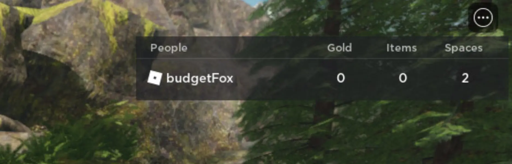
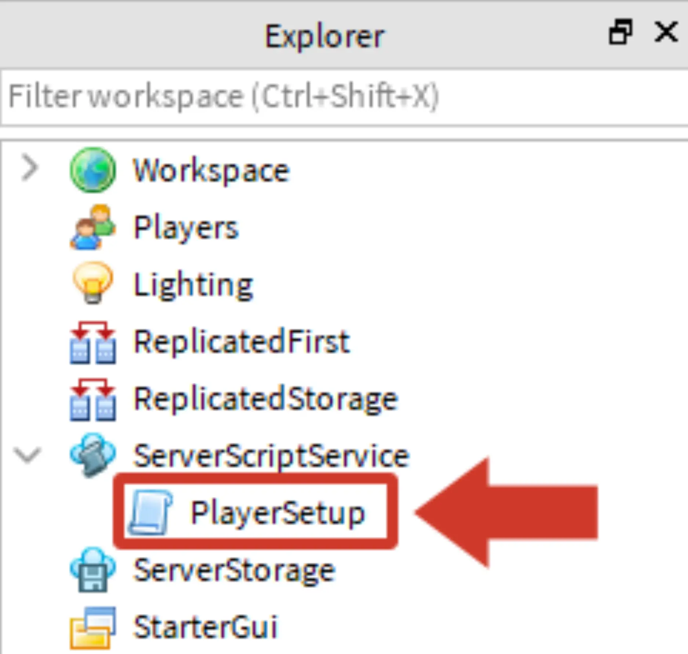

# Coding the Leaderboard

## 목차
- [Coding the Leaderboard](#coding-the-leaderboard)
  - [목차](#목차)
  - [리더보드 설정하기](#리더보드-설정하기)
  - [플레이어 통계 추적하기](#플레이어-통계-추적하기)
    - [골드 통계 코딩하기](#골드-통계-코딩하기)
    - [문제 해결 팁](#문제-해결-팁)
    - [아이템 및 공간 통계 코딩하기](#아이템-및-공간-통계-코딩하기)
  - [완성된 PlayerSetup 스크립트](#완성된-playersetup-스크립트)
  - [출처](#출처)
  - [다음](#다음)

---

게임 내에서 플레이어는 수집한 아이템과 같은 중요한 통계를 확인해야 합니다. 이러한 숫자는 리더보드를 사용하여 표시됩니다. **리더보드**는 스크립트로 활성화하고 사용자 지정할 수 있는 Roblox의 내장 기능입니다.



<Alert severity="info">
이 경험의 리더보드는 세션 간에 플레이어 정보를 저장하지 않습니다. 플레이어 데이터를 저장하려면 [데이터 저장소](../../cloud-services/data-stores)라는 고급 코딩 개념을 사용해야 합니다.
</Alert>

## 리더보드 설정하기

플레이어가 경험에 추가될 때마다, 각 플레이어를 리더보드에 추가하고 개별 통계를 추적하는 코드를 작성해야 합니다.

1. Explorer에서 **ServerScriptService** 아래에 새로운 스크립트를 생성하고 이름을 PlayerSetup으로 설정합니다. 스크립트에서 hello world 줄을 삭제하고 설명 주석을 작성합니다.

   

2. 주석 다음에 player라는 매개변수를 가진 onPlayerJoin이라는 사용자 지정 함수를 만듭니다.

   ```lua
   -- 플레이어 변수를 표시하는 리더보드를 생성합니다.

   local function onPlayerJoin(player)

   end
   ```

3. `onPlayerJoin`에서 `leaderstats`라는 변수를 생성하고 새로운 **폴더** 인스턴스를 만듭니다.

   ```lua
   local function onPlayerJoin(player)
    local leaderstats = Instance.new("Folder")
   end
   ```

4. 새로운 **폴더** 인스턴스 이름을 `leaderstats`로 지정하고, 이를 플레이어에 부모로 설정합니다. 폴더 이름을 `leaderstats`로 지정하면 Roblox Studio가 리더보드를 생성합니다.

   ```lua
   local function onPlayerJoin(player)
      local leaderstats = Instance.new("Folder")
      leaderstats.Name = "leaderstats"
      leaderstats.Parent = player
   end
   ```

    <Alert severity="warning">
    리더보드는 내장 기능이므로 이름을 정확하게 지정해야 합니다. 예를 들어, 폴더 이름이 "leaderboard"라면 작동하지 않습니다.
    </Alert>

5. 함수 끝 부분에서 `OnPlayerJoin`을 `PlayerAdded` 이벤트에 연결합니다. 플레이어가 경험에 참여할 때마다 각 플레이어에게 리더보드가 제공됩니다.

   ```lua
   local Players = game:GetService("Players")

   local function onPlayerJoin(player)
      local leaderstats = Instance.new("Folder")
      leaderstats.Name = "leaderstats"
      leaderstats.Parent = player
   end

   Players.PlayerAdded:Connect(onPlayerJoin)
   ```

    <Alert severity="warning">
    아직 테스트하지 마세요. 리더보드에 표시할 통계가 없으므로 리더보드가 나타나지 않을 것입니다.
    </Alert>

## 플레이어 통계 추적하기

이제 리더보드가 생성되었으므로 플레이어에게 다음 숫자를 보여줘야 합니다:

- **Gold** - 플레이어가 가진 돈.
- **Items** - 플레이어가 세계에서 수집한 아이템 수.
- **Spaces** - 플레이어가 한 번에 가질 수 있는 최대 아이템 수.

각 숫자는 IntValue로, 숫자를 위한 플레이스홀더 객체입니다.

### 골드 통계 코딩하기

골드에 대한 통계 코딩부터 시작합니다.

1. `OnPlayerJoin`에서 `leaderstats.Parent = player` 아래에 `local gold = Instance.new("IntValue")`를 입력합니다. 이는 새로운 IntValue를 생성하고 gold 변수에 저장합니다.

   ```lua
    local function onPlayerJoin(player)
      local leaderstats = Instance.new("Folder")
      leaderstats.Name = "leaderstats"
      leaderstats.Parent = player

      local gold = Instance.new("IntValue")
    end
   ```

2. 다음으로 `gold.Name = "Gold"`를 입력합니다. 이는 IntValue에 이름을 지정하여 다른 스크립트에서 사용할 수 있게 합니다. 이름은 리더보드에 플레이어에게도 표시됩니다.

   ```lua
    local function onPlayerJoin(player)
      local gold = Instance.new("IntValue")
      gold.Name = "Gold"
    end
   ```

    <Alert severity="warning">
    통계 이름을 자신만의 이름으로 사용할 경우, 나중에 시리즈의 다른 스크립트에서 참조할 정확한 이름과 철자를 기억하세요.
    </Alert>

3. 새로운 줄에 `gold.Value = 0`을 입력합니다. 이는 플레이어의 시작 값을 설정합니다.

   ```lua
    local function onPlayerJoin(player)
      local gold = Instance.new("IntValue")
      gold.Name = "Gold"
      gold.Value = 0
    end
   ```

    <Alert severity="info">
    일반적으로 변수는 `=`를 사용하여 변경되지만, IntValue는 `Value`를 사용하여 변경됩니다. 예: `myIntValue.Value = 10`.
    </Alert>

4. `gold.Parent = leaderstats`를 입력합니다. 이는 gold의 IntValue를 leaderstats에 부모로 설정합니다. IntValue가 leaderstats에 부모로 설정되지 않으면 플레이어가 이를 볼 수 없습니다.

   ```lua
    local function onPlayerJoin(player)
      local gold = Instance.new("IntValue")
      gold.Name = "Gold"
      gold.Value = 0
      gold.Parent = leaderstats
    end
   ```

5. 프로젝트를 실행하여 오른쪽 상단에 리더보드가 나타나는지 확인합니다.

   

### 문제 해결 팁

리더보드가 보이지 않으면 다음을 확인하세요:

- `.Value`의 대문자 여부를 확인하세요.
- IntValue 변수가 `gold.Parent = leaderstats`와 같이 리더보드에 부모로 설정되었는지 확인하세요.

### 아이템 및 공간 통계 코딩하기

통계 이름은 게임 디자인 문서에 따라 다를 수 있습니다. 예를 들어, `"Items"`는 `"Crystals"`가 될 수 있습니다.

1. 다음 통계를 구분하기 위해 빈 줄을 추가한 후, 골드와 동일한 방식으로 새로운 IntValue를 설정하여 아이템 통계를 만듭니다.

   ```lua
    local function onPlayerJoin(player)
      gold.Parent = leaderstats

      -- 아이템 통계 생성
      local items = Instance.new("IntValue")
      items.Name = "Items"
      items.Value = 0
      items.Parent = leaderstats
    end
   ```

2. 플레이어의 가방 공간에 대한 새로운 통계를 만듭니다. 플레이어가 한 번에 두 개의 아이템만 가질 수 있도록 `spaces.Value`를 `2`로 설정하여 플레이어가 가능한 빨리 새로운 가방을 구매하도록 유도합니다.

   ```lua
    local function onPlayerJoin(player)
      items.Parent = leaderstats

      -- 공간 통계 생성
      local spaces = Instance.new("IntValue")
      spaces.Name = "Spaces"
      spaces.Value = 2
      spaces.Parent = leaderstats
    end
   ```

3. 프로젝트를 테스트합니다. 플레이어는 골드, 아이템, 공간을 보여주는 리더보드를 가지게 됩니다.
   

리더보드가 나타나지 않으면 다음을 확인하세요:

- 리더보드에 숫자가 표시되지 않으면, 각 IntValue가 leaderstats에 부모로 설정되었는지 확인하세요.
- 각 IntValue가 정확히 표시된 대로 철자가 맞는지 확인하세요.
- PlayerAdded 이벤트가 스크립트 하단에 있는지 확인하세요.

## 완성된 PlayerSetup 스크립트

완성된 스크립트는 아래를 참고하세요.

```lua
 local Players = game:GetService("Players")

 -- 플레이어 변수를 표시하는 리더보드를 생성합니다.
 local function onPlayerJoin(player)
   local leaderstats = Instance.new("Folder")
   leaderstats.Name = "leaderstats"
   leaderstats.Parent = player

   local gold = Instance.new("IntValue")
   gold.Name = "Gold"
   gold.Value = 0
   gold.Parent = leaderstats

   local items = Instance.new("IntValue")
   items.Name = "Items"
   items.Value = 0
   items.Parent = leaderstats

   local spaces = Instance.new("IntValue")
   spaces.Name = "Spaces"
   spaces.Value = 2
   spaces.Parent = leaderstats
 end

 -- PlayerAdded 이벤트가 발생할 때 onPlayerJoin을 실행합니다.
 Players.PlayerAdded:Connect(onPlayerJoin)
```

---
## 출처
 - [Coding the Leaderboard](https://create.roblox.com/docs/ko-kr/education/adventure-game-series/code-the-leaderboard)

---
## [다음](./13_04_Collecting_Items.md)