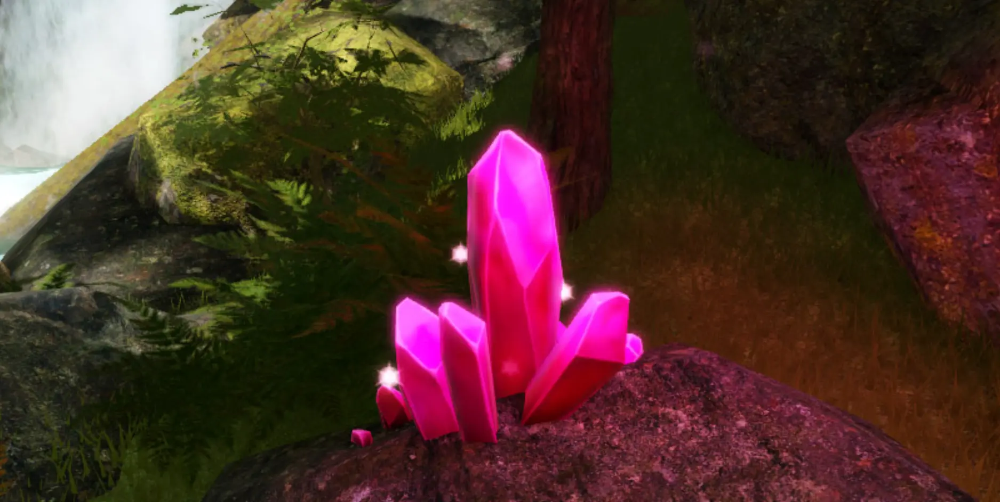
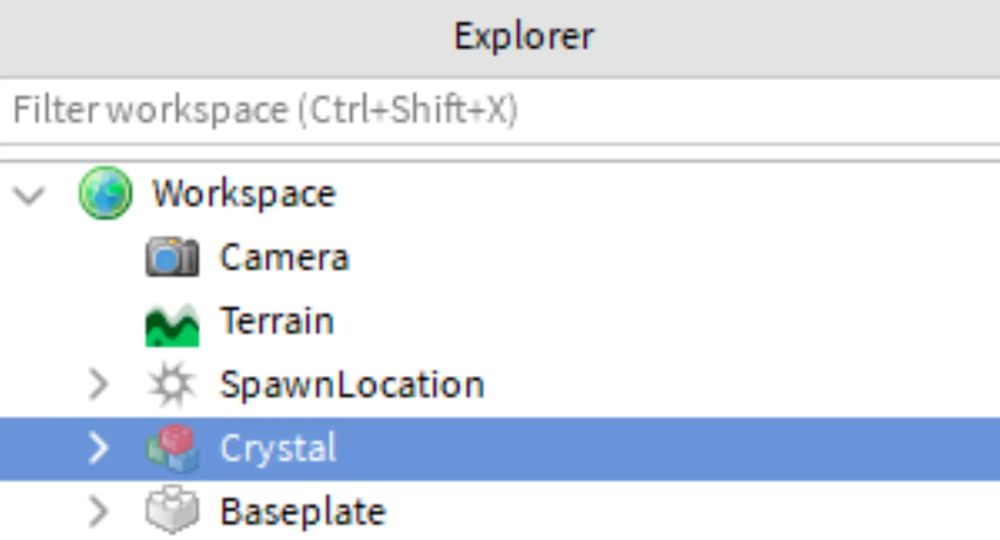
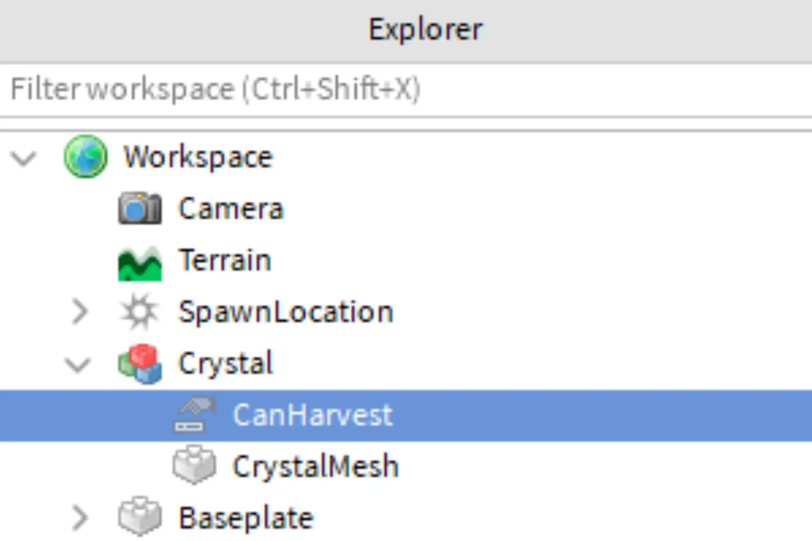
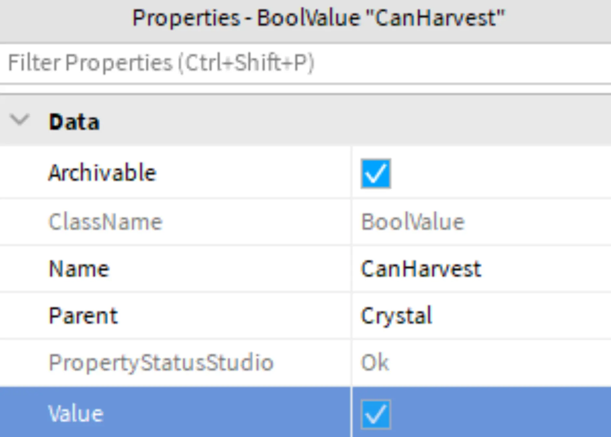
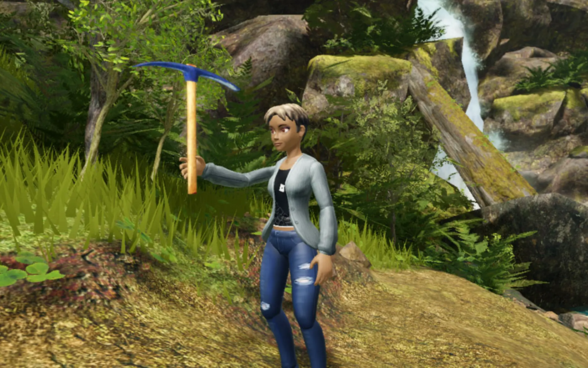
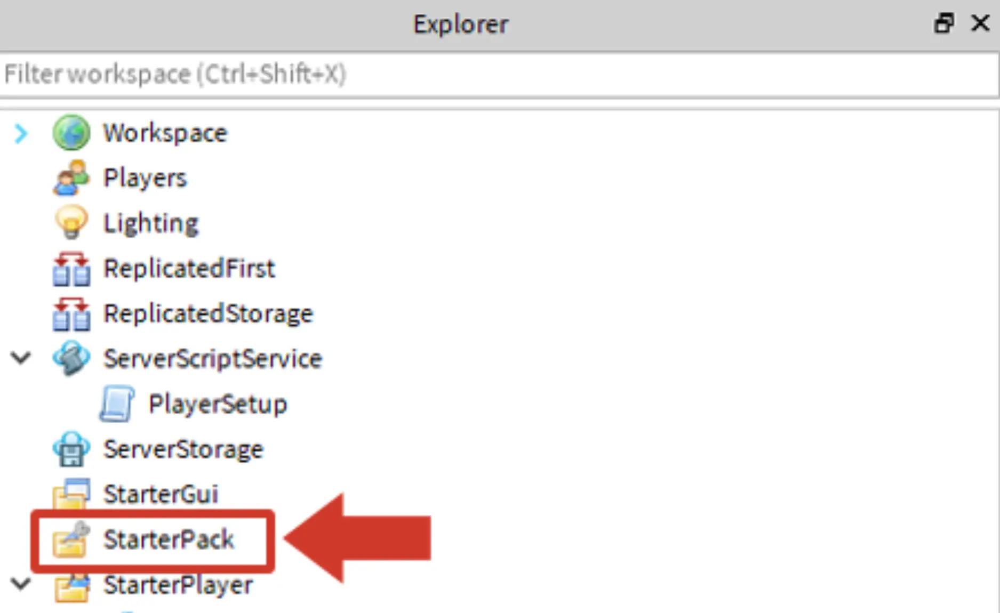
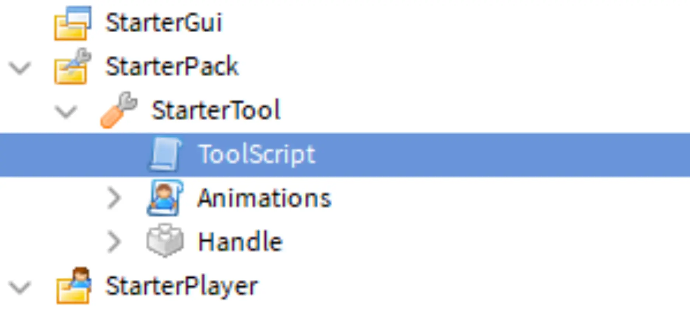
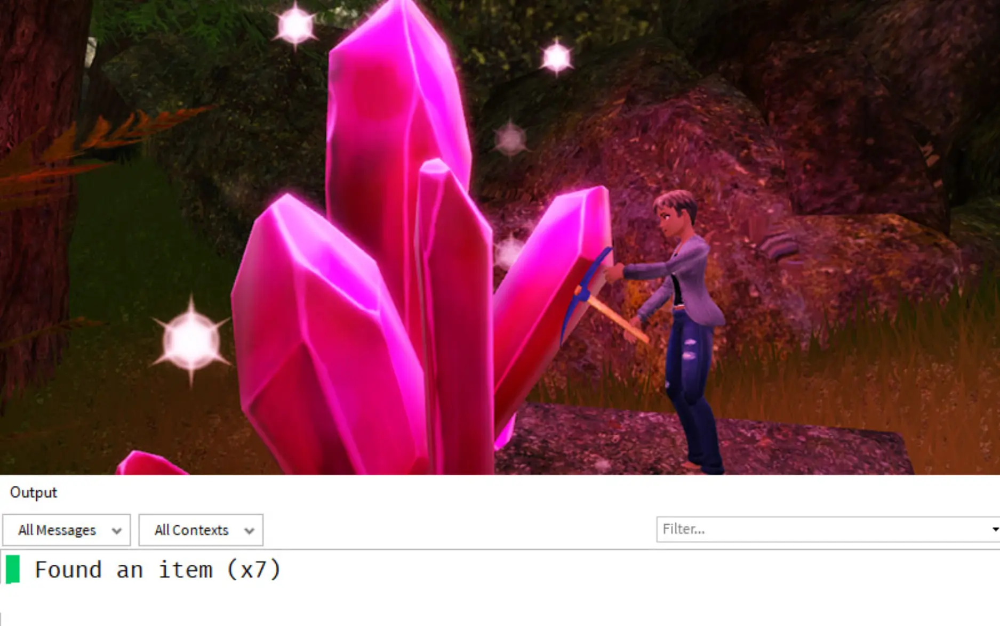
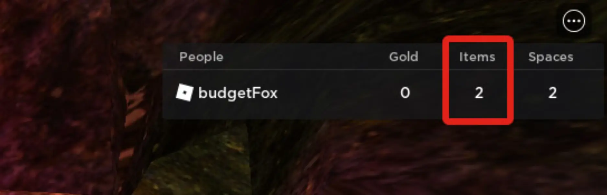

# Collecting Items

## 목차
- [Collecting Items](#collecting-items)
  - [목차](#목차)
  - [아이템 만들기](#아이템-만들기)
  - [도구 만들기](#도구-만들기)
    - [도구 추가하기](#도구-추가하기)
  - [도구 코딩하기](#도구-코딩하기)
    - [스크립트 설정](#스크립트-설정)
    - [아이템 확인](#아이템-확인)
    - [문제 해결 팁](#문제-해결-팁)
    - [플레이어 통계 가져오기](#플레이어-통계-가져오기)
    - [수확 가능한 객체 확인](#수확-가능한-객체-확인)
    - [아이템 재설정](#아이템-재설정)
    - [문제 해결 팁](#문제-해결-팁-1)
  - [완성된 ToolScript](#완성된-toolscript)
  - [출처](#출처)
  - [다음](#다음)

---

리더보드가 생성된 후에는 플레이어가 수집할 아이템을 만들어야 합니다. 이를 위해 플레이어가 세계에서 찾을 수 있는 3D 아이템을 만들어야 합니다. 아래는 플레이어가 아이템을 수집하는 과정을 보여주는 비디오입니다.

<video controls src="../img/13_04_Collecting_Items/adventure-harvestItemShort.mp4" width="100%"></video>

## 아이템 만들기

경험 속의 아이템은 플레이어가 도구를 사용하여 수확할 수 있는 3D 모델입니다. 각 아이템은 수확되면 사라졌다가 일정 시간이 지나면 다시 나타납니다.

아이템의 경우, 게임 디자인 문서를 참조하십시오. 이 시리즈에서는 예제로 크리스탈을 사용합니다.

1. 부품을 사용하거나 마켓플레이스에서 신뢰할 수 있는 사용자가 제공하는 객체를 사용하여 객체를 만듭니다.

   원하는 경우, 이 [링크](https://prod.docsiteassets.roblox.com/assets/education/adventure-game-series/crystalPart.rbxm)를 통해 크리스탈 부품을 다운로드할 수 있습니다. 추가하려면 Workspace를 마우스 오른쪽 버튼으로 클릭하고 **Insert from File**을 선택하십시오.

   

2. 직접 만든 부품을 사용하는 경우, 모든 부품을 **모델**로 그룹화하십시오. 이를 수행하는 한 가지 방법은 모든 아이템을 선택하고, 부품을 마우스 오른쪽 버튼으로 클릭한 다음 **Group**을 선택하는 것입니다. 이렇게 하면 부품을 조직하는 모델이 생성됩니다.

   

3. 모든 부품이 **고정(Anchored)**되어 있는지 확인하십시오.

4. 아이템이 사라질 때 수확할 수 없도록 **BoolValue**를 만들어 CanHarvest라는 이름을 지정하여 상태를 추적합니다.

   

5. CanHarvest의 속성에서 **Value** 상자를 선택합니다. 값 상자를 선택하면 불리언이 true로 설정되어 플레이어가 아이템을 수확할 수 있음을 의미합니다.

   

## 도구 만들기

플레이어가 아이템을 수집하려면 도끼나 삽과 같은 도구가 필요합니다. Roblox에서는 플레이어가 장착하고 사용할 수 있는 아이템을 **도구**라고 합니다. 이 레슨에서는 나중에 사용자 지정할 수 있는 모든 부품과 애니메이션이 이미 만들어진 시작 도구를 사용합니다.



### 도구 추가하기

플레이어가 시작 도구를 사용할 수 있도록 다운로드하여 StarterPack에 배치합니다.

1. 아래에서 시작 도구를 다운로드하십시오.

   <a href="https://prod.docsiteassets.roblox.com/assets/education/adventure-game-series/starterTool.rbxm">
   <Button variant="contained">도구 다운로드</Button>
   </a>

2. Explorer에서 Workspace 아래의 StarterPack을 마우스 오른쪽 버튼으로 클릭합니다. 그런 다음 **Insert from File**을 선택합니다.

   

3. 다운로드한 파일 `starterTool.rbxm`을 선택합니다.
4. 프로젝트를 실행하여 플레이어가 시작하자마자 도구를 장착하는지 확인하십시오. 게임 내에서 <kbd>1</kbd> 키를 눌러 도구를 장착하거나 해제할 수 있습니다. 왼쪽 클릭으로 도구를 휘두릅니다.

   

    <Alert severity="info">
    시작 도구의 이름을 바꾸려면 StarterPack의 객체 이름을 변경하면 됩니다. 그 이름이 플레이어에게 표시됩니다.
    </Alert>

## 도구 코딩하기

도구가 수확 가능한 객체에 닿고 플레이어의 가방에 충분한 공간이 있는 경우, 플레이어의 아이템 수가 리더보드에서 1만큼 증가합니다. 아이템을 수확하면 몇 초 동안 사라지고 다시 나타나기 전에 수확할 수 없게 됩니다. 이렇게 하면 플레이어가 같은 아이템을 반복해서 클릭하는 대신 더 많은 아이템을 찾기 위해 탐험하도록 유도합니다.

### 스크립트 설정

이제 도구에 스크립트를 추가합니다. 이 스크립트는 도구가 수확 가능한 객체에 닿을 때 발생하는 일을 처리합니다.

1. StarterPack에서 StarterTool 아래에 새 스크립트를 추가하고 이름을 ToolScript로 지정합니다.

   

2. 스크립트에서 맨 위에 설명 주석을 작성한 다음 도구 부품과 도구 자체를 저장하는 변수를 만듭니다.

   ```lua
   -- 수확 가능한 부품에 닿으면 플레이어에게 아이템을 제공합니다.
   local tool = script.Parent
   local toolPart = tool.Handle
   ```

### 아이템 확인

도구가 객체에 닿을 때마다 해당 객체에 CanHarvest가 있는지, 그리고 불리언이 True로 설정되어 있는지 확인합니다.

1. `partTouched`라는 매개변수를 가진 `onTouch()`라는 새 함수를 만듭니다.

   ```lua
   local tool = script.Parent
   local toolPart = tool.Handle

   local function onTouch(partTouched)

   end
   ```

2. 그 함수에서 `canHarvest`라는 로컬 변수를 만들고 `FindFirstChild()` 함수를 사용하여 해당 부품의 부모에 CanHarvest 불리언이 있는지 확인합니다.

   ```lua
   local function onTouch(partTouched)
     local canHarvest = partTouched:FindFirstChild("CanHarvest")
   end
   ```

3. 이제 스크립트는 실제로 무엇인가를 찾았는지 확인하고, 그렇다면 코드를 실행해야 합니다. 이를 위해 조건이 `canHarvest`인 if 문을 만듭니다. `canHarvest`에 무언가가 존재하면 이 문장은 true로 평가됩니다.

   ```lua
   local function onTouch(partTouched)
     local canHarvest = partTouched:FindFirstChild("CanHarvest")
     if canHarvest then

     end
   end
   ```

4. if 문에서 스크립트가 작동하는지 확인하기 위해 print 문을 추가합니다. 스크립트가 작동하는지 확인한 후 아이템 수확 논리를 코딩할 수 있습니다.

   ```lua
   if canHarvest then
       -- 코드가 작동하는지 테스트에 사용됨
     print("아이템을 찾았습니다")
   end
   ```

5. 함수의 `end` 문 아래에 `toolPart.Touched:Connect(onTouch)`를 추가합니다. 이렇게 하면 스크립트가 도구(이 경우에는 핸들)에 무엇이든 닿는지 확인하고, 그렇다면 `onTouch()`를 호출합니다.

   ```lua
   local function onTouch(partTouched)
     local canHarvest = partTouched:FindFirstChild("CanHarvest")
     if canHarvest then
       print("아이템을 찾았습니다")
     end
   end

   toolPart.Touched:Connect(onTouch)
   ```

6. 프로젝트를 실행하고 도구를 사용하여 수확 가능한 아이템에 사용하십시오(왼쪽 클릭으로 도구를 휘두릅니다). Output 창에 "아이템을 찾았습니다"라는 메시지가 표시되는지 확인하십시오.

   

### 문제 해결 팁

메시지가 보이지 않으면 다음 팁을 시도해 보십시오.

- 사용자 지정 부품 및 메쉬를 사용하는 경우 오류가 발생할 수 있습니다. 스크립트는 CanHarvest 객체가 도구가 닿는 부품의 자식인 경우에만 작동합니다.
- 도구가 StarterPack에 있고 Workspace에 있지 않은지 확인하십시오.
- 부품이 고정되어 있는지 확인하십시오.

### 플레이어 통계 가져오기

플레이어의 아이템 수를 증가시키기 전에 도구는 해당 플레이어의 리더보드에서 아이템 수가 있는 위치를 찾아야 합니다. 도구가 리더보드에 액세스할 수 있게 되면 해당 플레이어의 아이템 수를 변경할 수 있습니다.

1. 먼저 도구를 사용하는 플레이어를 가져옵니다. ToolScript에서 `local item = toolitem` 아래, 사용자 지정 함수 위에 다음을 입력합니다.

   ```lua
   local item = toolitem

   local backpack = tool.Parent
   local player = backpack.Parent

   local function onTouch(partTouched)
   ```

2. 다음 줄에서 `FindFirstChild()` 함수를 사용하여 플레이어의 리더보드를 찾습니다.

   ```lua
   local backpack = tool.Parent
   local player = backpack.Parent
   local playerStats = player:FindFirstChild("leaderstats")

   local function onTouch(partTouched)
   ```

3. `local playerStats` 아래에 플레이어의 아이템 및 공간 통계를 저장하는 변수를 만듭니다.

   ```lua
   local playerStats = player:FindFirstChild("leaderstats")
   local playerItems = playerStats:FindFirstChild("Items")
   local playerSpaces = playerStats:FindFirstChild("Spaces")
   ```

   <Alert severity="warning">
   `FindFirstChild()`의 괄호 안의 문자열은 PlayerSetup 스크립트의 IntValue 이름과 동일해야 합니다. 아이템에 다른 이름을 사용한 경우 PlayerSetup 스크립트에서와 동일한지 확인하십시오.
   </Alert>

### 수확 가능한 객체 확인

이제 도구 스크립트가 playerItems 및 playerSpaces 변수를 생성했으므로 플레이어에게 아이템을 줄 수 있습니다. 도구에 닿는 객체가 수확 가능한지 확인하고 플레이어의 가방에 충분한 공간이 있는지 확인한 다음 리더보드의 아이템 수를 하나 증가시키는 함수를 사용하십시오.

1. 스크립트에는 두 가지 조건이 충족되어야 하는 if 문이 필요합니다. if 문을 만들고 다음 조건을 `and` 키워드로 연결하여 추가하십시오.

   - `canHarvest.Value == true`
   - `playerItems.Value < playerSpaces.Value`

   ```lua
   local function onTouch(partTouched)
     local canHarvest = partTouched.Parent:FindFirstChild("CanHarvest")
     if canHarvest then
       if canHarvest.Value == true and playerItems.Value < playerSpaces.Value then

       end
     end
   end
   ```

   <Alert severity="info">
   값 객체의 내용을 액세스하려면 객체 끝에 .Value를 입력하십시오. 객체 자체만 사용하면 이름만 가져오게 됩니다.
   </Alert>

2. if 문 안에서 `playerItems.Value += 1`을 입력하여 플레이어의 아이템을 추가합니다.

   ```lua
   if canHarvest then
     if canHarvest.Value == true and playerItems.Value < playerSpaces.Value then
         playerItems.Value += 1

     end
   end
   ```

3. 프로젝트를 실행하여 도구를 사용하여 아이템을 수확하고 아이템 수가 증가했는지 확인하십시오.

   

    <Alert severity="warning">
    현재 플레이어의 아이템 수치는 하나의 아이템을 치면 즉시 채워집니다. 다음 섹션에서는 아이템이 재설정되어 플레이어가 각 아이템에서 하나의 아이템만 얻을 수 있도록 합니다.
    </Alert>

### 아이템 재설정

아이템이 수확되면 두 가지 방식으로 재설정됩니다:

- 아이템이 사라지고 상호작용할 수 없게 됩니다.
- CanHarvest가 false로 설정됩니다.

그런 다음 짧은 시간 후에 아이템이 원래 상태로 돌아갑니다. 이렇게 하면 플레이어가 각 수확에서 하나의 아이템만 얻고, 원래 아이템이 재설정되는 동안 더 많은 아이템을 찾기 위해 탐색해야 합니다.

1. 아이템이 추가된 후 `canHarvest`를 false로 설정합니다. 플레이어가 아이템을 수확하자마자 canHarvest의 값을 false로 설정하면 스크립트는 도구가 한 번 타격할 때 하나의 아이템만 제공합니다.

   ```lua
   if canHarvest then
     if canHarvest.Value == true and playerItems.Value < playerSpaces.Value then
       playerItems.Value += 1
       canHarvest.Value = false
     end
   end
   ```

2. 값을 false로 설정한 후, 부품의 투명도를 1(보이지 않음)로 설정하고, CanCollide를 false로 설정하여 플레이어가 만질 수 없게 만듭니다.

   ```lua
   if canHarvest.Value == true and playerItems.Value < playerSpaces.Value then
     playerItems.Value += 1
     canHarvest.Value = false
     partTouched.Transparency = 1
     partTouched.CanCollide = false
   end
   ```

3. 아이템을 재설정하는 데 필요한 시간을 주기 위해 `task.wait(5)`를 입력합니다. 5는 권장 숫자이며 경험에 따라 시간이 다를 수 있습니다.

   ```lua
   if canHarvest.Value == true and playerItems.Value < playerSpaces.Value then
     playerItems.Value += 1
     canHarvest.Value = false
     partTouched.Transparency = 1
     partTouched.CanCollide = false
     task.wait(5)
   end
   ```

4. 대기 후, 이전 코드와 반대로 CanHarvest를 true로 설정하고 투명도와 CanCollide를 원래 값으로 재설정합니다.

   ```lua
     task.wait(5)
     canHarvest.Value = true
     partTouched.Transparency = 0
     partTouched.CanCollide = true
   end
   ```

5. 프로젝트를 실행하고 다음을 확인하십시오:

   - 플레이어가 아이템을 수확할 때 하나의 아이템만 얻습니다.
   - 아이템이 사라졌다가 5초 후에 다시 나타납니다.

   <video controls src="../img/13_04_Collecting_Items/adventure-harvestItemFull.mp4" width="100%"></video>

### 문제 해결 팁

이 시점에서 검사 중 하나가 통과하지 않으면 다음 중 하나를 시도해 보십시오.

- 투명도 및 CanCollide가 정확하게 철자되고 대문자가 사용되었는지 확인하십시오.
- canHarvest.Value를 사용하고 canHarvest = true를 사용하지 않는지 확인하십시오.

## 완성된 ToolScript

완성된 스크립트는 아래를 참고하십시오.

```lua
local toolPart = script.Parent
local tool = toolPart.Parent

local backpack = tool.Parent
local player = backpack.Parent
local playerStats = player:FindFirstChild("leaderstats")
local playerItems = playerStats:FindFirstChild("Items")
local playerSpaces = playerStats:FindFirstChild("Spaces")

local function onTouch(partTouched)
	local canHarvest = partTouched:FindFirstChild("CanHarvest")
	if canHarvest then
		if canHarvest.Value == true and playerItems.Value < playerSpaces.Value then
			playerItems.Value += 1
			canHarvest.Value = false
			-- 수확된 아이템 재설정
			partTouched.Transparency = 1
			partTouched.CanCollide = false

			task.wait(5)
			-- 수확된 아이템을 다시 나타내고 사용할 수 있게 함
			canHarvest.Value = true
			partTouched.Transparency = 0
			partTouched.CanCollide = true
		end
	end
end

toolPart.Touched:Connect(onTouch)
```

---
## 출처
 - [Collecting Items](https://create.roblox.com/docs/ko-kr/education/adventure-game-series/collect-items)

---
## [다음](./13_05_Selling_Items.md)