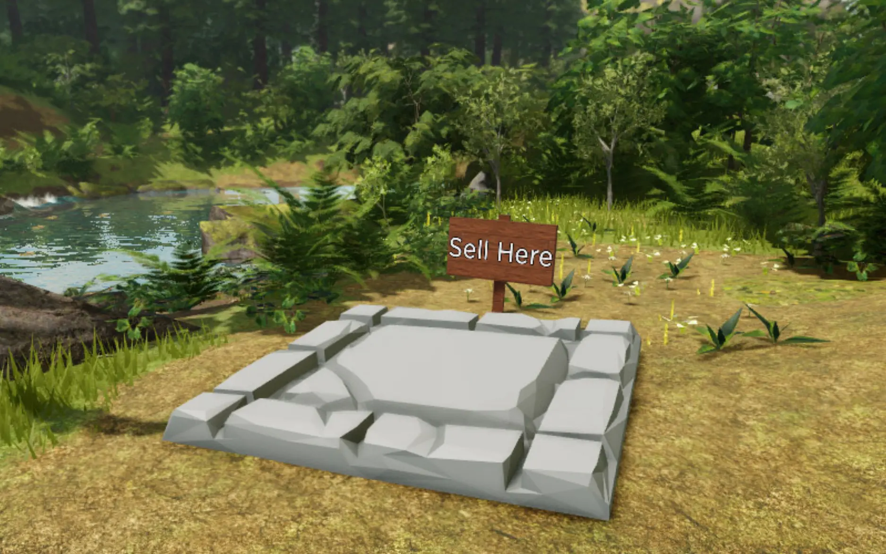
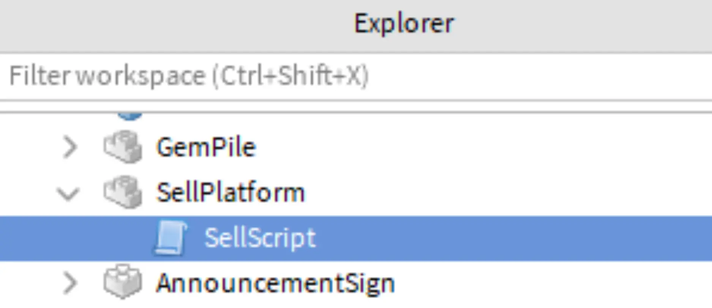

# Selling Items

## 목차
- [Selling Items](#selling-items)
  - [목차](#목차)
  - [판매 플랫폼 만들기](#판매-플랫폼-만들기)
    - [플랫폼 설정하기](#플랫폼-설정하기)
    - [터치 이벤트 처리](#터치-이벤트-처리)
  - [아이템 판매](#아이템-판매)
    - [새로운 판매 함수 코딩](#새로운-판매-함수-코딩)
    - [문제 해결 팁](#문제-해결-팁)
  - [출처](#출처)
  - [다음](#다음)

---


게임 루프의 다음 단계에서는 플레이어가 가방에 있는 아이템을 골드로 판매하여 더 많은 공간을 구입할 수 있도록 해야 합니다.

## 판매 플랫폼 만들기

플레이어는 가방에 있는 아이템을 골드로 바꾸기 위해 플랫폼에 올라가서 아이템을 판매합니다.

### 플랫폼 설정하기

플랫폼은 어떤 부품이든 될 수 있으며, 판매를 처리하는 스크립트를 포함해야 합니다.

1. SellPlatform이라는 새 부품을 만들고, 경험의 테마에 맞게 맞춤 설정하십시오.

   

2. SellPlatform에서 SellScript라는 새 스크립트를 만들고 주석을 추가하십시오.

   

3. SellScript에서 SellPlatform 부품을 가져오기 위해 `local sellPart = script.Parent`를 입력하십시오.

   ```lua
   -- 플레이어의 모든 아이템을 판매하고 골드를 지급합니다.
   local sellPart = script.Parent
   ```

### 터치 이벤트 처리

플랫폼을 사용하려면 스크립트에 플레이어가 플랫폼을 터치하는지 확인하는 함수가 필요합니다.

1. 플레이어가 플랫폼을 터치하는지 확인하는 `onTouch()`라는 함수를 만드십시오.

   ```lua
   local function onTouch(partTouched)
     local character = partTouched.Parent
   end
   ```

2. 리더보드의 통계를 변경하려면 스크립트가 캐릭터를 제어하는 플레이어를 알아야 합니다. if 문에서 `GetPlayerFromCharacter()` 함수를 사용하여 플레이어를 찾으십시오.

   ```lua
   local Players = game:GetService("Players")

   local player = Players:GetPlayerFromCharacter(character)
   ```

3. 다음 줄에서 해당 플레이어의 리더보드 컨테이너를 가져오십시오.

   ```lua
   local Players = game:GetService("Players")

   local player = Players:GetPlayerFromCharacter(character)
   
   if player then
      -- 플레이어의 리더보드를 가져옵니다. 아이템과 골드를 가져오는 데 필요합니다.
      local playerStats = player:FindFirstChild("leaderstats")
   end
   ```

4. 다음 줄에서 플레이어의 골드와 아이템을 가져오는 변수를 만드십시오.

   ```lua
   local Players = game:GetService("Players")

   local player = Players:GetPlayerFromCharacter(character)
   
   if player then
      -- 플레이어의 리더보드를 가져옵니다. 아이템과 골드를 가져오는 데 필요합니다.
      local playerStats = player:FindFirstChild("leaderstats")

      if playerStats then
         -- 플레이어의 아이템과 골드를 가져옵니다.
         local playerItems = playerStats:FindFirstChild("Items")
         local playerGold = playerStats:FindFirstChild("Gold")
      end
   end
   ```

   <Alert severity="warning">
   `FindFirstChild()`의 모든 이름이 PlayerSetup 스크립트에 작성된 이름과 정확히 일치하는지 확인하십시오. 예를 들어, PlayerSetup에서 돈이 "Rubies"인 경우 playerGold는 "Gold" 대신 "Rubies"를 찾아야 합니다.
   </Alert>

5. 작업을 확인하려면 플레이어가 sellPart를 터치했을 때 실행될 print 문을 추가하십시오.

   ```lua
   local playerItems = playerStats:FindFirstChild("Items")
   local playerGold = playerStats:FindFirstChild("Gold")
   print("플레이어가 sellPart를 터치했습니다.")
   ```

6. 스크립트의 맨 아래에 `sellPart.Touched:Connect(onTouch)`를 연결하십시오.

   ```lua
   local Players = game:GetService("Players")

   local function onTouch(partTouched)
     local character = partTouched.Parent
     local player = Players:GetPlayerFromCharacter(character)
     if player then
       -- 플레이어의 리더보드를 가져옵니다. 아이템과 골드를 가져오는 데 필요합니다.
       local playerStats = player:FindFirstChild("leaderstats")
       
       if playerStats then
         -- 플레이어의 아이템과 골드를 가져옵니다.
         local playerItems = playerStats:FindFirstChild("Items")
         local playerGold = playerStats:FindFirstChild("Gold")

         print("플레이어가 sellPart를 터치했습니다.")
       end
     end
   end

   sellPart.Touched:Connect(onTouch)
   ```

7. 프로젝트를 실행하고 sellPart에 올라가 보십시오. Output 창에서 `"플레이어가 sellPart를 터치했습니다"` 메시지를 확인하십시오.

## 아이템 판매

이 경험에서는 플레이어가 각 아이템당 100골드를 받습니다. 돈을 받은 후, 플레이어의 아이템 수는 0으로 설정되어 플레이어가 더 많은 아이템을 찾을 수 있도록 합니다.

### 새로운 판매 함수 코딩

1. 변수 아래에 `playerItems`와 `playerGold`라는 두 매개변수를 받는 `sellItems()`라는 함수를 만드십시오.

   ```lua
   -- 플레이어의 모든 아이템을 판매하고 골드를 지급합니다.
   local sellPart = script.Parent

   local function sellItems(playerItems, playerGold)

   end

   local function onTouch(partTouched)
   ```

2. 플레이어에게 정확한 양의 골드를 주기 위해, `playerItems`의 값을 각 아이템당 받아야 하는 골드 양과 곱하십시오. 이 예제에서는 각 아이템당 100골드를 줍니다.

   `sellItems()` 함수에서 `local totalSell = playerItems.Value * 100`을 입력하십시오.

   ```lua
   local function sellItems(playerItems, playerGold)
     -- 플레이어가 가진 아이템 수와 아이템의 가치를 곱합니다.
     local totalSell = playerItems.Value * 100
   end
   ```

3. `playerGold.Value += totalSell`을 입력하여 아이템에 대한 골드를 현재 골드에 추가하십시오.

   ```lua
   local function sellItems(playerItems, playerGold)
     local totalSell = playerItems.Value * 100
     -- 플레이어가 번 돈을 골드에 추가합니다.
     playerGold.Value += totalSell
   end
   ```

4. `playerItems.Value = 0`을 입력하여 플레이어의 아이템을 0으로 설정하십시오. 플레이어의 아이템이 0으로 설정되지 않으면 스크립트가 플레이어에게 계속해서 골드를 줍니다.

   ```lua
   local function sellItems(playerItems, playerGold)
     local totalSell = playerItems.Value * 100
     playerGold.Value += totalSell
     playerItems.Value = 0
   end
   ```

5. **두 번째 if 문** 아래의 `onTouch()` 함수에서 `sellItems()` 함수를 호출하십시오. 매개변수 `playerItems`와 `playerGold`를 전달하여 변경할 수 있도록 합니다.

   ```lua
   local Players = game:GetService("Players")

   local player = Players:GetPlayerFromCharacter(character)

   if player then
     -- 플레이어의 리더보드를 가져옵니다. 아이템과 골드를 가져오는 데 필요합니다.
     local playerStats = player:FindFirstChild("leaderstats")

     if playerStats then
      -- 플레이어의 아이템과 골드를 가져옵니다.
      local playerItems = playerStats:FindFirstChild("Items")
      local playerGold = playerStats:FindFirstChild("Gold")

      if playerItems and playerGold then
         sellItems(playerItems, playerGold)
      end
     end
   end
   ```

6. 프로젝트를 실행하여 플레이어가 플랫폼에 올라설 때마다 골드가 증가하고 아이템이 0으로 설정되는지 확인하십시오.

   <video controls src="../img/13_05_Selling_Items/adventure-sellItems.mp4" width="100%"></video>

### 문제 해결 팁

이 시점에서 아이템 판매가 의도대로 작동하지 않으면 다음 중 하나를 시도해 보십시오.

- `sellItems()` 함수는 플레이어의 아이템을 확인하는 두 번째 if 문에서 호출됩니다.
- playerItems와 같은 모든 IntValue는 변경할 때 끝에 .Value를 사용합니다. Value는 항상 대문자로 시작합니다.
- `sellPart.Touched:Connect(onTouch)`는 스크립트의 맨 아래에 입력되어 있습니다.
- `sellItems(playerItems, playerGold)`는 if humanoid then 문 끝 전에 입력됩니다.

---
## 출처
 - [Selling Items](https://create.roblox.com/docs/ko-kr/education/adventure-game-series/selling-items)

---
## [다음](./13_06_Buying_Upgrades.md)