# Buying Upgrades

## 목차
- [Buying Upgrades](#buying-upgrades)
  - [목차](#목차)
  - [상점 만들기](#상점-만들기)
    - [표지판 만들기](#표지판-만들기)
    - [표지판 텍스트 변경](#표지판-텍스트-변경)
    - [Click Detector 추가](#click-detector-추가)
    - [문제 해결 팁](#문제-해결-팁)
  - [업그레이드 구매](#업그레이드-구매)
    - [업그레이드 변수 추가](#업그레이드-변수-추가)
    - [업그레이드 제공](#업그레이드-제공)
    - [문제 해결 팁](#문제-해결-팁-1)
  - [완성된 BuyScript 스크립트](#완성된-buyscript-스크립트)
  - [출처](#출처)
  - [다음](#다음)

---

이것은 게임 루프의 마지막 단계인 업그레이드 구매에 대한 내용입니다. 플레이어가 아이템 가방의 크기를 늘리는 업그레이드를 구매할 수 있도록 하면 한 번에 더 많은 아이템을 수확하고 더 많은 골드를 얻을 수 있습니다.

## 상점 만들기

각 상점에는 플레이어가 더 큰 아이템 가방을 구매할 수 있는 버튼이 있습니다. 상점 자체는 SurfaceGUI가 포함된 파트로, 파트에 텍스트를 쓸 수 있게 해줍니다.

### 표지판 만들기

1. Workspace에서 Shop이라는 새 모델을 만듭니다.
2. Shop 안에 BuyButton이라는 새 블록 파트를 만듭니다.

   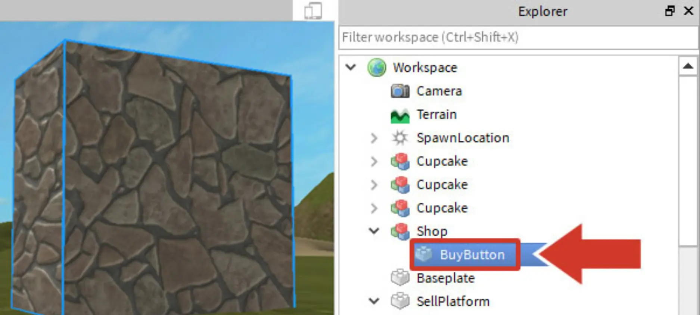

3. BuyButton에서 Surface GUI를 추가하려면 + 버튼을 클릭하고 GUI를 선택합니다.

   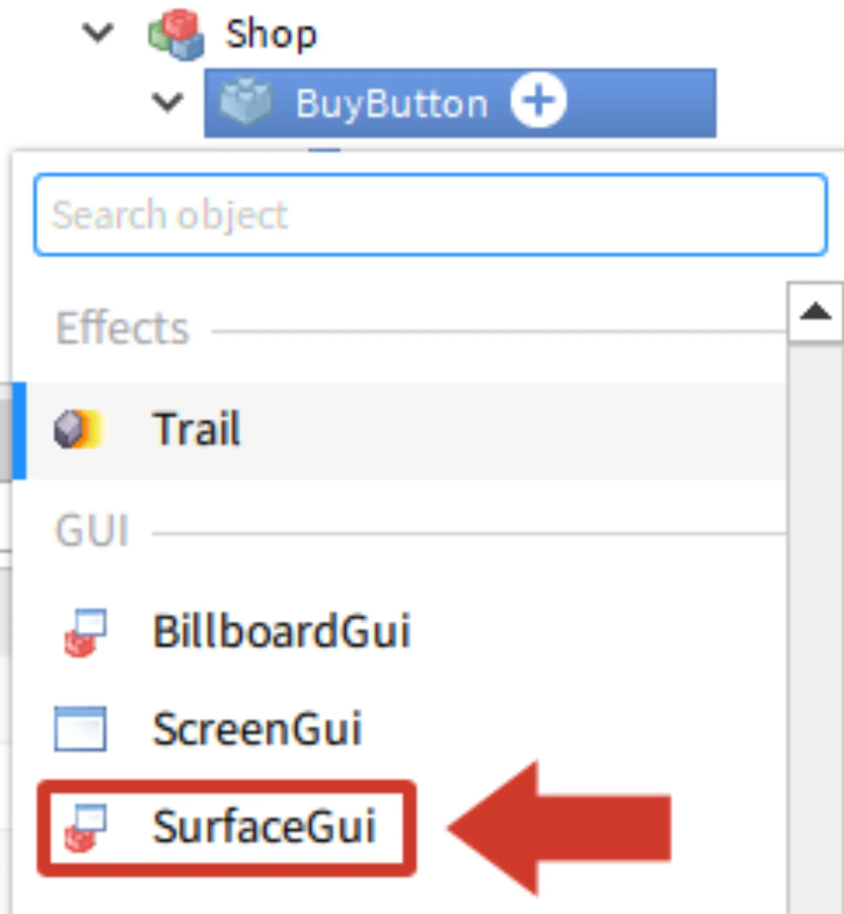

4. Surface GUI 안에 BuyText라는 새 TextLabel을 추가합니다. 작은 라벨이 파트의 어딘가에 나타납니다.

   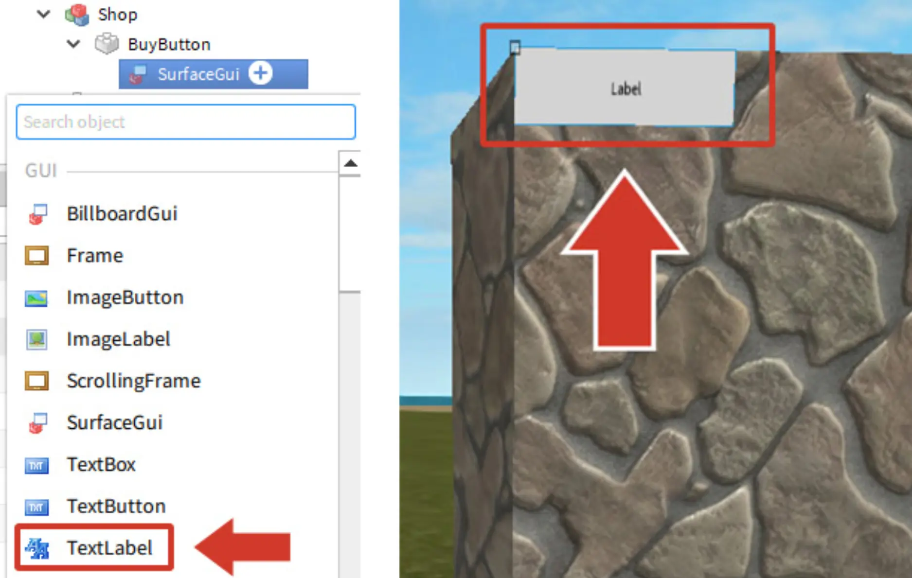

5. 파트의 제작 방식에 따라 라벨이 다른 위치에 있을 수 있습니다. 원하는 면에 텍스트가 보이지 않으면 SurfaceGUI로 이동하여 Face 속성을 찾으십시오. 텍스트 라벨이 보일 때까지 속성을 변경하십시오.

   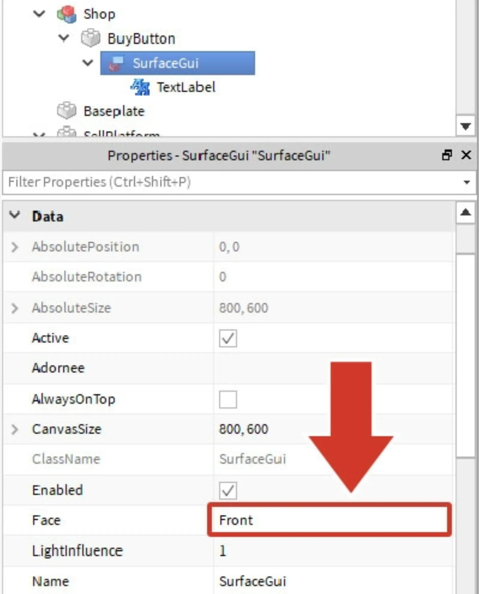

   <Alert severity="warning">
   파트에 따라 Face 속성이 위 그림과 다를 수 있습니다.
   </Alert>

### 표지판 텍스트 변경

현재 TextLabel은 너무 작아서 플레이어가 보기 어렵습니다. 크기를 키워야 합니다.

1. BuyText 속성에서 **Size** 옆의 화살표를 클릭합니다. X(좌우) 및 Y(상하)의 **Offset**을 0으로 변경합니다.

   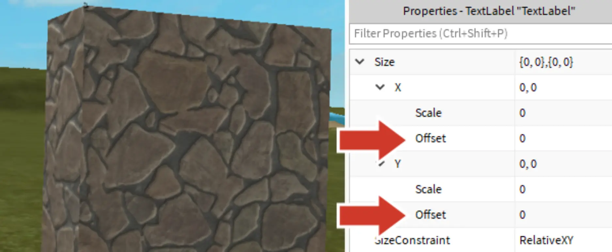

2. X 및 Y의 **scale**을 0.5로 변경하여 정사각형을 만듭니다.

   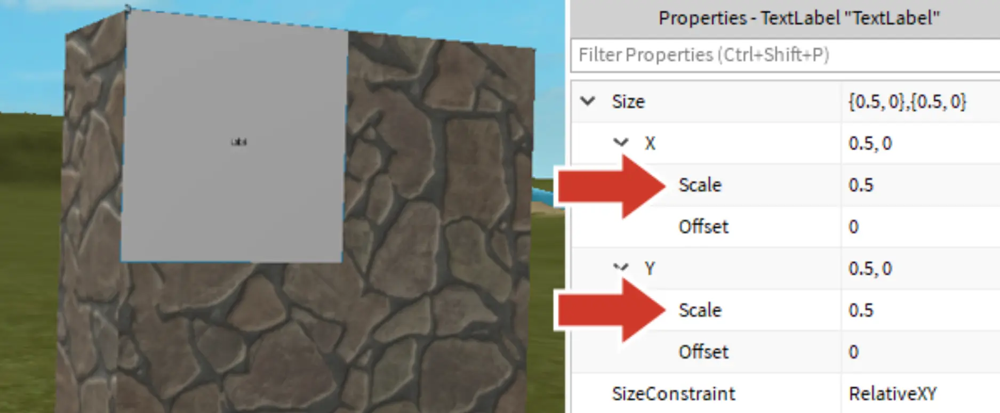

3. TextLabel 속성에서 **AnchorPoint** 왼쪽의 화살표를 클릭합니다. X 및 Y에 0.5를 입력합니다. 이렇게 하면 라벨의 일부가 보이지 않게 되지만 다음에 올바르게 위치시킬 것입니다.

   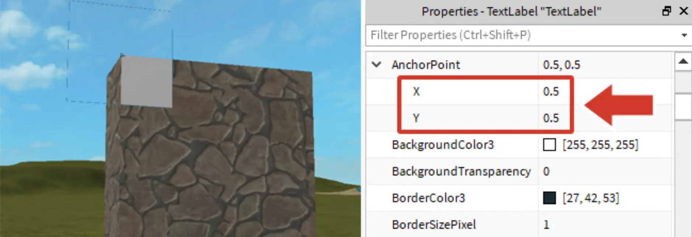

4. 속성에서 **Position**을 열고 X 및 Y의 스케일을 0.5로 변경하여 상자가 중앙에 오도록 합니다.

   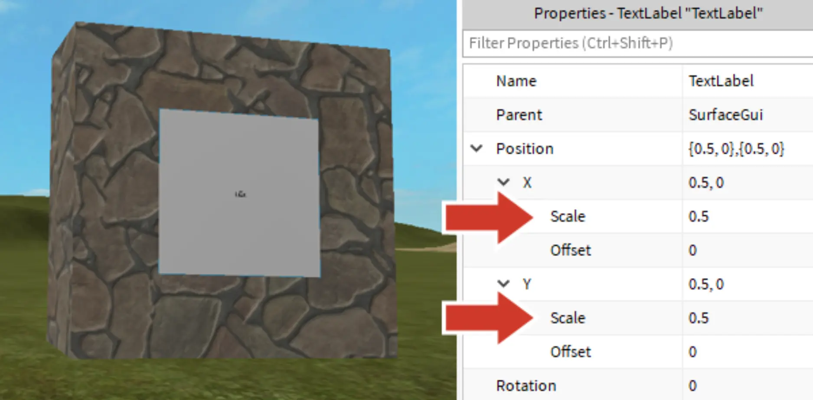

5. BuyText 속성에서 **Text**를 설명적으로 변경합니다. 예를 들어: `"Buy Larger Bag: 100 gold"`.
6. **TextScaled**를 **on**으로 설정합니다. 이렇게 하면 텍스트가 상자에 맞게 자동으로 조정됩니다.

### Click Detector 추가

플레이어는 상점을 터치하는 대신 클릭하여 아이템을 구매합니다. 스크립트는 클릭 감지기를 사용하여 플레이어가 상점 표지판을 클릭했는지 확인합니다. **ClickDetectors**는 환경에서 문을 여는 것과 같은 상호작용을 가능하게 하는 객체입니다.

1. BuyButton에 ClickDetector를 추가합니다.

   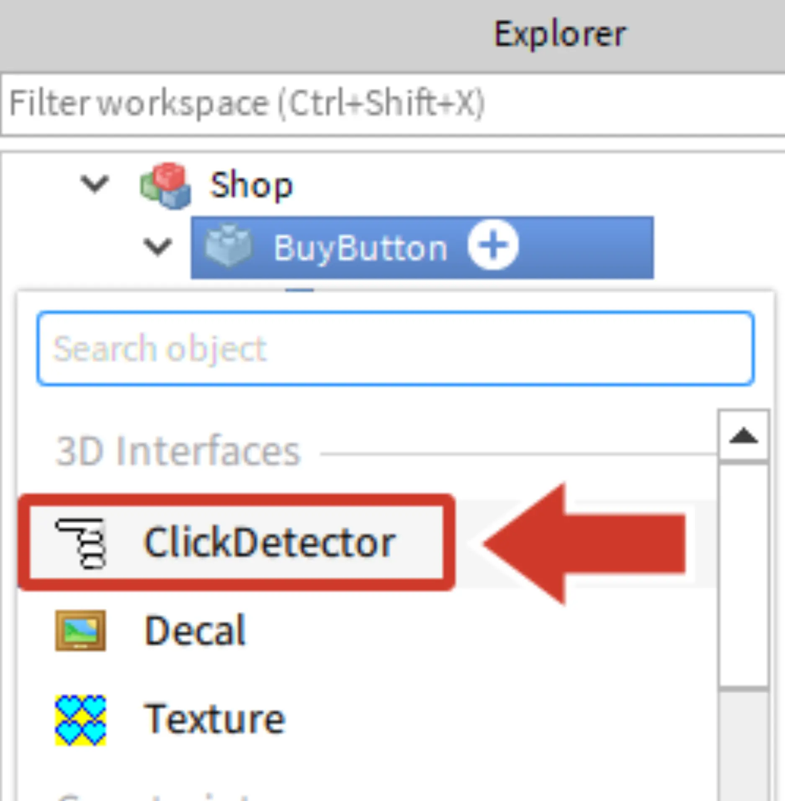

2. BuyButton에 BuyScript라는 새 스크립트를 추가하고 설명적인 주석을 추가합니다.

   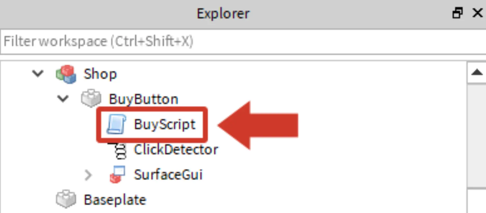

3. BuyScript에서 버튼 파트와 클릭 감지기를 저장할 변수를 만듭니다.

   ```lua
   -- 플레이어가 버튼을 클릭하여 Spaces를 증가시키는 업그레이드를 구매할 수 있게 합니다.
   local buyButton = script.Parent
   local clickDetector = buyButton.ClickDetector
   ```

4. `giveUpgrade()`라는 새로운 함수를 만들고 `player`라는 매개변수를 받습니다. 이 함수는 플레이어가 버튼을 클릭할 때마다 플레이어의 공간을 업그레이드합니다.

   ```lua
   local buyButton = script.Parent
   local clickDetector = buyButton.ClickDetector

   local function giveUpgrade(player)

   end
   ```

5. 함수 아래에 클릭 감지기의 `MouseClick` 이벤트를 `giveUpgrade()` 함수에 연결합니다.

   ```lua
   local function giveUpgrade(player)

   end

   clickDetector.MouseClick:Connect(giveUpgrade)
   ```

6. `giveUpgrade()` 함수에 print 문을 추가하여 함수를 테스트합니다.

   ```lua
   local function giveUpgrade(player)
      print("누군가 버튼을 클릭했습니다.")
   end
   ```

7. 프로젝트를 **재생**합니다. 버튼을 클릭하고 Output 창에 텍스트가 표시되는지 확인하십시오.

   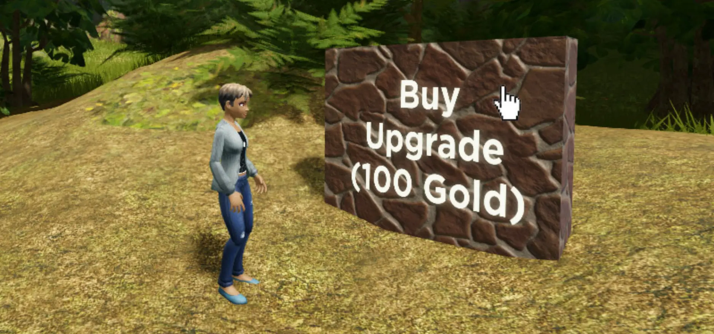

   <Alert severity="info">
   Click Detectors는 플레이어가 상호작용할 수 있는 거리가 있습니다. 이 거리를 변경하려면 객체로 이동하여 MaxActivationDistance를 수정하십시오.
   </Alert>

### 문제 해결 팁

**문제:** 버튼을 클릭할 수 없거나 버튼에 마우스 커서가 나타나지 않습니다.

- ClickDetector 객체가 클릭하려는 파트의 자식인지 확인하십시오.
- 캐릭터가 버튼에 충분히 가까이 있는지 확인하십시오. 또는 도구가 장착되지 않았는지 확인하십시오.

## 업그레이드 구매

작동하는 버튼이 있으면 이제 giveUpgrade에 플레이어의 골드를 빼고 업그레이드된 가방을 제공하는 코드를 추가할 차례입니다.

### 업그레이드 변수 추가

각 업그레이드에는 업그레이드 비용과 공간 수의 두 변수가 있습니다.

1. BuyScript에서 `local clickDetector` 아래에 두 변수를 만듭니다:

   - `newSpace`: 구매할 때 추가되는 공간 수.
   - `upgradeCost`: 업그레이드 비용

   ```lua
   -- 업그레이드 변수
   local newSpaces = 10
   local upgradeCost = 100
   ```

### 업그레이드 제공

플레이어에게 업그레이드를 판매하기 전에 그들이 충분한 돈을 가지고 있는지 확인해야 합니다. 만약 그렇다면, 그들의 최대 공간 수를 증가시킵니다.

1. `giveUpgrade()`에서 플레이어의 골드와 공간 변수를 액세스할 수 있도록 플레이어의 리더보드를 가져오는 아래 코드를 입력하십시오.

   ```lua
   local function giveUpgrade(player)
      print("누군가 버튼을 클릭했습니다.")
      -- 플레이어의 리더보드를 가져와 다른 IntValue를 얻습니다.
      local playerStats = player:FindFirstChild("leaderstats")

      if playerStats then
         -- 플레이어의 골드와 공간을 가져와 변경합니다.
         local playerGold = playerStats:FindFirstChild("Gold")
         local playerSpaces = playerStats:FindFirstChild("Spaces")
      end
   end
   ```

     <Alert severity="warning">
     변수 이름이 PlayerSetup 스크립트와 동일한지 확인하십시오.
     </Alert>

2. 공간 변수에 대한 변수를 작성한 후, `playerGold` 값이 업그레이드 비용보다 크거나 같은지 확인하는 if 문을 만듭니다.

   ```lua
   local function giveUpgrade(player)
      local playerStats = player:FindFirstChild("leaderstats")

      if playerStats then
         local playerGold = playerStats:FindFirstChild("Gold")
         local playerSpaces = playerStats:FindFirstChild("Spaces")

         -- 플레이어가 업그레이드를 구입할 충분한 돈이 있는지 확인합니다.
         if playerGold and playerSpaces and playerGold.Value >= upgradeCost then

         end
      end
   end
   ```

3. if 문에서 플레이어의 골드에서 업그레이드 비용을 빼십시오.

   ```lua
   if playerGold and playerSpaces and playerGold.Value >= upgradeCost then
      -- 아이템의 비용을 플레이어의 돈에서 뺍니다.
      playerGold.Value -= upgradeCost
   end
   ```

4. 다음 줄에서 플레이어의 현재 공간 수와 업그레이드당 부여되는 새로운 공간 수를 더합니다.

   ```lua
   if playerGold and playerSpaces and playerGold.Value >= upgradeCost then
      playerGold.Value -= upgradeCost
      playerSpaces.Value += newSpaces
   end
   ```

5. 프로젝트를 실행하여 공간 업그레이드가 작동하는지 리더보드를 확인하십시오.

   <video controls src="../img/13_06_Buying_Upgrades/adventure-showUpgradePurchase.mp4" width="100%"></video>

### 문제 해결 팁

이 시점에서 업그레이드가 의도대로 작동하지 않으면 다음 중 하나를 시도해 보십시오.

- `FindFirstChild()`의 `()` 안에 있는 모든 항목에 **양쪽**

에 인용 부호가 있는지 확인하십시오. 예: `"leaderstats"`.
- 각 문자열이 PlayerSetup 스크립트의 IntValue 이름과 정확히 일치하는지 확인하십시오. 예를 들어, 코드에서 돈을 Rubies로 사용한다면 `FindFirstChild("Rubies")`가 있어야 합니다.
- `giveUpgrade()`가 `clickDetector.MouseClick` 위에 있는지 확인하십시오.

## 완성된 BuyScript 스크립트

완성된 스크립트의 버전은 아래를 참조할 수 있습니다.

```lua
-- 플레이어가 버튼을 클릭하여 MaxSpaces를 증가시키는 업그레이드를 구매할 수 있게 합니다.
local buyButton = script.Parent
local clickDetector = buyButton.ClickDetector

-- 업그레이드 변수
local newSpaces = 10
local upgradeCost = 100

local function giveUpgrade(player)
	print("누군가 버튼을 클릭했습니다.")
	-- 플레이어의 리더보드를 가져와 다른 IntValue를 얻습니다.
	local playerStats = player:FindFirstChild("leaderstats")

   if playerStats then
      -- 플레이어의 골드와 공간을 가져와 변경합니다.
      local playerGold = playerStats:FindFirstChild("Gold")
      local playerSpaces = playerStats:FindFirstChild("Spaces")

	   -- 플레이어가 업그레이드를 구입할 충분한 돈이 있는지 확인합니다.
      if playerGold and playerSpaces and playerGold.Value >= upgradeCost then
      	print("플레이어가 아이템을 구입할 수 있습니다.")
      	-- 아이템의 비용을 플레이어의 돈에서 뺍니다.
         playerGold.Value -= upgradeCost
         playerSpaces.Value += newSpaces
      end
   end
end

clickDetector.MouseClick:Connect(giveUpgrade)
```

---
## 출처
 - [Buying Upgrades](https://create.roblox.com/docs/ko-kr/education/adventure-game-series/buying-upgrades)

---
## [다음](./13_07_Finishing_the_Project.md)