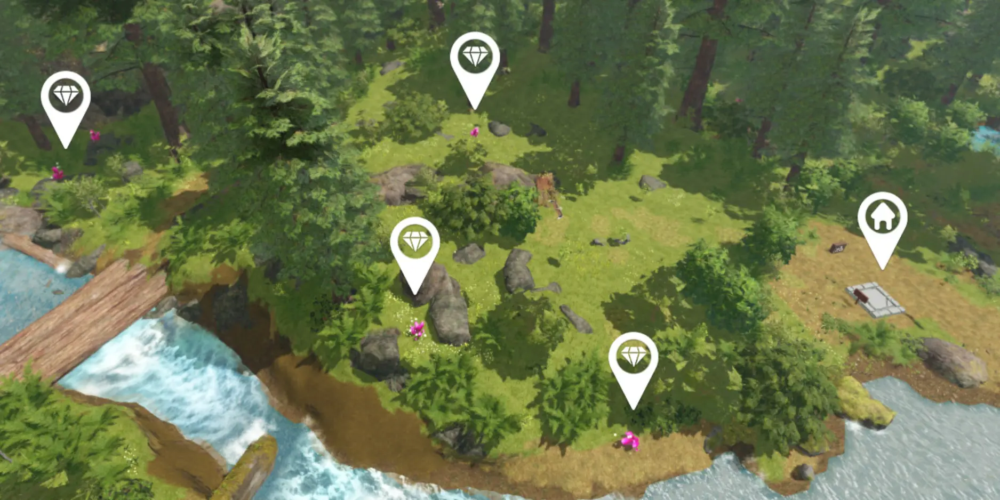

# Finishing the Project

## 목차
- [Finishing the Project](#finishing-the-project)
  - [목차](#목차)
  - [플레이어 변수 시작 값](#플레이어-변수-시작-값)
  - [더 많은 아이템 추가](#더-많은-아이템-추가)
  - [플레이 테스트와 피드백](#플레이-테스트와-피드백)
  - [경험 확장](#경험-확장)
  - [출처](#출처)
  - [다음](#다음)

---

여러분의 경험을 다른 사람들과 공유할 준비가 거의 완료되었습니다! 공유하기 전에 스크립트에 몇 가지 작은 변경을 하고, 세계를 조금 더 확장하며, 경험을 플레이 테스트해 보겠습니다.

## 플레이어 변수 시작 값

경험을 만드는 동안 많은 변수가 작은 값으로 설정되었습니다. 예를 들어, 플레이어의 시작 공간은 2였습니다. 이는 테스트를 쉽게 만들었지만, 최종 경험에서 플레이어에게 적절한 숫자가 아닐 수 있습니다.

경험을 다른 사람들과 공유하기 전에 변수들이 **도전적**이지만 **공정**하게 느껴지는 것이 중요합니다. 올바른 숫자를 설정하면 플레이어에게 더 재미있는 경험을 제공할 수 있습니다.

1. ServerScriptService > PlayerSetup에서 `Spaces` 값을 변경합니다. 이는 플레이어가 아이템을 판매하기 전까지 보유할 수 있는 공간 수입니다. 6-10 사이의 숫자가 좋은 시작점이지만, 적절한 양을 찾기 위해 플레이 테스트를 해보는 것이 좋습니다.

   ```lua
   local maxSpaces = Instance.new("IntValue")
   maxSpaces.Name = "Spaces"
   -- 플레이어의 가방에 대한 가능한 값으로 6
   maxSpaces.Value = 6
   ```

2. SellPart > SellScript에서 플레이어가 각 아이템에 대해 받는 금액의 값을 변경합니다. 이는 `playerItems.Value`에 곱해지는 숫자입니다. 50에서 200 사이의 숫자를 시도해보십시오.

   ```lua
     local totalSell = playerItems.Value * 200
   ```

3. Shop > BuyButton > BuyScript에서 `newMaxItems`(추천 10-15)와 `upgradeCost`(추천 500-1000)의 변수 시작 값을 변경합니다.

   ```lua
   -- 게임의 가능한 값
   local newMaxItems = 15
   local upgradeCost = 500
   ```

## 더 많은 아이템 추가

아이템을 배치하는 위치는 플레이어가 그것을 얻는 재미에 영향을 미칩니다. 다양한 배치와 아이템을 얻기 위한 장애물은 아이템 수집을 더 재미있게 만드는 두 가지 방법입니다.



## 플레이 테스트와 피드백

게임 디자이너가 경험에서 사용하는 각 숫자는 재미있을 것 같은 예상에 근거한 추측입니다. 경험의 각 부분은 도전적이지만 공정해야 합니다.

플레이어에게 처음에 10개의 공간을 제공하는 것이 재미있을 것 같지만, 실제로 테스트해보기 전까지는 알 수 없습니다. 항상 테스트를 통해 재미있는지 확인하고, 친구들에게도 플레이 테스트를 요청해보세요. 플레이 테스트를 하면서 다음 질문을 생각해보세요.

- 플레이어가 아이템을 찾기 위해 많이 걸어야 하나요? 아니면 너무 쉽게 찾을 수 있나요?
- 업그레이드 비용이 너무 쉽거나 어렵게 느껴지나요?
- 눈치채지 못한 버그가 있나요?

## 경험 확장

코스를 마쳤지만, 배운 기술을 사용하여 경험을 계속 확장할 수 있는 많은 방법이 있습니다:

- 플레이어가 수집할 수 있는 여러 아이템 만들기
- 다양한 종류의 업그레이드 생성하기

---
## 출처
 - [Finishing the Project](https://create.roblox.com/docs/ko-kr/education/adventure-game-series/finishing-the-project)

---
## [다음]()