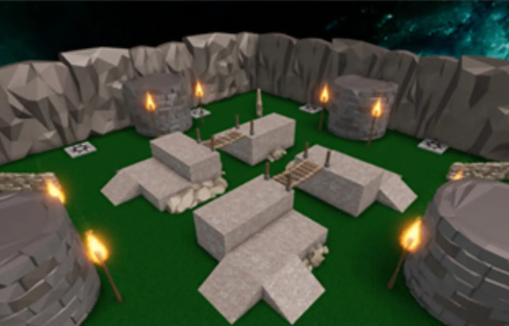

# Creating a Battle Royale

## 목차
- [Creating a Battle Royale](#creating-a-battle-royale)
  - [목차](#목차)
    - [시리즈 설명](#시리즈-설명)
    - [목표 및 전제 조건](#목표-및-전제-조건)
    - [시리즈 내용](#시리즈-내용)
    - [예제 프로젝트](#예제-프로젝트)
  - [출처](#출처)
  - [다음](#다음)

---

### 시리즈 설명

사용자들이 마지막까지 살아남기 위해 경쟁하는 라운드 기반 멀티플레이어 경험을 만들어보세요! 어드벤처 게임 이후에 적합한 다음 단계의 수업으로, 게임 디자인과 컴퓨터 과학의 핵심 개념을 확장합니다. 완료된 후에는 고유한 게임 플레이 요소로 쉽게 맞춤화하고 수익화할 수 있습니다.

<video controls src="../img/14_01_Creating_a_Battle_Royale/battleRoyal_webFinal.mp4" width="100%"></video>

### 목표 및 전제 조건

<table>
<tbody>
   <tr>
    <td width="20%"><b>학습 목표</b></td>
    <td>
    게임 기능(예: 플레이어 텔레포트 또는 경기 타이머 시작)을 별도로 처리하는 스크립트를 작성하여 <b>모듈식 프로그래밍</b>을 연습합니다. 
    게임 경기가 시작되고 종료될 때마다 이벤트를 구현하여 별도의 스크립트 간의 원인과 결과 관계를 만듭니다. 
    게임이 시작되고, 이기거나 떠나는 동안 플레이어를 관리하고 조작할 수 있도록 <b>배열</b>을 구현합니다. 
    라운드 기반 게임의 <b>코딩 아키텍처</b>를 이해하고, 정리 및 재설정을 통해 반복적인 게임 플레이를 만듭니다.
    </td>
   </tr>
   <tr>
    <td><b>전제 조건</b></td>
    <td>
    if 문, 배열 및 for 루프를 사용하는 방법을 이해합니다. 
    모듈 스크립트에 대한 일반적인 이해가 있습니다.
    </td>
   </tr>
</tbody>
</table>

### 시리즈 내용

<table>
<thead>
   <tr>
    <th>기사</th>
    <th>설명</th>
   </tr>
</thead>
<tbody>
   <tr>
    <td>프로젝트 설정</td>
    <td>경험에 대한 비전을 계획하고, 게임 플레이와 움직임을 테스트할 수 있는 지도를 만듭니다.</td>
   </tr>
   <tr>
    <td>게임 루프 코딩</td>
    <td>모듈 스크립트를 사용하여 경험의 백그라운드에서 실행되는 게임 루프를 코딩합니다.</td>
   </tr>
   <tr>
   <td>플레이어 관리</td>
    <td>모듈 스크립트를 계속 사용하여 플레이어 배열을 관리하고 경기로 텔레포트하는 등의 기능을 수행합니다.</td>
   </tr>
   <tr>
   <td>타이머 및 이벤트</td>
    <td>게임의 다른 상태를 추적하고 상태가 변경될 때마다 신호를 보내는 이벤트를 사용합니다. 예를 들어 타이머 종료 시.</td>
   </tr>
   <tr>
   <td>GUI 생성</td>
    <td>그래픽 사용자 인터페이스를 사용하여 현재 게임 상태 및 기타 정보를 플레이어에게 표시합니다.</td>
   </tr>
    <tr>
   <td>경기 종료</td>
    <td>경기에서 현재 플레이어 수를 추적하고 그 정보를 사용하여 게임 종료를 트리거하는 이벤트를 보냅니다.</td>
     </tr>
     <tr>
    <td>정리 및 재설정</td>
    <td>각 플레이어가 경기 후 연속적인 게임 플레이 루프를 경험할 수 있도록 코드를 정리하는 방법을 배웁니다.</td>
    </tr>
     <tr>
    <td>프로젝트 마무리</td>
    <td>지도를 장식할 수 있는 자산을 찾고, 경험을 더욱 발전시키기 위한 선택적 도전 과제를 확인합니다.</td>
   </tr>
</tbody>
</table>

### 예제 프로젝트

<table>
<tbody>
   <tr>
      <td></td>
      <td>
      <a href="https://www.roblox.com/games/3623999509/Battle-Royale-Template" target="_blank" rel="noopener">배틀 로얄 예제</a> 
      이 시리즈를 통해 개발할 수 있는 최종 프로젝트 버전을 플레이해 보세요.
      </td>
   </tr>
</tbody>
</table>

---
## 출처
 - [Creating a Battle Royale](https://create.roblox.com/docs/ko-kr/education/battle-royale-series/project-setup)

---
## [다음](./14_02_Battle_Royale.md)