# Battle Royale

## 목차
- [Battle Royale](#battle-royale)
  - [목차](#목차)
  - [경험 개발](#경험-개발)
    - [프로젝트 계획](#프로젝트-계획)
    - [맵 레이아웃 디자인](#맵-레이아웃-디자인)
    - [레이아웃 팁](#레이아웃-팁)
  - [맵 생성](#맵-생성)
    - [로비 빌딩](#로비-빌딩)
    - [경기장 및 스폰](#경기장-및-스폰)
    - [경기장 그레이박싱](#경기장-그레이박싱)
    - [그레이박스 플레이 테스트](#그레이박스-플레이-테스트)
  - [출처](#출처)
  - [다음](#다음)

---

**배틀 로얄**은 여러 명의 플레이어가 최후의 1인이 될 때까지 경쟁하는 멀티플레이어 게임 장르입니다. 모든 배틀 로얄이 다르지만, 모두 플레이어를 제거하는 방법(예: 누군가를 얼리거나 맵에서 떨어뜨리기)을 포함합니다. 한 명의 플레이어가 생존하거나 타이머가 종료되면 매치가 끝나고 새로운 라운드가 시작됩니다.

이 장르는 라운드가 빠르고 쉽게 적응할 수 있으며 마스터하기에는 도전적이기 때문에 인기가 많습니다. 배틀 로얄은 독특한 무기, 플랫폼 장애물 또는 시각적 테마와 같은 다양한 게임 메커니즘으로 맞춤화하여 폭넓은 관객에게 어필할 수 있습니다.

Roblox에서 인기 있는 배틀 로얄 경험 중 일부는 Island Royale과 Strucid이 있습니다.

<GridContainer numColumns="2">
  <figure>
    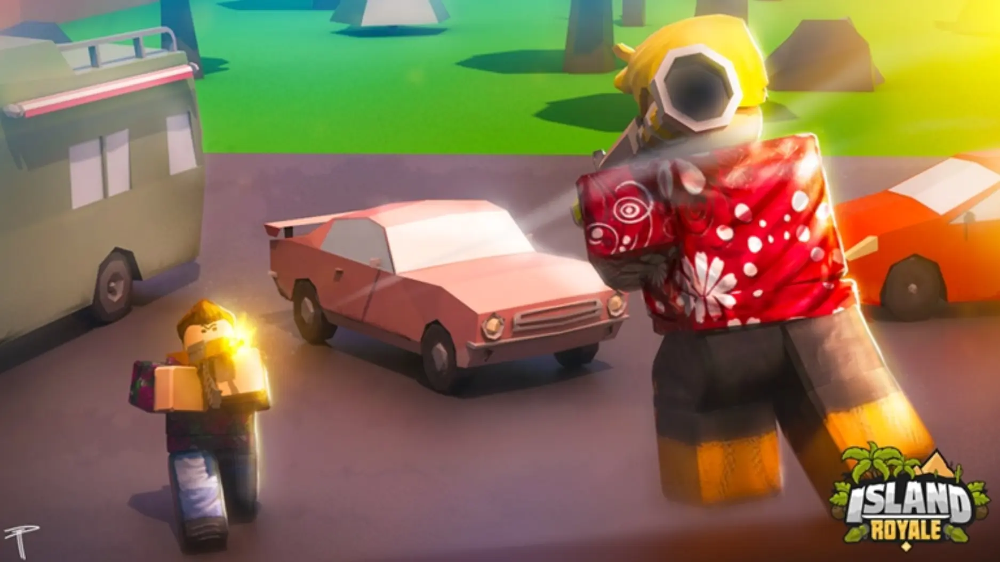
    <figcaption>Island Royale by LordJurrd</figcaption>
  </figure>
  <figure>
    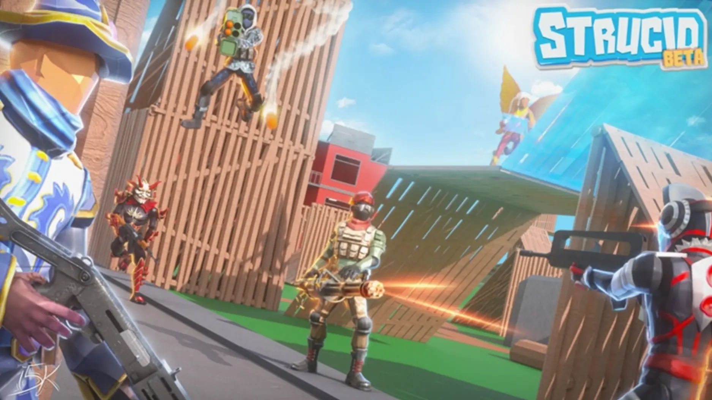
    <figcaption>Strucid by Frosted Studios</figcaption>
  </figure>
</GridContainer>

배틀 로얄은 일반적으로 라운드 기반 **게임 루프** 또는 일련의 단계로 구성됩니다. 프로젝트에서 플레이어는 아래의 게임 루프를 거치게 됩니다:

<GridContainer numColumns="3">
  <figure>
    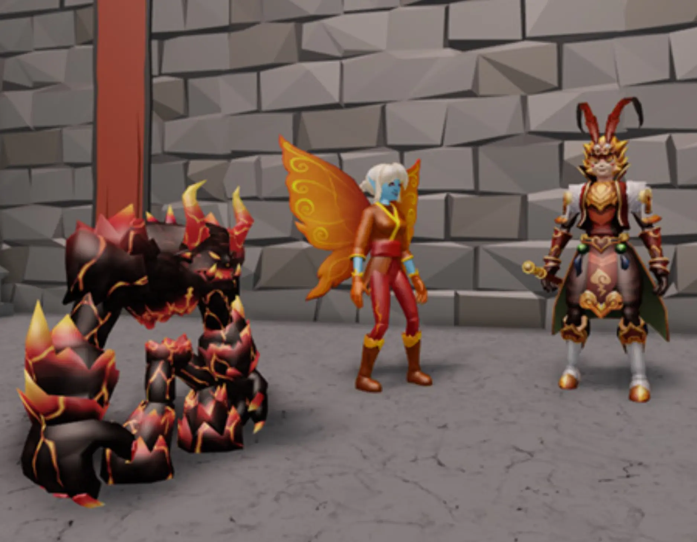
    <figcaption>인터미션</figcaption>
  </figure>
  <figure>
    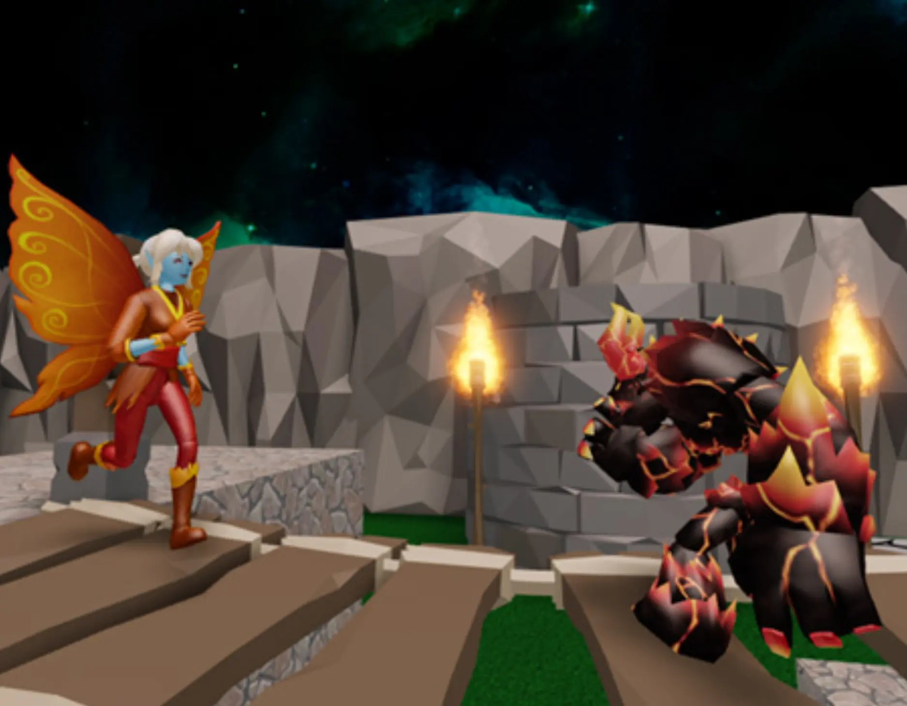
    <figcaption>경쟁</figcaption>
  </figure>
  <figure>
    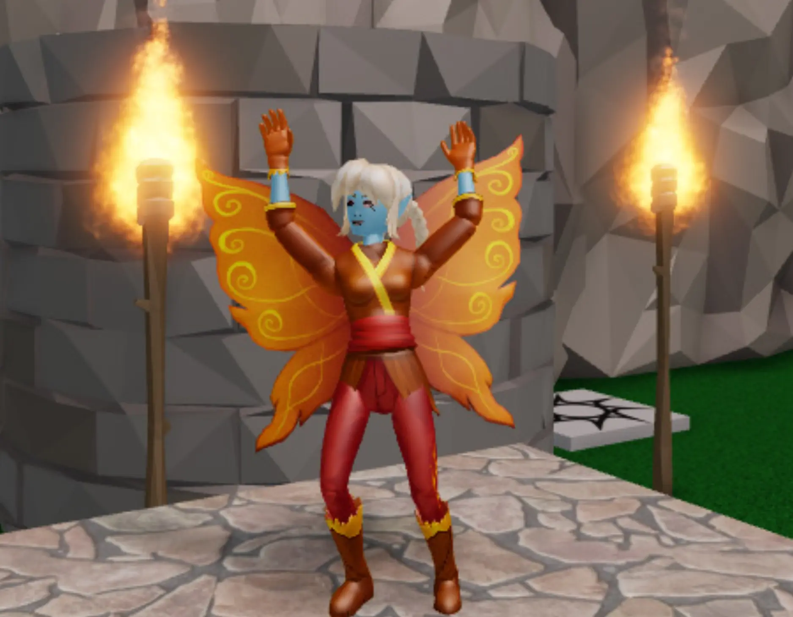
    <figcaption>정리 및 재설정</figcaption>
  </figure>
</GridContainer>

각 단계 동안 다른 작업 세트가 발생하며, 이 시리즈에서 이를 코딩하게 됩니다.

- **인터미션** - 플레이어는 로비에서 새 라운드가 시작될 때까지 소셜 활동을 하거나 게임을 관람합니다.
- **매치** - 타이머가 시작되고 플레이어는 경쟁할 경기장으로 이동됩니다. 플레이어가 패배하면 다시 로비로 이동됩니다.
- **정리 및 재설정** - 한 명의 플레이어가 남거나 타이머가 종료될 때 발생합니다. 플레이어는 로비로 다시 이동되고 루프가 재시작됩니다.

## 경험 개발

배틀 로얄은 코드와 아트 자산과 같은 여러 요소로 구성됩니다. 더 큰 프로젝트를 관리하기 위해 개발자는 완료로 가는 일련의 단계인 **워크플로우**를 계획합니다.

이 시리즈 동안 다음 워크플로우를 거치게 됩니다:

- **사전 제작** - 게임 맵의 스케치를 작성합니다.
- **테스트 맵 디자인** - 시각적 외관에 신경 쓰지 않고 플레이 테스트를 위한 플레이스홀더 자산을 사용하여 맵을 개발합니다.
- **코딩 및 테스트** - 게임 루프 코딩 프로세스를 시작합니다.
- **다듬기 및 개선** - 플레이스홀더 자산을 최종 모델로 교체하고 빈번한 플레이 테스트를 통해 코드와 디자인을 개선합니다.

프로젝트의 다른 부분을 동시에 작업하는 대신, 개발자는 큰 프로젝트를 관리 가능한 덩어리로 나눕니다. 각 단계는 다음 단계로 넘어가기 전에 고유한 특정 목표를 가져야 합니다. 이렇게 하면 잠재적인 오류를 잡고 시간을 절약할 수 있습니다. 예를 들어, 테스트되지 않은 맵을 폴리싱하기 위해 아트를 디자인하면 맵이 재미있게 재설계되어야 할 경우 낭비되는 시간이 발생할 수 있습니다.

### 프로젝트 계획

첫 번째 단계는 **사전 제작**이라고 하는 과정에서 비전을 계획하는 것입니다. 계획을 세우는 데 시간을 할애하면 장애물 배치와 플레이어 스폰과 같은 중요한 디자인 선택에 집중할 수 있습니다.

계획을 세우기 위해 종이나 그림 소프트웨어를 사용하여 레이아웃 맵을 작성합니다. 레이아웃 맵은 시각적 세부 사항보다 플레이어가 세계를 이동하는 방식에 중점을 둔 기본 모양으로 그린 경기장의 평면도입니다. 레이아웃 맵이 완료되면 스튜디오에서 다시 작성하게 됩니다.

<GridContainer numColumns="2">
  <figure>
    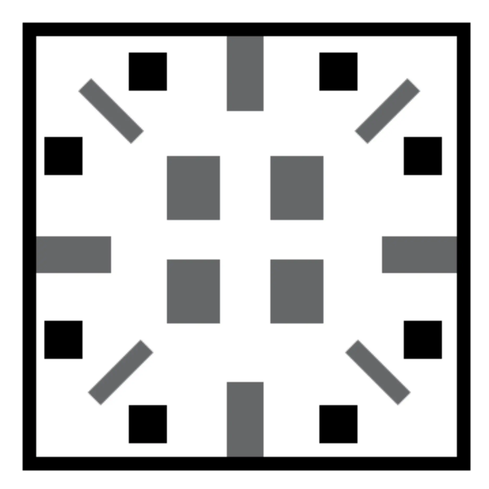
    <figcaption>그려진 레이아웃</figcaption>
  </figure>
  <figure>
    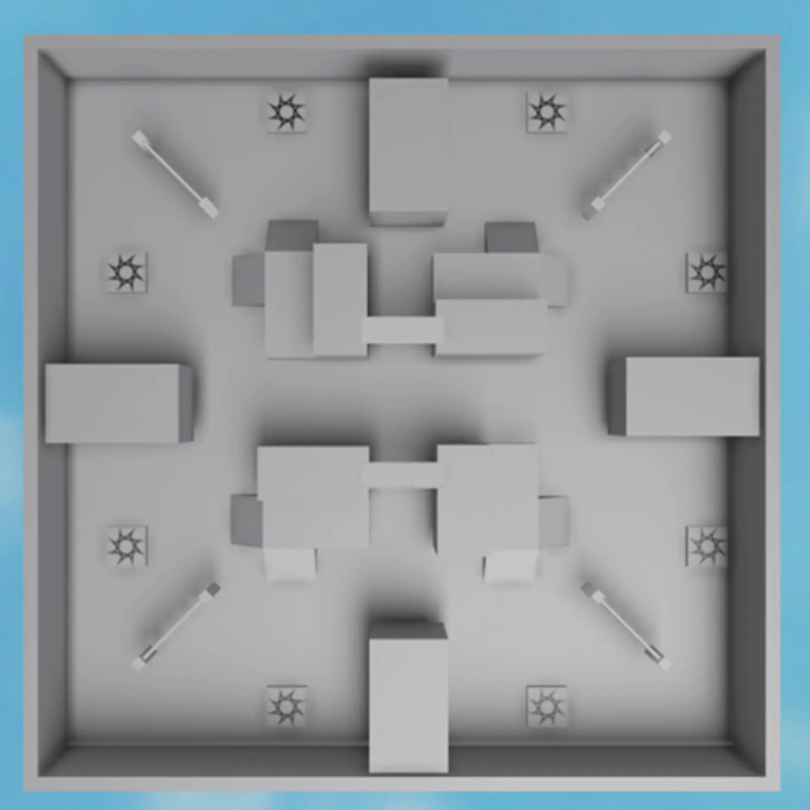
    <figcaption>스튜디오의 레이아웃</figcaption>
  </figure>
</GridContainer>

### 맵 레이아웃 디자인

스케치를 위해 여기에서의 목표는 스튜디오에서 복제할 수 있는 디자인을 만드는 것입니다. 맵 아레나는 재미를 느끼기에 충분한 다양성을 가져야 하지만, 사용자가 불공평한 이점을 가지지 않도록 균형도 포함해야 합니다.

1. **설정**의 간단한 설명을 작성합니다. 예: 정글, 버려진 달 기지, 중세 성. 폴리싱 단계에서는 이 설정을 사용하여 맵 세부 정보를 추가하게 됩니다.

2. 맵의 모양을 식별한 다음 1-3개의 **기본 모양**(정사각형, 직사각형, 팔각형)의 조합을 사용하여 그립니다. 더 복잡한 맵을 구상하더라도, 예를 들어 섬과 같은 맵을 기본 모양으로 나누어 보십시오.

   <Alert severity="info">
   균형 잡힌 경험을 쉽게 만들기 위해 대칭 맵을 만드는 것을 권장합니다. 경험이 쌓이면 비대칭 맵 모양 작업을 시작할 수 있습니다. 이는 모두에게 공평하게 균형을 맞추기가 더 복잡할 수 있습니다.
   </Alert>

3. 플레이어 스폰을 추가합니다. 지금은 8개의 스폰을 사용하되 나중에 더 추가할 수 있습니다. 여기서는 사각형을 맵 모양으로 사용한 예시를 보여줍니다.

   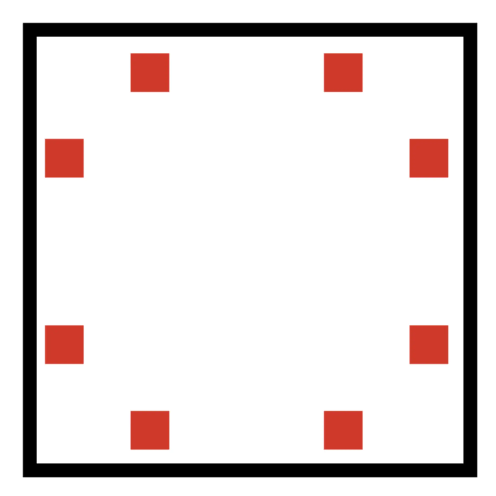

4. 플레이어를 덜 예측 가능하게 만들고 흥미를 더하기 위해, 플레이어가 다른 방향을 선택하게 만드는 장애물을 배치합니다. 아레나 주변을 돌아다니는 동안 선택할 수 있는 2-4개의 모양(주황색)을 그립니다. 플레이어가 시작 시 바로 싸우지 않도록 하는 보조 장애물(노란색)을 추가합니다.

   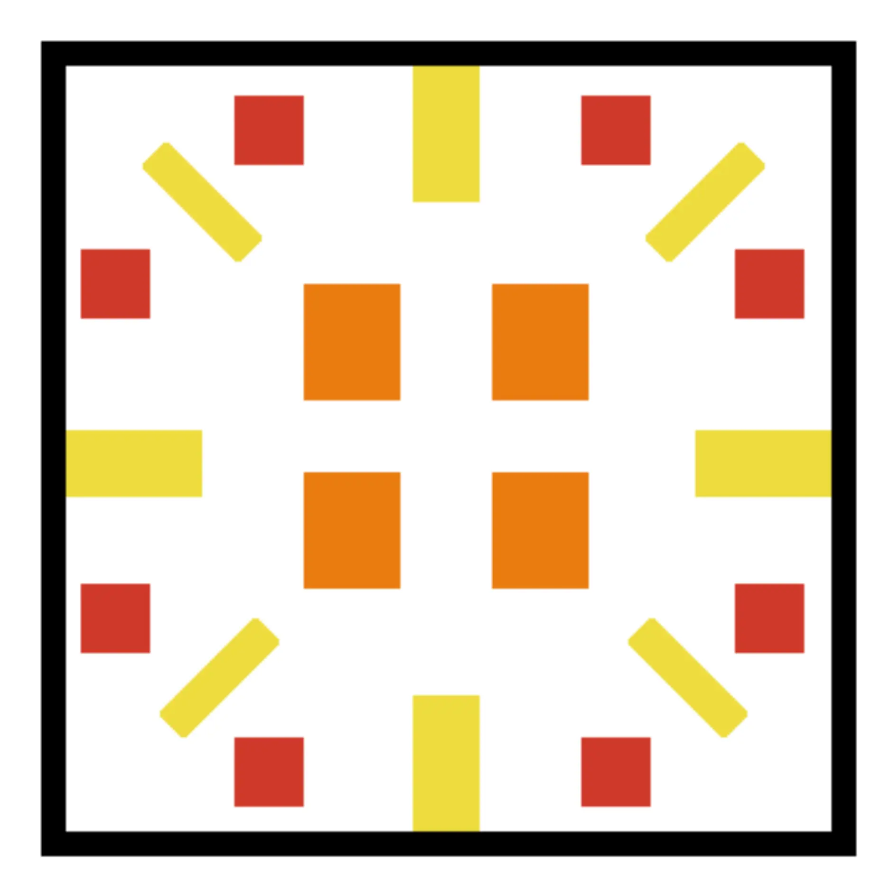

### 레이아웃 팁

디자인을 간단하지만 매력적으로 유지하십시오. 플레이어가 레벨을 이동하면서 순간적인 결정을 내리기 때문에, 레벨이 매번 다르게 느껴질 만큼 선택지를 제공하되, 너무 많아서 맵을 이동하는 방법을 기억하지 못하거나 압도되게 하지 마십시오.

<GridContainer numColumns="3">
  <figure>
    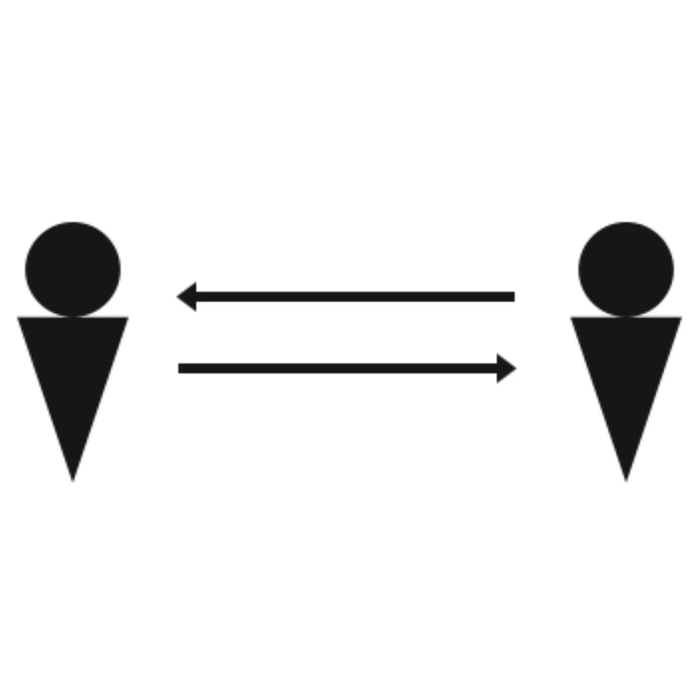
    <figcaption>너무 간단</figcaption>
  </figure>
  <figure>
    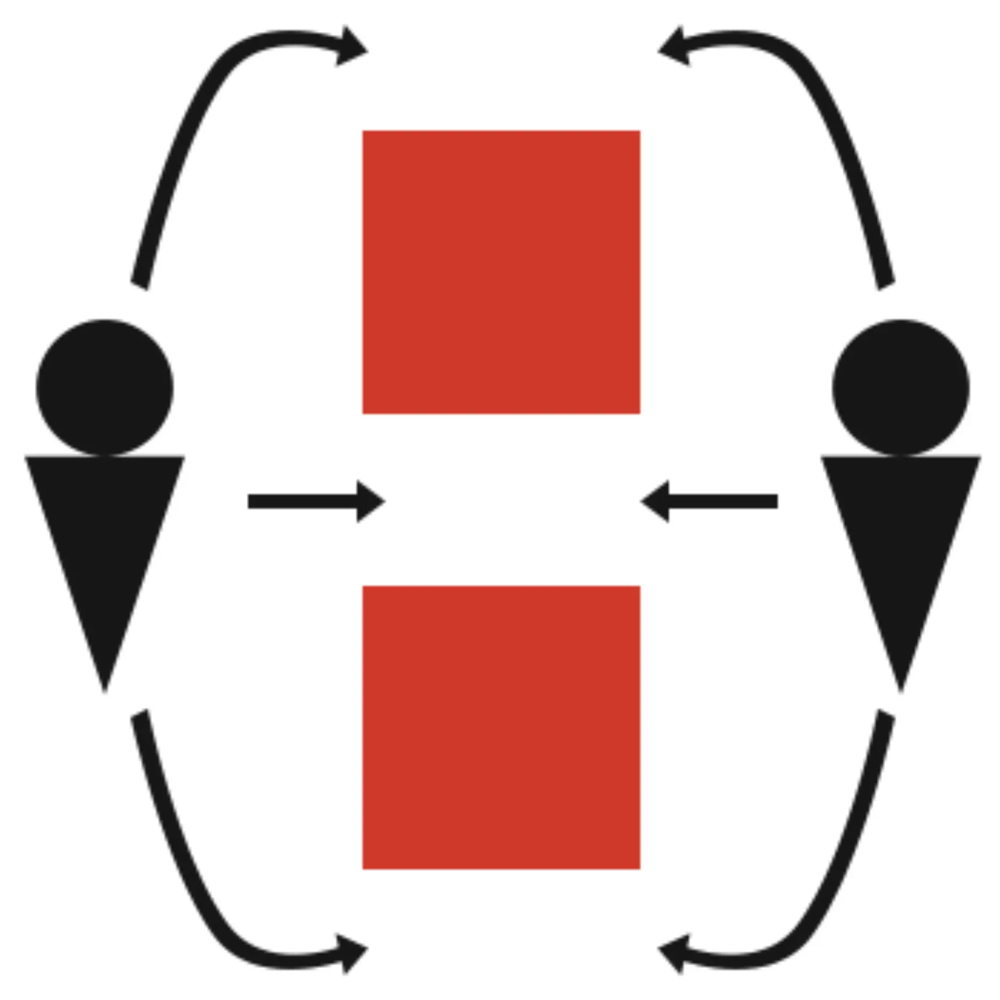
    <figcaption>균형 잡힘</figcaption>
  </figure>
  <figure>
    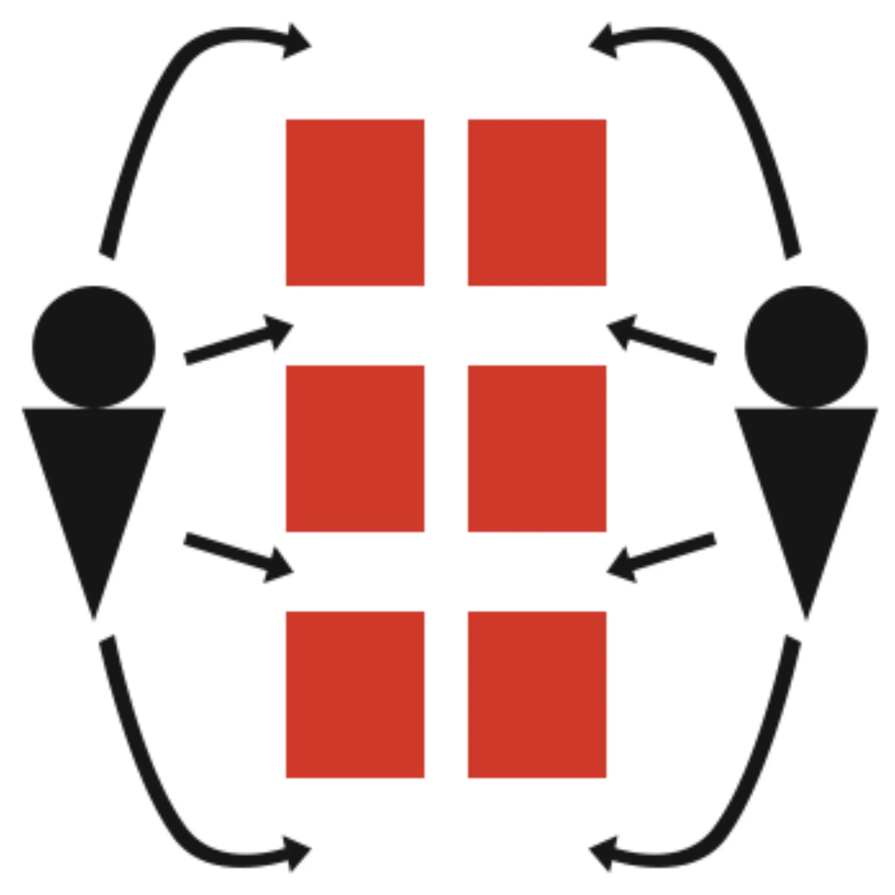
    <figcaption>복잡할 수 있음</figcaption>
  </figure>
</GridContainer>

## 맵 생성

레이아웃 맵을 Roblox Studio에서 기본 파트를 사용하여 빠르게 재현하는 작업을 그레이박싱이라고 합니다. 재미있고 플레이 가능한 맵을 디자인하는 데 집중하세요. 텍스처나 장식 소품과 같은 작은 세부 사항을 추가하는 데 시간을 보내지 마십시오. 작동하는 맵이 코드와 함께 생성된 후에 맵의 설정에 맞게 아트를 디자인하는 데 시간을 할애하십시오.

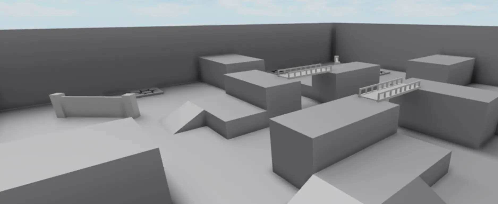

### 로비 빌딩

경기장을 만들기 전에, 플레이어가 경기 사이에 경험을 입력하고 소셜 활동을 할 수 있는 로비를 빌드하십시오.

1. 새로운 Baseplate 프로젝트를 만들고 베이스플레이트를 삭제합니다.
2. 스폰 위치가 있는 벽이 있는 방을 구성합니다

.

   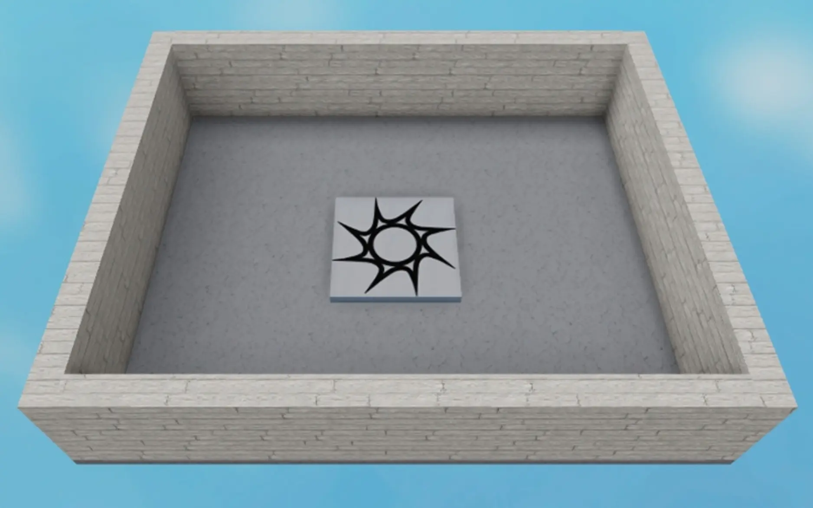

   <Alert severity="info">
   객체를 이동하고 정렬하기 쉽게 그리드에 맞춤을 활성화하십시오. 90도 또는 45도 각도로 회전하면 더 깔끔한 디자인을 얻을 수 있습니다.
   </Alert>

3. 모든 로비 파트를 로비라는 폴더에 넣습니다.

### 경기장 및 스폰

경기장은 플레이어가 경쟁하는 곳입니다. 경기장을 만들 때는 단순한 파트와 색상을 사용하여 환경을 **그레이박싱**합니다. 그레이박스 환경은 최종 디자인의 예시이며, 큰 실린더는 최종 버전에서 동일한 크기의 나무가 될 수 있습니다.

이 과정은 레벨 디자인에서 일반적이며, 디자이너에게 테스트하고 반복할 수 있는 작동 프로토타입을 제공합니다. 맵 디자인이 플레이 테스트에서 좋게 느껴지면, 그레이박스 자산을 3D 자산 및 지형으로 교체합니다.

1. 아레나라는 이름의 폴더를 만듭니다. 안에 경기장의 바닥을 추가합니다. 지형을 사용하는 경우, 폴더를 비워둡니다.

   아래는 샘플 아레나입니다.

   <GridContainer numColumns="3">
     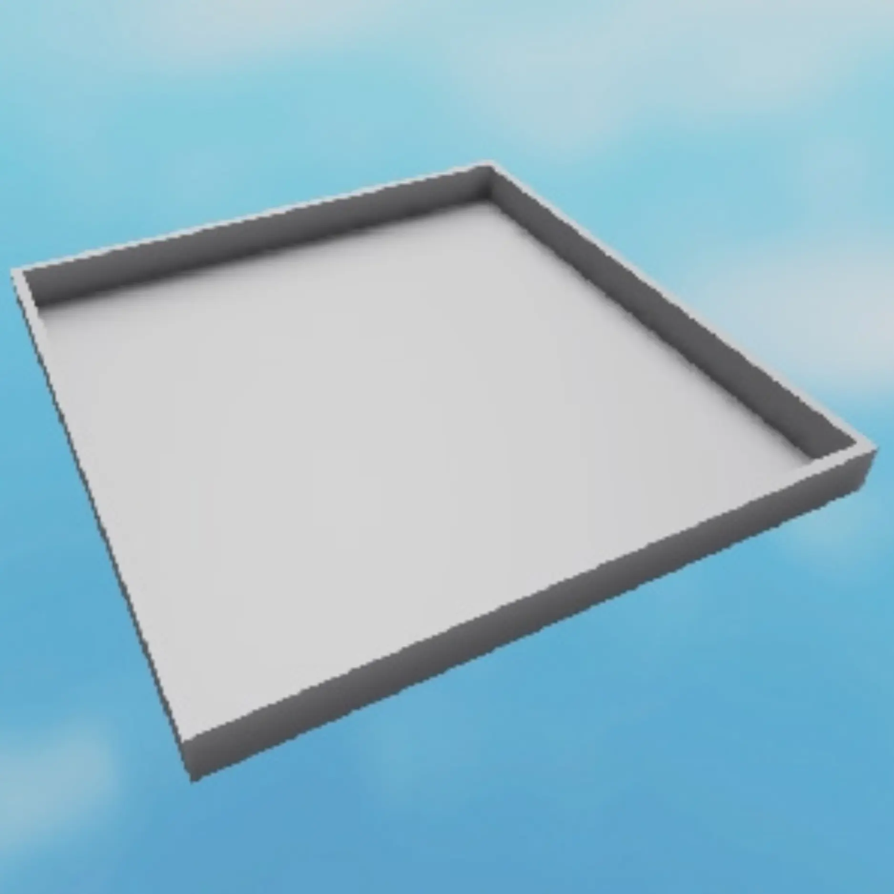
     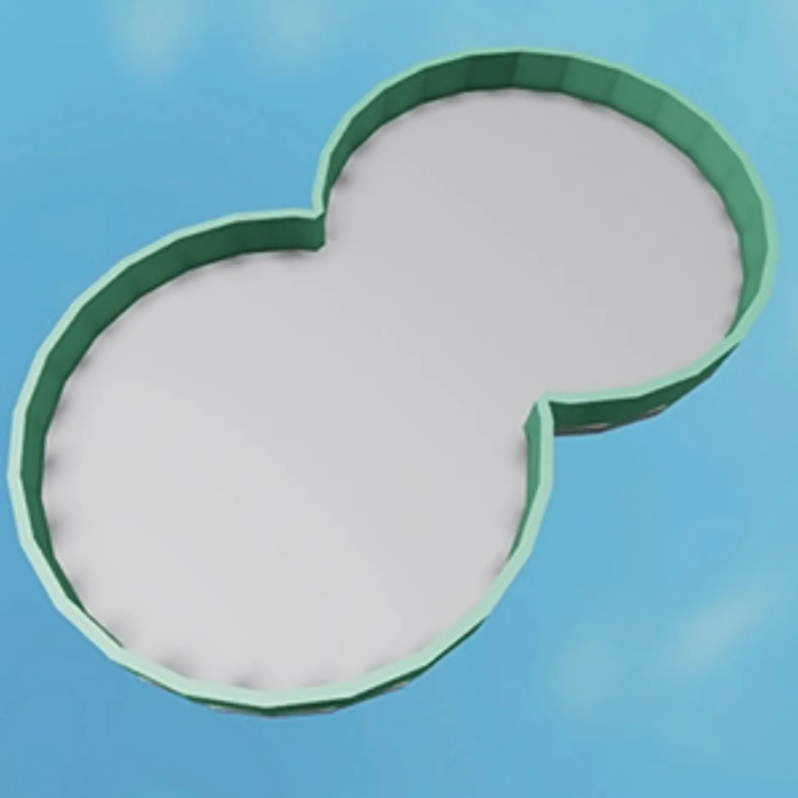
     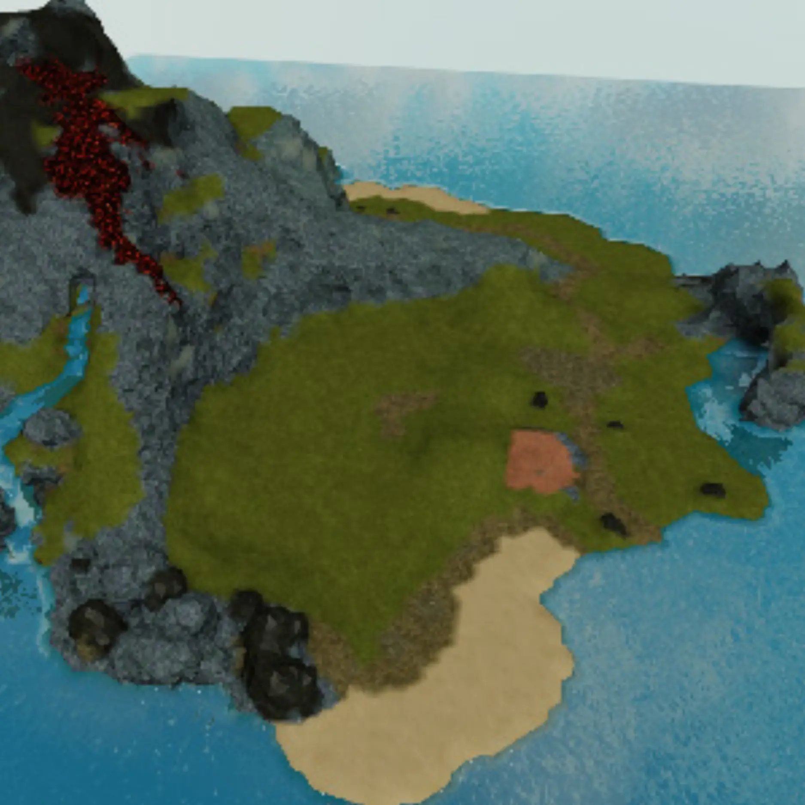
   </GridContainer>

2. 맵에 8개의 스폰 위치를 만듭니다. 아레나에 새로운 폴더를 만들고 SpawnLocations이라는 이름을 지정한 후, 8개의 스폰을 그곳으로 이동합니다.

   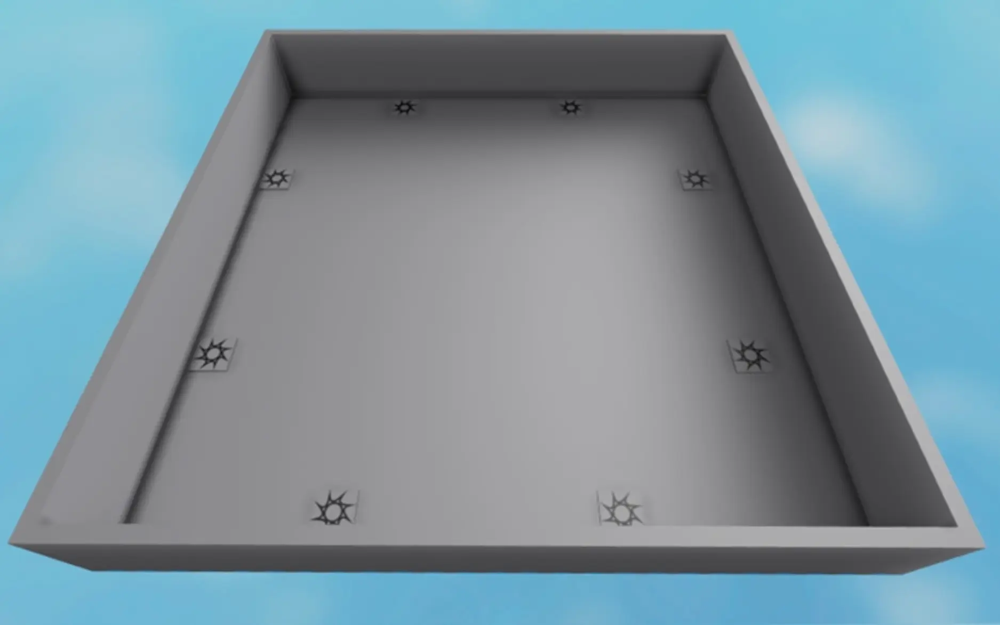

   <Alert severity="info">
   스폰을 배치할 때, 모든 플레이어가 무작위로 스폰된다는 점을 유념하십시오.
   </Alert>

### 경기장 그레이박싱

그레이박싱은 단순한 파트를 사용하여 최종 디자인의 예시를 만드는 것입니다. 그레이박스 레벨은 디자이너에게 플레이어가 경기장을 어떻게 이동하는지에 대한 이해를 제공합니다. 경기장을 만들기 위해 선택적 빌딩 키트 또는 기본 파트를 사용할 수 있습니다.

1. 툴박스에서 그레이박싱 키트를 가져옵니다. 여기에는 계단, 경사로, 벽과 같은 일반적인 빌딩 기능이 포함되어 있습니다.

   <a href="https://www.roblox.com/library/10202876758/Graybox-Assets" target="_blank" rel="noopener">
   <Button variant="contained">키트 받기</Button>
   </a>

   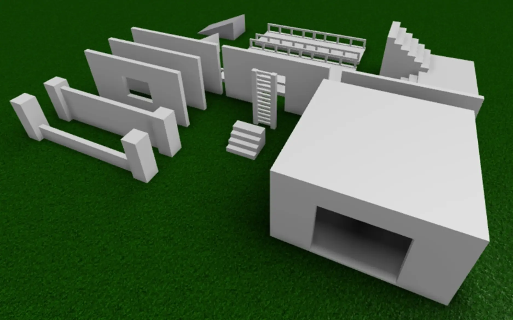

   <Alert severity="info">
   Roblox_Educators는 Roblox Education의 공식 신뢰할 수 있는 자산 계정입니다.
   </Alert>

2. 파트와 그레이박싱 키트의 자산을 조합하여 장애물과 장벽을 만드십시오.

   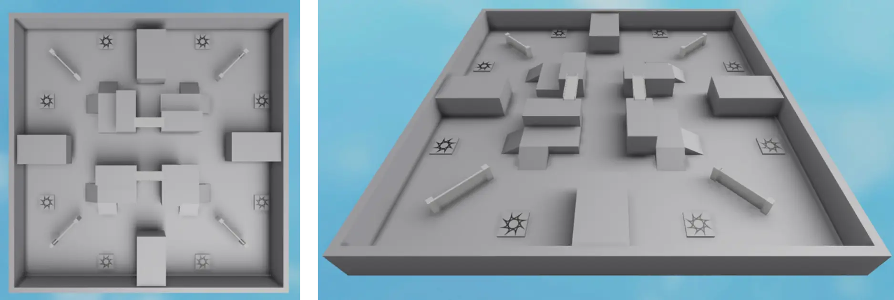

빌드를 하면서 맵 디자인을 위한 몇 가지 팁은 다음과 같습니다.

- **높이 다양화** - 평평한 맵은 플레이어에게 반복될 수 있습니다. 언덕, 계단, 다양한 높이의 경사로를 사용하여 맵에 변화를 줍니다.
- **맵의 절반을 빌드한 후 복제** - 이 기술을 사용하면 대칭 맵을 신속하게 빌드할 수 있습니다.
- **테스트 및 스케일 확인** - 빌드를 하면서 맵을 플레이어와 관련하여 생각하십시오. 예를 들어, 공간이 얼마나 넓은지 또는 플레이어가 문을 쉽게 통과할 수 있는지 확인합니다. 평균 아바타는 6.5 스터드 높이입니다.

### 그레이박스 플레이 테스트

경기장이 완성되면 재미있고 흥미롭게 이동할 수 있는지 확인하는 것이 중요합니다.

1. 경기장에서 **Play Here**를 클릭하고 맵을 테스트합니다.

   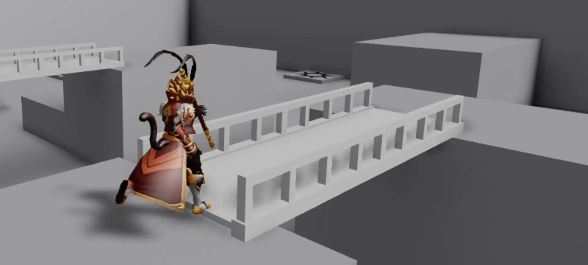

테스트를 하면서 아래의 프롬프트를 사용하여 작업을 자체 평가하고 필요한 경우 개선하십시오.

- 플레이어가 혼란스럽거나 갇히지 않고 이동할 수 있습니까?
- 맵의 크기가 적절합니까? 너무 빈 공간이 있습니까? 다른 플레이어를 만나기까지 시간이 오래 걸리나요?
- 떠다니거나 정렬되지 않은 부분과 같이 이상한 점이 있습니까?

---
## 출처
 - [Battle Royale](https://create.roblox.com/docs/ko-kr/education/battle-royale-series/project-setup)

---
## [다음](./14_03_Coding_the_Game_Loop.md)