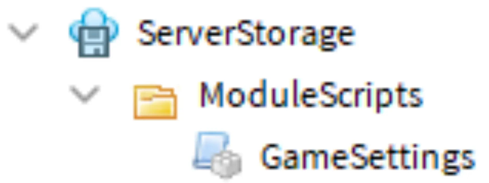
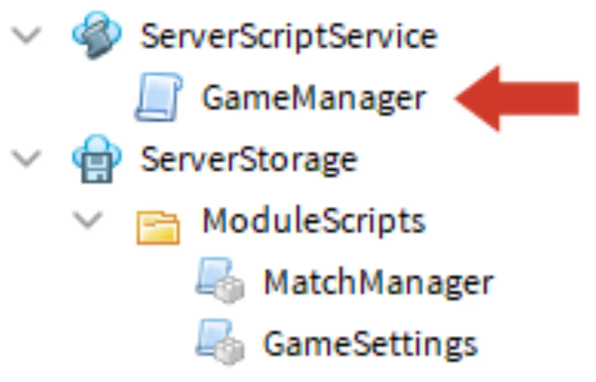
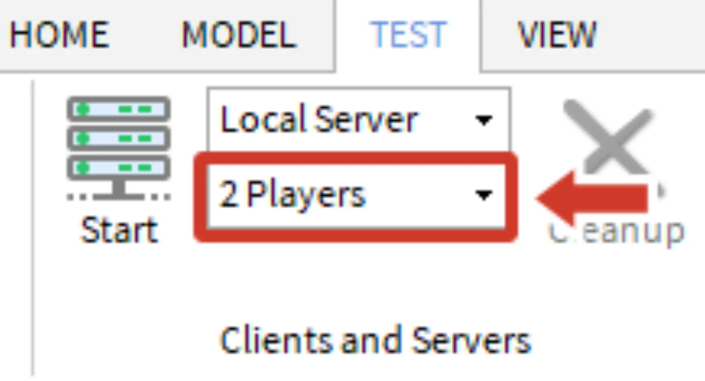
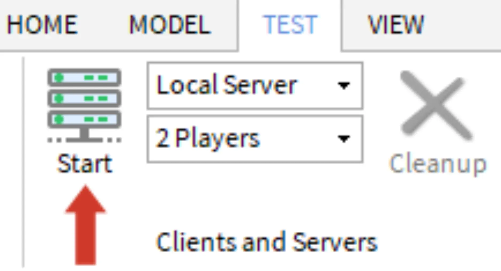
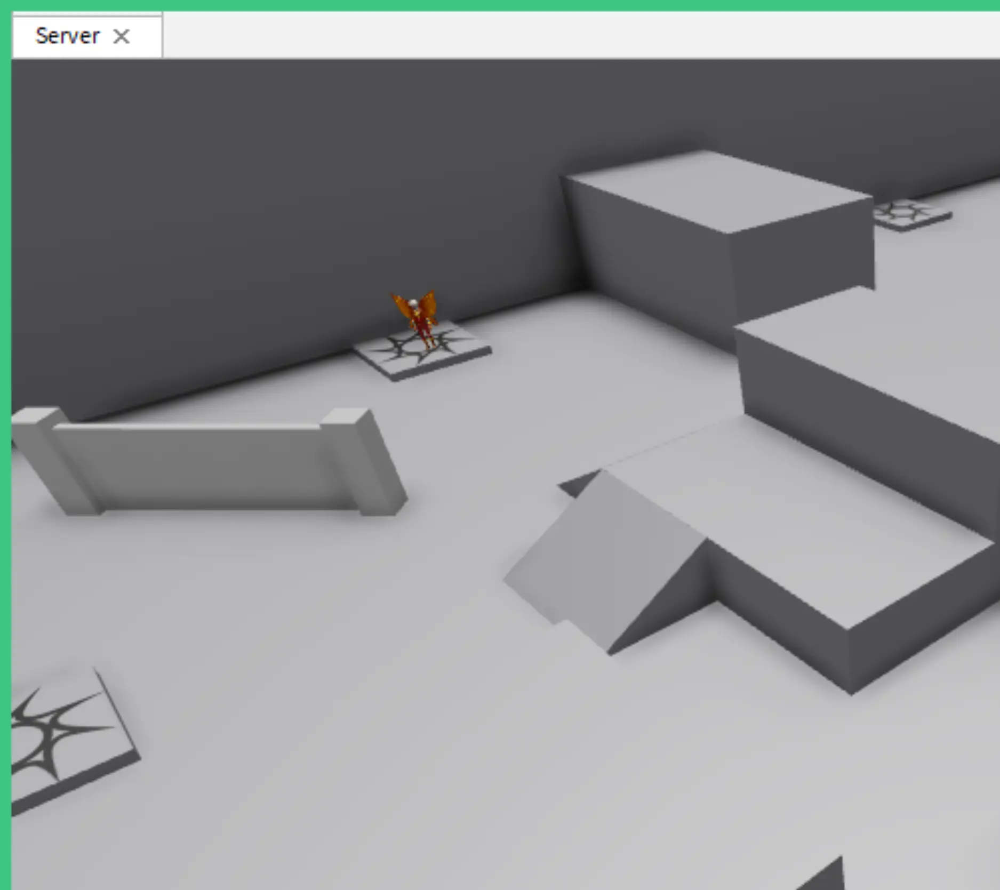
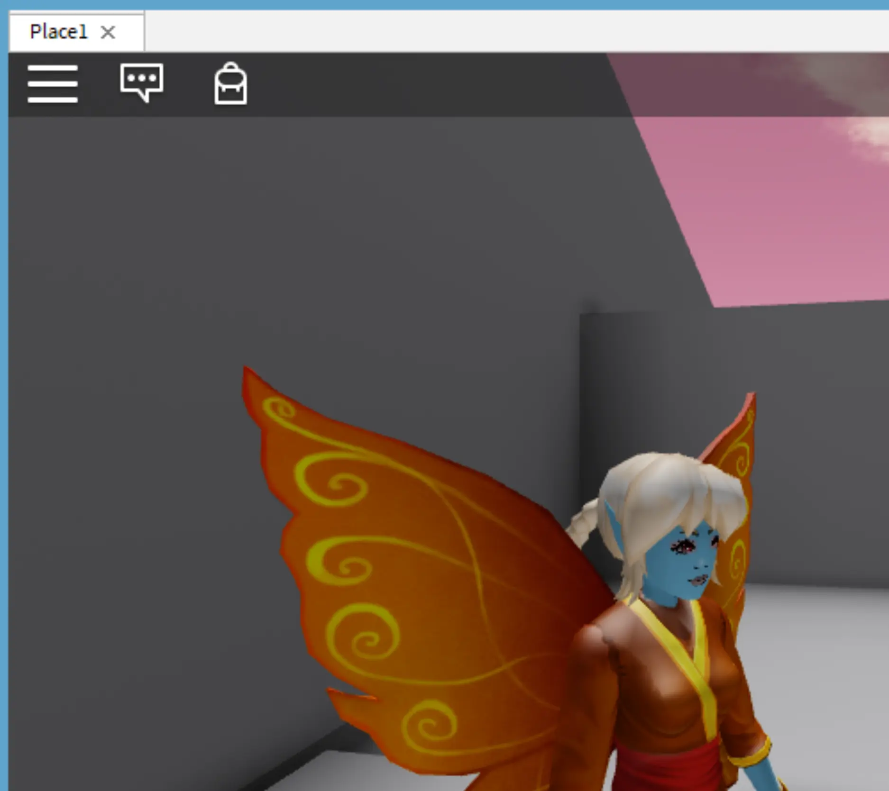
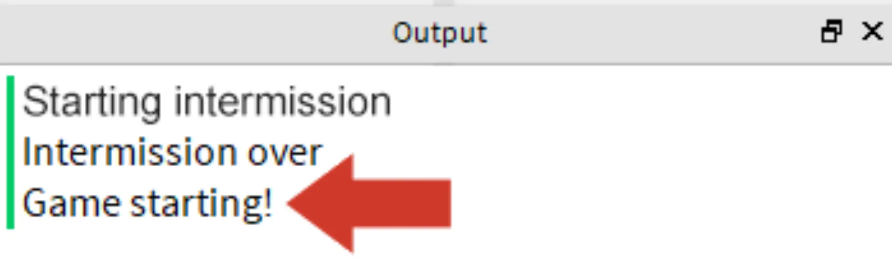
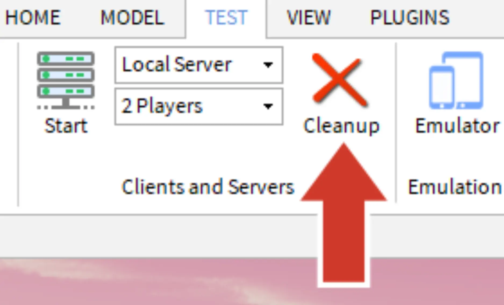

# Coding the Game Loop

## 목차
- [Coding the Game Loop](#coding-the-game-loop)
  - [목차](#목차)
  - [스크립트 설정](#스크립트-설정)
    - [GameSettings 스크립트](#gamesettings-스크립트)
    - [MatchManager 스크립트](#matchmanager-스크립트)
  - [게임 루프 코딩](#게임-루프-코딩)
    - [GameManager 스크립트](#gamemanager-스크립트)
    - [인터미션 코딩](#인터미션-코딩)
    - [문제 해결 팁](#문제-해결-팁)
    - [인터미션 종료](#인터미션-종료)
  - [멀티플레이어 게임 테스트](#멀티플레이어-게임-테스트)
    - [로컬 서버 시작](#로컬-서버-시작)
    - [문제 해결 팁](#문제-해결-팁-1)
    - [로컬 서버에서 테스트](#로컬-서버에서-테스트)
    - [문제 해결 팁](#문제-해결-팁-2)
  - [완료된 스크립트](#완료된-스크립트)
    - [GameManager 스크립트](#gamemanager-스크립트-1)
    - [MatchManager 스크립트](#matchmanager-스크립트-1)
    - [GameSettings 스크립트](#gamesettings-스크립트-1)
  - [출처](#출처)
  - [다음](#다음)

---

맵이 만들어졌으므로 이제 스크립트를 작성할 차례입니다. 이 과정의 나머지 부분은 게임 루프의 다양한 요소를 스크립팅하는 데 중점을 둡니다.

## 스크립트 설정

배틀 로얄은 모듈 스크립트와 일반 스크립트를 결합하여 사용할 것입니다. 아래는 스크립트와 그 기능입니다.

<table>
<tbody>
   <tr>
    <td><b>GameManager </b></td>
    <td>스크립트. Game Settings의 변수를 사용하여 Match Manager의 기능을 실행합니다.</td>
   </tr>
   <tr>
    <td><b>MatchManager </b></td>
    <td>모듈 스크립트. 플레이어를 경기장으로 보내거나 경기의 시간을 추적하는 등의 기능을 실행합니다.</td>
   </tr>
   <tr>
    <td><b>GameSettings </b></td>
    <td>모듈 스크립트. 다른 스크립트에서 사용하는 공통 변수를 저장합니다.</td>
   </tr>
</tbody>
</table>

### GameSettings 스크립트

다른 스크립트에서 사용하는 변수를 저장하기 위해 GameSettings라는 모듈 스크립트를 만듭니다. 이러한 변수는 나중에 GameManager 스크립트에서 사용됩니다.

1. **ServerStorage**에 ModuleScripts라는 폴더를 만듭니다. 그 폴더에 GameSettings라는 새 모듈 스크립트를 만듭니다.

   

2. GameSettings를 열고 모듈 테이블 이름을 스크립트 이름과 일치하도록 변경합니다.

   ```lua
   local GameSettings = {}

   return GameSettings
   ```

3. 모듈 테이블에 다음 용도로 사용할 변수를 추가합니다. 각 값에 대해 최선의 추측을 하되, 테스트하면서 나중에 변경할 수 있습니다.

   - **인터미션 지속 시간** - 경기 전 플레이어가 대기하는 시간(초 단위).
   - **경기 지속 시간** - 경기의 길이(초 단위).
   - **최소 플레이어 수** - 경기를 시작하는 데 필요한 최소 플레이어 수.
   - **전환 시간** - 경기 전후의 시간(초 단위). 게임 루프의 부분 간 전환을 덜 갑작스럽게 만듭니다.

   ```lua
   local GameSettings = {}

   -- 게임 변수
   GameSettings.intermissionDuration = 5
   GameSettings.matchDuration = 10
   GameSettings.minimumPlayers = 2
   GameSettings.transitionTime = 5

   return GameSettings
   ```

### MatchManager 스크립트

GameManager와 연결된 두 번째 스크립트는 MatchManager입니다. 이 스크립트는 타이머를 시작하거나 경기가 끝난 후 플레이어를 재설정하는 등의 작업을 관리합니다.

MatchManager 내의 `prepareGame()` 함수는 플레이어를 경기로 전환하여 게임을 시작합니다.

1. ServerStorage > ModuleScripts >에 MatchManager라는 모듈 스크립트를 추가합니다. 모듈 테이블 이름을 변경합니다.

   ```lua
   local MatchManager = {}

   return MatchManager
   ```

2. MatchManager에 `prepareGame()`이라는 새 모듈 함수를 추가합니다. 나중에 테스트할 때 사용할 print 문을 포함합니다.

   ```lua
   local MatchManager = {}

   function MatchManager.prepareGame()
     print("Game starting!")
   end

   return MatchManager
   ```

## 게임 루프 코딩

주요 게임 루프는 방금 만든 변수를 사용하여 GameManager 스크립트에서 코딩됩니다. 게임 루프에는 세 가지 단계가 있습니다: 인터미션, 경쟁, 정리 및 재설정.

### GameManager 스크립트

이 스크립트는 일반 서버 스크립트이므로 모듈 스크립트 폴더가 아닌 ServerScriptService에 넣습니다. 실제 게임 루프는 `while true do` 루프 안에 있습니다.

1. ServerScriptService에 GameManager라는 새 스크립트를 만듭니다.

   

2. "ServerStorage" 서비스에 대한 변수를 추가합니다. 이는 ModuleScripts의 위치입니다. 인터미션 중 플레이어 수를 확인하는 데 필요한 "Players" 서비스에 대한 변수를 추가합니다.

   ```lua
   -- 서비스
   local ServerStorage = game:GetService("ServerStorage")
   local Players = game:GetService("Players")
   ```

3. 이전에 만든 모듈을 사용하려면:

   - `moduleScripts`라는 변수를 ModuleScripts 폴더의 위치로 설정합니다.
   - `matchManager` 및 `gameSettings`라는 변수를 추가합니다. 각 변수를 해당 스크립트로 설정합니다.

   ```lua
   -- 서비스
   local ServerStorage = game:GetService("ServerStorage")
   local Players = game:GetService("Players")

   -- 모듈 스크립트
   local moduleScripts = ServerStorage:WaitForChild("ModuleScripts")
   local matchManager = require(moduleScripts:WaitForChild("MatchManager"))
   local gameSettings = require(moduleScripts:WaitForChild("GameSettings"))
   ```

4. 변수를 추가한 후, `while true do` 루프를 추가합니다. 모든 게임 루프 단계가 무한 반복되도록 루프 안에 들어갑니다.

   ```lua
   -- 모듈 스크립트
   local moduleScripts = ServerStorage:WaitForChild("ModuleScripts")
   local matchManager = require(moduleScripts:WaitForChild("MatchManager"))
   local gameSettings = require(moduleScripts:WaitForChild("GameSettings"))

   -- 메인 게임 루프
   while true do

   end
   ```

### 인터미션 코딩

게임 루프가 무한히 실행되는 동안, 인터미션은 루프를 일시 중지하고 경기 시작에 충분한 플레이어가 있을 때만 계속되어야 합니다. 이 일시 중지를 코딩하려면 `while` 루프에 중첩된 `repeat` 루프를 포함하십시오. 해당 중첩 루프는 충분한 플레이어가 있을 때까지 반복되며, 메인 루프를 일시 중지합니다. 충분한 플레이어가 있으면 루프에서 빠져나와 플레이어를 경기로 전환합니다.

**repeat 루프**를 사용하면 루프 안의 코드가 최소한 한 번 실행됩니다. `while` 루프와 달리, 루프가 끝날 때까지 조건을 확인하지 않습니다. 이를 통해 플레이어가 항상 경기 전에 로비로 이동하게 됩니다.

1. `while true do` 루프에서 `repeat`을 입력하고 <kbd>Enter</kbd>를 눌러 `until` 키워드로 자동 완성합니다.

   ```lua
   while true do
     repeat

     until
   end
   ```

2. 현재 플레이어 수 `(#Players:GetPlayers())`가 이전에 GameSettings 모듈에서 만든 `minimumPlayers` 변수보다 크거나 같은지 확인합니다.

   ```lua
   while true do
      repeat

      until #Players:GetPlayers() >= gameSettings.minimumPlayers
   end
   ```

3. repeat 루프에서 인터미션이 시작된다는 메시지를 표시하는 print 문을 추가합니다. `Library.task.wait()`을 사용하여 GameSettings의 `intermissionDuration`을 사용하여 일시 중지합니다.

   ```lua
   while true do
      repeat
         print("Starting intermission")
         task.wait(gameSettings.intermissionDuration)
      until #Players:GetPlayers() >= gameSettings.minimumPlayers
   end
   ```

4. 프로젝트를 실행하고 "Starting intermission" 메시지가 최소 두 번 표시되는지 확인합니다. 메시지가 두 번 표시되면 repeat 루프가 충분한 플레이어를 찾지 못하고 다시 실행되었음을 증명합니다. 메시지가 두 번째로 표시되기 전에 인터미션 길이만큼 기다려야 합니다.

### 문제 해결 팁

이 시점에서 의도한 대로 스폰되지 않는 경우 다음 중 하나를 시도해 보십시오.

- `Library.task.wait()`은 repeat 루프 안에 있어야 합니다. 대기 없이 스크립트가 초당 여러 번 실행되어 Roblox Studio가 과부하되어 오류가 발생할 수 있습니다.
- Game Settings 모듈에서 변수 `intermissionDuration`은 1보다 커야 합니다. 더 낮으면 스크립트가 너무 자주 반복되어 속도 저하 문제가 발생할 수 있습니다.

### 인터미션 종료

충분한 플레이어가 모이면 짧은 전환 시간을 대기하게 합니다. 그런 다음, MatchManager의 `prepareGame()` 함수를 호출하여 플레이어를 경기로 보내십시오. 이 함수는 단지 텍스트를 출력 창에 출력하는 것뿐이지만, 나중에 더 많은 코드를 추가하게 됩니다.

1. repeat 루프의 끝에, 코드가 작동하는지 테스트하기 위해 인터미션이 끝났다는 메시지를 표시하는 print 문을 추가합니다. 그런 다음, GameSetting의 `transitionTime` 변수를 사용하여 `Library.task.wait()`을 추가합니다.

   ```lua
   while true do
     repeat
         print("Starting intermission")
         task.wait(gameSettings.intermissionDuration)
      until #Players:GetPlayers() >= gameSettings.minimumPlayers
      print("Intermission over")
      task.wait(gameSettings.transitionTime)
   end
   ```

   <Alert severity="warning">
   코드를 `while` 루프의 범위 안에 유지하십시오(`do`와 `end` 사이). 코드가 밖에 있으면 게임 루프의 일부가 반복되지 않아 플레이어가 인터미션 단계에 머무를 수 있습니다.
   </Alert>

2. 대기 후, MatchManager 모듈의 `prepareGame()`을 호출합니다. 코드가 실행되면 단지 출력 창에 텍스트를 출력합니다. 다음 섹션에서 이 코드를 테스트할 것입니다.

   ```lua
   while true do
      repeat
         print("Starting intermission")
         task.wait(gameSettings.intermissionDuration)
      until #Players:GetPlayers() >= gameSettings.minimumPlayers

      print("Intermission over")
      task.wait(gameSettings.transitionTime)
      matchManager.prepareGame()
   end
   ```

   <Alert severity="warning">
   프로젝트를 진행하면서 스크립트에 추가할 경우, `while true do` 루프 아래의 코드는 실행되지 않습니다. 관련 코드를 `while` 루프 안에 유지하거나 모듈 함수 호출을 메인 루프에서 수행하십시오.
   </Alert>

## 멀티플레이어 게임 테스트

현재 `prepareGame()`을 실행하려면 repeat 루프에서 나와야 합니다. 이를 위해서는 두 명 이상의 플레이어가 필요합니다. 이는 플레이 테스트 버튼을 사용할 경우, 게임에 유일한 플레이어이기 때문에 함수가 절대 실행되지 않는다는 의미입니다(최소 플레이어가 1인 경우 제외). 이를 테스트하려면 멀티플레이어 게임을 시뮬레이션해야 합니다.

### 로컬 서버 시작

한 명 이상의 플레이어가 필요한 코드를 테스트하려면 로컬 서버를 만듭니다. 게시된 게임은 일반적으로 Roblox 서버에 있지만, **로컬 서버**는 컴퓨터에서 시뮬레이션된 플레이어로 멀티플레이어 게임을 시뮬레이션합니다.

1. 로컬 서버를 시작하려면, **테스트** 탭 > **클라이언트 및 서버** 섹션 > 플레이어 드롭다운을 GameSetting의 최소 플레이어 변수 수로 설정합니다. 이 레슨에서는 2명의 플레이어를 사용합니다.

   

2. 시작을 클릭하여 서버를 시작합니다.

   

3. 서버가 설정될 때까지 몇 초 동안 기다립니다. 원래 Studio 창 외에도 여러 창이 열립니다. 방화벽 또는 기타 온라인 보안 소프트웨어에서 Roblox Studio에 대한 액세스를 허용해야 할 수 있습니다.

### 문제 해결 팁

이 시점에서 테스트 서버를 볼 수 없는 경우 다음 중 하나를 시도해 보십시오.

- 서버 시작에 문제가 있는 경우, <a href="https://en.help.roblox.com/hc/en-us/articles/203312840-Firewall-and-Router-Issues">방화벽 및 라우터 문제</a> 기사를 확인하십시오.
- 플레이어 수를 2명 또는 3명으로 소규모로 설정하십시오.
- 문제가 해결되지 않으면 Studio를 다시 시작하거나 컴퓨터를 다시 시작해 보십시오.

### 로컬 서버에서 테스트

서버가 시작되면 여러 창이 표시됩니다. 각 창은 서버/클라이언트 관계의 다른 부분을 나타냅니다.

- **서버**(녹색 테두리) 게임을 실행합니다.
- **클라이언트**(파란색 테두리) 플레이어의 경험을 시뮬레이션합니다.

<GridContainer numColumns="2">
  <figure>
    
    <figcaption>녹색 테두리의 서버</figcaption>
  </figure>
  <figure>
    
    <figcaption>파란색 테두리의 클라이언트</figcaption>
  </figure>
</GridContainer>

서버가 실행 중인 상태에서 코드가 작동하는지 확인할 수 있습니다.

1. 녹색 테두리의 **서버** 창을 찾습니다. MatchManager 스크립트에서 호출된 print 문을 확인합니다. repeat 루프가 있기 때문에 동일한 print 문이 반복됩니다.

   

2. 테스트가 끝나면, 어떤 창에서든 Cleanup 버튼을 눌러 서버를 닫습니다. 이는 모든 서버 및 클라이언트 창을 닫고 원래의 Studio 창으로 돌아가게 합니다.

   

### 문제 해결 팁

이 시점에서 의도된 print 문이 나타나지 않는 경우 다음 중 하나를 시도해 보십시오.

- `prepareGame()`과 같은 함수가 `while true do` 루프의 범위 내에 있는지 확인하십시오.
- MatchManager의 print 문이 작동하지 않는 경우, 모듈 스크립트와 관련된 일반적인 문제 해결을 확인하십시오. 예를 들어, GameManager에서 MatchManager 스크립트가 필요한지 또는 `prepareGame()`이 해당 모듈의 테이블에 추가되었는지 확인하십시오.

## 완료된 스크립트

작업을 다시 확인하기 위해 완료된 스크립트는 아래와 같습니다.

### GameManager 스크립트

```lua
-- 서비스
local ServerStorage = game:GetService("ServerStorage")
local Players = game:GetService("Players")

-- 모듈 스크립트
local moduleScripts = ServerStorage:WaitForChild("ModuleScripts")
local matchManager = require(moduleScripts:WaitForChild("MatchManager"))
local gameSettings = require(moduleScripts:WaitForChild("GameSettings"))

-- 메인 게임 루프
while true do
	repeat
		print("Starting intermission")
		task.wait(gameSettings.intermissionDuration)
	until #Players:GetPlayers() >= gameSettings.minimumPlayers

	print("Intermission over")
	task.wait(gameSettings.transitionTime)

	matchManager.prepareGame()
end
```

### MatchManager 스크립트

```lua
local MatchManager = {}

function MatchManager.prepareGame()
	print("Game starting!")
end

return MatchManager
```

### GameSettings 스크립트

```lua
local GameSettings = {}

-- 게임 변수
GameSettings.intermissionDuration = 5
GameSettings.roundDuration = 10
GameSettings.minimumPlayers = 2
GameSettings.transitionTime = 5

return GameSettings
```

---
## 출처
 - [Coding the Game Loop](https://create.roblox.com/docs/ko-kr/education/battle-royale-series/coding-the-game-loop)

---
## [다음](./14_04_Managing_Players.md)