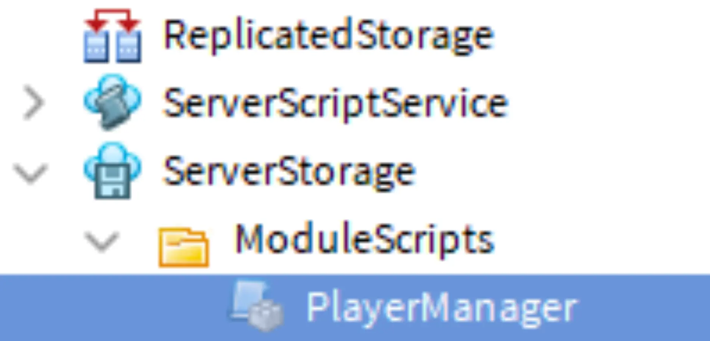
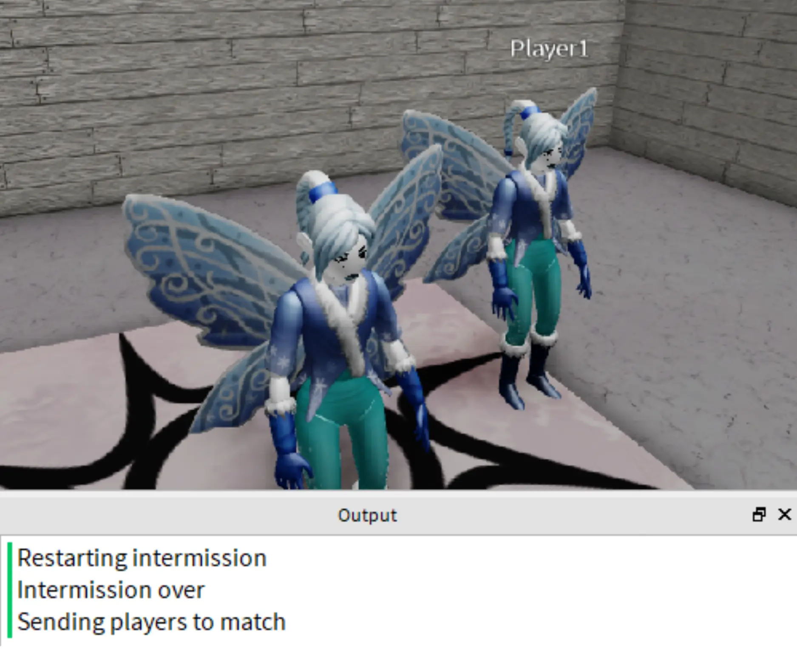
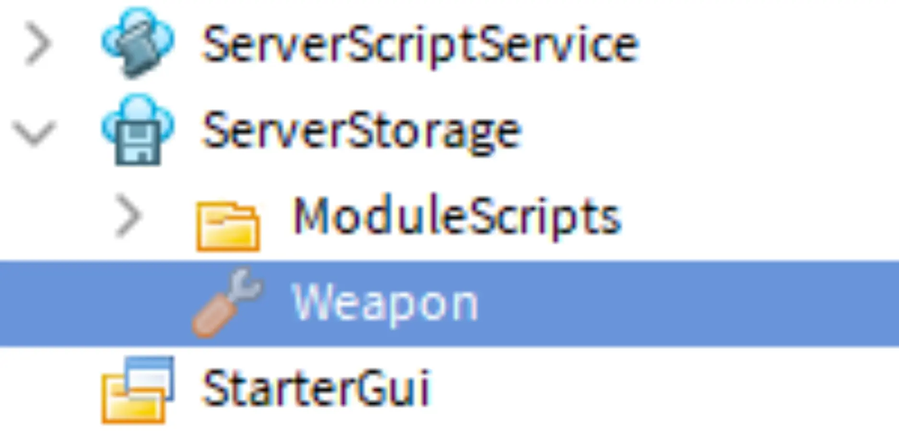

# Managing Players

## 목차
- [Managing Players](#managing-players)
  - [목차](#목차)
    - [스크립트 설정](#스크립트-설정)
    - [로비에서 플레이어 스폰](#로비에서-플레이어-스폰)
    - [연결 및 테스트](#연결-및-테스트)
    - [문제 해결 팁](#문제-해결-팁)
  - [플레이어를 경기장으로 보내기](#플레이어를-경기장으로-보내기)
    - [플레이어를 스폰으로 보내기](#플레이어를-스폰으로-보내기)
    - [추적 및 스폰](#추적-및-스폰)
    - [문제 해결 팁](#문제-해결-팁-1)
  - [플레이어에게 무기 제공](#플레이어에게-무기-제공)
    - [도구 추가](#도구-추가)
    - [플레이어에게 도구 제공](#플레이어에게-도구-제공)
  - [완료된 스크립트](#완료된-스크립트)
    - [GameManager 스크립트](#gamemanager-스크립트)
    - [MatchManager 스크립트](#matchmanager-스크립트)
    - [PlayerManager 모듈 스크립트](#playermanager-모듈-스크립트)
  - [출처](#출처)
  - [다음](#다음)

---

게임 루프가 코딩되었으므로 이제 기능을 추가할 차례입니다. 매치 중에는 플레이어가 입장하거나 나갈 수 있습니다. 따라서 플레이어를 매치에 보내고 활성 플레이어를 추적하는 등의 작업을 위한 코드가 필요합니다. 이러한 작업을 관리하기 위해 **PlayerManager**라는 모듈 스크립트를 만듭니다.

이 스크립트는 플레이어를 무기를 가지고 경기장으로 보내는 함수를 시작하고, 나중에 시리즈에서 확장될 것입니다.

<video controls src="../img/14_04_Managing_Players/arena_3_showFinalResult.mp4" width="100%"></video>

### 스크립트 설정

플레이어 매니저에는 다른 스크립트에서 사용하는 함수가 포함되므로 모듈 스크립트가 될 것입니다.

1. ServerStorage > ModuleScripts에 PlayerManager라는 새 모듈 스크립트를 추가합니다. 그런 다음, 모듈 테이블 이름을 스크립트 이름과 일치하도록 변경하고 로컬 및 모듈 함수에 대한 주석을 추가합니다.

   

   ```lua
   local PlayerManager = {}
   -- 로컬 함수

   -- 모듈 함수

   return PlayerManager
   ```

2. 다음을 위한 로컬 변수를 추가합니다:

   **서비스:**

   - Players - 게임에 참가하거나 나간 플레이어를 알 수 있습니다.
   - ServerStorage - 플레이어 무기의 저장소.

   **맵 및 플레이어 변수:**

   - 로비 스폰, 경기장 폴더 및 경기장 스폰 폴더 - 플레이어를 다른 지역으로 텔레포트하는 데 사용됩니다.
   - 활성 플레이어 배열 - 현재 게임 중인 플레이어를 추적합니다.

   ```lua
   local PlayerManager = {}

   -- 서비스
   local Players = game:GetService("Players")
   local ServerStorage = game:GetService("ServerStorage")
   -- 맵 변수
   local lobbySpawn = workspace.Lobby.StartSpawn
   local arenaMap = workspace.Arena
   local spawnLocations = arenaMap.SpawnLocations
   -- 플레이어 변수
   local activePlayers = {}

   -- 로컬 함수

   -- 모듈 함수

   return PlayerManager
   ```

3. `sendPlayersToMatch()`라는 모듈 함수를 만들고 테스트 출력을 추가합니다.

   ```lua
   -- 로컬 함수

   -- 모듈 함수
   function PlayerManager.sendPlayersToMatch()
     print("Sending players to match")
   end

   return PlayerManager
   ```

### 로비에서 플레이어 스폰

현재 여러 스폰 위치가 있으므로 플레이어가 게임에 참여할 때 무작위로 스폰됩니다. 플레이어가 로비에서 스폰되도록 하려면 플레이어의 `RespawnLocation` 속성을 변경해야 합니다.

1. `onPlayerJoin()`이라는 새로운 로컬 함수를 만들고 `player`라는 매개변수를 추가합니다. 그 함수에서 플레이어의 리스폰 위치를 이전에 만든 로비 스폰 변수로 설정합니다.

   ```lua
   -- 로컬 함수
   local function onPlayerJoin(player)
     player.RespawnLocation = lobbySpawn
   end
   ```

2. 모듈 함수 아래에 이벤트 섹션을 추가합니다. 그런 다음, Player 서비스의 `PlayerAdded` 이벤트에 `onPlayerJoin()`을 연결합니다.

   ```lua
   -- 모듈 함수
   function PlayerManager.sendPlayersToMatch()
     print("Sending players to match")
   end

   -- 이벤트
   Players.PlayerAdded:Connect(onPlayerJoin)
   ```

### 연결 및 테스트

이제 모듈을 연결하고 테스트할 수 있습니다. PlayerManager가 생성되었으므로 해당 모듈 스크립트의 코드를 실행하여 플레이어를 로비로 보낼 수 있도록 `require`합니다.

1. **MatchManager**로 돌아가서 다음을 위한 변수를 만듭니다:

   - **ServerStorage** 서비스.
   - ServerStorage의 하위 항목인 **ModuleScripts** 폴더.
   - moduleScripts의 하위 항목인 **PlayerManager** 모듈 스크립트.

   ```lua
   local MatchManager = {}

   -- 서비스
   local ServerStorage = game:GetService("ServerStorage")

   -- 모듈 스크립트
   local moduleScripts = ServerStorage:WaitForChild("ModuleScripts")
   local playerManager = require(moduleScripts:WaitForChild("PlayerManager"))

   function MatchManager.prepareGame()
     playerManager.sendPlayersToMatch()
   end

   return MatchManager
   ```

2. 최소 플레이어 수로 **로컬 서버**를 사용하여 테스트합니다. 다음을 확인합니다:

   - 모든 플레이어가 로비에서 스폰됩니다.
   - PlayerManager의 print 문이 출력 창에 나타납니다.

   

3. 완료되면, 서버를 종료하려면 Cleanup을 클릭합니다.

### 문제 해결 팁

이 시점에서 스크립트의 일부가 의도한 대로 작동하지 않는 경우 다음 중 하나를 시도해 보십시오.

- Arena의 이름이나 Lobby > StartSpawn의 위치를 확인합니다. 레슨에서 지시된 것과 다르게 이름을 지정한 경우 특히 주의하십시오.
- 각 스크립트에서 `require()` 함수를 사용하여 모듈이 필요한지 확인하고 올바르게 철자되어 있는지 확인합니다.

## 플레이어를 경기장으로 보내기

이제 플레이어가 로비에서 스폰되므로 인터미션이 끝나면 그들을 매치에 텔레포트합니다. 플레이어의 `RespawnLocation`을 경기장의 스폰 위치로 변경하고 `ReloadCharacter()`라는 Player 객체의 함수를 사용합니다.

1. **PlayerManager** 스크립트로 이동하여, `onPlayerJoin()` 아래에 `preparePlayer()`라는 새 로컬 함수를 추가합니다. 두 매개변수 `player`와 `whichSpawn`을 포함합니다.

   ```lua
   local activePlayers = {}

   -- 로컬 함수
   local function onPlayerJoin(player)
      player.RespawnLocation = lobbySpawn
   end

   local function preparePlayer(player, whichSpawn)

   end

   -- 모듈 함수
   function PlayerManager.sendPlayersToMatch()
      print("Sending players to match")
   end
   ```

2. 플레이어의 리스폰 위치를 `whichSpawn`으로 설정합니다.

   ```lua
   local function preparePlayer(player, whichSpawn)
      player.RespawnLocation = whichSpawn
   end
   ```

3. `LoadCharacter()`를 사용하여 캐릭터를 다시 로드합니다. 그러면 플레이어는 새로 할당된 위치에서 리스폰됩니다.

   ```lua
   local function preparePlayer(player, whichSpawn)
      player.RespawnLocation = whichSpawn
      player:LoadCharacter()
   end
   ```

  <Alert severity="info">
  캐릭터를 다시 로드하면 플레이어가 라운드 시작 시 제공된 도구만 갖도록 보장합니다. 예를 들어, 이 게임을 더 발전시켜 탄약이 있는 도구와 무기를 추가하는 경우, 캐릭터가 이러한 도구를 가져와서 불공평한 이점을 얻을 수 있습니다.
  </Alert>

### 플레이어를 스폰으로 보내기

각 플레이어가 경기장의 다른 스폰 위치로 텔레포트되도록 `for` 루프를 사용하여 활성 플레이어 배열을 반복합니다. `for` 루프를 사용하면 플레이어 배열의 모든 값을 순회할 수 있어 스크립트가 다양한 플레이어 수에 적응할 수 있습니다.

1. `sendPlayersToMatch()` 함수에서 Arena > SpawnLocations 폴더의 자식을 가져와 모든 경기장 스폰 위치의 배열을 만들기 위한 변수를 사용합니다.

   ```lua
   --모듈 함수
   function PlayerManager.sendPlayersToMatch()
      local arenaSpawns = spawnLocations:GetChildren()
   end
   ```

2. 모든 플레이어의 배열을 가져오고 각 플레이어를 반복하기 위해 아래에 `for` 루프를 추가합니다. 플레이어를 가져오려면 `Players:GetPlayers()`를 입력합니다.

   ```lua
   function PlayerManager.sendPlayersToMatch()
      local arenaSpawns = spawnLocations:GetChildren()

      for playerKey, whichPlayer in Players:GetPlayers() do

      end
   end
   ```

### 추적 및 스폰

게임이 실행될 때, 활성 플레이어 배열에서 각 사용자를 식별하여 경기장으로 스폰할 수 있도록 합니다. 라운드가 시작될 때, 모든 플레이어는 활성 플레이어 배열에 추적됩니다. 이 배열은 텔레포트하거나 무기를 할당하는 등의 다양한 함수에 사용되며, 라운드 중 로비에 있는 플레이어는 영향을 받지 않도록 보장합니다.

1. `for` 루프에서 `Library.table.insert()`를 사용하여 `activePlayers` 배열과 추가할 플레이어에 대한 두 매개변수를 사용합니다.

   ```lua
   function PlayerManager.sendPlayersToMatch()
      local arenaSpawns = spawnLocations:GetChildren()

      for playerKey, whichPlayer in Players:GetPlayers() do
         table.insert(activePlayers,whichPlayer)


      end
   end
   ```

2. 경기장에서 스폰 위치를 가져오기 위해 `spawnLocation`이라는 변수를 만들고 `arenaSpawns` 테이블의 **첫 번째** 인덱스로 설정합니다.

   ```lua
   for playerKey, whichPlayer in Players:GetPlayers() do
      table.insert(activePlayers,whichPlayer)
      local spawnLocation = arenaSpawns[1]
   end
   ```

3. `preparePlayer()`를 호출하고 `whichPlayer`와 `spawnLocation`을 전달합니다. 그런 다음, 해당 스폰 위치를 테이블에서 제거하여 다음 플레이어가 다른 스폰을 받도록 합니다.

   ```lua
   for playerKey, whichPlayer in Players:GetPlayers() do
      table.insert(activePlayers,whichPlayer)
      local spawnLocation = table.remove(arenaSpawns, 1)
      preparePlayer(whichPlayer, spawnLocation)
   end
   ```

4. **로컬** 서버에서 플레이어가 경기장으로 보내지는지 테스트합니다. 플레이어는 로비로 보내는 코드가 아직 설정되지 않았기 때문에 동일한 위치에서 계속 리스폰됩니다.

   <video controls src="../img/14_04_Managing_Players/arena_3_showRepeatArena.mp4" width="100%"></video>

### 문제 해결 팁

이 시점에서 의도된 결과가 나타나지 않는 경우 다음 중 하나를 시도해 보십시오.

- `GetPlayers()`에서 `Class.Players.GetPlayers(|Players:GetPlayers())` 문에서 닫는 괄호가 **두 개** 있는지 확인합니다.
- 모듈 스크립트에서 함수 호출의 순서를 확인합니다. 예를 들어, `matchManager.prepareGame()`은 `playerManager.sendPlayersToMatch()`를 호출해야 합니다.

## 플레이어에게 무기 제공

라운드가 시작되면 경기장의 각 플레이어에게 사용할 무기를 제공합니다.

### 도구 추가

플레이어 무기는 도구가 됩니다. Roblox에서 어떤 도구든 사용할 수 있지만, 시작할 샘플 검을 제공했습니다.

1. Toolbox에서 무기를 가져오거나 직접 만듭니다(`Class.Tool|Tools` 참조).

   <a href="https://www.roblox.com/library/10202913115/Battle-Royale-Weapon" target="_blank" rel="noopener">
   <Button variant="contained">Get Tool</Button>
   </a>

2. 무기를 ServerStorage에 배치합니다. 직접 도구를 만드는 경우, 나중에 스크립트에서 사용할 것이므로 도구 이름을 Weapon으로 지정하십시오.

   

### 플레이어에게 도구 제공

이제 도구가 저장소에 있으므로 활성 플레이어 배열을 순회하며 각 사용자에게 해당 도구를 제공합니다.

1. PlayerManager에서 `playerWeapon`이라는 변수를 추가하여 ServerStorage의 Weapon을 가져옵니다.

   ```lua
   -- 맵 변수
   local lobbySpawn = workspace.Lobby.StartSpawn
   local arenaMap = workspace.Arena
   local spawnLocations = arenaMap.SpawnLocations

   -- 플레이어 변수
   local activePlayers = {}
   local playerWeapon = ServerStorage.Weapon
   ```

2. `preparePlayer()`에서 플레이어의 캐릭터를 가져오는 코드를 추가합니다.

   ```lua
   local function preparePlayer(player, whichSpawn)
      player.RespawnLocation = whichSpawn
      player:LoadCharacter()

      local character = player.Character or player.CharacterAdded:Wait()
   end
   ```

   <Alert severity="info">
   게임이 시작될 때 플레이어의 캐릭터가 로드되지 않을 수 있습니다. 추가적인 대기를 추가하면 캐릭터가 즉시 사용 가능하지 않은 경우 스크립트가 대기하고 오류를 일으키지 않도록 합니다.
   </Alert>

3. `sword`라는 새로운 변수를 만들고 `Clone()` 함수를 사용하여 ServerStorage의 무기 복사본을 만듭니다. 그런 다음 검을 플레이어의 캐릭터에 부모로 설정합니다.

   ```lua
   local function preparePlayer(player, whichSpawn)
      player.RespawnLocation = whichSpawn
      player:LoadCharacter()

      local character = player.Character or player.CharacterAdded:Wait()
      local sword = playerWeapon:Clone()
      sword.Parent = character
   end
   ```

4. **로컬 서버**에서 테스트하여 각 플레이어가 경기장으로 보내질 때 도구를 받는지 확인합니다. 계속 테스트하면 인터미션이 계속 재시작되므로 플레이어는 몇 초마다 리스폰됩니다. 이는 다음 레슨에서 해결됩니다.

   <video controls src="../img/14_04_Managing_Players/show-weapon-spawned.mp4" width="100%"></video>

## 완료된 스크립트

작업을 다시 확인하기 위해 완료된 스크립트는 아래와 같습니다.

### GameManager 스크립트

```lua
-- 서비스
local ServerStorage = game:GetService("ServerStorage")
local Players = game:GetService("Players")

-- 모듈 스크립트
local moduleScripts = ServerStorage:WaitForChild("ModuleScripts")
local matchManager = require(moduleScripts:WaitForChild("MatchManager"))
local gameSettings = require(moduleScripts:WaitForChild("GameSettings"))

while true do
	repeat
		task.wait(gameSettings.intermissionDuration)
		print("Restarting intermission")
	until #Players:GetPlayers() >= gameSettings.minimumPlayers

	print("Intermission over")
	task.wait(gameSettings.transitionTime)

	matchManager.prepareGame()
end
```

### MatchManager 스크립트

```lua
local MatchManager = {}

-- 서비스
local ServerStorage = game:GetService("ServerStorage")

-- 모듈 스크립트
local moduleScripts = ServerStorage:WaitForChild("ModuleScripts")
local playerManager = require(moduleScripts:WaitForChild("PlayerManager"))

function MatchManager.prepareGame()
	playerManager.sendPlayersToMatch()
end

return MatchManager
```

### PlayerManager 모듈 스크립트

```lua
local PlayerManager = {}
-- 서비스
local Players = game:GetService("Players")
local ServerStorage = game:GetService("ServerStorage")

-- 맵 변수
local lobbySpawn = workspace.Lobby.StartSpawn
local arenaMap = workspace.Arena
local spawnLocations = arenaMap.SpawnLocations

-- 플레이어 변수
local activePlayers = {}
local playerWeapon = ServerStorage.Weapon

-- 로컬 함수
local function onPlayerJoin(player)
	player.RespawnLocation = lobbySpawn

end

local function preparePlayer(player, whichSpawn)
	player.RespawnLocation = whichSpawn
	player:LoadCharacter()
	local character = player.Character or player.CharacterAdded:Wait()
	local sword = playerWeapon:Clone()
	sword.Parent = character
end

-- 모듈 함수
function PlayerManager.sendPlayersToMatch()
	print("Sending players to match")

local arenaSpawns = spawnLocations:GetChildren()

	for playerKey, whichPlayer in Players:GetPlayers() do
		table.insert(activePlayers,whichPlayer)
		local spawnLocation = table.remove(arenaSpawns, 1)
		preparePlayer(whichPlayer, spawnLocation)
	end
end

-- 이벤트
Players.PlayerAdded:Connect(onPlayerJoin)

return PlayerManager
```

---
## 출처
 - [Managing Players](https://create.roblox.com/docs/ko-kr/education/battle-royale-series/managing-players)

---
## [다음](./14_05_Timers_and_Events.md)