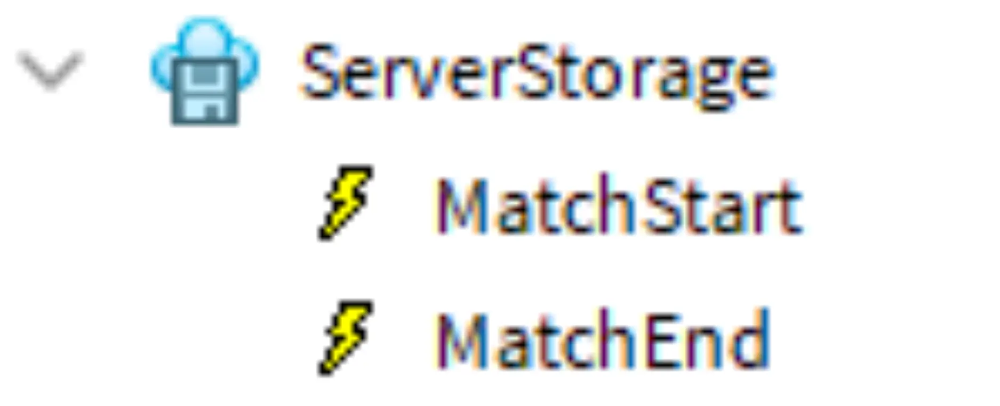
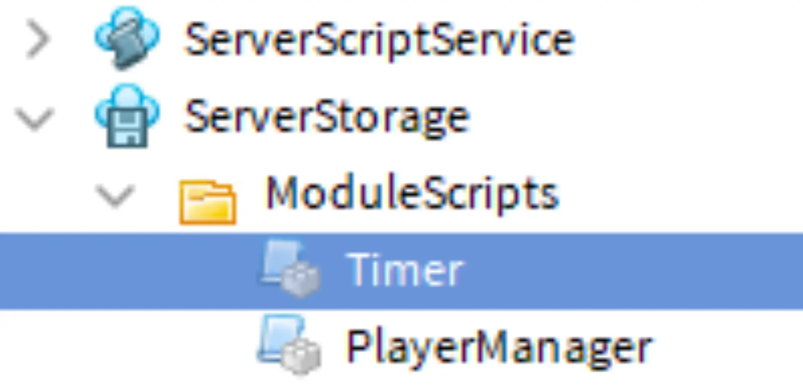
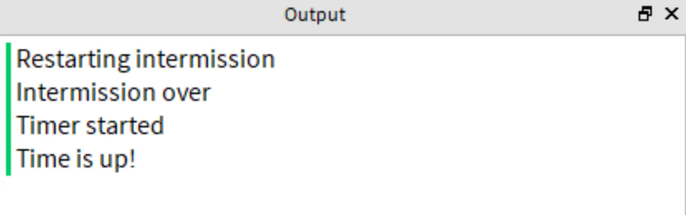

# Timers and Events

## 목차
- [Timers and Events](#timers-and-events)
  - [목차](#목차)
  - [이벤트를 사용한 신호 보내기](#이벤트를-사용한-신호-보내기)
    - [바인더블 이벤트 생성](#바인더블-이벤트-생성)
    - [이벤트 사용](#이벤트-사용)
    - [문제 해결 팁](#문제-해결-팁)
  - [타이머 사용](#타이머-사용)
    - [타이머 설정](#타이머-설정)
    - [시작 및 중지](#시작-및-중지)
    - [타이머 시작](#타이머-시작)
  - [완료된 스크립트](#완료된-스크립트)
    - [MatchManager 스크립트](#matchmanager-스크립트)
    - [GameManager 스크립트](#gamemanager-스크립트)
  - [출처](#출처)
  - [다음](#다음)

---

라운드가 진행되는 동안 스크립트는 시간을 추적하고 다른 스크립트 간에 신호를 보내야 합니다. 시간은 타이머 스크립트를 사용하여 관리되며, 이벤트는 매치의 끝과 같은 변경 사항을 신호로 보내는 개념입니다.

## 이벤트를 사용한 신호 보내기

이제 플레이어가 경기장에 있으므로, 이벤트를 사용하여 매치의 시작을 알리고 타이머 코드를 시작할 수 있습니다. 나중에 이벤트를 사용하여 매치가 끝났음을 알리고 플레이어를 로비로 전환할 시간임을 알릴 수도 있습니다.

이러한 이벤트는 사전 제작되지 않았으므로 **바인더블 이벤트**라는 사용자 지정 이벤트 객체를 만들어야 합니다. 바인더블 이벤트는 플레이어가 발사한 행동에 자주 사용되며, `Touched`나 `Changed`와 같은 이벤트와 유사합니다.

여러 스크립트가 동일한 바인더블 이벤트를 청취할 수 있습니다. 이를 통해 코드를 체계적으로 유지하고 나중에 매치의 시작 또는 끝에 추가 코드를 추가하기가 더 쉬워집니다.

### 바인더블 이벤트 생성

먼저 매치의 시작과 끝을 신호하는 바인더블 이벤트 객체를 생성합니다. 바인더블 이벤트는 클라이언트와 상호작용하지 않으므로 Server Storage에 저장할 수 있습니다.

1. ServerStorage에서 Events라는 새 폴더를 만듭니다. 그 폴더에 두 개의 **BindableEvents**를 생성하고 각각을 MatchStart와 MatchEnd로 이름을 지정합니다.

   

### 이벤트 사용

현재, 플레이어가 경기장에 입장할 때 인터미션이 계속 재시작되며 타이머가 시작되지 않습니다. 메인 게임 루프는 MatchEnd 이벤트가 발생할 때까지 멈추고 기다려야 합니다. 

이벤트에는 `Connect()`와 `Wait()`라는 두 가지 기본 제공 함수가 있습니다. 이전에 사용한 것처럼 `Connect()`를 사용하는 대신, MatchEnd에서 `Wait()`를 호출하여 GameManager 스크립트가 MatchEnd가 발생할 때까지 멈추도록 합니다. 이 경우, 대기 함수는 게임 매니저가 매치가 끝났다는 신호를 받을 때까지 코드를 일시 정지합니다.

1. **GameManager**에서 `Events` 폴더와 `MatchEnd` 이벤트를 위한 변수를 생성합니다.

   ```lua
   -- Module Scripts
   local moduleScripts = ServerStorage:WaitForChild("ModuleScripts")
   local matchManager = require(moduleScripts:WaitForChild("MatchManager"))
   local gameSettings = require(moduleScripts:WaitForChild("GameSettings"))

   -- Events
   local events = ServerStorage:WaitForChild("Events")
   local matchEnd = events:WaitForChild("MatchEnd")
   ```

2. 스크립트가 다음으로 넘어가기 전에 매치 종료 이벤트가 발생하기를 기다리도록 합니다. **루프**의 **끝**에 `matchEnd.Event:Wait()`를 입력합니다.

   ```lua
   while true do
     repeat
       task.wait(gameSettings.intermissionDuration)
       print("Restarting intermission")
     until #Players:GetPlayers() >= gameSettings.minimumPlayers

     print("Intermission over")
     task.wait(gameSettings.transitionTime)

     matchManager.prepareGame()
     -- Placeholder wait for the length of the game.
     matchEnd.Event:Wait()
   end
   ```

3. 게임을 **테스트**합니다. 플레이어가 경기장에 입장하면 인터미션 루프가 계속되지 않음을 확인합니다. 스크립트는 이제 `matchEnd` 신호가 발생하기를 기다리고 있습니다.

### 문제 해결 팁

이 시점에서 코드가 예상대로 작동하지 않는 경우 다음 중 하나를 시도해 보십시오.

- `matchEnd.Event:Wait()`에서 점 또는 콜론 연산자의 사용을 다시 확인하십시오.
- MatchEnd가 RemoteEvent가 아닌 BindableEvent인지 확인하십시오.

## 타이머 사용

매치의 끝을 유발하는 조건 중 하나는 타이머가 종료되는 것입니다. 이는 스크립트를 통해 처리됩니다.

### 타이머 설정

게임에 타이머를 추가하려면 아래 단계에 따라 준비된 모듈 스크립트를 사용하십시오. 이 스크립트에는 타이머를 시작하고 끝내며 남은 시간을 반환하는 함수가 포함되어 있습니다.

1. ServerStorage > ModuleScripts에서 Timer라는 새 모듈 스크립트를 만듭니다.

   

   아래 코드를 복사하여 붙여넣습니다.

   ```lua
   local Timer = {}
   Timer.__index = Timer

   function Timer.new()
     local self = setmetatable({}, Timer)

     self._finishedEvent = Instance.new("BindableEvent")
     self.finished = self._finishedEvent.Event

     self._running = false
     self._startTime = nil
     self._duration = nil

     return self
   end

   function Timer:start(duration)
     if not self._running then
       task.spawn(function()
         self._running = true
         self._duration = duration
         self._startTime = tick()
         while self._running and tick() - self._startTime < duration do
           task.wait()
         end
         local completed = self._running
         self._running = false
         self._startTime = nil
         self._duration = nil
         self._finishedEvent:Fire(completed)
       end)
     else
       warn("Warning: timer could not start again as it is already running.")
     end
   end

   function Timer:getTimeLeft()
     if self._running then
       local now = tick()
       local timeLeft = self._startTime + self._duration - now
       if timeLeft < 0 then
         timeLeft = 0
       end
       return timeLeft
     else
       warn("Warning: could not get remaining time, timer is not running.")
     end
   end

   function Timer:isRunning()
     return self._running
   end

   function Timer:stop()
     self._running = false
   end

   return Timer
   ```

2. MatchManager에서 GameSettings와 Timer 모듈을 요구합니다.

   ```lua
   local MatchManager = {}

   -- Services
   local ServerStorage = game:GetService("ServerStorage")

   -- Module Scripts
   local moduleScripts = ServerStorage:WaitForChild("ModuleScripts")
   local playerManager = require(moduleScripts:WaitForChild("PlayerManager"))
   local gameSettings = require(moduleScripts:WaitForChild("GameSettings"))
   local timer = require(moduleScripts:WaitForChild("Timer"))
   ```

3. 변수를 설정한 후, `myTimer`라는 변수에 `timer.new()`를 할당하여 새 타이머 객체를 생성합니다. 이 객체는 타이머를 시작하고 중지하는 데 사용됩니다.

   ```lua
   local gameSettings = require(moduleScripts:WaitForChild("GameSettings"))
   local timer = require(moduleScripts:WaitForChild("Timer"))

   -- Creates a new timer object to be used to keep track of match time.
   local myTimer = timer.new()
   ```

  <Alert severity="info">
  타이머 모듈 스크립트는 다른 스크립트에서도 호출할 수 있으며, 필요에 따라 더 많은 타이머를 생성할 수 있습니다. 예를 들어, 특정 시간 후에 함정이 나타나도록 하려면 새 타이머 객체를 생성하여 사용하십시오. 타이머 객체는 단일 목적으로만 사용되어야 하며, 재사용되지 않아야 합니다.
  </Alert>

### 시작 및 중지

이제 타이머가 생성되었으므로, 포함된 `start()` 및 `stop()` 함수를 매치 중에 사용합니다. 아래는 각 함수와 그 매개변수의 설명입니다.

- `start(time)` - 타이머를 시작하며, 매개변수로 시간(초)을 받습니다.
- `finished:Connect(functionName)` - 타이머가 완료되면, 매개변수로 전달된 함수를 실행합니다.

1. **MatchManager**에서 타이머가 완료될 때 실행할 `timeUp()`라는 새 함수를 생성합니다. 테스트 출력을 포함합니다.

   ```lua
   local myTimer = timer.new()

   -- 로컬 함수
   local function timeUp()
     print("Time is up!")
   end

   -- 모듈 함수
   function MatchManager.prepareGame()
     playerManager.sendPlayersToMatch()
   end

   return MatchManager
   ```

2. `timeUp()` 아래에 `startTimer()`라는 함수를 추가하고 테스트 출력을 포함합니다. 나중에 게임에서 타이머를 표시할 것입니다.

   ```lua
   -- 로컬 함수
   local function timeUp()
     print("Time is up!")
   end

   local function startTimer()
     print("Timer started")
   end
   ```

3. `startTimer()`에서 타이머를 시작하고 중지하려면:

   - `myTimer.start()`를 호출합니다. 매개변수로 `gameSettings.matchDuration`을 전달합니다.
   - `myTimer.finished:Connect()`를 호출합니다. 매

개변수로 `timeUp()`을 전달합니다.

   ```lua
   -- 로컬 함수
   local function startTimer()
     print("Timer started")
     myTimer:start(gameSettings.matchDuration)
     myTimer.finished:Connect(timeUp)
   end
   ```

### 타이머 시작

타이머는 매치 시작 이벤트를 사용하여 매치 시작 시 트리거될 수 있습니다.

1. MatchManager에서 모듈 변수를 설정한 후, Events 폴더, MatchStart 및 MatchEnd를 저장할 변수를 생성합니다(추후 레슨에서 사용).

   ```lua
   -- 모듈 스크립트
   local moduleScripts = ServerStorage:WaitForChild("ModuleScripts")
   local playerManager = require(moduleScripts:WaitForChild("PlayerManager"))
   local gameSettings = require(moduleScripts:WaitForChild("GameSettings"))
   local timer = require(moduleScripts:WaitForChild("Timer"))

   -- 이벤트
   local events = ServerStorage:WaitForChild("Events")
   local matchStart = events:WaitForChild("MatchStart")
   local matchEnd = events:WaitForChild("MatchEnd")

   -- 타이머 생성
   local myTimer = timer.new()
   ```

2. `return MatchManager` 위에 match start 이벤트를 `startTimer()`에 연결합니다.

   ```lua
   -- 모듈 함수
   function MatchManager.prepareGame()
     playerManager.sendPlayersToMatch()
   end

   matchStart.Event:Connect(startTimer)

   return MatchManager
   ```

3. `prepareGame()`에서 match start 이벤트를 발생시키려면 `matchStart:Fire()`를 입력합니다.

   ```lua
   -- 모듈 함수
   function MatchManager.prepareGame()
     playerManager.sendPlayersToMatch()
     matchStart:Fire()
   end
   ```

4. 게임을 테스트합니다. 출력 창에서 타이머 시작 및 종료 함수의 출력 메시지를 확인합니다.

   

## 완료된 스크립트

작업을 다시 확인하기 위해 완료된 스크립트는 아래와 같습니다.

### MatchManager 스크립트

```lua
local MatchManager = {}

-- 서비스
local ServerStorage = game:GetService("ServerStorage")

-- 모듈 스크립트
local moduleScripts = ServerStorage:WaitForChild("ModuleScripts")
local playerManager = require(moduleScripts:WaitForChild("PlayerManager"))
local gameSettings = require(moduleScripts:WaitForChild("GameSettings"))
local timer = require(moduleScripts:WaitForChild("Timer"))

-- 이벤트
local events = ServerStorage:WaitForChild("Events")
local matchStart = events:WaitForChild("MatchStart")
local matchEnd = events:WaitForChild("MatchEnd")

-- 타이머 객체를 생성하여 매치 시간을 추적
local myTimer = timer.new()

-- 로컬 함수
local function timeUp()
	print("Time is up!")
end

local function startTimer()
	print("Timer started")
	myTimer:start(gameSettings.matchDuration)
	myTimer.finished:Connect(timeUp)
end

-- 모듈 함수
function MatchManager.prepareGame()
	playerManager.sendPlayersToMatch()
	matchStart:Fire()
end

matchStart.Event:Connect(startTimer)

return MatchManager
```

### GameManager 스크립트

```lua
-- 서비스
local ServerStorage = game:GetService("ServerStorage")
local Players = game:GetService("Players")

-- 모듈 스크립트
local moduleScripts = ServerStorage:WaitForChild("ModuleScripts")
local matchManager = require(moduleScripts:WaitForChild("MatchManager"))
local gameSettings = require(moduleScripts:WaitForChild("GameSettings"))

-- 이벤트
local events = ServerStorage:WaitForChild("Events")
local matchEnd = events:WaitForChild("MatchEnd")

while true do
	repeat
		task.wait(gameSettings.intermissionDuration)
		print("Restarting intermission")
	until #Players:GetPlayers() >= gameSettings.minimumPlayers

	print("Intermission over")
	task.wait(gameSettings.transitionTime)

	matchManager.prepareGame()
	-- 게임 길이의 자리 표시자 대기
	matchEnd.Event:Wait()
end
```

---
## 출처
 - [Timers and Events](https://create.roblox.com/docs/ko-kr/education/battle-royale-series/timers-and-events)

---
## [다음](./14_06_Creating_a_GUI.md)