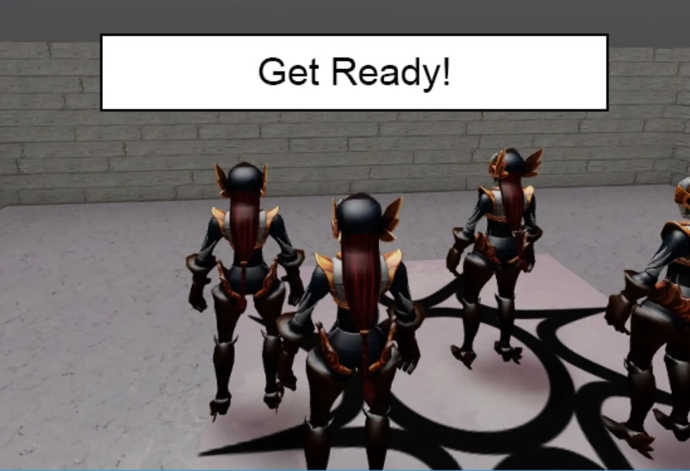
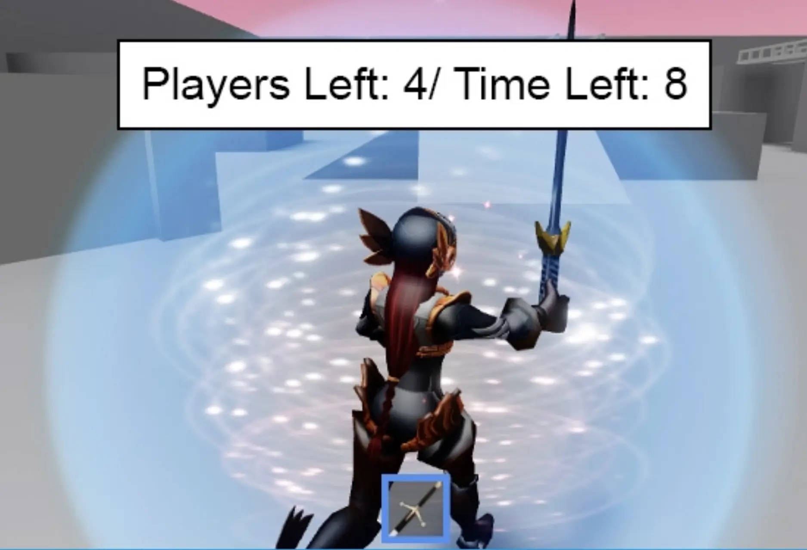
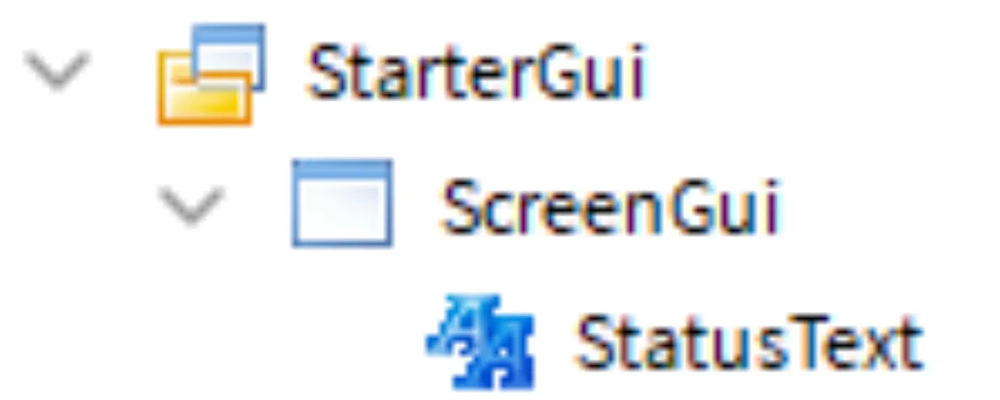
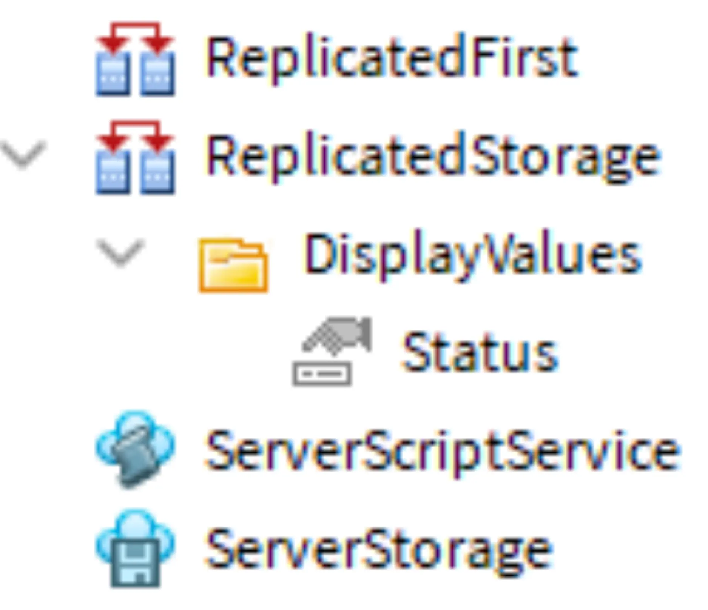
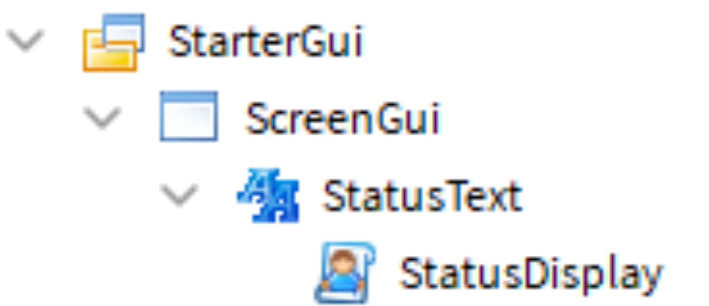
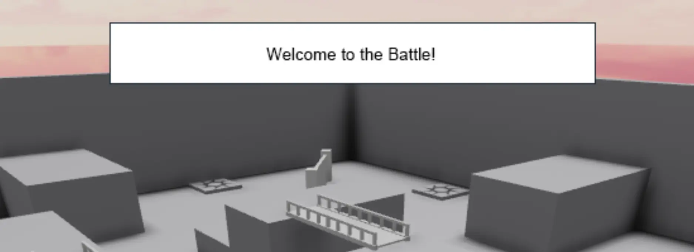
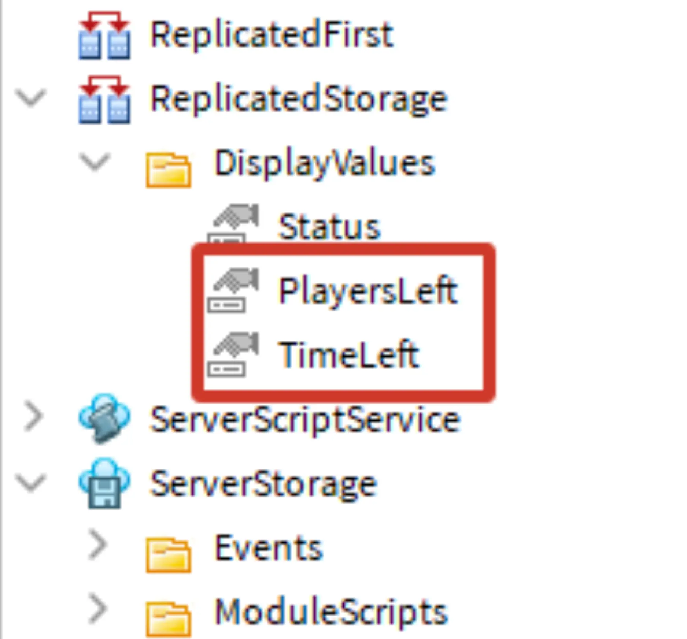

# Creating a GUI

## 목차
- [Creating a GUI](#creating-a-gui)
  - [목차](#목차)
  - [GUI로 정보 표시](#gui로-정보-표시)
    - [GUI 설정](#gui-설정)
  - [GUI 스크립팅](#gui-스크립팅)
    - [스크립트 설정](#스크립트-설정)
    - [텍스트 레이블 변경](#텍스트-레이블-변경)
  - [디스플레이 매니저 만들기](#디스플레이-매니저-만들기)
    - [스크립트 설정](#스크립트-설정-1)
    - [텍스트 상태 업데이트](#텍스트-상태-업데이트)
    - [문제 해결 팁](#문제-해결-팁)
  - [매치 상태 표시](#매치-상태-표시)
  - [값 및 함수 설정](#값-및-함수-설정)
    - [플레이어 수 표시](#플레이어-수-표시)
    - [타이머 표시](#타이머-표시)
  - [완료된 스크립트](#완료된-스크립트)
    - [GameManager 스크립트](#gamemanager-스크립트)
    - [DisplayManager 스크립트](#displaymanager-스크립트)
    - [MatchManager 스크립트](#matchmanager-스크립트)
    - [StatusDisplay 스크립트](#statusdisplay-스크립트)
  - [출처](#출처)
  - [다음](#다음)

---

현재 게임 정보의 대부분은 플레이어에게 보이지 않는 출력 창에 있습니다. 게임에서 무슨 일이 일어나는지 플레이어에게 알리기 위해 그래픽 사용자 인터페이스(GUI)를 만들고 코딩할 것입니다.

## GUI로 정보 표시

이 게임에서는 텍스트 레이블이 현재 게임 상태와 남은 플레이어 수 및 시간을 표시합니다.

<GridContainer numColumns="2">
  <figure>
    
    <figcaption>인터미션 중</figcaption>
  </figure>
  <figure>
    
    <figcaption>매치 중</figcaption>
  </figure>
</GridContainer>

### GUI 설정

먼저, 다양한 텍스트 요소를 포함할 **Screen GUI** 객체를 만듭니다. 플레이어가 카메라를 움직일 때 화면 GUI는 화면의 같은 위치에 유지됩니다.

모든 플레이어가 동일한 디스플레이를 볼 수 있도록 GUI를 **StarterGUI** 폴더에 배치합니다. 게임이 시작될 때 이 폴더는 모든 플레이어에게 복사됩니다.

1. StarterGUI 폴더에서 새 ScreenGUI를 만듭니다. 그런 다음 ScreenGUI에서 StatusText라는 새 TextLabel을 추가합니다.

   

2. 레이블을 이동하려면 Explorer에서 StatusText를 선택합니다. 그런 다음 게임 뷰에서 레이블을 원하는 위치로 드래그합니다. 숫자는 비디오와 다를 수 있습니다. 앵커 포인트를 사용하여 레이블의 크기도 조정할 수 있습니다.

   <video controls src="../img/14_06_Creating_a_GUI/arena_5_showMovingScaleGUI.mp4" width="100%"></video>

## GUI 스크립팅

게임의 변경 사항을 반영하기 위해 스크립트는 GUI 요소를 업데이트해야 합니다. 예를 들어, 게임 상태(인터미션 중인지 활성 라운드인지)는 StringValue에 저장되고 로컬 스크립트를 사용하여 업데이트됩니다.

<Alert severity="info">
스크립트 및 모듈 스크립트는 Roblox 서버에서 실행되는 반면, 로컬 스크립트는 플레이어의 장치에서 실행됩니다. 로컬 스크립트는 타이머 또는 마우스 및 키보드 액션과 같은 플레이어 입력을 코딩하는 데 자주 사용됩니다.
</Alert>

### 스크립트 설정

StatusDisplay 스크립트는 게임 상태가 변경될 때마다 플레이어의 GUI를 업데이트하는 데 사용됩니다.

1. **ReplicatedStorage**에 DisplayValues라는 폴더를 만듭니다. 그 폴더에 Status라는 StringValue를 추가합니다. 나중에 값을 테스트하기 위해 "Welcome to the Battle!"와 같은 임시 값을 부여합니다.

   

   <Alert severity="info">
   로컬 스크립트는 플레이어의 장치에서만 실행되므로, ServerStorage와 같은 서버 폴더에 저장할 수 없습니다. ReplicatedStorage는 클라이언트(장치)와 서버 모두에서 사용할 수 있는 폴더입니다.
   </Alert>

2. StarterGUI > ScreenGUI > Status에서 StatusDisplay라는 새 로컬 스크립트를 추가합니다. GUI에 영향을 미치는 스크립트는 종종 해당 GUI 요소에 상속됩니다.

   

3. StatusDisplay를 열고 다음 변수에 대해 정의합니다:

   - ReplicatedStorage 서비스
   - DisplayValues 폴더
   - Status StringValue
   - TextLabel - `script.Parent`를 사용합니다.

     ```lua
     local ReplicatedStorage = game:GetService("ReplicatedStorage")
     local displayValues = ReplicatedStorage:WaitForChild("DisplayValues")
     local status = displayValues:WaitForChild("Status")

     local textLabel = script.Parent
     ```

### 텍스트 레이블 변경

레이블의 텍스트를 변경하려면 Changed 이벤트를 사용하여 다른 스크립트에 의해 Status 문자열이 변경될 때마다 텍스트 레이블이 업데이트되도록 합니다.

1. `updateText()`라는 새 함수를 코딩합니다. 그 함수에서 `textLabel`의 Text 속성을 `status.Value`로 설정합니다.

   ```lua
   local textLabel = script.Parent

   local function updateText()
      textLabel.Text = status.Value
   end
   ```

2. 함수를 Changed 이벤트에 연결합니다.

   ```lua
   local function updateText()
      textLabel.Text = status.Value
   end

   status.Changed:Connect(updateText)
   ```

3. 플레이어가 게임을 시작할 때 가장 최신의 상태를 볼 수 있도록, 스크립트 끝에 `updateText()`를 실행합니다.

   ```lua
   local function updateText()
      textLabel.Text = status.Value
   end

   status.Changed:Connect(updateText)
   updateText()
   ```

4. 게임을 실행하여 디스플레이에서 임시 값을 확인합니다.

   

## 디스플레이 매니저 만들기

게임 중에 텍스트 레이블은 GameManager, MatchManager 및 다른 스크립트로부터 정보를 받아야 합니다. 이러한 다양한 스크립트가 필요할 때 텍스트 레이블을 업데이트할 수 있도록 DisplayManager라는 모듈 스크립트를 만듭니다.

### 스크립트 설정

DisplayManager는 다른 스크립트와 통신해야 하므로 모듈 스크립트가 됩니다.

1. **ServerStorage** > **ModuleScripts**에서 DisplayManager라는 새 모듈 스크립트를 만듭니다. 모듈 테이블의 이름을 스크립트 이름과 일치시킵니다.

2. 다음을 저장할 로컬 변수를 추가합니다: Replicated Storage, DisplayValues 폴더, Status.

   ```lua
   local DisplayManager = {}

   -- 서비스
   local ReplicatedStorage = game:GetService("ReplicatedStorage")

   -- 플레이어 GUI를 업데이트하는 데 사용되는 Display Values
   local displayValues = ReplicatedStorage:WaitForChild("DisplayValues")
   local status = displayValues:WaitForChild("Status")

   -- 로컬 함수

   -- 모듈 함수

   return DisplayManager
   ```

3. `updateStatus()`라는 새 모듈 함수를 만들어 Status 값의 문자열을 업데이트합니다. 다른 스크립트는 이 함수를 호출할 수 있습니다.

   ```lua
   -- 로컬 함수

   -- 모듈 함수
   function DisplayManager.updateStatus(newStatus)
      status.Value = newStatus
   end
   ```

### 텍스트 상태 업데이트

Display Manager가 설정되면 다른 스크립트에서 GUI 텍스트 레이블을 업데이트하는 데 사용할 수 있습니다. GUI의 첫 번째 메시지로 인터미션의 시작과 끝을 GameManager 스크립트를 통해 표시합니다.

1. **ServerScriptService** > GameManager에서 `displayManager`라는 변수를 만들고 ServerStorage의 DisplayManager 모듈을 요구합니다.

   ```lua
   -- 서비스
   local ReplicatedStorage = game:GetService("ReplicatedStorage")
   local ServerStorage = game:GetService("ServerStorage")
   local Players = game:GetService("Players")

   -- 모듈 스크립트
   local moduleScripts = ServerStorage:WaitForChild("ModuleScripts")
   local roundManager = require(moduleScripts:WaitForChild("RoundManager"))
   local gameSettings = require(moduleScripts:WaitForChild("GameSettings"))
   local displayManager = require(moduleScripts:WaitForChild("DisplayManager"))
   ```

2. while true do 문 후 첫 번째 줄로 displayManager > `updateStatus()`를 호출하고 플레이어를 기다리는 메시지를 전달합니다.

   ```lua
   -- 이벤트
   local events = ServerStorage:WaitForChild("Events")
   local matchEnd = events:WaitForChild("MatchEnd")

   while true do
      displayManager.updateStatus("Waiting for Players")

      repeat
         print("Starting intermission")
         task.wait(gameSettings.intermissionDuration)
      until #Players:GetPlayers() >= gameSettings.minimumPlayers

      task.wait(gameSettings.transitionTime)

      matchManager.prepareGame()
      matchEnd.Event:Wait()

   end
   ```

3. 인터미션 반복 루프가 끝난 후 `updateStatus()`를 호출하고 매치가 시작됨을 알리는 문자열을 전달합니다. GUI를 테스트할 예정이므로 인터미션 시작 및 끝을 나타내는 두 개의 출력 문을 삭제합니다.

   ```lua
   while true do
      displayManager.updateStatus("Waiting for Players")

      repeat
         task.wait(gameSettings.intermissionDuration)
      until #Players:GetPlayers() >= gameSettings.minimumPlayers

      displayManager.updateStatus("Get ready!")
      task.wait(gameSettings.transitionTime)

      matchManager.prepareGame()
      matchEnd.Event:Wait()

   end
   ```

4. 최소 플레이어 수가 있거나 없는 상태로 게임을 테스트합니다. 메시지는 다음과 같이 표시되어야 합니다:
    - 최소 플레이어 수가 없는 경우: `"Waiting for Players"`.
    - 최소 플레이어 수가 있는 경우: `"Get ready"`.

### 문제 해결 팁

이 시점에서 텍스트 레이블이 첫 번째 메시지를 표시하지 않거나 여전히 "Label"을 표시하는 경우, 아래의 해결 방법을 시도해 보세요.

- StatusDisplay 로컬 스크립트에서 `updateText()`가 스크립트 하단에 호출되었는지 확인합니다. 이렇게 하면 플레이어가 최신 메시지를 받게 됩니다.
- Status StringValue가 ReplicatedStorage에 있는지 확인합니다. 클라이언트-서버 관계의 고유한 특성 때문에 ServerStorage에 있으면 로컬 스크립트가 찾을 수 없습니다.

## 매치 상태 표시

게임 중에 GUI는 두 가지 숫자를 표시합니다: 남은 플레이어 수와 시간. 이 숫자가 변경될 때마다 텍스트 레이블도 변경됩니다.

## 값 및 함수 설정

IntValues는 플레이어 수와 남은 시간을 저장하는 데 사용됩니다.

1. ReplicatedStorage > DisplayValues에서 PlayersLeft와 TimeLeft라는 두 개의 IntValues를 만듭니다.

   

2. DisplayManager에서 플레이어 수와 남은 시간을 저장할 변수를 추가합니다.

   ```lua
   local DisplayManager = {}

   -- 서비스
   local ReplicatedStorage = game:GetService("ReplicatedStorage")

   -- 플레이어 GUI를 업데이트하는 데 사용되는 Display Values
   local displayValues = ReplicatedStorage:WaitForChild("DisplayValues")
   local status = displayValues:WaitForChild("Status")
   local playersLeft = displayValues:WaitForChild("PlayersLeft")
   local timeLeft = displayValues:WaitForChild("TimeLeft")
   ```

3. `updateMatchStatus()`라는 로컬 함수를 만듭니다. 그런 다음 상태의 값을 플레이어 수와 남은 시간을 표시하도록 설정합니다.

   ```lua
   local displayValues = ReplicatedStorage:WaitForChild("DisplayValues")
   local status = displayValues:WaitForChild("Status")
   local playersLeft = displayValues:WaitForChild("PlayersLeft")
   local timeLeft = displayValues:WaitForChild("TimeLeft")

   -- 로컬 함수
   local function updateRoundStatus()
      status.Value = "Players Left: " .. playersLeft.Value .. " / Time Left: " .. timeLeft.Value
   end
   ```

4. **두** IntValue 변수에 대해 `updateRoundStatus()`를 Changed 이벤트에 연결합니다.

   ```lua
   -- 모듈 함수
   function DisplayManager.updateStatus(newStatus)
      status.Value = newStatus
   end

   playersLeft.Changed:Connect(updateRoundStatus)
   timeLeft.Changed:Connect(updateRoundStatus)

   return DisplayManager
   ```

   <Alert severity="warning">
   아직 테스트하지 마세요. 아직 아무것도 PlayersLeft 또는 TimeLeft 값을 업데이트하지 않았으므로, 라운드가 시작되었을 때 상태가 변경되지 않습니다.
   </Alert>

### 플레이어 수 표시

이제 게임 시작 시 플레이어 수를 표시하는 코드를 추가합니다. 이후 레슨에서는 플레이어가 게임에서 탈락할 때 PlayersLeft 값을 업데이트할 것입니다.

1. PlayerManager에서 ReplicatedStorage 서비스, DisplayValues 폴더 및 PlayersLeft IntValue에 대한 로컬 변수를 추가합니다.

   ```lua
   local PlayerManager = {}

   -- 서비스
   local Players = game:GetService("Players")
   local ServerStorage = game:GetService("ServerStorage")
   local ReplicatedStorage = game:GetService("ReplicatedStorage")

   -- 맵 변수
   local lobbySpawn = workspace.Lobby.StartSpawn
   local arenaMap = workspace.Arena
   local spawnLocations = arenaMap.SpawnLocations

   -- 값
   local displayValues = ReplicatedStorage:WaitForChild("DisplayValues")
   local playersLeft = displayValues:WaitForChild("PlayersLeft")
   ```

2. 시작 플레이어 수를 표시하려면 `playersLeft`의 값을 활성 플레이어 배열의 크기로 설정합니다.

   그런 다음 `sendPlayersToMatch()`의 for 루프 아래에 `playersLeft.Value = #activePlayers`를 입력합니다.

   ```lua
   function PlayerManager.sendPlayersToMatch()
      local availableSpawnPoints = spawnLocations:GetChildren()

      for playerKey, whichPlayer in Players:GetPlayers() do
         table.insert(activePlayers, whichPlayer)

         local spawnLocation = table.remove(availableSpawnPoints, 1)
         preparePlayer(whichPlayer, spawnLocation)
      end

      playersLeft.Value = #activePlayers
   end
   ```

### 타이머 표시

모듈 스크립트는 유사한 코드를 중앙 집중화하는 데 사용됩니다. 타이머가 MatchManager에서 추적되므로 Timer 스크립트의 함수를 사용하여 TimeLeft 값을 업데이트합니다. 디스플레이 매니저는 TimeLeft의 변경 사항을 듣고 새로운 값에 맞게 업데이트합니다.

1. MatchManager에서 **ReplicatedStorage** 서비스, DisplayValues 폴더 및 TimeLeft 값을 저장할 변수를 생성합니다.

   ```lua
   local MatchManager = {}

   -- 서비스
   local ServerStorage = game:GetService("ServerStorage")
   local ReplicatedStorage = game:GetService("ReplicatedStorage")

   -- 모듈 스크립트
   local moduleScripts = ServerStorage:WaitForChild("ModuleScripts")
   local playerManager = require(moduleScripts:WaitForChild("PlayerManager"))
   local gameSettings = require(moduleScripts:WaitForChild("GameSettings"))
   local timer = require(moduleScripts:WaitForChild("Timer"))

   -- 이벤트
   local events = ServerStorage:WaitForChild("Events")
   local matchStart = events:WaitForChild("MatchStart")

   -- 값
   local displayValues = ReplicatedStorage:WaitForChild("DisplayValues")
   local timeLeft = displayValues:WaitForChild("TimeLeft")

   local myTimer = timer.new()
   ```

2. `startTimer()` 함수를 찾습니다. **타이머의** `Finished` 이벤트 **이후에** 전체 강조 표시된 while 루프를 복사하여 붙여넣습니다. 이 코드는 타이머가 여전히 활성 상태인 동안 `timeLeft` 값을 업데이트하는 루프를 실행합니다.

   ```lua
   while myTimer:isRunning() do
         -- Adding +1 makes sure the timer display ends at 1 instead of 0.
         timeLeft.Value = (math.floor(myTimer:getTimeLeft() + 1))
         -- By not setting the time for wait, it offers more accurate looping
         task.wait()
      end
   ```

   추가하면 코드는 아래 샘플과 같아야 합니다.

   ```lua
   local function startTimer()
      print("Timer started")
      myTimer:start(gameSettings.matchDuration)
      myTimer.finished:Connect(timeUp)

      while myTimer:isRunning() do
         -- Adding +1 makes sure the timer display ends at 1 instead of 0.
         timeLeft.Value = (math.floor(myTimer:getTimeLeft() + 1))
         -- By not setting the time for wait, it offers more accurate looping
         task.wait()
      end
   end
   ```

3. 최소 플레이어와 함께 게임을 실행합니다. 상태 텍스트가 다음을 표시하는지 확인합니다:

   - 시작 플레이어 수가 올바릅니다. 이 숫자는 이후 레슨에서 추가 코드가 추가될 때까지 변경되지 않습니다.
   - 시간이 1초씩 감소하여 1에서 멈춥니다.

   <video controls src="../img/14_06_Creating_a_GUI/arena_5_showFinalizedGameLoop.mp4" width="100%"></video>

## 완료된 스크립트

작업을 다시 확인하기 위해 완료된 스크립트는 아래와 같습니다.

### GameManager 스크립트

```lua
-- 서비스
local ServerStorage = game:GetService("ServerStorage")
local Players = game:GetService("Players")

-- 모듈 스크립트
local moduleScripts = ServerStorage:WaitForChild("ModuleScripts")
local matchManager = require(moduleScripts:WaitForChild("MatchManager"))
local gameSettings = require(moduleScripts:WaitForChild("GameSettings"))
local displayManager = require(moduleScripts:WaitForChild("DisplayManager"))

-- 이벤트
local events = ServerStorage:WaitForChild("Events")
local matchEnd = events:WaitForChild("MatchEnd")

while true do
	displayManager.updateStatus("Waiting for Players")

	repeat
		task.wait(gameSettings.intermissionDuration)
	until #Players:GetPlayers() >= gameSettings.minimumPlayers
  
	displayManager.updateStatus("Get ready!")
	task.wait(gameSettings.transitionTime)

	matchManager.prepareGame()
	matchEnd.Event:Wait()
end
```

### DisplayManager 스크립트

```lua
local DisplayManager = {}

-- 서비스
local ReplicatedStorage = game:GetService("ReplicatedStorage")

-- 플레이어 GUI를 업데이트하는 데 사용되는 Display Values
local displayValues = ReplicatedStorage:WaitForChild("DisplayValues")
local status = displayValues:WaitForChild("Status")
local playersLeft = displayValues:WaitForChild("PlayersLeft")
local timeLeft = displayValues:WaitForChild("TimeLeft")

-- 로컬 함수
local function updateRoundStatus()
	status.Value = "Players Left: " .. playersLeft.Value .. " / Time Left: " .. timeLeft.Value
end

-- 모듈 함수


function DisplayManager.updateStatus(newStatus)
	status.Value = newStatus
end

playersLeft.Changed:Connect(updateRoundStatus)
timeLeft.Changed:Connect(updateRoundStatus)

return DisplayManager
```

### MatchManager 스크립트

```lua
local ReplicatedStorage = game:GetService("ReplicatedStorage")

-- 모듈 스크립트
local moduleScripts = ServerStorage:WaitForChild("ModuleScripts")
local playerManager = require(moduleScripts:WaitForChild("PlayerManager"))
local gameSettings = require(moduleScripts:WaitForChild("GameSettings"))
local timer = require(moduleScripts:WaitForChild("Timer"))

-- 이벤트
local events = ServerStorage:WaitForChild("Events")
local matchStart = events:WaitForChild("MatchStart")
local matchEnd = events:WaitForChild("MatchEnd")

-- 값
local displayValues = ReplicatedStorage:WaitForChild("DisplayValues")
local timeLeft = displayValues:WaitForChild("TimeLeft")

local myTimer = timer.new()

-- 로컬 함수
local function timeUp()
	print("Time is up!")
end

local function startTimer()
	print("Timer started")
	myTimer:start(gameSettings.matchDuration)
	myTimer.finished:Connect(timeUp)

	while myTimer:isRunning() do
		-- Adding +1 makes sure the timer display ends at 1 instead of 0.
		timeLeft.Value = (math.floor(myTimer:getTimeLeft() + 1))
		-- By not setting the time for wait, it offers more accurate looping
		task.wait()
	end

end

-- 모듈 함수
function MatchManager.prepareGame()
	playerManager.sendPlayersToMatch()
	matchStart:Fire()
end

matchStart.Event:Connect(startTimer)

return MatchManager
```

### StatusDisplay 스크립트

```lua
local ReplicatedStorage = game:GetService("ReplicatedStorage")
local displayValues = ReplicatedStorage:WaitForChild("DisplayValues")
local status = displayValues:WaitForChild("Status")

local textLabel = script.Parent

local function updateText()
	textLabel.Text = status.Value
end

status.Changed:Connect(updateText)
updateText()
```

---
## 출처
 - [Creating a GUI](https://create.roblox.com/docs/ko-kr/education/battle-royale-series/creating-a-gui)

---
## [다음](./14_07_Ending_Matches.md)