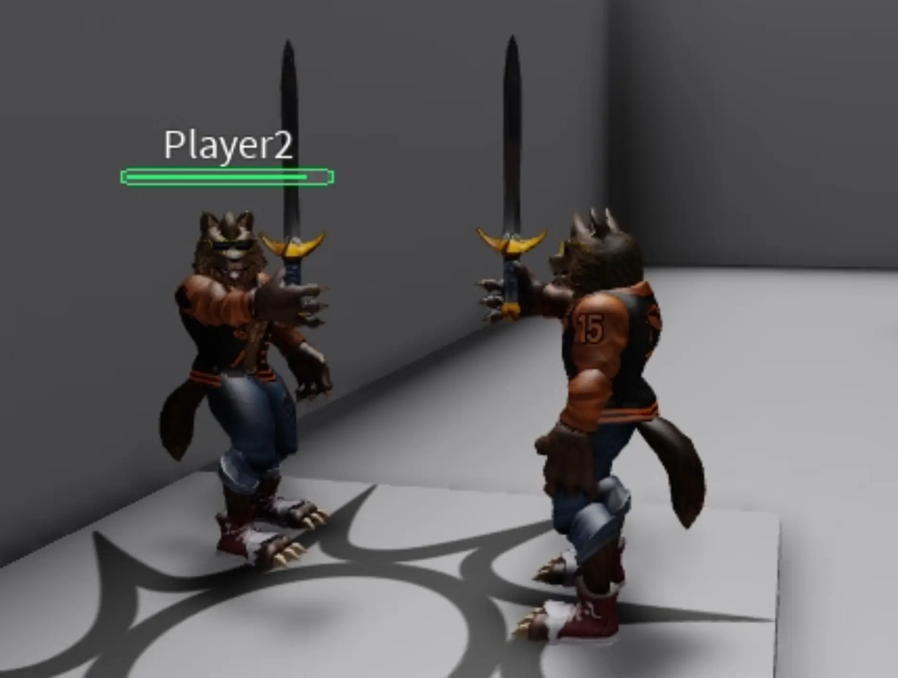
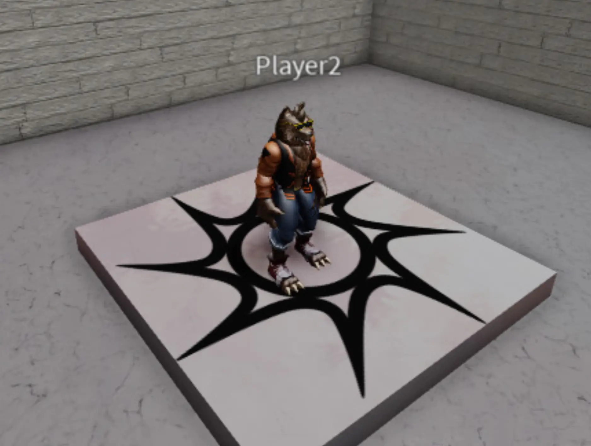
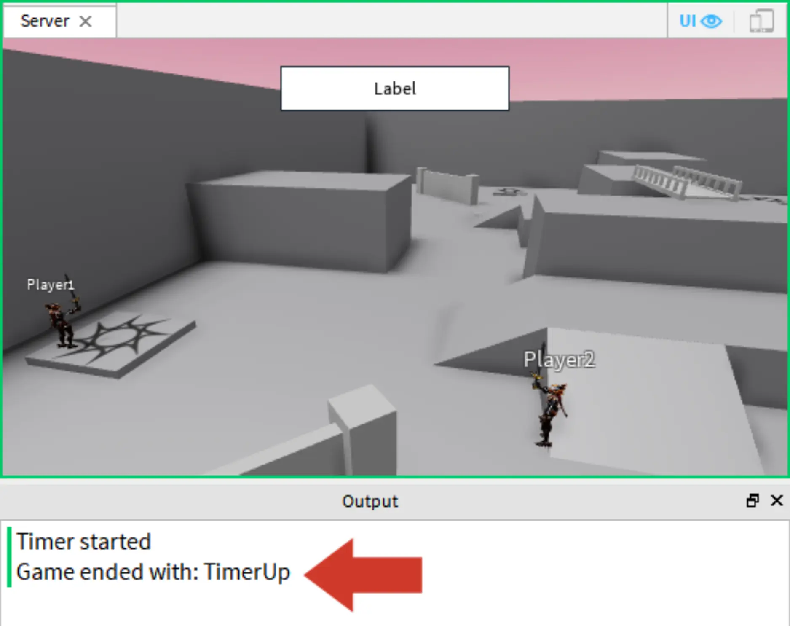
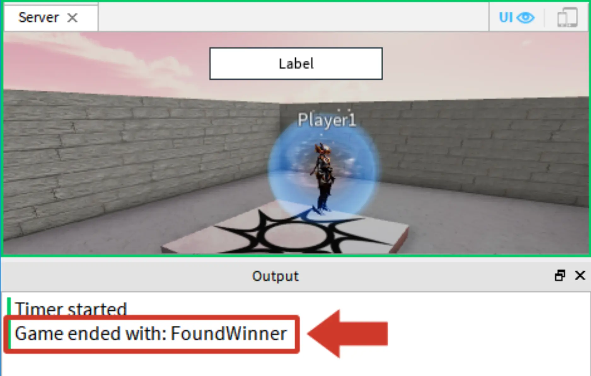
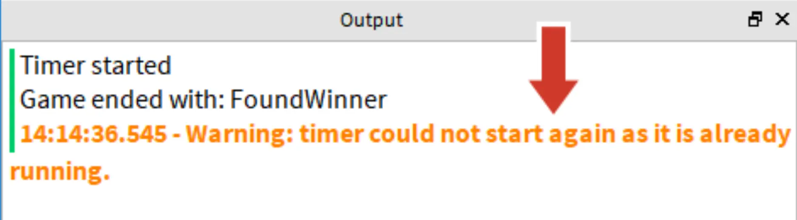

# Ending Matches

## 목차
- [Ending Matches](#ending-matches)
  - [목차](#목차)
  - [패배한 플레이어 관리](#패배한-플레이어-관리)
  - [익명 함수 사용](#익명-함수-사용)
    - [Died 이벤트 코딩](#died-이벤트-코딩)
  - [게임 종료](#게임-종료)
    - [타이머로 종료](#타이머로-종료)
    - [문제 해결 팁](#문제-해결-팁)
  - [승리한 매치 코딩](#승리한-매치-코딩)
    - [플레이어 수 확인](#플레이어-수-확인)
    - [플레이어 제거](#플레이어-제거)
    - [이벤트 연결 및 테스트](#이벤트-연결-및-테스트)
    - [타이머 멈추기](#타이머-멈추기)
  - [다음 단계](#다음-단계)
  - [완성된 스크립트](#완성된-스크립트)
    - [PlayerManager 스크립트](#playermanager-스크립트)
    - [GameSettings 스크립트](#gamesettings-스크립트)
    - [GameManager 스크립트](#gamemanager-스크립트)
    - [MatchManager 스크립트](#matchmanager-스크립트)
  - [출처](#출처)
  - [다음](#다음)

---

경기가 종료되는 조건에는 타이머가 종료되거나 단 한 명의 플레이어가 남는 경우 등이 있습니다.

## 패배한 플레이어 관리

현재 패배한 플레이어는 경기장에서 리스폰합니다. 대신, 그들을 로비로 보내 다음 경기를 기다리게 합니다.

1. PlayerManager에서 `respawnPlayerInLobby()`라는 로컬 함수를 만듭니다. 그 함수에서 다음을 수행합니다:

- 플레이어의 RespawnLocation 속성을 lobbySpawn으로 설정합니다.
- `Class.Player:LoadCharacter()`를 사용하여 캐릭터를 다시 로드합니다. `LoadCharacter()`는 플레이어를 스폰 위치에서 다시 생성하여 그들이 가지고 있던 도구를 제거합니다.

## 익명 함수 사용

익명 함수는 특정 상황에서 고급 스크립트에서 자주 사용됩니다. 이를 정의하기 전에, 스크립트가 직면할 수 있는 상황을 이해하는 것이 중요합니다.

예를 들어, 패배한 플레이어를 로비로 이동시키기 위해서는 리스폰 함수가 플레이어의 Died 이벤트에 연결되어야 합니다. 문제는, 이전에 했던 것처럼 이벤트를 연결하면 Died 이벤트에서 플레이어의 이름을 얻을 수 있는 방법이 없다는 것입니다. 스크립트는 활성 플레이어를 추적하는 테이블에서 패배한 플레이어를 제거하려면 그 이름이 필요합니다.

Died 이벤트를 트리거한 플레이어의 이름을 얻기 위해, 익명 함수를 사용합니다. **익명 함수**는 이름이 없으며 `Connect()` 내부에서 직접 생성될 수 있습니다.

아래는 익명 함수의 구문을 보여주는 샘플입니다.

```lua
myPlayer.Died:Connect(function()
  print(player)
end)
```

### Died 이벤트 코딩

이 함수에서는 플레이어의 캐릭터가 죽을 때마다 로비로 리스폰하는 함수를 트리거합니다.

1. 플레이어의 Died 이벤트에 접근하기 위해 PlayerManager > `preparePlayer()`에서 플레이어의 humanoid를 위한 변수를 추가합니다.

   ```lua
   local function preparePlayer(player, whichSpawn)
     player.RespawnLocation = whichSpawn
     player:LoadCharacter()

     local character = player.Character or player.CharacterAdded:Wait()
     local sword = playerWeapon:Clone()
     sword.Parent = character

     local humanoid = character:WaitForChild("Humanoid")
   end
   ```

2. Died 이벤트에 연결되는 익명 함수를 만듭니다. `humanoid.Died:Connect()`를 입력한 다음, `Connect()` 내부에 `function()`을 입력하고 <kbd>Enter</kbd>를 눌러 `end`를 자동 완성한 후, 여분의 괄호를 삭제합니다.

   ```lua
   local humanoid = character:WaitForChild("Humanoid")

   humanoid.Died:Connect(function()

   end)
   ```

3. 익명 함수에서 `respawnPlayerInLobby()`를 호출합니다. 매치에 들어갈 준비를 하고 있는 플레이어를 저장하는 변수인 `player`를 전달합니다.

   ```lua
   local humanoid = character:WaitForChild("Humanoid")

     humanoid.Died:Connect(function()
       respawnPlayerInLobby(player)
     end)
   ```

4. **서버**를 시작하고 경기를 플레이합니다. 플레이어가 죽었을 때 그들이 로비에서 리스폰하는지 테스트합니다. 플레이어를 패배시키기 위해, 그들에게 다가가 무기를 사용하여 그들이 로비에서 리스폰하는지 확인합니다.

   <GridContainer numColumns="2">
     <figure>
       
       <figcaption>Player2를 공격 중</figcaption>
     </figure>
     <figure>
       
       <figcaption>리스폰 후 로비에 있는 Player2</figcaption>
     </figure>
   </GridContainer>

참고로, 원하는 경우 테스트를 위한 몇 가지 다른 방법도 있습니다.

- 플레이어를 죽이려면, Server > Output Window > Command Bar에서 다음을 복사하고 붙여넣습니다: `workspace.Player1.Humanoid.Health = 0`. 명령어를 실행하려면 <kbd>Enter</kbd>를 누릅니다. 다른 플레이어를 제거하려면 Player2, Player3 등을 사용합니다.
- GameSettings > `matchDuration`을 더 긴 시간으로 설정하면 모든 플레이어를 찾고 제거할 시간이 더 많아집니다.
- 빠른 테스트를 위해 GameSettings > `minimumPlayers`를 2와 같은 작은 숫자로 변경합니다.

## 게임 종료

이제 패배한 플레이어가 리스폰했으므로 게임을 종료하는 작업을 시작합니다. MatchEnd 이벤트를 생성한 것을 기억하십니까? 이 이벤트는 타이머가 종료되거나 승자가 발견되었을 때 실행됩니다.

다른 스크립트에 게임이 어떤 조건으로 종료되었는지 알려주기 위해, `TimerUp` 및 `FoundWinner` 변수를 포함하는 테이블을 만듭니다. 매치 종료 이벤트가 발생하면 변수를 전달하여 다른 스크립트가 이에 따라 응답할 수 있습니다.

1. GameSettings에서 `endStates`라는 빈 모듈 테이블을 만듭니다.

   ```lua
   local GameSettings = {}

   -- 게임 변수
   GameSettings.intermissionDuration = 5
   GameSettings.matchDuration = 10
   GameSettings.minimumPlayers = 2
   GameSettings.transitionTime = 5

   -- 게임이 종료될 수 있는 가능한 방법.
   GameSettings.endStates = {
   }

   return GameSettings
   ```

2. `TimerUp` 및 `FoundWinner`라는 두 변수를 만듭니다. 각 변수를 이름과 일치하는 문자열로 설정합니다. 이 문자열은 코드를 테스트하는 데 사용됩니다.

```lua
GameSettings.endStates = {
	TimerUp = "TimerUp",
	FoundWinner = "FoundWinner"
}
```

### 타이머로 종료

타이머가 종료될 때, Match End 이벤트를 발생시키고 일치하는 종료 상태 변수를 보냅니다. 이렇게 하면 그 이벤트를 듣고 있는 다른 스크립트가 이에 따라 응답할 수 있습니다. 이벤트가 신호를 발사할 때, `TimerUp` 또는 `FoundWinner`와 같은 데이터를 수신하는 스크립트로 보낼 수도 있다는 것을 기억하세요.

1. **GameManager**에서 while true do 루프를 찾아 `matchEnd.Event:Wait()` 줄을 찾습니다. 줄의 시작 부분에 `local endState =`를 추가합니다.

   ```lua
   while true do
     displayManager.updateStatus("Waiting for Players")

     repeat
       task.wait(gameSettings.intermissionDuration)
     until #Players:GetPlayers() >= gameSettings.minimumPlayers

     displayManager.updateStatus("Get ready!")
     task.wait(gameSettings.transitionTime)

     matchManager.prepareGame()
     local endState = matchEnd.Event:Wait()
   end
   ```

2. 올바른 상태가 수신되었는지 확인하기 위해, `endState`를 포함한 print 문을 추가합니다.

   ```lua
   while true do
     displayManager.updateStatus("Waiting for Players")

     repeat
       task.wait(gameSettings.intermissionDuration)
     until #Players:GetPlayers() >= gameSettings.minimumPlayers

     displayManager.updateStatus("Get ready!")
     task.wait(gameSettings.transitionTime)

     matchManager.prepareGame()
     local endState = matchEnd.Event:Wait()
     print("Game ended with: " .. endState)
   end
   ```

3. MatchManager에서 `timeUp()`을 찾아 print 문을 **제거**합니다. 그런 다음 매치 종료 이벤트를 발생시키려면 `matchEnd:Fire()`를 입력하고 `gameSettings.endStates.TimerUp`을 전달합니다.

   ```lua
   -- 값
   local displayValues = ReplicatedStorage:WaitForChild("DisplayValues")
   local timeLeft = displayValues:WaitForChild("TimeLeft")

   -- 매치 시간을 추적하는 데 사용되는 새로운 타이머 객체를 생성합니다.
   local myTimer = timer.new()

   -- 로컬 함수
   local function timeUp()
     matchEnd:Fire(gameSettings.endStates.TimerUp)
   end
   ```

4. 매치를 테스트합니다. 타이머가 종료되면 출력 창에 print 문이 `TimerUp` 변수에 저장된 문자열을 포함하는지 확인합니다.

   

### 문제 해결 팁

이 시점에서 메시지가 표시되지 않은 경우, 아래의 해결 방법을 시도해 보세요.

- 종료 상태 변수가 호출되는 모든 곳에서 정확히 작성되었는지 확인하세요, 예: `gameSettings.endStates.TimerUp`.
- `Class.Fire|Fire()`에 콜론 연산자(:)를 사용하여 `matchEnd:Fire()`처럼 **점 연산자 대신** 사용하세요.

## 승리한 매치 코딩

다음으로, 스크립트는 승리한 플레이어를 식별하고, 패배한 플레이어를 제거하며, 타이머를 멈추는 등의 정리 작업을 수행해야 합니다. 한 명의 플레이어가 남으면 매치도 종료됩니다. `FoundWinner` 조건이 충족되었는지 확인하려면, 매치에서 플레이어 수를 추적하는 테이블에 남아있는 플레이어 수를 확인하는 함수가 필요합니다.

### 플레이어 수 확인

플레이어가 한 명만 남았을 때 매치가 종료됩니다. 이를 확인하기 위해, 스크립트는 매치에서 플레이어를 추적해야 합니다. 한 명의 플레이어가 남으면, 승자가 지정될 수 있습니다.

1. PlayerManager에서 다음 변수를 정의합니다:

   - ModuleScripts 폴더
   - GameSettings 모듈 - 종료 상태 변수를 액세스하는 데 사용
   - Events 폴더 및 MatchEnd 이벤트 - 이벤트를 발생시킴

   ```lua
   local PlayerManager = {}

   -- 서비스
   local Players = game:GetService("Players")
   local ServerStorage = game:GetService("ServerStorage")
   local ReplicatedStorage = game:GetService("ReplicatedStorage")

   -- 모듈
   local moduleScripts = ServerStorage:WaitForChild("ModuleScripts")
   local gameSettings = require(moduleScripts:WaitForChild("GameSettings"))
   -- 이벤트
   local events = ServerStorage:WaitForChild("Events")
   local matchEnd = events:WaitForChild("MatchEnd")
   ```

2. `respawnPlayerInLobby()` 위에 `checkPlayerCount()`라는 새로운 로컬 함수를 추가합니다.

   ```lua
   -- 플레이어 변수
   local activePlayers = {}
   local playerWeapon = ServerStorage.Weapon

   local function checkPlayerCount()

   end

   local function respawnPlayerInLobby(player)
   ```

   <Alert severity="warning">
   이 함수가 범위 내에 있기 위해서는 나중에 사용할 함수 **앞에** 와야 합니다.
   </Alert>

3. 해당 함수 내에서 if then 문을 사용하여 승자를 확인합니다. 그 문에서:

   - `activePlayers` 테이블의 크기가 1인지 확인합니다.
   - 그렇다면 `matchEnd`를 실행하고 `gameSettings.endStates.FoundWinner`를 전달합니다.

   ```lua
   local function checkPlayerCount()
     if #activePlayers == 1 then
       matchEnd:Fire(gameSettings.endStates.FoundWinner)
     end
   end
   ```

### 플레이어 제거

정확한 수를 유지하려면 플레이어를 제거해야 합니다. 플레이어가 패배하면 플레이어 테이블에서 그들을 제거하여 정확한 플레이어 수를 유지합니다. 그런 다음, 활성 플레이어 테이블의 크기를 확인하여 승자가 있는지 확인합니다.

1. `checkPlayerCount()` 아래에 `removeActivePlayer()`라는 새로운 로컬 함수를 만들고 `player`라는 매개 변수를 추가합니다.

   ```lua
   local function checkPlayerCount()
     if #activePlayers == 1 then
       matchEnd:Fire(gameSettings.endStates.FoundWinner)
     end
   end

   local function removeActivePlayer(player)

   end
   ```

2. `activePlayers` 테이블을 반복하여 그 테이블에서 플레이어를 찾기 위해 `for` 루프를 사용합니다. 그런 다음, 매개 변수로 전달된 플레이어와 일치하는 플레이어를 찾으면 실행되는 `if` 문을 추가합니다.

   ```lua
   local function removeActivePlayer(player)
     for playerKey, whichPlayer in activePlayers do
       if whichPlayer == player then

       end
     end
   end
   ```

   <Alert severity="warning">
   유사한 변수 이름을 **다르게** 유지하세요. 코딩할 때, `player`와 `whichPlayer`와 같은 중복 변수 이름을 사용하지 않도록 하세요.

   예를 들어, 반복 테이블에서 변수 이름에 which를 추가하는 것은 혼동을 피하기 위한 좋은 관례입니다. 예: `whichPlayer` 또는 `whichPart`.
   </Alert>

3. 플레이어를 제거하려면, `if` 문에서:

   - `Library.table.remove()`를 호출합니다. 괄호 안에 `activePlayers`(찾을 테이블)와 `playerKey`(테이블에서 제거할 플레이어)를 전달합니다.
   - `playersLeft` 객체의 값을 `#activePlayers`로 설정합니다.
   - 승리한 플레이어가 있는지 확인하기 위해 `checkPlayerCount()`를 실행합니다.

   ```lua
   local function removeActivePlayer(player)
     for playerKey, whichPlayer in activePlayers do
       if whichPlayer == player then
         table.remove(activePlayers, playerKey)
         playersLeft.Value = #activePlayers
         checkPlayerCount()
       end
     end
   end
   ```

### 이벤트 연결 및 테스트

방금 만든 함수를 사용하려면, 플레이어의 `Died` 이벤트에 연결된 익명 함수 내에서 호출합니다.

1. `preparePlayer()`를 찾습니다. Died 이벤트 연결된 익명 함수 내에서 `removeActivePlayer()`를 호출합니다. 그런 다음 플레이어를 매개 변수로 전달합니다.

   ```lua
   humanoid.Died:Connect(function()
       respawnPlayerInLobby(player)
       removeActivePlayer(player)
     end)
   ```

2. 승리한 플레이어가 발견되었는지 확인하기 위해 **테스트 서버**를 시작합니다. 한 명의 플레이어만 남으면 출력 창에 FoundWinner가 표시되어야 합니다.

   

3. 계속해서 테스트하고 매치가 끝나도록 합니다. 새로운 매치가 시작될 때 출력 창에 오류가 나타나는 것을 확인합니다.

   

이 오류는 타이머가 멈추지 않았기 때문에 발생합니다. 이는 다음 섹션에서 수정될 것입니다.

### 타이머 멈추기

승리한 플레이어가 있는 경우 타이머도 멈춰야 합니다. 시간이 다 되기 전에 매치가 종료되면 타이머가 멈추도록 해야 합니다. 이벤트를 생성하는 이점 중 하나는 여러 상황에서 원인과 결과 관계를 스크립팅할 수 있다는 것입니다.

1. MatchManager에서 `stopTimer()`라는 새로운 로컬 함수를 만듭니다. 내부에서 `myTimer:stop()`을 입력하여 타이머를 멈춥니다.

   ```lua
   -- 매치 시간을 추적하는 데 사용되는 새로운 타이머 객체를 생성합니다.
   local myTimer = timer.new()

   -- 로컬 함수
   local function stopTimer()
     myTimer:stop()
   end

   local function timeUp()
     matchEnd:Fire(gameSettings.endStates.TimerUp)
   end
   ```

2. 매치가 끝날 때 타이머를 멈추기 위해, matchEnd 이벤트를 `stopTimer()`에 연결합니다.

   ```lua
   -- 모듈 함수
   function MatchManager.prepareGame()
     playerManager.sendPlayersToMatch()
     matchStart:Fire()
   end

   matchStart.Event:Connect(startTimer)
   matchEnd.Event:Connect(stopTimer)

   return MatchManager
   ```

3. 이전 오류가 더 이상 나타나지 않는지 확인하기 위해 **서버**를 시작하여 **테스트**합니다. 모든 플레이어를 제거한 후 매치가 끝난 후 몇 초 동안 기다립니다.

## 다음 단계

두 가지 승리 조건이 완료되었지만, 게임 루프를 완료하기 위해 아직 남은 작업이 있습니다. 예를 들어, 승리한 플레이어는 로비로 이동되지 않습니다. 다음 레슨에서는 경기 종료 방법을 플레이어에게 표시하고 게임을 리셋하여 전체 루프를 완료합니다.

## 완성된 스크립트

아래는 작업을 다시 확인하기 위한 완성된 스크립트입니다.

### PlayerManager 스크립트

```lua
local PlayerManager = {}

-- 서비스
local Players = game:GetService("Players")
local ServerStorage = game:GetService("ServerStorage")
local ReplicatedStorage = game:GetService("ReplicatedStorage")

-- 모듈
local moduleScripts = ServerStorage:WaitForChild("ModuleScripts")
local gameSettings = require(moduleScripts:WaitForChild("GameSettings"))

-- 이벤트
local events = ServerStorage:WaitForChild("Events")
local matchEnd = events:WaitForChild("MatchEnd")

-- 맵 변수
local lobbySpawn = workspace.Lobby.StartSpawn
local arenaMap = workspace.Arena
local spawnLocations = arenaMap.SpawnLocations

-- 값
local displayValues = ReplicatedStorage:WaitForChild("DisplayValues")
local playersLeft = displayValues:WaitForChild("PlayersLeft")

-- 플레이어 변수
local activePlayers = {}
local playerWeapon = ServerStorage.Weapon

-- 로컬 함수
local function checkPlayerCount()
	if #activePlayers == 1 then
		matchEnd:Fire(gameSettings.endStates.FoundWinner)
	end
end

local function removeActivePlayer(player)
	for playerKey, whichPlayer in activePlayers do
		if whichPlayer == player then
			table.remove(activePlayers, playerKey)
			playersLeft.Value = #activePlayers
			checkPlayerCount()
		end
	end
end

local function respawnPlayerInLobby(player)
	player.RespawnLocation = lobbySpawn
	player:LoadCharacter()
end

local function onPlayerJoin(player)
	player.RespawnLocation = lobbySpawn
end

local function preparePlayer(player, whichSpawn)
	player.RespawnLocation = whichSpawn
	player:LoadCharacter()

	local character = player.Character or player.CharacterAdded:Wait()
	local sword = playerWeapon:Clone()
	sword.Parent = character

	local humanoid = character:WaitForChild("Humanoid")

	humanoid.Died:Connect(function()
		respawnPlayerInLobby(player)
		removeActivePlayer(player)
	end)
end

-- 모듈 함수
function PlayerManager.sendPlayersToMatch()
	local arenaSpawns = spawnLocations:GetChildren()

	for playerKey, whichPlayer in Players:GetPlayers() do
		table.insert(activePlayers, whichPlayer)
		local spawnLocation = table.remove(arenaSpawns, 1)
		preparePlayer(whichPlayer, spawnLocation)
	end

	playersLeft.Value = #activePlayers
end

-- 이벤트
Players.PlayerAdded:Connect(onPlayerJoin)

return PlayerManager
```

### GameSettings 스크립트

```lua
local GameSettings = {}

-- 게임 변수
GameSettings.intermissionDuration = 5
GameSettings.matchDuration = 10
GameSettings.minimumPlayers = 2
GameSettings.transitionTime = 5

-- 게임이 종료될 수 있는 가능한 방법.
GameSettings.endStates = {
	TimerUp = "TimerUp",
	FoundWinner = "FoundWinner"
}

return GameSettings
```

### GameManager 스크립트

```lua
-- 서비스
local ServerStorage = game:GetService("ServerStorage")
local Players = game:GetService("Players")

-- 모듈 스크립트
local moduleScripts = ServerStorage:WaitForChild("ModuleScripts")
local matchManager = require(moduleScripts:WaitForChild("MatchManager"))
local gameSettings = require(moduleScripts:WaitForChild("GameSettings"))
local displayManager = require(moduleScripts:WaitForChild("DisplayManager"))

-- 이벤트
local events = ServerStorage:WaitForChild("Events")
local matchEnd = events:WaitForChild("MatchEnd")

while true do
	displayManager.updateStatus("Waiting for Players")

	repeat
		task.wait(gameSettings.intermissionDuration)
	until #Players:GetPlayers() >= gameSettings.minimumPlayers

	displayManager.updateStatus("Get ready!")
	task.wait(gameSettings.transitionTime)

	matchManager.prepareGame()
	local endState = matchEnd.Event:Wait()
	print("Game ended with: " .. endState)
end
```

### MatchManager 스크립트

```lua
local MatchManager = {}

-- 서비스
local ServerStorage = game:GetService("ServerStorage")
local ReplicatedStorage = game:GetService("ReplicatedStorage")

-- 모듈 스크립트
local moduleScripts = ServerStorage:WaitForChild("ModuleScripts")
local playerManager = require(moduleScripts:WaitForChild("PlayerManager"))
local gameSettings = require(moduleScripts:WaitForChild("GameSettings"))
local timer = require(moduleScripts:WaitForChild("Timer"))

-- 이벤트
local events = ServerStorage:WaitForChild("Events")
local matchStart = events:WaitForChild("MatchStart")
local matchEnd = events:WaitForChild("MatchEnd")

-- 값
local displayValues = ReplicatedStorage:WaitForChild("DisplayValues")
local timeLeft = displayValues:WaitForChild("TimeLeft")

-- 매치 시간을 추적하는 데 사용되는 새로운 타이머 객체를 생성합니다.
local myTimer = timer.new()

-- 로컬 함수
local function stopTimer()
	myTimer:stop()
end

local function timeUp()
	matchEnd:Fire(gameSettings.endStates.TimerUp)
end

local function startTimer()
	print("Timer started")
	myTimer:start(gameSettings.matchDuration)
	myTimer.finished:Connect(timeUp)

	while myTimer:isRunning() do
		-- 타이머 디스플레이가 0이 아닌 1에서 끝나도록 +1을 추가합니다.
		timeLeft.Value = (math.floor(myTimer:getTimeLeft() + 1))
		-- 대기 시간을 설정하지 않으면 더 정확한 루핑이 가능합니다.
		task.wait()
	end

end

-- 모듈 함수
function MatchManager.prepareGame()
	playerManager.sendPlayersToMatch()
	matchStart:Fire()
end

matchStart.Event:Connect(startTimer)
matchEnd.Event:Connect(stopTimer)

return MatchManager
```

---
## 출처
 - [Ending Matches](https://create.roblox.com/docs/ko-kr/education/battle-royale-series/ending-matches)

---
## [다음](./14_08_Finishing_the_Project.md)