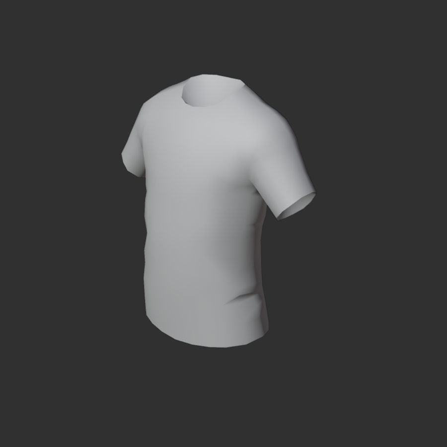
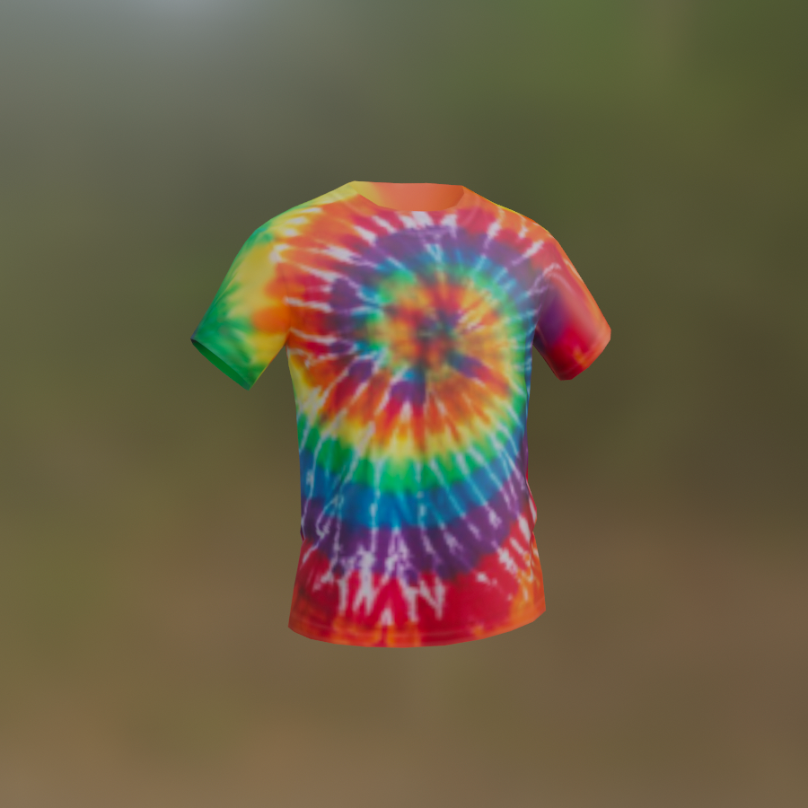
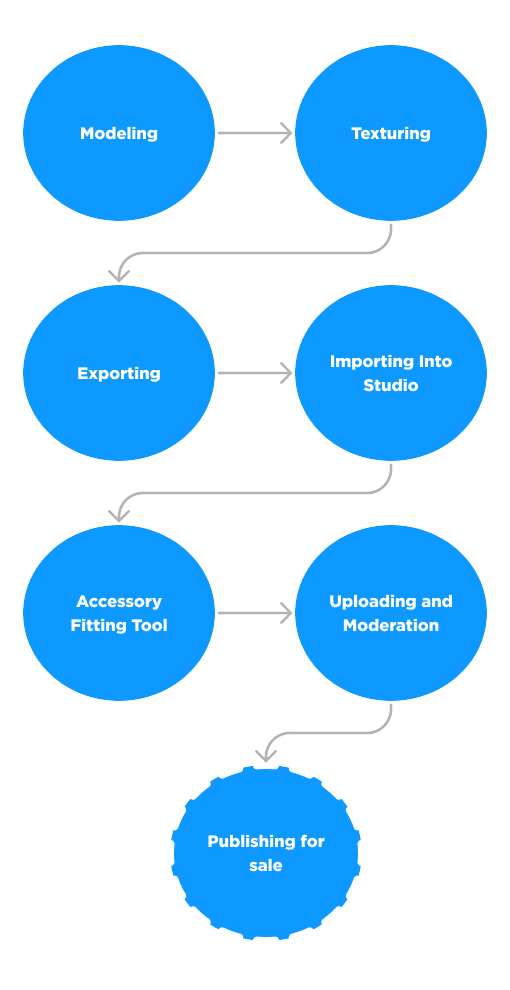
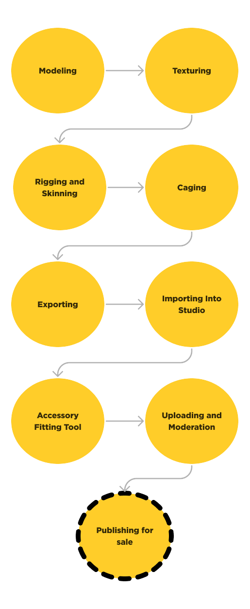

# Rigid Accessories

## 목차
- [Rigid Accessories](#rigid-accessories)
  - [목차](#목차)
  - [리짓 액세서리의 구성 요소](#리짓-액세서리의-구성-요소)
    - [메시 파트](#메시-파트)
    - [텍스처](#텍스처)
    - [부착점](#부착점)
  - [제작 과정](#제작-과정)
  - [리소스](#리소스)
  - [출처](#출처)
  - [다음](#다음)

---

리짓 액세서리는 프로프, 무기, 모자 등 아바타 캐릭터에 착용할 수 있는 가장 기본적인 3D 화장품 아이템입니다. 캐릭터 몸 위에 늘어나고 맞춰지는 의상 액세서리와 달리, 리짓 액세서리는 아바타 캐릭터의 특정 지점에 부착되며 변형되거나 대상 위에 감싸지 않습니다.

자신의 경험을 위해 또는 마켓플레이스에서 판매할 커스텀 Roblox 액세서리를 만들려면 다음을 시작하는 것이 중요합니다:

- [Blender](https://www.blender.org/) 또는 [Maya](https://www.autodesk.com/products/maya/overview)와 같은 3D 모델링 도구에 대한 기본 배경 지식.
- 리짓 액세서리를 구성하는 구성 요소에 대한 이해.
- 일반적인 액세서리 제작 과정에 대한 이해.
- Roblox의 공식 튜토리얼을 검토하여 자신의 액세서리를 만드세요:
  - [리짓 액세서리 제작 튜토리얼](https://create.roblox.com/docs/art/accessories#components-of-a-rigid-accessory) - 3D 모델을 리짓 액세서리로 변환하고 마켓플레이스에 게시하는 데 필요한 각 프로세스를 다룹니다.
  - [의상 제작 튜토리얼](https://create.roblox.com/docs/art/accessories/creating) - Blender에서 처음부터 아바타 준비된 의상을 만드는 단계별 과정.
- Roblox에서 제공하는 [추가 도구, 리소스 및 가이드](https://create.roblox.com/docs/art/accessories#resources)를 검토하여 제작 과정을 표준화하고 가속화하십시오.

## 리짓 액세서리의 구성 요소

모든 액세서리 모델은 [메시 객체](#메시-파트), [텍스처](#텍스처), 및 [부착점](#부착점)의 동일한 기본 구성 요소로 구성됩니다.

[액세서리 만들기](#제작-과정)에서는 대부분의 구성 요소가 모델링 소프트웨어에서 먼저 생성된 다음 가져오기 시 적절한 Roblox Studio 인스턴스로 변환됩니다.

### 메시 파트

<!-- <GridContainer numColumns="2">
<figure><figcaption>활 리짓 액세서리 메시 객체</figcaption></figure>

<figure>  <figcaption>티셔츠 레이어드 의상 메시 객체</figcaption></figure>
</GridContainer> -->

|활 리짓 액세서리 메시 객체|티셔츠 레이어드 의상 메시 객체|
|---|---|
|||

티셔츠와 같은 의상은 3D 객체에 레이어 효과를 적용하기 위해 [추가 의상 구성 요소](https://create.roblox.com/docs/art/accessories/layered-clothing)가 필요합니다.

모든 액세서리는 액세서리 객체의 기하학을 나타내는 단일 메시 객체가 필요합니다. Studio에서 이 메시 객체는 단일 `Model` 아래에 중첩된 `MeshPart`로 나타납니다.

### 텍스처

<!-- <GridContainer numColumns="2">
  <figure>  <figcaption>티셔츠 모델의 2D 텍스처 맵</figcaption></figure>

  <figure><figcaption>텍스처가 적용된 티셔츠 모델</figcaption></figure>
</GridContainer> -->

|티셔츠 모델의 2D 텍스처 맵|텍스처가 적용된 티셔츠 모델|
|---|---|
|||

텍스처는 3D 객체의 표면 외관을 정의하는 2D 이미지 파일입니다. 텍스처는 텍스처 페인팅 프로그램이나 3D 모델링 소프트웨어 내에서 만들 수 있습니다.

Studio에서 텍스처 이미지는 이미지 자산으로 가져오며 `SurfaceAppearance` 객체의 자식 또는 `MeshPart.TextureID` 속성으로 `MeshPart` 객체에 설정됩니다.

### 부착점

<GridContainer numColumns="2">
  <figure>  <figcaption>부착 지오메트리는 부착점이 캐릭터와 연결되는 위치를 정의합니다</figcaption></figure>

  <figure><figcaption>"_Att" 접미사가 있는 지오메트리는 Studio에서 자동으로 `Class.Attachment` 객체로 변환됩니다</figcaption></figure>
</GridContainer>

부착점은 액세서리가 캐릭터의 몸에 부착되는 위치를 정의합니다. Studio에서 부착점은 `Attachment` 객체로 나타납니다.

## 제작 과정

커스텀 액세서리는 `.fbx` 또는 `.gltf` 모델을 Studio로 가져오기 전에 [Blender](https://www.blender.org/) 또는 [Maya](https://www.autodesk.com/products/maya/overview)와 같은 3D 모델링 프로그램에서 처음 생성됩니다.
첫 아바타 자산 생성을 시작하려면 [아바타 튜토리얼](https://create.roblox.com/docs/avatar/tutorials)을 참조하십시오.

제작하는 자산의 유형에 따라 제작 과정은 다음과 같은 고급 워크플로우를 따릅니다:

<!-- <GridContainer numColumns="2">

  <figure>  <figcaption>
리짓 액세서리 워크플로우
</figcaption></figure>

  <figure><figcaption>
레이어드 액세서리 워크플로우
</figcaption></figure>
</GridContainer> -->

|리짓 액세서리 워크플로우|레이어드 액세서리 워크플로우|
|---|---|
|||

<Alert severity = 'info'>
3D 생성은 항상 반복과 테스트를 요구하는 비선형 과정이기 때문에 액세서리 생성 과정은 개인과 다양한 제작 워크플로우에 따라 다를 수 있습니다.
</Alert>

## 리소스

액세서리 제작을 시작하기 위해 모든 배경의 제작자에게 다양한 리소스가 제공됩니다.

특정 아바타 생성 주제에 관심이 있는 경우, 다음 표를 사용하여 필요에 가장 적합한 가이드 및 리소스를 찾으십시오:
[resources](https://create.roblox.com/docs/art/accessories#resources)

---
## 출처
 - [Rigid Accessories](https://create.roblox.com/docs/art/accessories)

---
## [다음](./00_01_Layered_Clothing.md)