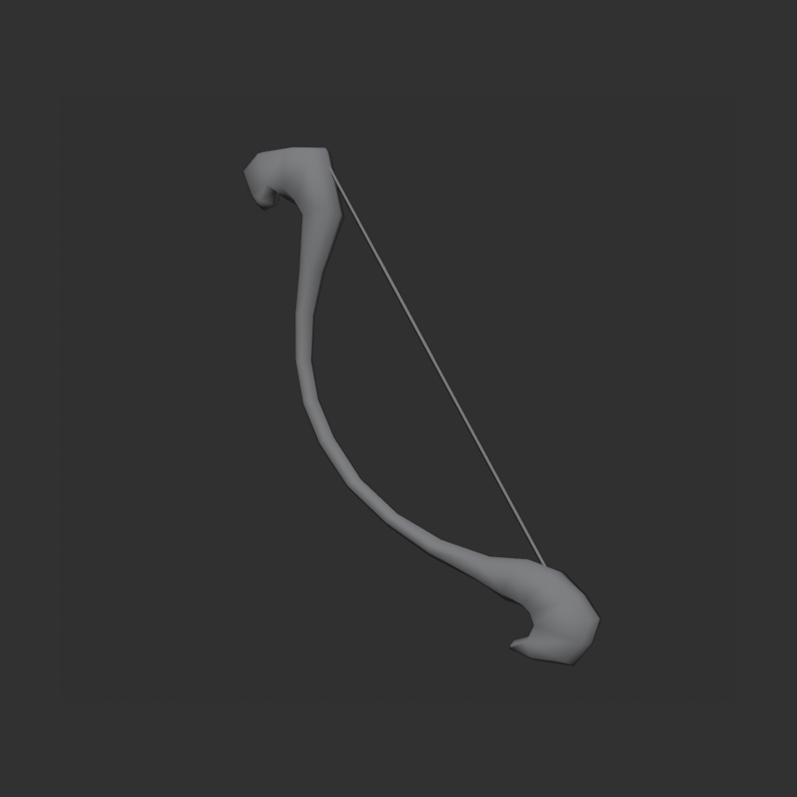
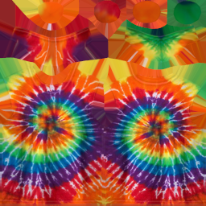
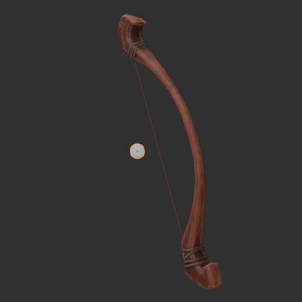
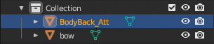
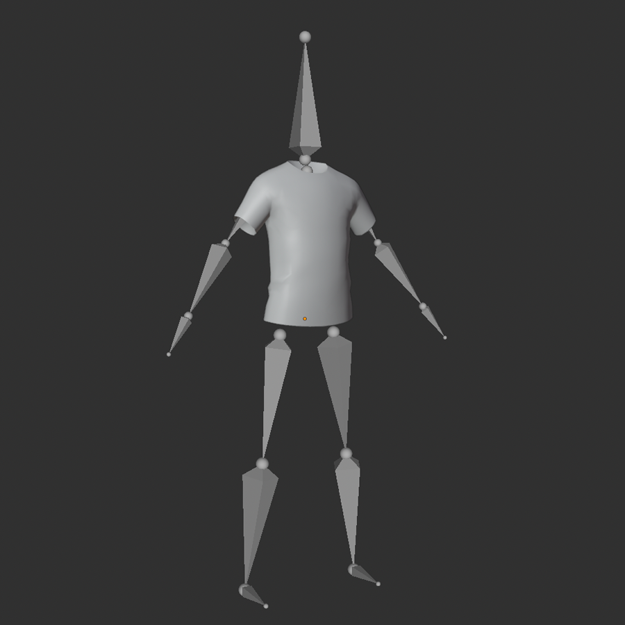
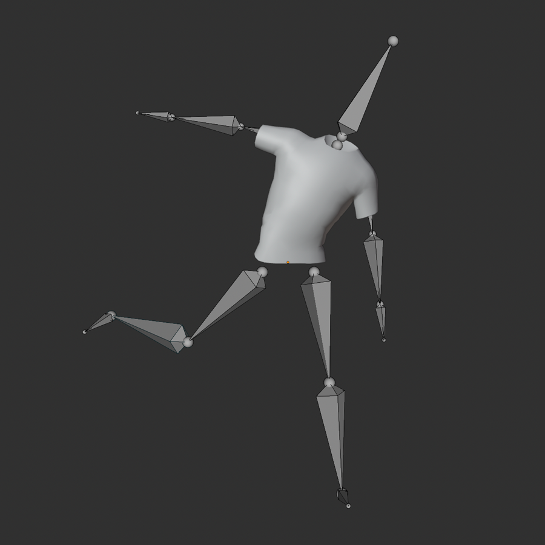
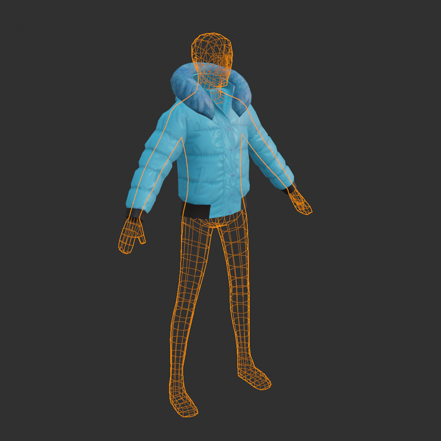
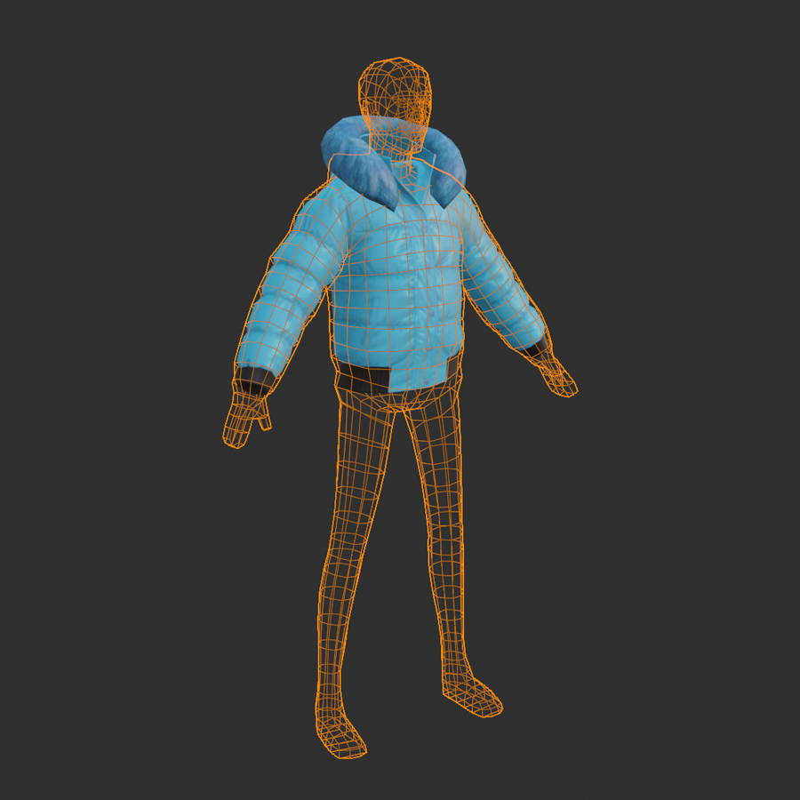
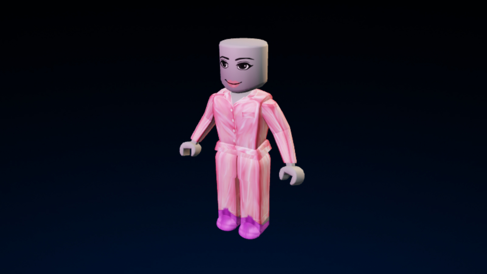

# Layered Clothing

## 목차
- [Layered Clothing](#layered-clothing)
  - [목차](#목차)
  - [레이어드 의상 액세서리의 구성 요소](#레이어드-의상-액세서리의-구성-요소)
    - [메시 파트](#메시-파트)
    - [텍스처](#텍스처)
    - [부착점](#부착점)
    - [리깅 아머처](#리깅-아머처)
    - [내부 및 외부 케이지](#내부-및-외부-케이지)
  - [제작 과정](#제작-과정)
  - [리소스](#리소스)
  - [클래식 의상](#클래식-의상)
  - [출처](#출처)
  - [다음](#다음)

---

  

레이어드 의상 액세서리는 바지, 티셔츠, 재킷, 드레스 등 사용자 아바타에 착용할 수 있는 3D 화장품 아이템입니다. 캐릭터의 특정 지점에만 부착되는 [리짓 액세서리](./00_00_Rigid_Accessories.md)와 달리, 레이어드 의상은 모든 체형과 기존 의상에 맞춰 늘어나고 착용됩니다.

자신의 경험을 위해 또는 마켓플레이스에서 판매할 커스텀 Roblox 액세서리를 만들려면 다음을 시작하는 것이 중요합니다:

- [Blender](https://www.blender.org/) 또는 [Maya](https://www.autodesk.com/products/maya/overview)와 같은 3D 모델링 도구에 대한 일반적인 배경 지식.
- [레이어드 액세서리를 구성하는 구성 요소](#레이어드-의상-액세서리의-구성-요소)에 대한 이해.
- 일반적인 [의상 제작 과정](#제작-과정)에 대한 이해.
- Roblox의 공식 튜토리얼을 검토하여 자신의 액세서리를 만드세요:
  - [리짓 액세서리 제작 튜토리얼](./03_00_Rigid_Accessories.md) - 3D 모델을 리짓 액세서리로 변환하고 마켓플레이스에 게시하는 데 필요한 각 프로세스를 다룹니다.
  - [의상 제작 튜토리얼](./04_00_Basic_Clothing_Creation.md) - Blender에서 처음부터 아바타 준비된 의상을 만드는 단계별 과정.
- Roblox에서 제공하는 [추가 도구, 리소스 및 가이드](#리소스)를 검토하여 제작 과정을 표준화하고 가속화하십시오.

Roblox는 또한 캐릭터의 표면에 적용할 수 있는 2D 이미지인 [클래식 의상](#클래식-의상)을 지원합니다.

## 레이어드 의상 액세서리의 구성 요소

모든 액세서리 모델은 [메시 객체](#메시-파트), [텍스처](#텍스처), 및 [부착점](#부착점)의 동일한 기본 구성 요소로 구성됩니다. 레이어드 의상은 대상 캐릭터와 기존 의상 아이템에 맞춰 늘어나고 겹쳐질 수 있도록 [포즈 가능한 리그](#리깅-아머처) 및 [내부 및 외부 케이지](#내부-및-외부-케이지)와 같은 추가 구성 요소가 필요합니다.

[액세서리 만들기](#제작-과정)에서는 모든 구성 요소가 모델링 소프트웨어에서 먼저 생성된 다음 가져오기 시 적절한 Roblox Studio 인스턴스로 변환됩니다.

### 메시 파트

|티셔츠 의상 메시 객체|활 액세서리 메시 객체|
|---|---|
|||

<Alert severity = 'warning'>
활과 같은 간단한 액세서리는 대상 위에 맞춰 늘어나고 착용될 수 있도록 리깅 및 케이지 구성 요소가 필요하지 않은 리짓 액세서리입니다.
</Alert>

모든 액세서리는 액세서리 객체의 기하학을 나타내는 단일 메시 객체가 필요합니다. Studio에서 이 메시 객체는 단일 `Model` 아래에 중첩된 `MeshPart`로 나타납니다.

### 텍스처

<!-- <GridContainer numColumns="2">
  <figure>  <figcaption>티셔츠 모델의 2D 텍스처 맵</figcaption></figure>

  <figure><figcaption>텍스처가 적용된 티셔츠 모델</figcaption></figure>
</GridContainer> -->

|티셔츠 모델의 2D 텍스처 맵|텍스처가 적용된 티셔츠 모델|
|---|---|
|||

텍스처는 액세서리의 표면 외관을 정의하는 이미지 파일입니다. 텍스처는 텍스처 페인팅 프로그램이나 3D 모델링 소프트웨어 내에서 만들 수 있습니다. Studio에서 텍스처 이미지는 이미지 자산으로 가져오며 `SurfaceAppearance` 객체의 자식 또는 `MeshPart.TextureID` 속성으로 `MeshPart` 객체에 설정됩니다.

### 부착점

<GridContainer numColumns="2">
  <figure>  <figcaption>부착 지오메트리는 부착점이 캐릭터와 연결되는 위치를 정의합니다</figcaption></figure>

  <figure><figcaption>"_Att" 접미사가 있는 지오메트리는 Studio에서 자동으로 `Class.Attachment` 객체로 변환됩니다</figcaption></figure>
</GridContainer>

레이어드 의상의 경우, 부착 지점은 몸이 래그돌이 되거나 분리될 때 올바른 신체 부위와 연결되는 데 사용됩니다. Studio에서 부착점은 `Attachment` 객체로 나타납니다.

의상 아이템의 부착점은 `액세서리 피팅 도구`를 사용하여 Studio에서 자동으로 생성됩니다.

### 리깅 아머처

<!-- <GridContainer numColumns="2">
  <figure>  <figcaption>의상 아이템의 자연스러운 움직임을 보장하려면 캐릭터 리그에 가중치를 부여해야 합니다</figcaption></figure>

  <figure><figcaption>리그가 올바르게 설정되면 레이어드 모델이 캐릭터 리그와 함께 움직이고 구부러질 수 있습니다</figcaption></figure>
</GridContainer> -->

|||
|---|---|
|의상 아이템의 자연스러운 움직임을 보장하려면 캐릭터 리그에 가중치를 부여해야 합니다|리그가 올바르게 설정되면 레이어드 모델이 캐릭터 리그와 함께 움직이고 구부러질 수 있습니다|

리깅 아머처는 레이어드 자산이 캐릭터 모델과 함께 움직일 수 있는 방법을 정의합니다. 리깅 및 스키닝 기술을 사용하여 셔츠 소매가 팔꿈치와 어깨의 움직임을 정확히 따르도록 하는 등 의상의 특정 부위가 캐릭터 모델의 관절과 자연스럽게 움직이도록 설정할 수 있습니다. Studio에서는 이 리깅 및 스키닝 데이터가 메시 기하학에 저장됩니다.

### 내부 및 외부 케이지

<!-- <GridContainer numColumns="2">
  <figure>  <figcaption>내부 케이지는 의상 아이템의 내부 표면을 정의하여 옷이 어떻게 몸에 맞춰 늘어나는지 정의합니다</figcaption></figure>

  <figure><figcaption>외부 케이지는 의상 아이템의 외부 표면을 정의하여 추가 의상이 어떻게 겹쳐질 수 있는지 정의합니다</figcaption></figure>
</GridContainer> -->

|||
|---|---|
|내부 케이지는 의상 아이템의 내부 표면을 정의하여 옷이 어떻게 몸에 맞춰 늘어나는지 정의합니다|외부 케이지는 의상 아이템의 외부 표면을 정의하여 추가 의상이 어떻게 겹쳐질 수 있는지 정의합니다|

케이지 메시는 레이어드 액세서리의 내부 및 외부 표면을 나타냅니다. 티셔츠의 내부 케이지는 티셔츠가 캐릭터 몸에 맞춰 어떻게 늘어나는지를 정의합니다. 티셔츠의 외부 케이지는 추가 레이어드 의상이 티셔츠에 어떻게 맞춰지는지를 정의합니다. Studio에서 이러한 케이지는 `WrapLayer` 객체로 나타납니다.

## 제작 과정

커스텀 액세서리는 `.fbx` 또는 `.gltf` 모델을 Studio로 가져오기 전에 [Blender](https://www.blender.org/) 또는 [Maya](https://www.autodesk.com/products/maya/overview)와 같은 3D 모델링 프로그램에서 처음 생성됩니다.
첫 아바타 자산 생성을 시작하려면 [아바타 튜토리얼](./05_00_Creating_with_Templates.md)을 참조하십시오.

제작하는 자산의 유형에 따라 제작 과정은 다음과 같은 고급 워크플로우를 따릅니다:

<!-- <GridContainer numColumns="2">
  <figure><figcaption>
레이어드 액세서리 워크플로우
</figcaption> </figure>  
  
  <figure>  <figcaption>
리짓 액세서리 워크플로우
</figcaption> </figure>

</GridContainer> -->

|레이어드 액세서리 워크플로우|리짓 액세서리 워크플로우|
|---|---|
|||

<Alert severity = 'info'>
3D 생성은 항상 반복과 테스트를 요구하는 비선형 과정이기 때문에 액세서리 생성 과정은 개인과 다양한 제작 워크플로우에 따라 다를 수 있습니다.
</Alert>

## 리소스

액세서리 제작을 시작하기위해 모든 배경의 제작자가 사용할 수 있는 다양한 리소스가 있습니다.

특정 아바타 제작 주제에 관심이 있다면 다음 표를 사용하여 필요에 가장 잘 맞는 가이드 및 리소스를 찾으십시오:
[resources](https://create.roblox.com/docs/art/accessories/layered-clothing#resources)

## 클래식 의상

클래식 의상 자산은 티셔츠, 셔츠 또는 바지로 아바타 몸의 표면에 적용할 수 있는 2D 이미지입니다. 이러한 자산을 이미지 처리 소프트웨어에서 디자인하고, Studio에서 텍스처를 테스트한 다음, 마켓플레이스에 업로드하여 판매할 수 있습니다. 이러한 자산을 만들고, 업로드하고, 판매하는 방법에 대한 자세한 내용은 [클래식 의상](https://create.roblox.com/docs/art/accessories/classic-clothing)을 참조하십시오.

---
## 출처
 - [Layered Clothing](https://create.roblox.com/docs/art/accessories/layered-clothing)

---
## [다음](./00_02_Avatar_Characters.md)