# Avatar Characters

## 목차
- [Avatar Characters](#avatar-characters)
  - [목차](#목차)
  - [아바타의 구성 요소](#아바타의-구성-요소)
    - [신체 부위](#신체-부위)
    - [텍스처](#텍스처)
    - [리깅 아머처](#리깅-아머처)
    - [얼굴 애니메이션 데이터](#얼굴-애니메이션-데이터)
    - [케이지 메쉬](#케이지-메쉬)
    - [부착 지점](#부착-지점)
  - [생성 과정](#생성-과정)
  - [리소스](#리소스)
  - [출처](#출처)
  - [다음](#다음)

---

<a href="https://www.youtube-nocookie.com/embed/2My8jE47clI">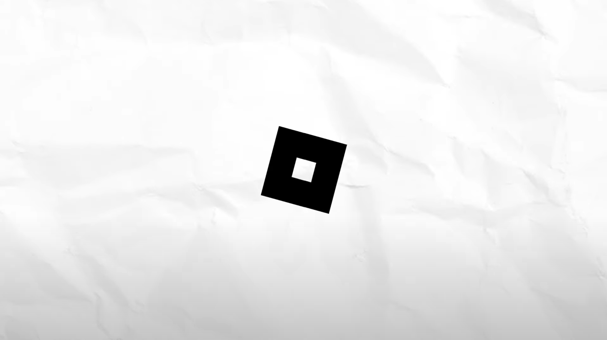</a>

  

모든 Roblox 사용자는 **아바타**라는 커스터마이징 가능한 캐릭터로 표현됩니다. 아바타는 사용자가 세상과 상호작용하고 마켓플레이스에서 다양한 의상과 액세서리로 자신을 꾸밀 수 있는 많은 특수 기능을 가진 캐릭터 모델입니다.

커스텀 아바타는 [Blender](https://www.blender.org/) 또는 [Maya](https://www.autodesk.com/products/maya/overview)와 같은 3D 모델링 프로그램에서 처음 생성된 후 Studio로 가져옵니다. 자신의 경험을 위해 커스텀 Roblox 아바타 캐릭터를 만들려면 다음과 같은 사항으로 시작하는 것이 중요합니다:

- [Blender](https://www.blender.org/) 또는 [Maya](https://www.autodesk.com/products/maya/overview)와 같은 3D 모델링 도구에 대한 고급 배경 지식.
- [아바타 캐릭터를 구성하는 구성 요소](#아바타의-구성-요소)에 대한 이해.
- 일반적인 [캐릭터 생성 과정](#생성-과정)에 대한 이해.
- Roblox의 템플릿을 사용하여 첫 번째 아바타 캐릭터를 만드는 데 필요한 [기본 캐릭터 생성 튜토리얼](./05_00_Creating_with_Templates.md)을 검토하세요.
- 제작 과정을 표준화하고 가속화하는 데 도움이 되는 [다양한 도구, 리소스 및 가이드](#리소스).

## 아바타의 구성 요소

모든 아바타 캐릭터 모델은 사용자가 세상과 상호작용하고 자신을 꾸밀 수 있는 기능과 유연성을 제공하는 몇 가지 기본 구성 요소로 구성됩니다. 이러한 구성 요소 중 많은 부분은 사용자에게 보이지 않지만, 소셜 및 환경적 상호작용을 강화하는 강력한 아바타 기능을 가능하게 합니다. 아바타 캐릭터를 만들 때, 이러한 모든 구성 요소는 일반적으로 모델링 소프트웨어에서 먼저 생성된 후 가져오기 시 적절한 Roblox Studio 인스턴스로 변환됩니다.

각 아바타 캐릭터는 다음과 같은 렌더링 및 비렌더링 구성 요소로 구성됩니다:

<!-- <Tabs>
  <TabItem label="렌더링됨">
<GridContainer numColumns="2">
  <figure>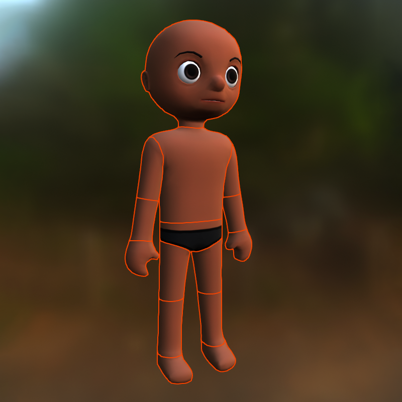  <figcaption>캐릭터 모델의 물리적 측면을 구성하는 15개의 신체 부위 메시</figcaption></figure>

  <figure>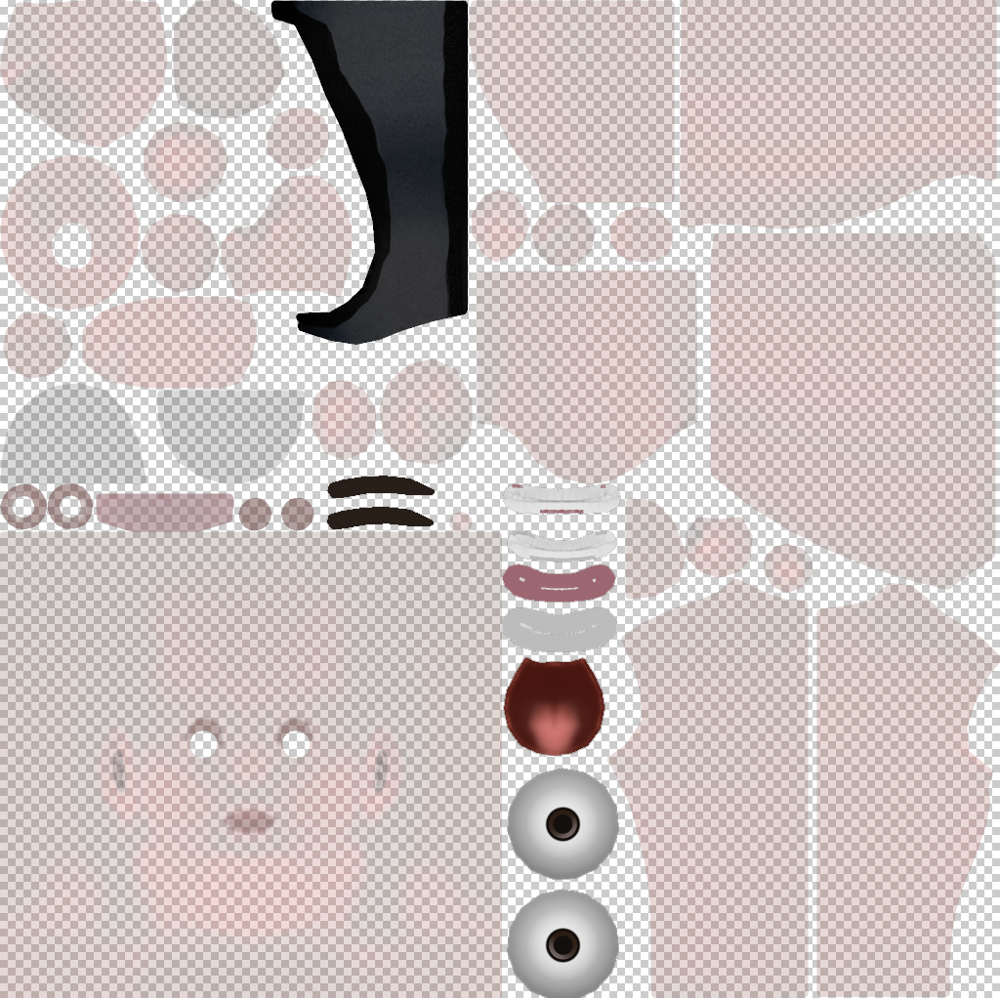<figcaption>텍스처 이미지 맵은 표면 색상과 외관을 적용합니다. 투명도는 사용자 정의 피부색과 같은 기본 파트 색상을 노출할 수 있습니다.</figcaption></figure>
  
</GridContainer>
  </TabItem>
  <TabItem label="비렌더링됨">
<GridContainer numColumns="2">
  <figure>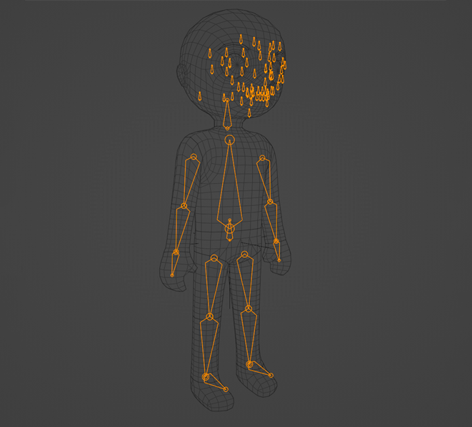  <figcaption>리깅 아머처는 신체 부위가 서로 제대로 연결되도록 하여 움직임, 표정 및 애니메이션을 구동합니다</figcaption></figure>

  <figure>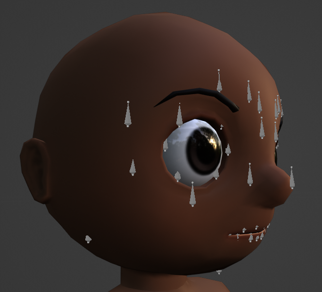 <figcaption>얼굴 애니메이션 데이터는 아바타가 채팅 및 소셜 활동을 위한 다양한 표정을 표현할 수 있게 합니다</figcaption></figure>
</GridContainer>
<GridContainer numColumns="2">
  <figure>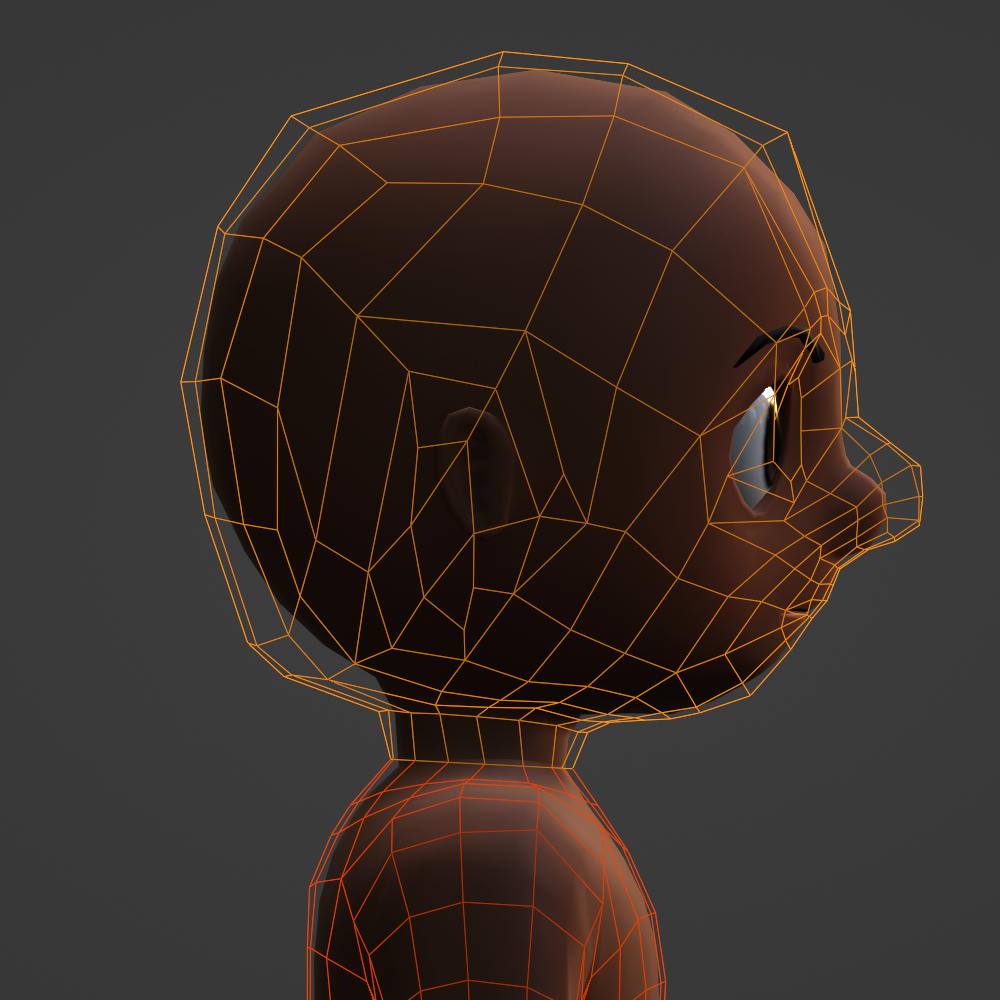  <figcaption>케이지 메시는 캐릭터의 외부 경계를 설정하여 의상 및 기타 레이어 가능한 아이템이 덮고 늘어날 수 있는 표면을 정의합니다.</figcaption></figure>

  <figure>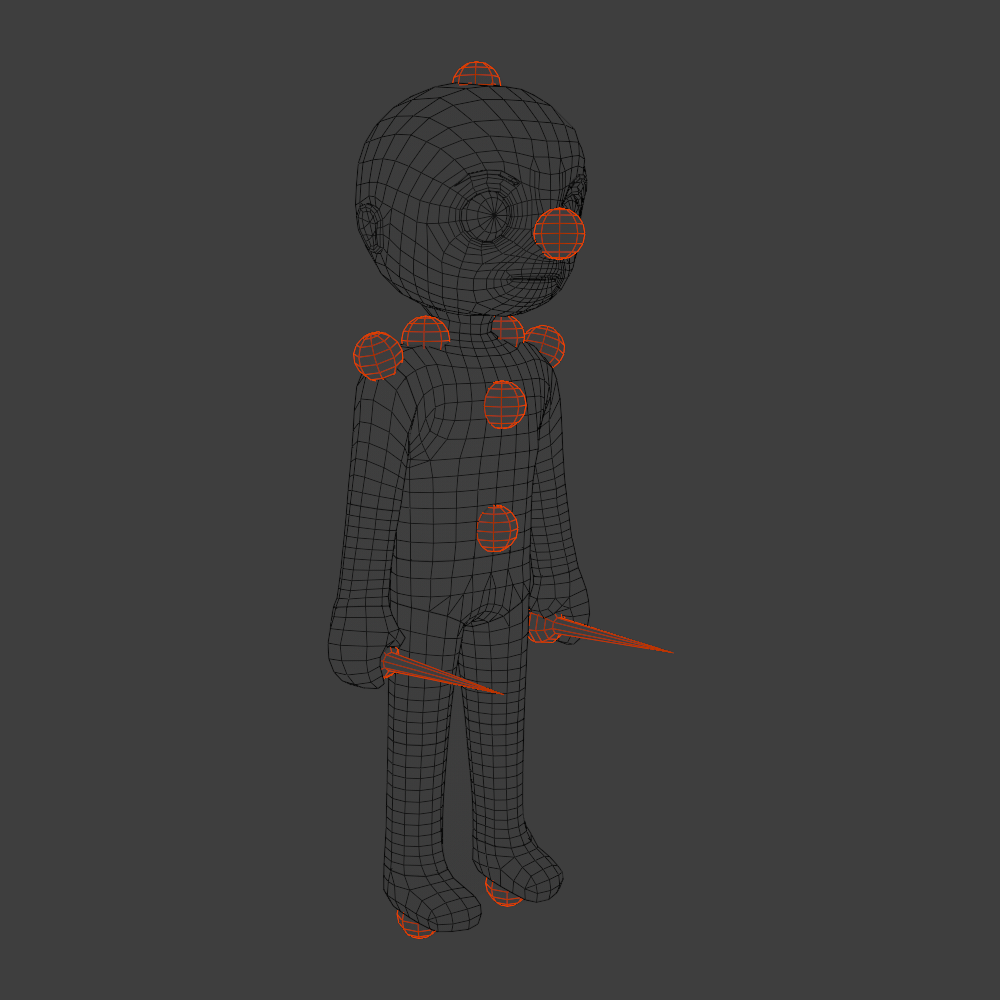  <figcaption>부착 지점은 리짓 액세서리가 캐릭터에 부착되는 위치를 정의합니다</figcaption></figure>

</GridContainer>
  </TabItem>
</Tabs> -->

**렌더링됨**

|<figure>  </figure>|<figure></figure>|
|---|---|
|<figcaption>캐릭터 모델의 물리적 측면을 구성하는 15개의 신체 부위 메시</figcaption>|<figcaption>텍스처 이미지 맵은 표면 색상과 외관을 적용합니다. 투명도는 사용자 정의 피부색과 같은 기본 파트 색상을 노출할 수 있습니다.</figcaption>|

**비렌더링됨**

|<figure>  <figcaption>리깅 아머처는 신체 부위가 서로 제대로 연결되도록 하여 움직임, 표정 및 애니메이션을 구동합니다</figcaption></figure>|<figure> <figcaption>얼굴 애니메이션 데이터는 아바타가 채팅 및 소셜 활동을 위한 다양한 표정을 표현할 수 있게 합니다</figcaption></figure>|
|---|---|
|<figure>  <figcaption>케이지 메시는 캐릭터의 외부 경계를 설정하여 의상 및 기타 레이어 가능한 아이템이 덮고 늘어날 수 있는 표면을 정의합니다.</figcaption></figure>|<figure>  <figcaption>부착 지점은 리짓 액세서리가 캐릭터에 부착되는 위치를 정의합니다</figcaption></figure>|

### 신체 부위

<GridContainer numColumns="2">
  <figure>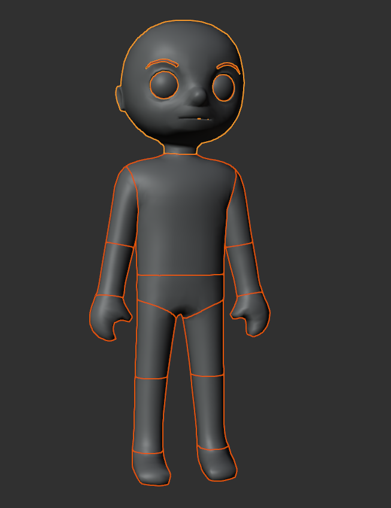  <figcaption>각 아바타 캐릭터는 15개의 개별 메시 객체로 구성됩니다</figcaption></figure>

  <figure>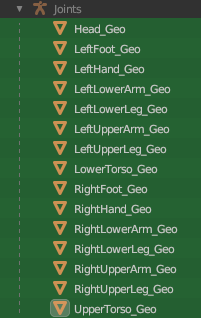<figcaption>이 메시들은 표준 명명 규칙을 따라야 합니다</figcaption></figure>
</GridContainer>

Roblox 아바타 캐릭터는 15개의 신체 부위로 구성되며, 이는 아바타 캐릭터의 모양과 윤곽을 정의하는 기하학적 형태입니다. Studio에서는 이러한 기하학적 형태가 `MeshPart` 객체로 나타나며 단일 `Model` 아래에 중첩됩니다.

### 텍스처

<!-- <GridContainer numColumns="2">
  <figure>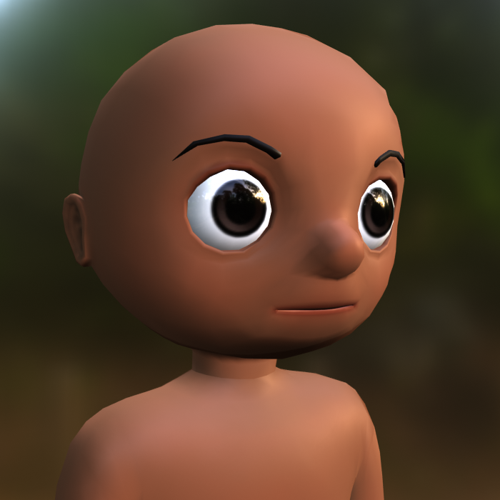  <figcaption>텍스처는 캐릭터 모델에 색상과 표면 세부 사항을 적용합니다.</figcaption></figure>

  <figure>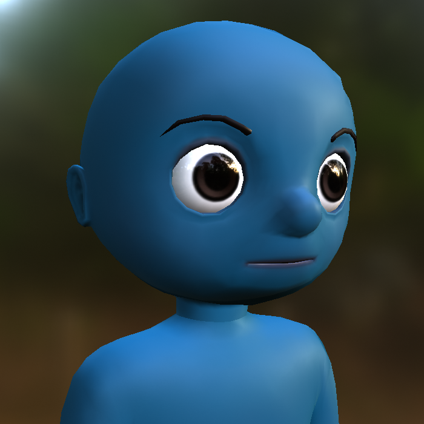<figcaption>텍스처 이미지 맵의 불투명도는 `Class.MeshPart.Color`와 결합하여 캐릭터에 사용자 정의 피부색을 적용할 수 있습니다.</figcaption></figure>
</GridContainer> -->

|||
|---|---|
|텍스처는 캐릭터 모델에 색상과 표면 세부 사항을 적용합니다.|텍스처 이미지 맵의 불투명도는 `MeshPart.Color`와 결합하여 캐릭터에 사용자 정의 피부색을 적용할 수 있습니다.|

텍스처는 캐릭터의 표면 외관을 정의하는 이미지 파일입니다. 텍스처는 텍스처 페인팅 프로그램이나 3D 모델링 소프트웨어를 사용하여 만들 수 있습니다. Studio에서는 텍스처를 이미지 파일로 가져와 `SurfaceAppearance` 인스턴스를 통해 액세스하거나 `MeshPart.TextureID` 속성으로 설정해야 합니다.

<Alert severity = 'warning'>
캐릭터 모델의 신체 부위를 텍스처링할 때, 캐릭터 모델에 민감한 부위에 대한 최소한의 레이어가 포함되어 있는지 확인하십시오. Roblox 정책에 대한 자세한 내용은 [커뮤니티 기준](https://en.help.roblox.com/hc/en-us/articles/203313410#safety)을 참조하십시오.
</Alert>

### 리깅 아머처

<GridContainer numColumns="2">
  <figure>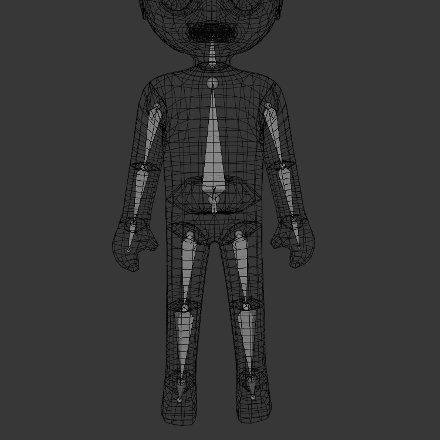  <figcaption>아머처는 신체 부위 기하학마다 1개의 뼈와 루트 뼈로 구성됩니다</figcaption></figure>

  <figure>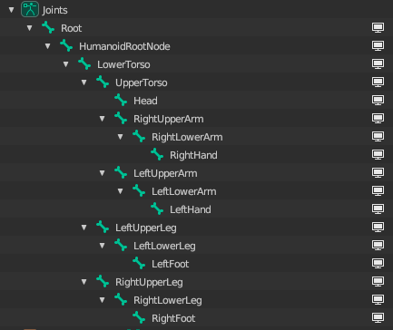<figcaption>뼈는 특정 계층 구조와 명명 규칙을 따라야 합니다</figcaption></figure>  
</GridContainer>

아머처는 각 캐릭터가 사지를 움직이고 환경을 자연스럽게 이동할 수 있게 합니다. 종종 뼈나 관절로 불리는 이 리깅 캐릭터 정보에는 무릎이나 팔꿈치와 같은 연결된 사지가 유기적으로 구부러질 수 있도록 하는 스키닝 데이터가 포함됩니다. Studio에서는 캐릭터 아머처의 각 뼈가 `Class.Bone` 객체로 나타나며 캐릭터 `Class.MeshPart` 객체를 연결합니다.

### 얼굴 애니메이션 데이터

<GridContainer numColumns="2">
  <figure>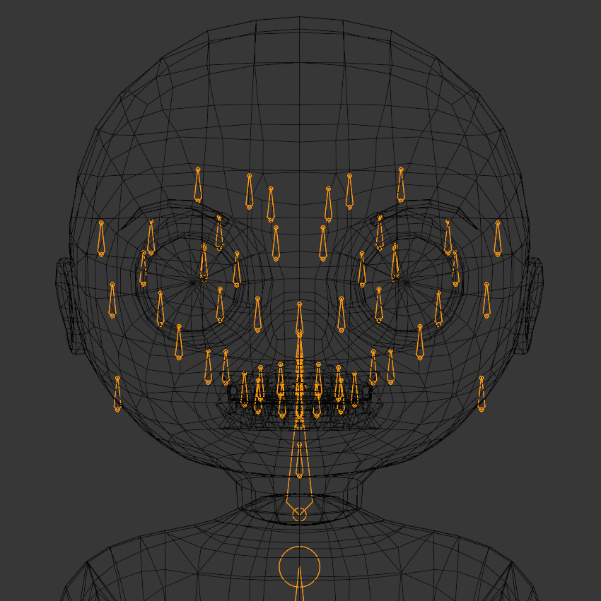  <figcaption>각 아바타 캐릭터 얼굴은 다양한 표정을 만들기 위해 리깅되고 스키닝됩니다</figcaption></figure>
  
 <figure>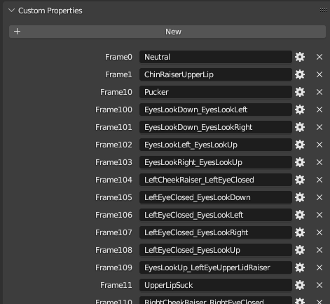<figcaption>각 포즈는 Head_Geo 객체의 Custom Properties (Maya의 Extra Attributes)에 포즈 이름으로 매핑됩니다</figcaption></figure>
</GridContainer>

<figure>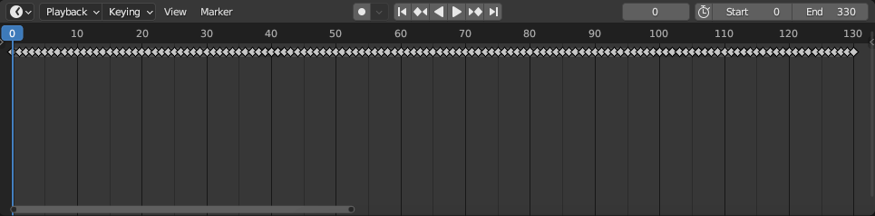<figcaption>각 필수 얼굴 포즈는 애니메이션 타임라인에 키프레임으로 저장됩니다.</figcaption></figure>

얼굴 애니메이션 데이터는 각 캐릭터가 글로벌 얼굴 표정을 사용할 수 있게 합니다. 각 캐릭터에는 얼굴 뼈와 스키닝, 애니메이션 타임라인 데이터 및 매핑된 포즈 데이터가 포함되어 있습니다. Studio에서는 이러한 얼굴 애니메이션 요소가 `Class.FaceControls` 인스턴스로 나타납니다.

### 케이지 메쉬

<GridContainer numColumns="2">
  <figure>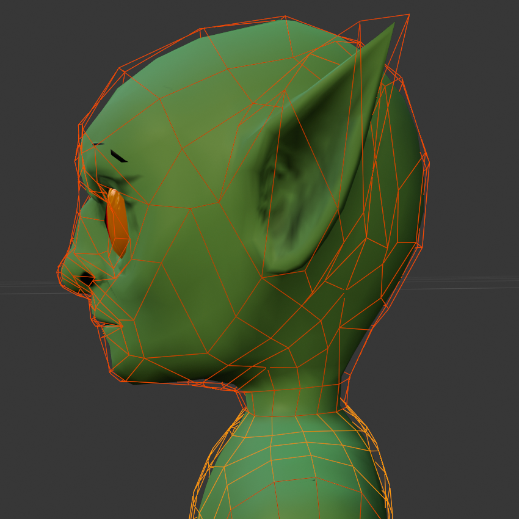  <figcaption>헤드 및 상반신 케이지 메시 객체 (와이어프레임)</figcaption></figure>

  <figure>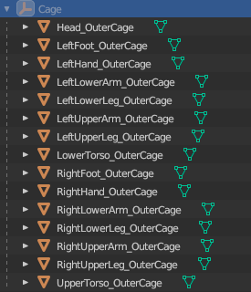<

figcaption>각 신체 부위에는 케이지 객체가 존재해야 합니다</figcaption></figure>
</GridContainer>

이 외부 케이지는 의상과 같은 레이어 가능한 액세서리가 몸 위로 늘어나고 맞추어질 수 있는 보이지 않는 표면을 설정합니다. 이러한 케이지 메시들은 다양한 모양과 크기의 모델에 옷이 맞을 수 있게 하여 옷 아이템을 다시 모델링할 필요가 없습니다. Studio에서는 외부 케이지 메시 객체가 `Class.WrapTarget` 인스턴스로 나타납니다.

자체 비템플릿 캐릭터 모델을 케이지하는 경우, Roblox의 신체 케이지 프로젝트 파일 중 하나를 사용하여 Roblox 표준 케이지 메시를 사용하는 것이 중요합니다. 이 표준 메시에서 정점 제거 또는 추가는 의상 맞춤 및 가져오기 문제를 일으킬 수 있습니다.

### 부착 지점

<GridContainer numColumns="2">
  <figure>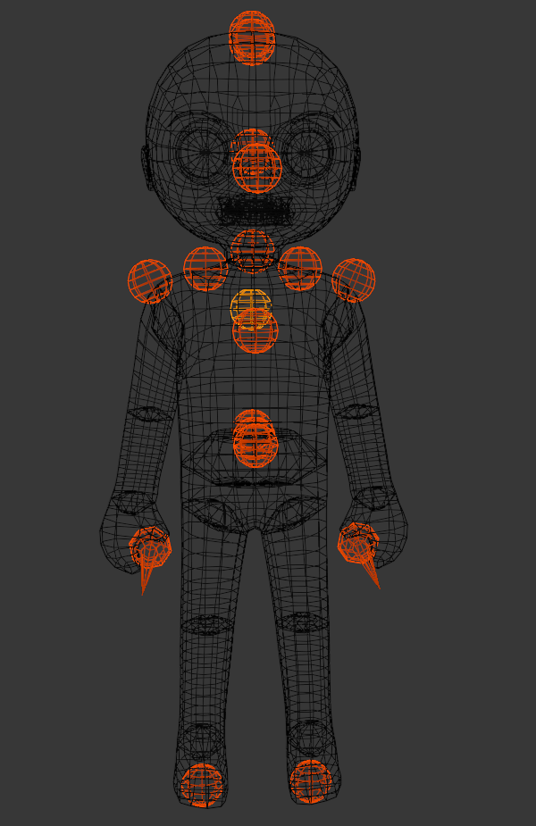  <figcaption>각 캐릭터에는 리짓 화장품을 착용하기 위한 일반적인 부착 지점이 있습니다</figcaption></figure>

  <figure>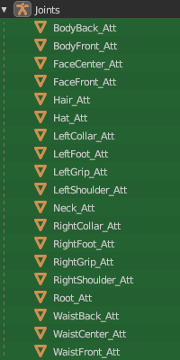<figcaption>각 아바타 캐릭터는 관련된 19개의 부착 지점을 포함해야 합니다</figcaption></figure>
</GridContainer>

부착 지점은 리짓 3D 액세서리와 장비가 캐릭터의 몸에 부착되는 위치를 정의합니다. 이는 최종 사용자에게 렌더링되지 않지만, 3D 모델링 소프트웨어에서 구형 기하학으로 나타나며, Studio로 가져오면 표준화된 이름을 사용하여 `Attachment` 인스턴스로 생성됩니다.

레이어드 의상을 착용할 때, 의상은 부착 지점에 직접 연결되지 않지만, 래그돌 및 분리 애니메이션 중 관련 부착 지점을 참조합니다.

## 생성 과정

아바타 모델을 디자인할 때, 모든 아바타 구성 요소를 단일 `.fbx` 또는 `.gltf`로 내보내어 Studio로 가져와야 합니다. 3D 생성은 항상 반복과 테스트를 필요로 하므로 아바타 캐릭터 모델을 만드는 과정은 개인과 다양한 생성 워크플로우에 따라 다를 수 있습니다.

일반적으로 생성 과정은 다음과 같은 전형적인 워크플로우를 따릅니다:

<!-- <GridContainer numColumns="2">
  <figure><figcaption>
템플릿을 사용한 기본 생성
</figcaption>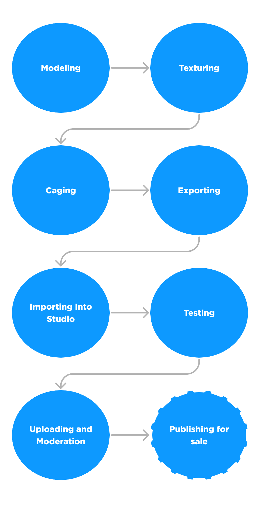<figcaption>필요한 모든 구성 요소를 포함하는 Roblox 템플릿 캐릭터를 맞춤화합니다. 가이드 및 지침은 [템플릿으로 생성](../characters/creating/index.md)을 참조하십시오.</figcaption></figure>

  <figure><figcaption>
스크래치에서의 고급 생성
</figcaption>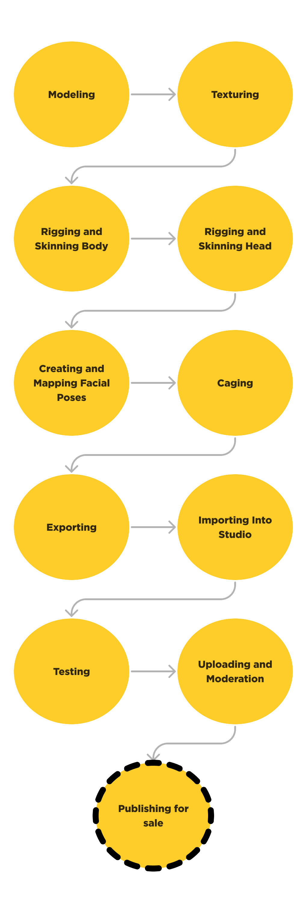<figcaption>아바타 캐릭터의 구성 요소를 완전히 맞춤화하여 스크래치에서 캐릭터를 만듭니다.</figcaption></figure>
</GridContainer> -->

|<figure><figcaption>
템플릿을 사용한 기본 생성
</figcaption><figcaption>필요한 모든 구성 요소를 포함하는 Roblox 템플릿 캐릭터를 맞춤화합니다. 가이드 및 지침은 [템플릿으로 생성](./05_00_Creating_with_Templates.md)을 참조하십시오.</figcaption></figure>|<figure><figcaption>
스크래치에서의 고급 생성
</figcaption><figcaption>아바타 캐릭터의 구성 요소를 완전히 맞춤화하여 스크래치에서 캐릭터를 만듭니다.</figcaption></figure>|
|---|---|

생성한 모든 자산이 관련 [마켓플레이스 정책](https://create.roblox.com/docs/art/marketplace/marketplace-policy) 및 [Roblox 커뮤니티 기준](https://en.help.roblox.com/hc/en-us/articles/203313410-Roblox-Community-Standards)을 준수하는지 확인하십시오.

## 리소스

모든 배경의 제작자가 캐릭터 제작을 시작할 수 있는 다양한 리소스가 있습니다.

특정 아바타 제작 주제에 관심이 있다면 다음 표를 사용하여 필요에 가장 잘 맞는 가이드 및 리소스를 찾으십시오:
[resources](https://create.roblox.com/docs/art/characters#resources)

---
## 출처
 - [Avatar Characters](https://create.roblox.com/docs/art/characters)

---
## [다음](./01_Blender_환경설정.md)