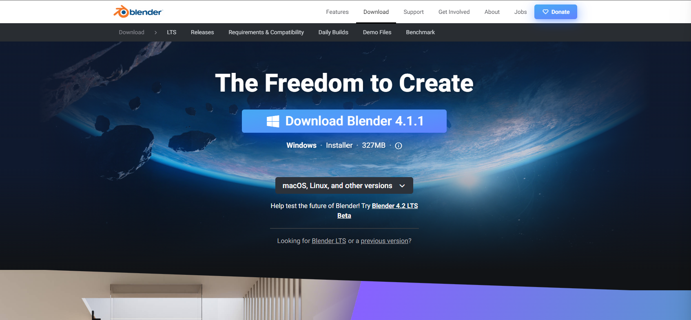
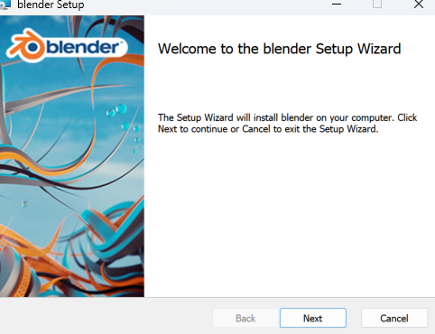
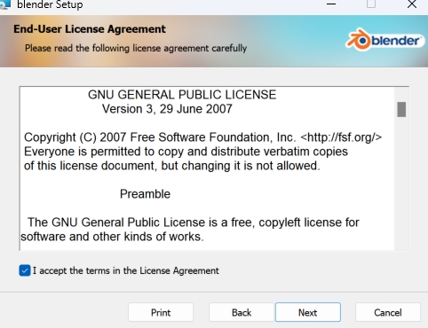
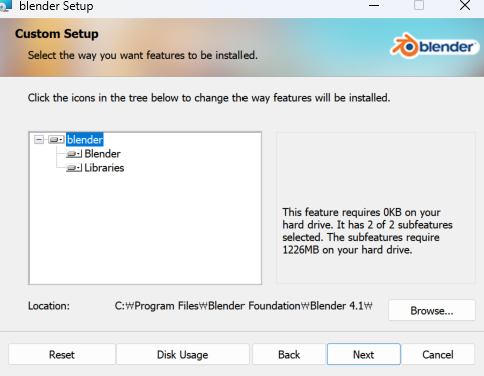
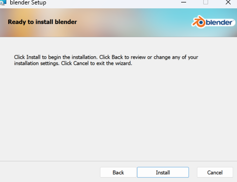
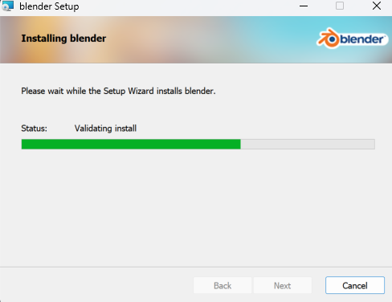
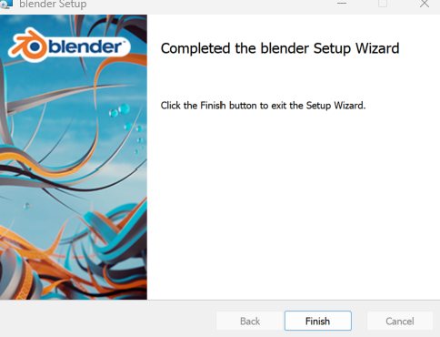

# Blender 환경 설정
## 목차
- [Blender 환경 설정](#blender-환경-설정)
  - [목차](#목차)
  - [Install Blender](#install-blender)
  - [출처](#출처)
  - [다음](#다음)

---
## Install Blender

1. [다음 웹사이트](https://www.blender.org/download/)로 이동합니다.
     
2. Blender installer를 다운로드 합니다.
3. 다운로드된 installer를 받아 설치를 진행합니다.
     
     
     
     
     
     

---
## 출처
 - [Blender](https://www.blender.org/)

---
## [다음](./02_Blender_Introduction.md)