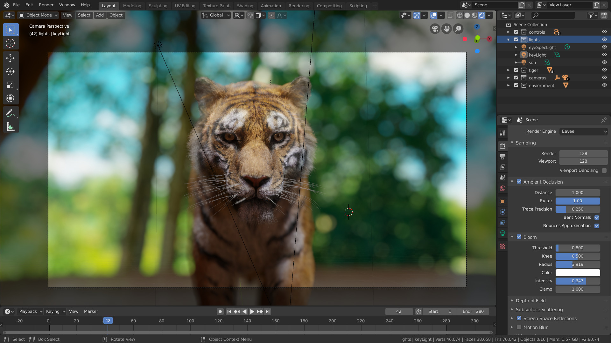
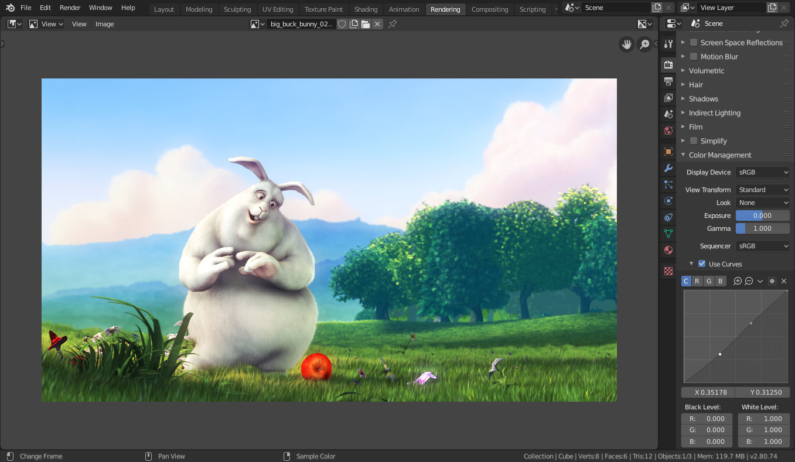

# Blender Introduction
## 목차
- [Blender Introduction](#blender-introduction)
  - [목차](#목차)
  - [Introduction](#introduction)
    - [Blender의 사용자는 누구인가요?](#blender의-사용자는-누구인가요)
    - [주요 기능](#주요-기능)
  - [출처](#출처)
  - [다음](#다음)

---
## Introduction

Blender에 오신 것을 환영합니다! Blender는 무료 오픈 소스 3D 제작 스위트입니다.

Blender를 사용하면 정지 이미지, 3D 애니메이션, VFX 샷과 같은 3D 시각화를 만들 수 있습니다. 또한 비디오 편집도 가능합니다. Blender는 통합된 파이프라인과 반응성 높은 개발 프로세스를 통해 개인 및 소규모 스튜디오에 적합합니다.

Blender는 크로스 플랫폼 애플리케이션으로, Linux, macOS 및 Windows 시스템에서 실행됩니다. 또한 다른 3D 제작 스위트에 비해 메모리와 드라이브 요구 사항이 상대적으로 작습니다. 인터페이스는 OpenGL을 사용하여 모든 지원 하드웨어 및 플랫폼에서 일관된 경험을 제공합니다.

### Blender의 사용자는 누구인가요?

Blender는 다양한 도구를 제공하여 거의 모든 종류의 미디어 제작에 적합합니다. 전 세계의 전문가, 취미가, 스튜디오가 애니메이션, 게임 자산, 모션 그래픽, TV 쇼, 콘셉트 아트, 스토리보딩, 광고 및 장편 영화 제작에 Blender를 사용합니다.

더 많은 예시를 보려면 Blender 웹사이트의 사용자 스토리 페이지를 확인하세요.

### 주요 기능

 - Blender는 모델링, 렌더링, 애니메이션 및 리깅, 비디오 편집, VFX, 합성, 텍스처링 및 다양한 종류의 시뮬레이션을 포함한 광범위한 필수 도구를 제공하는 완전 통합된 3D 콘텐츠 제작 스위트입니다.
 - Blender는 크로스 플랫폼이며, 모든 주요 플랫폼에서 일관된 OpenGL GUI를 제공합니다(파이썬 스크립트로 사용자 지정 가능).
 - 고품질의 3D 아키텍처를 갖추고 있어 빠르고 효율적인 제작 워크플로우를 가능하게 합니다.
 - 활발한 커뮤니티 지원을 자랑합니다. 광범위한 사이트 목록은 blender.org/community를 참조하세요.
 - 작은 실행 파일을 가지고 있으며, 선택적으로 포터블 버전도 제공합니다.

렌더링된 이미지의 후처리.

Blender는 다양한 작업을 수행할 수 있게 해주며, 처음에는 기본을 이해하는 것이 어렵게 느껴질 수 있습니다. 하지만 약간의 동기부여와 적절한 학습 자료가 있다면 몇 시간의 연습 후에 Blender에 익숙해질 수 있습니다.

이 매뉴얼은 좋은 출발점이지만, 참고 자료로 더 적합합니다. 또한, 전문 웹사이트의 많은 온라인 비디오 튜토리얼도 있습니다.

Blender가 할 수 있는 모든 것에도 불구하고, Blender는 도구일 뿐입니다. 위대한 예술가는 버튼을 누르거나 브러시를 조작하는 것만으로 걸작을 만들지 않으며, 인체 해부학, 구성, 조명, 애니메이션 원칙 등과 같은 주제를 배우고 연습하여 걸작을 만듭니다.

Blender와 같은 3D 제작 소프트웨어는 기본 기술과 관련된 용어 때문에 추가적인 기술 복잡성과 전문 용어를 가지고 있습니다. UV 맵, 재질, 셰이더, 메시 및 "서브디브"와 같은 용어는 디지털 아티스트의 매체이며, 이를 대략적으로라도 이해하면 Blender를 최대한 활용하는 데 도움이 됩니다.

따라서 이 매뉴얼을 계속 읽고 Blender라는 훌륭한 도구를 배우고, 다른 예술적 및 기술적 영역에도 마음을 열어 위대한 예술가가 되세요.

---
## 출처
 - [Blender Manual](https://docs.blender.org/manual/en/latest/)
 - [Blender Introduction](https://docs.blender.org/manual/en/latest/getting_started/about/introduction.html)

---
## [다음](./03_00_Rigid_Accessories.md)