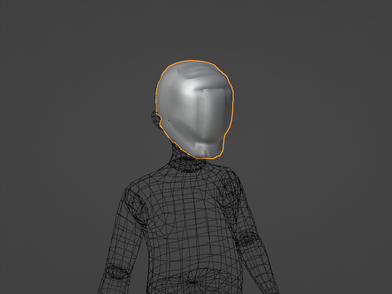
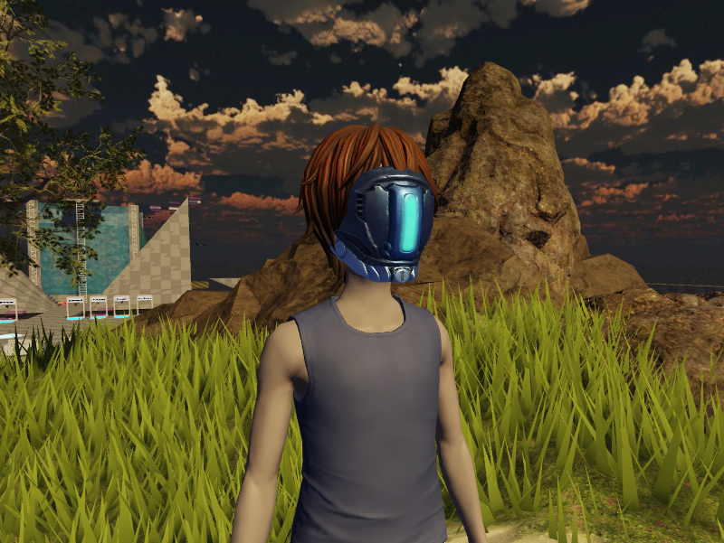

# Rigid Accessory Creation
## 목차
- [Rigid Accessory Creation](#rigid-accessory-creation)
  - [목차](#목차)
  - [출처](#출처)
  - [다음](#다음)

---

강체 액세서리는 사용자가 경험이나 Roblox의 [마켓플레이스](https://www.roblox.com/catalog) 및 [아바타 에디터](https://www.roblox.com/my/avatar)를 통해 아바타 캐릭터에 장착할 수 있는 3D 객체입니다. 제3자 모델링 애플리케이션에서 케이지, 리깅 및 스키닝이 필요한 `의류 액세서리` 또는 `몸체`와 달리, 강체 액세서리는 아바타 캐릭터에 직접 부착되며 캐릭터의 몸에 굽거나 변형되지 않습니다. 제3자 애플리케이션에서 모델링 및 텍스처링 이외에 추가적인 구성 작업이 필요하지 않기 때문에 강체 액세서리는 일반적으로 가장 기본적인 3D 아바타 아이템입니다.

제공된 3D 참고 파일을 사용하여 이 튜토리얼에서는 Blender에서 3D 모델을 적절히 구성하고 내보내는 각 단계를 다루며, Studio에서 자신의 강체 액세서리를 생성하는 방법을 설명합니다. 액세서리를 만든 후에는 마켓플레이스에 업로드하고, 툴박스에 저장하고, 자신의 경험에서 사용할 수 있습니다.

<!-- <GridContainer numColumns="2">
<figure>
    
<figcaption>
  Blender에서 텍스처가 없는 메시 객체로 표시된 마스크 자산
</figcaption>
</figure>
<figure>
    
<figcaption>
  Studio에서 `Class.Accessory`로 장착된 마스크 자산
</figcaption>
</figure>
</GridContainer> -->

|Blender에서 텍스처가 없는 메시 객체로 표시된 마스크 자산|Studio에서 `Accessory`로 장착된 마스크 자산|
|---|---|
|||

제공된 3D 참조 자산을 사용하여 이 튜토리얼에서는 다음과 같은 강체 액세서리 워크플로우를 다룹니다:

1. Blender에서 모델링 개요 및 요구 사항.
2. Blender에서 PBR 텍스처를 사용한 텍스처링 설정.
3. Blender에서 자산을 `.fbx`로 내보내기.
4. Studio로 자산 가져오기.
5. 가져온 모델을 `Class.Accessory` 객체로 맞추고 변환하기.
6. 마켓플레이스 업로드를 위한 액세서리 게시 및 검증.

<Alert severity='info'>
이 콘텐츠는 제공된 참조 예제를 사용한 Blender 워크플로우를 다루지만, 동일한 개념을 다른 제3자 모델링 애플리케이션 및 사용자 지정 자산에도 적용할 수 있습니다.
</Alert>

---
## 출처
 - [Rigid Accessory Creation](https://create.roblox.com/docs/art/accessories/creating-rigid)

---
## [다음](./03_01_Blender_Setup.md)