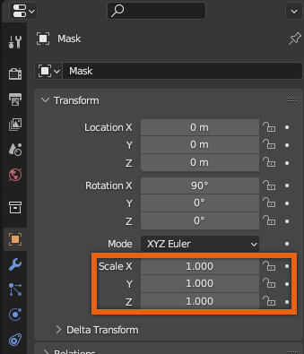

# Blender Setup
## 목차
- [Blender Setup](#blender-setup)
  - [목차](#목차)
  - [출처](#출처)
  - [다음](#다음)

---

**모델링**은 객체의 3D 형상을 생성하고 형태를 만드는 과정입니다. 기존 모양을 사용하거나 자체 3D 객체를 만드는 경우, `기술 요구사항` (예: 폴리곤 수 제한을 유지하는 것) 및 `정책 요구사항` (예: Roblox 생태계 내외의 다른 제작자의 IP를 침해하지 않도록 설계 보장) 등을 고려하는 것이 중요합니다.

Blender에서 자산을 올바르게 설정하면 Studio에서 가져오기 및 렌더링 문제를 줄일 수 있습니다. 제공된 [마스크 자산](https://prod.docsiteassets.roblox.com/assets/art/accessories/creating-rigid/Rigid_Mask_Model-Only.fbx)과 같은 Roblox 관련 `.fbx` 파일을 가져올 때 `.fbx` 변환으로 인해 자산이 1/100 스케일로 가져와질 수 있습니다. Blender 프로젝트에서 스케일을 재설정하여 Blender 환경에서 작업을 더 쉽게 할 수 있습니다.

<Alert severity = 'info'>
처음부터 강체 액세서리를 직접 만드는 경우, 특히 모자나 팔찌처럼 신체 부위를 둘러싸는 강체 액세서리의 경우 Roblox의 `표준 아바타 크기`를 이해하는 것이 중요합니다.
</Alert>

[Sci Fi Mask](https://prod.docsiteassets.roblox.com/assets/art/accessories/creating-rigid/Rigid_Mask_Model-Only.fbx) 참조를 예로 들어, Blender에서 강체 액세서리 모델을 가져오고 설정하는 다음 지침을 따르세요:

1. 새 Blender 프로젝트를 엽니다.
2. <kbd>A</kbd>를 눌러 모두 선택하고 <kbd>X</kbd>를 눌러 기본 시작 큐브와 카메라를 삭제합니다.
3. **File** > **Import** > **FBX**로 이동하여 다운로드한 참조 모델을 선택합니다.
4. 객체가 작은 스케일로 가져와지면 **객체를 선택**하고 **Properties 패널** > **Object Properties** > **Transform**으로 이동하여 **X**, **Y**, **Z**를 `1.000`으로 조정합니다.

   

   <video controls src="../img/03_01_Blender_Setup/Scaling-FBX-Import.mp4" width="100%"></video>

5. 자산을 처음부터 조각하는 경우, 작업 공간에서 객체를 정렬합니다. 가져오는 경우, 조정이 필요하지 않을 수 있습니다.
   1. 자산이 **-Y 방향**을 향하고 있는지 확인합니다.
   2. 액세서리가 Studio의 카메라 중심에서 가져오기 위해 이상적으로 월드의 `0`,`0`,`0`으로 이동해야 합니다.

<Alert severity='success'>
튜토리얼의 모델링 섹션을 완료했습니다. 원하는 경우, 이 단계의 프로젝트를 비교할 수 있는 [참조 버전](https://prod.docsiteassets.roblox.com/assets/art/accessories/creating-rigid/Rigid_Mask_Texturing-Completed.blend)을 다운로드하세요.

고유한 자산을 만드는 데 사용할 수 있는 많은 도구와 워크플로우가 있습니다. 추가 제안을 위해 어깨 패드나 벨트와 같은 다른 유형의 자산을 만들거나 참조 모델을 Blender에 마네킹으로 가져와 화장품을 처음부터 조각하고 형성해 보세요.
</Alert>

---
## 출처
 - [Blender Setup](https://create.roblox.com/docs/art/accessories/creating-rigid/modeling-setup)

---
## [다음](./03_02_Importing_PBR_Textures.md)