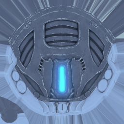
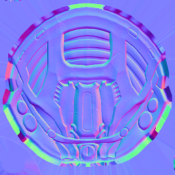
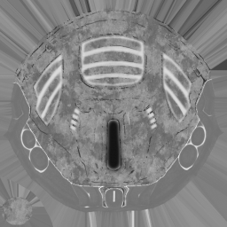
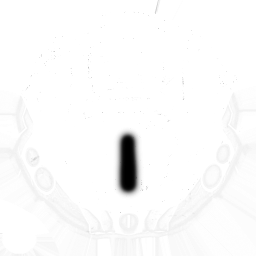
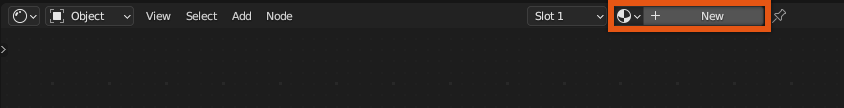
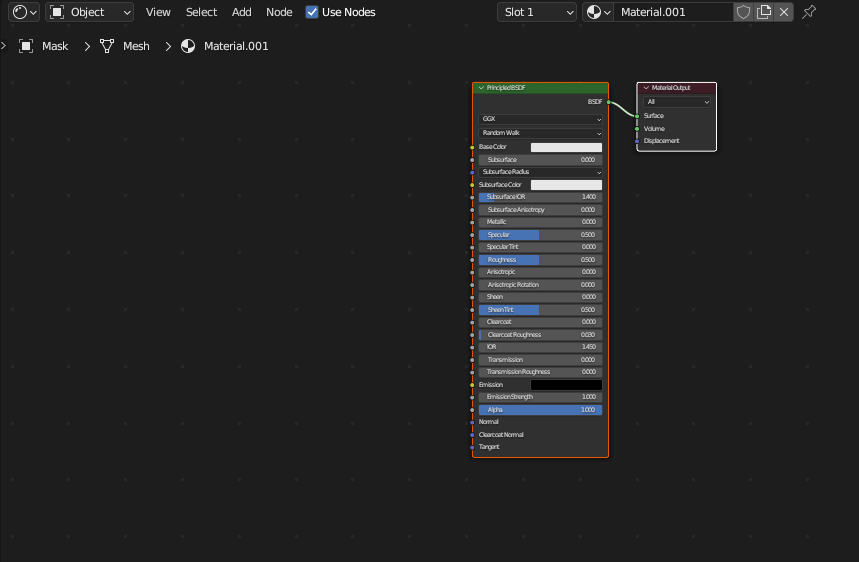
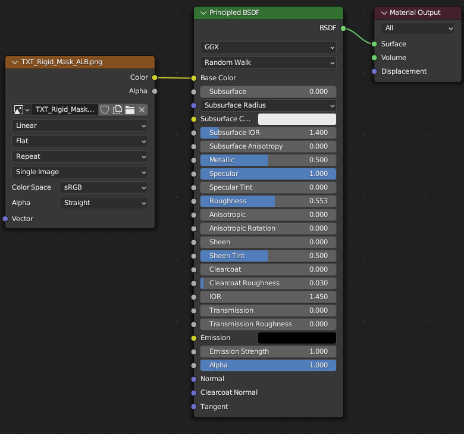
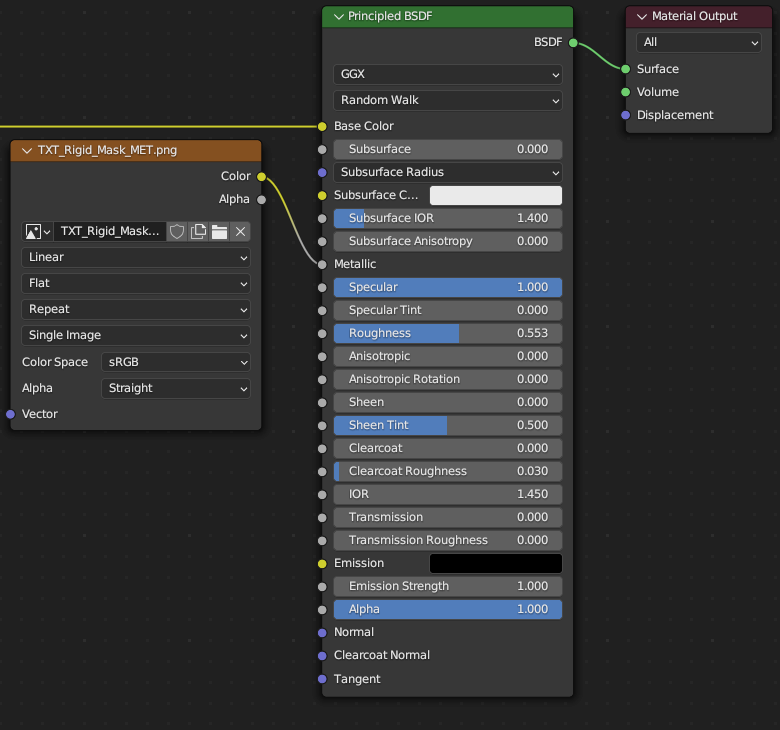
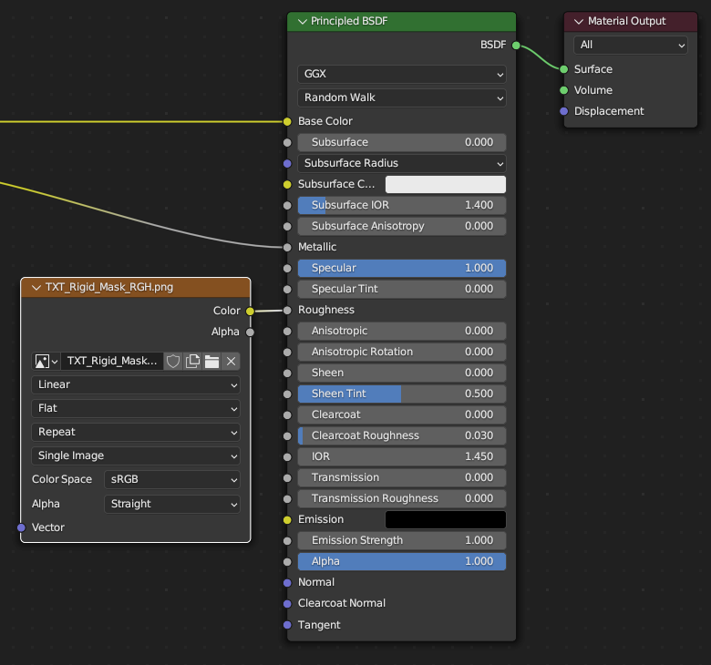
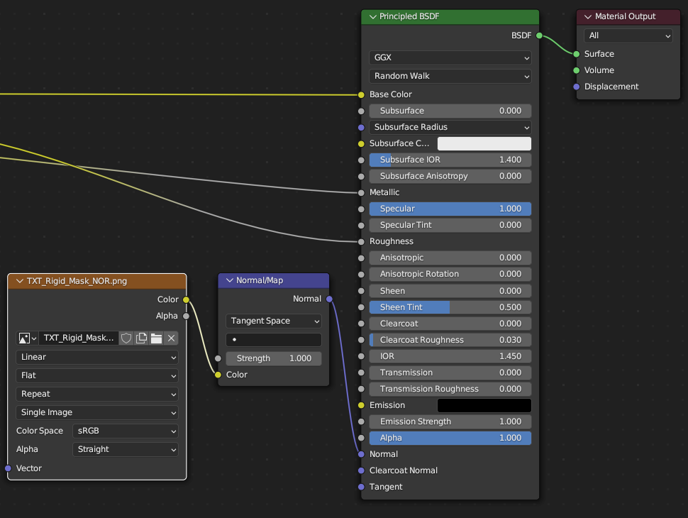

# Importing PBR Textures
## 목차
- [Importing PBR Textures](#importing-pbr-textures)
  - [목차](#목차)
  - [출처](#출처)
  - [다음](#다음)

---

**텍스처링**은 3D 객체에 표면 외관을 적용하는 과정입니다. Blender는 자산에 자신의 텍스처 맵을 생성하고 연결할 수 있는 다양한 도구와 기능을 제공하여 모델의 최종 외관을 미리 보고 텍스처 이미지를 내보낸 파일에 연결할 수 있습니다.

마스크 예제 자산은 다양한 조명 환경에서 현실적인 표면을 만드는 고급 텍스처인 [물리 기반 렌더링(PBR) 텍스처](https://create.roblox.com/docs/art/modeling/surface-appearance)를 사용합니다. PBR 텍스처는 3D 객체의 다양한 표면 특성을 나타내기 위해 여러 이미지 파일 또는 **맵**을 사용합니다.

<!-- <GridContainer numColumns="4">
<figure>
   
<figcaption>
색상(알베도) 맵
</figcaption>
</figure>
<figure>
   
<figcaption>
노멀 맵
</figcaption>
</figure>
<figure>
   
<figcaption>
거칠기 맵
</figcaption>
</figure>
<figure>
   
<figcaption>
금속성 맵
</figcaption>
</figure>
</GridContainer> -->

|색상(알베도) 맵|노멀 맵|거칠기 맵|금속성 맵|
|---|---|---|---|
|||||

이 튜토리얼은 일반적으로 ZBrush 또는 Substance 3D Painter와 같은 타사 소프트웨어를 사용하는 PBR 텍스처 생성 과정을 다루지 않습니다. 대신, 미리 제작된 PBR 이미지 파일을 Blender로 가져오고 이를 내보내기 위해 자산에 올바르게 연결하는 과정을 설명합니다.

<Alert severity = 'warning'>
PBR 텍스처는 액세서리에 필수는 아니지만, 추가하면 시각적 매력과 현실감을 높일 수 있습니다. Blender를 사용하여 기본적인 비 PBR 텍스처를 만드는 방법에 대한 예시는 [기본 의류 텍스처링](https://create.roblox.com/docs/art/accessories/creating/unwrapping)을 참조하십시오.
</Alert>

모델에 PBR 텍스처를 구성하고 연결하려면 다음 단계를 따르세요:

1. [Rigid_Mask_Textures.zip](https://prod.docsiteassets.roblox.com/assets/art/accessories/creating-rigid/Rigid_Mask_Textures.zip)을 다운로드하고 텍스처 이미지를 Blender 프로젝트와 동일한 디렉토리에 압축 해제합니다.
2. Blender에서 **Shading** 탭으로 이동합니다. 객체가 선택되어 있는지 확인합니다.

   1. **PrincipledBSDF 노드**가 보이지 않으면, **+New** 버튼을 선택하여 새 소재를 만듭니다.

      

      

3. 파일 탐색기에서 텍스처 `.png` 파일을 노드 섹션으로 드래그 앤 드롭합니다. 각 파일과 함께 새 이미지 노드가 나타납니다.
4. 새로 생성된 노드에서 각 이미지 노드를 Principled BSDF 주요 노드의 적절한 연결에 클릭하여 드래그합니다:

   1. **\_ALB 텍스처**: **Color** 노드를 **Principled BSDF** > **Base Color**에 연결합니다.
      
   2. **\_MTL 텍스처**: **Color** 노드를 **Principled BSDF** > **Metallic**에 연결합니다.
      
   3. **\_RGH 텍스처**: **Color** 노드를 **Principled BSDF** > **Roughness**에 연결합니다.
      
   4. **\_NOR 텍스처**:
      1. **Add** > **Vector** > **Normal Map**을 클릭하여 NormalMap 노드를 생성합니다. 이 노드는 노멀 PBR 이미지 맵을 변환하는 데 필요합니다.
      2. \_NOR 노드의 **Color**를 NormalMap 노드의 **Color** 연결에 연결합니다.
      3. NormalMap의 **Normal**을 **Principled BSDF** > **Normal**에 연결합니다.
         

5. 뷰포트 보기 모드를 **Viewport Shading > Material Preview Mode**로 변경하여 텍스처를 테스트합니다.
   <!-- <video controls src="../img/03_02_Importing_PBR_Textures/Adding-PBR.mp4" width="100%"></video> -->
   

튜토리얼의 텍스처링 섹션을 완료했습니다. 원할 경우, 이 단계의 프로젝트에 대한 [참조 샘플](https://prod.docsiteassets.roblox.com/assets/art/accessories/creating-rigid/Rigid_Mask_Texturing-Completed.blend)을 다운로드하세요.

자체 PBR 텍스처를 생성하는 경우, 다음 액세서리에 적용할 수 있는 다양한 PBR 소재 예제는 [Material References](https://create.roblox.com/docs/art/modeling/material-reference)를 참조하십시오.

---
## 출처
 - [Importing PBR Textures](https://create.roblox.com/docs/art/accessories/creating-rigid/texturing)

---
## [다음](./03_03_Project_Cleanup.md)