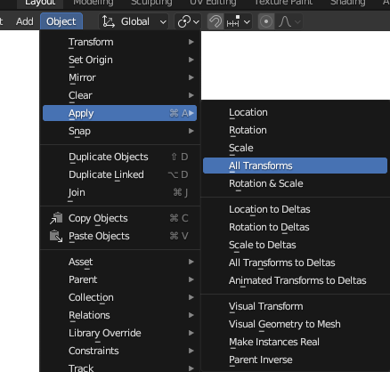

# Exporting FBX

## 목차
- [Exporting FBX](#exporting-fbx)
  - [목차](#목차)
  - [출처](#출처)
  - [다음](#다음)

---

자산의 모델링 및 텍스처링을 완료한 후, Blender 프로젝트를 `.fbx` 파일로 **내보내는** 과정을 시작할 수 있습니다. 이 과정의 시작은 프로젝트를 정리하는 것으로, 이는 액세서리 메시만 내보낼 수 있도록 조명, 카메라 또는 마네킹과 같은 불필요한 객체를 삭제하거나 제거하는 것을 포함할 수 있으며, 메시 객체에 모든 수정자를 적용하는 것을 포함할 수 있습니다.

불필요한 객체와 마네킹을 삭제하는 것 외에도 종종 잊혀지는 정리 단계는 방향, 회전 및 크기 델타를 0으로 설정하여 변형을 **적용**하는 것으로, 이는 **변환 고정**이라고도 합니다. 변환을 적용하지 않으면 Studio에서 메시를 가져올 때 예상치 못한 동작과 방향이 발생할 수 있습니다.

변환을 고정하려면:

1. 객체 모드에서 메시 객체를 선택합니다.
2. **Object** > **Apply** > **All Transforms**로 이동합니다.

   

모델을 `.fbx`로 내보내려면:

1. 상단 메뉴에서 **File**을 클릭합니다.
2. **Export**를 선택한 다음 **FBX (.fbx)**를 선택합니다.
3. 파일 보기 창의 오른쪽에서 **Path Mode** 속성을 **Copy**로 변경한 후 **Embed Textures** 버튼을 토글합니다.

   

4. **Transform** > **Scale**을 `.01`로 설정합니다. 이는 `.fbx` 내보내기의 크기 조절을 유지하는 데 필요합니다.

   

5. **Export FBX** 버튼을 클릭합니다.

<Alert severity = 'success'>
이 튜토리얼의 내보내기 섹션을 완료했습니다. 원한다면 내보낸 파일의 [참조 샘플](https://prod.docsiteassets.roblox.com/assets/art/accessories/creating-rigid/Rigid_Mask_Export.fbx)을 다운로드하여 비교할 수 있습니다. 이 참조 파일을 다음 가져오기 단계에서 사용할 수 있습니다.
</Alert>

---
## 출처
 - [Exporting FBX](https://create.roblox.com/docs/art/accessories/creating-rigid/exporting)

---
## [다음](./03_05_Using_Studios_3D_Importer.md)