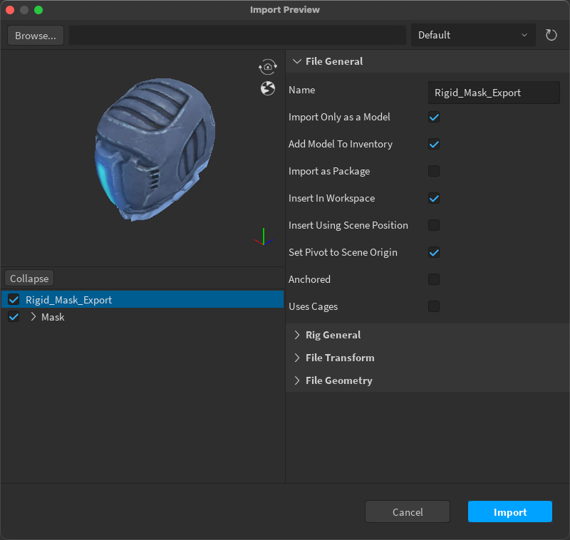
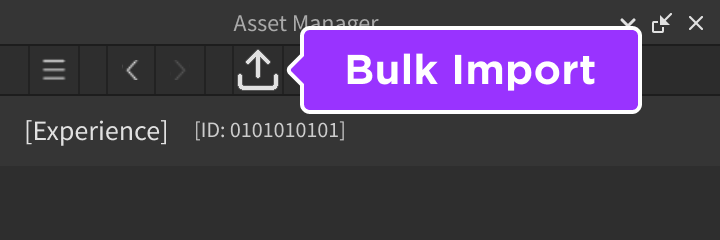
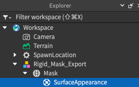
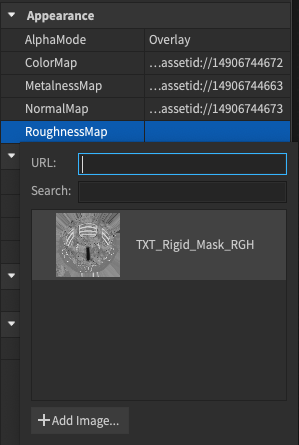

# Using Studio's 3D Importer

## 목차
- [Using Studio's 3D Importer](#using-studios-3d-importer)
  - [목차](#목차)
  - [출처](#출처)
  - [다음](#다음)

---

Studio의 3D 가져오기 도구는 타사 3D 자산을 프로젝트에 빠르고 쉽게 가져올 수 있는 방법을 제공합니다. 이 도구는 객체 미리보기 및 오류 검사를 제공하여 자산이 Studio의 일반 3D 요구 사항을 충족하는지 확인합니다.

자산을 가져오려면:

1. Studio에서 **아바타 탭**으로 이동하여 **3D 가져오기 도구**를 선택합니다.
2. 파일 브라우저에서 로컬에 저장된 `.fbx` 파일을 선택합니다. 3D 가져오기 도구가 객체의 미리보기를 로드합니다.

      

   1. 자산의 텍스처가 로드되지 않는 경우, 4단계에서 텍스처를 수동으로 가져올 수 있습니다.

3. **가져오기**를 선택합니다. 자산은 적절한 텍스처가 적용된 `SurfaceAppearance`로 `Model` 형태로 작업 공간에 나타납니다.

   1. 텍스처가 제대로 로드되지 않은 경우 수동으로 추가합니다. 자산 관리자를 사용하려면 경험을 저장하고 게시해야 할 수도 있습니다.

      1. 자산 관리자 열기. 자산에 액세스하기 전에 경험을 저장하고 게시해야 할 수 있습니다.
      2. 자산 관리자에서 **대량 가져오기** 버튼을 선택합니다.

         

      3. 이미지 파일을 업로드합니다.
      4. 이미지가 검토를 통과한 후, 가져온 `Model` 내에 있는 `MeshPart`를 선택합니다.
      5. `MeshPart`에 `SurfaceAppearance` 자식을 추가합니다.

         

      6. `SurfaceAppearance` 속성에서 각 속성 값을 클릭하고 자산 드롭다운에서 적절한 텍스처 이미지를 할당합니다:

         1. **ColorMap**을 **\_ALB** 텍스처 이미지로 설정합니다.
         2. **MetalnessMap**을 **\_MTL** 텍스처 이미지로 설정합니다.
         3. **NormalMap**을 **\_NOR** 텍스처 이미지로 설정합니다.
         4. **RoughnessMap**을 **\_RGH** 텍스처 이미지로 설정합니다.

            

<Alert severity = 'success'>
성공적으로 가져오기를 완료하면, 모델 객체가 적절한 텍스처가 적용된 `Model` 형태로 프로젝트에 나타납니다. 가져오기 설정 및 문제 해결에 대한 추가 정보는 [3D 가져오기 도구](https://create.roblox.com/docs/art/modeling/3d-importer)를 참조하세요.
</Alert>

---
## 출처
 - [Using Studio's 3D Importer](https://create.roblox.com/docs/art/accessories/creating-rigid/importing)

---
## [다음](./03_06_Using_the_Accessory_Fitting_Tool.md)