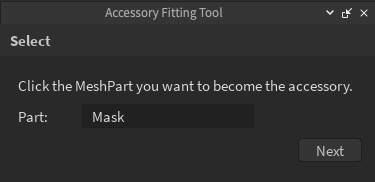
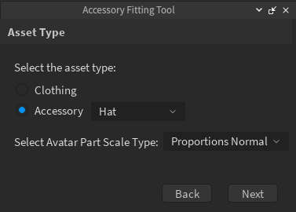
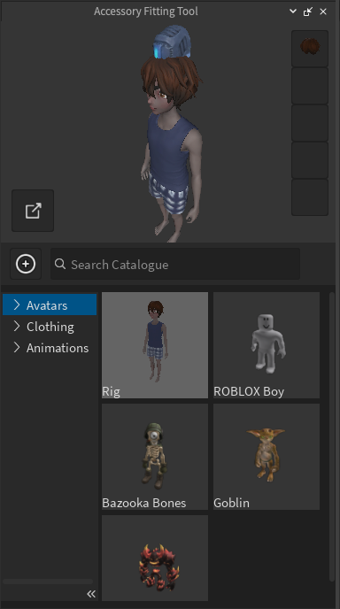

# Using the Accessory Fitting Tool

## 목차
- [Using the Accessory Fitting Tool](#using-the-accessory-fitting-tool)
  - [목차](#목차)
  - [출처](#출처)
  - [다음](#다음)

---

자산을 Studio에 가져온 후, 가져온 객체를 마네킹에 **맞추고** `Model` 객체를 `Accessory`로 **변환**할 수 있습니다. 액세서리를 맞추고 변환할 때는 **Accessory Fitting Tool (AFT)**을 사용하여 올바르게 배치하고 적절한 구성을 적용하는 것이 중요합니다.

액세서리를 맞추고 생성하려면 다음 단계를 따르세요:

1. **Avatar** 탭에서 **Accessory Fitting Tool (AFT)**을 엽니다.
2. 새로운 AFT 패널에서 **Part** 필드를 선택하고, 작업 공간에서 액세서리 `Class.MeshPart` 객체를 선택한 후 **다음**을 클릭합니다.

   

3. 자산 유형 페이지에서 자산의 **유형**과 예상 **몸 크기**를 선택합니다. 완료되면 **다음**을 클릭합니다.

   1. 이 튜토리얼에서는 **모자** 자산과 **Proportions Normal** 크기를 사용합니다.
   2. 몸 크기는 일반적으로 자산의 원래 조각과 크기를 기준으로 설정됩니다. 엄격한 액세서리 크기에 대한 추가 정보는 `Body Scale`을 참조하세요.

      

4. 미리보기 화면에서 휴머노이드 캐릭터 중 하나를 마네킹으로 선택합니다:

   1. 아바타 섹션에서 휴머노이드 기본 몸체 캐릭터를 선택합니다.
   2. 미리보기 패널에서 이전 선택을 취소합니다. 미리보기 창에는 휴머노이드 몸체만 표시됩니다.

      

5. AFT 미리보기 창과 작업 공간을 사용하여 액세서리의 위치, 크기 및 회전을 조정합니다.

   1. **AFT 미리보기 창**과 마네킹을 사용하여 자산이 캐릭터에 어떻게 맞는지 정확하게 미리 봅니다. 작업 공간의 의상 마네킹은 엄격한 액세서리가 어떻게 부착되는지를 정확하게 나타내지 않습니다.
   2. 작업 공간에서 **이동**, **크기 조정**, **회전** 도구를 사용하여 엄격한 액세서리의 위치를 조정합니다.
   3. 실수로 다른 것을 선택한 경우, AFT 패널로 다시 클릭하여 액세서리를 다시 선택하고 변환 도구를 사용하여 조정을 계속합니다.

      <video controls src="../img/03_06_Using_the_Accessory_Fitting_Tool/Fitting-Mask.mp4" width="100%"></video>

6. 자산을 미리 보고 맞춘 후, **Generate MeshPart Accessory**를 선택하여 Accessory를 생성하고 탐색기에 추가합니다.

<Alert severity = 'success'>
성공적으로 맞추고 변환한 후, 3D 모델이 `Accessory`로 프로젝트에 나타납니다. 이 `Accessory`를 사용하여 다음 작업을 수행할 수 있습니다:

- 액세서리를 [마켓플레이스에 업로드](https://create.roblox.com/docs/art/accessories/creating-rigid/publishing)합니다.
- [HumanoidDescription](https://create.roblox.com/docs/characters/appearance#humanoiddescription)을 사용하여 현재 경험에서 캐릭터 모델에 장착하거나, 액세서리를 적절한 캐릭터 `Model` 객체 아래로 드래그 앤 드롭하여 사용합니다.
- [Toolbox](https://create.roblox.com/docs/projects/assets/toolbox)에 액세서리를 저장하여 모든 경험에서 공유하거나 사용할 수 있습니다.
</Alert>

---
## 출처
 - [Using the Accessory Fitting Tool](https://create.roblox.com/docs/art/accessories/creating-rigid/converting)

---
## [다음](./03_07_Validation_and_Moderation.md)