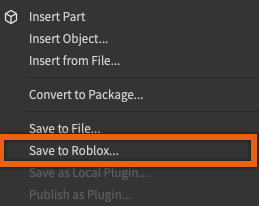
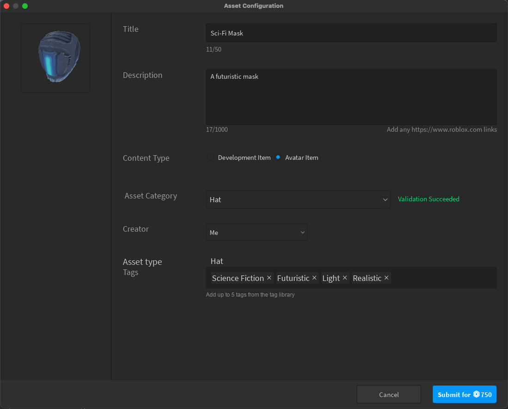

# Validation and Moderation

## 목차
- [Validation and Moderation](#validation-and-moderation)
  - [목차](#목차)
  - [출처](#출처)
  - [다음](#다음)

---

`Accessory` 아이템을 생성한 후, 이제 자산을 마켓플레이스에 **게시**하는 과정을 시작할 수 있습니다. 이 단계는 선택 사항이며 자산을 판매하려는 창작자에게만 적용됩니다.

게시 과정은 세 가지 주요 단계로 구성됩니다:

1. **검증** - 검증은 업로드 과정의 시작에서 로컬로 수행됩니다. 이는 액세서리가 업로드 전에 모든 기술 요구 사항을 충족하는지 확인합니다.
2. **모더레이션** - 업로드 후, 스튜디오는 자산을 모더레이션 대기열로 보냅니다. 모더레이션은 일반적으로 24시간 이내에 완료됩니다.
3. **판매 준비 완료** - 자산이 모더레이션을 통과하면 마켓플레이스 설정을 하고 자산을 판매 가능하게 설정할 수 있습니다.

마켓플레이스에서 자산을 판매하려면 다음 단계를 따라 검증 및 업로드 과정을 시작하세요:

1. Explorer에서 액세서리 객체를 오른쪽 클릭하고 **Save to Roblox**를 선택합니다.

   

2. Asset Configuration 창에서 **Content Type**을 **Avatar Item**으로 설정합니다.
3. 다음 필드를 작성합니다(나중에 조정할 수 있습니다):

   1. **Title**: 액세서리의 이름.
   2. **Description**: 자산에 대한 짧은 설명.
   3. **Asset Category**: 액세서리 유형. 이는 [맞춤 및 변환](https://create.roblox.com/docs/art/accessories/creating-rigid/converting) 과정에서 선택한 액세서리 유형과 일치해야 합니다.
   4. **Creator**: 드롭다운을 사용하여 이 자산을 개인으로 게시할지 또는 관련 그룹의 일부로 게시할지 선택합니다.
   5. **Tags**: 자산에 최대 5개의 태그를 추가합니다. 이는 카탈로그에서 검색 및 발견을 돕는 데 사용됩니다.

      

4. **Asset Category**를 선택한 후, 스튜디오는 액세서리가 Roblox의 액세서리 기술 요구 사항에 맞는지 확인하기 위해 검증을 시작합니다.
   1. 올바르게 설정된 경우, 창에 녹색 검증 성공 확인이 표시됩니다.
   2. 오류가 발생하면 오류 메시지를 확인하여 세부 사항을 확인하세요. 일부 오류는 모델링 소프트웨어로 돌아가 자산을 조정해야 할 수 있습니다.
5. 검증이 성공하면 자산을 업로드 및 모더레이션 대기열에 제출할 수 있습니다. 현재 수수료 정보는 [수수료 및 커미션](https://create.roblox.com/docs/art/marketplace/marketplace-fees-and-commissions)을 참조하세요.

---
## 출처
 - [Validation and Moderation](https://create.roblox.com/docs/art/accessories/creating-rigid/validation)

---
## [다음](./03_08_Selling_Your_Accessory.md)