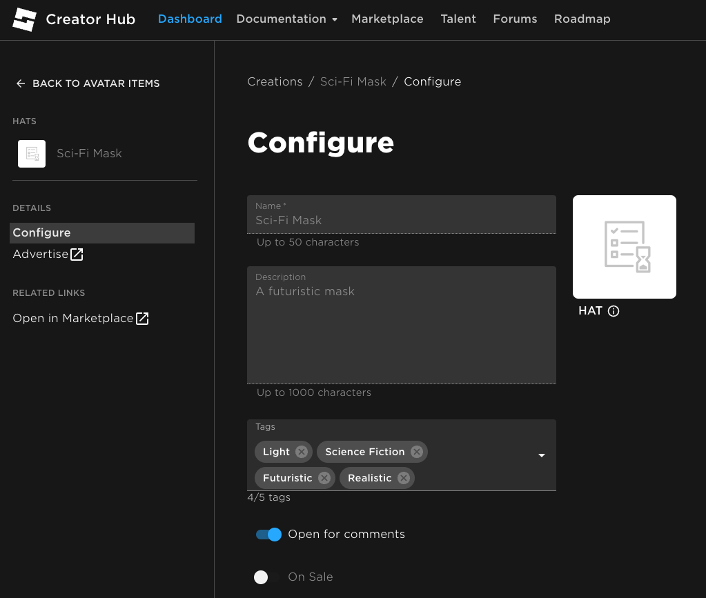
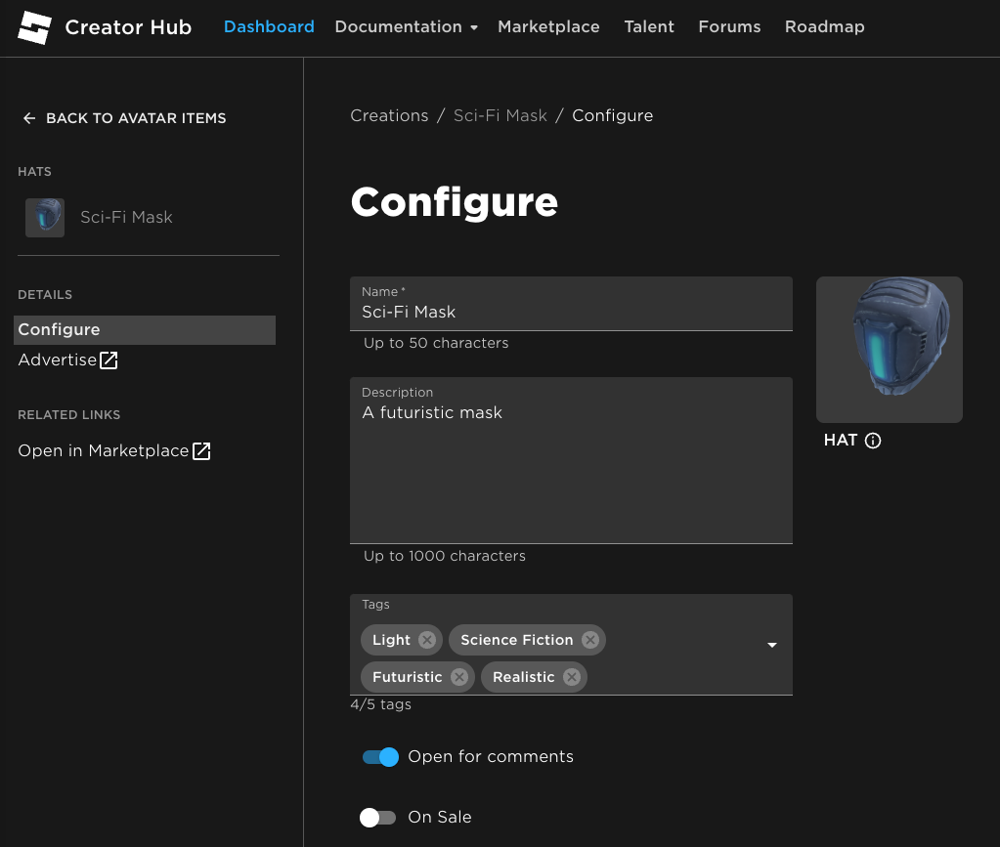
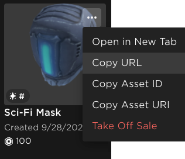
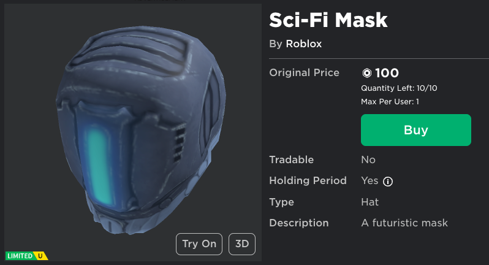

# Selling Your Accessory

## 목차
- [Selling Your Accessory](#selling-your-accessory)
  - [목차](#목차)
  - [출처](#출처)
  - [다음](#다음)

---

자산을 모더레이션에 업로드한 후, [크리에이터 대시보드 > 아바타 아이템](https://create.roblox.com/dashboard/creations)에서 자산의 현재 모더레이션 상태를 확인할 수 있습니다. 모더레이션은 최대 24시간이 걸릴 수 있으며, 그동안 생성 페이지에는 플레이스홀더 아이콘이 사용됩니다.

<!-- <Tabs>
<TabItem label='모더레이션 대기 중'>

</TabItem>
<TabItem label='모더레이션 통과'>

</TabItem>
</Tabs> -->

|모더레이션 대기 중|모더레이션 통과|
|---|---|
|||

1. 액세서리가 모더레이션을 통과한 후, **판매 중** 토글을 활성화하고 마켓플레이스 설정을 구성합니다.
   1. 각 마켓플레이스 설정에 대한 자세한 내용은 [마켓플레이스 자산 업데이트](https://create.roblox.com/docs/art/marketplace/publishing-to-marketplace#publishing-an-asset)를 참조하세요.
2. **게시**를 선택하여 아이템을 판매합니다.
3. 마켓플레이스 목록 링크를 얻으려면 생성 페이지로 이동하여 아이템에서 **URL 복사**를 선택합니다.

   

이제 액세서리가 마켓플레이스 카탈로그에 추가되었습니다! 아이템의 마켓플레이스 링크를 사용하여 언제든지 목록을 확인하거나 친구 및 팔로워에게 보내 추가 참여를 유도할 수 있습니다.

추가 마켓플레이스 정책 및 관련 정보는 다음 리소스를 참조하세요:

- [마켓플레이스 정책](https://create.roblox.com/docs/art/marketplace/marketplace-policy)
- [수수료 및 커미션](https://create.roblox.com/docs/art/marketplace/marketplace-fees-and-commissions)
- [지적 재산](https://create.roblox.com/docs/art/marketplace/intellectual-property)
- [모더레이션](https://create.roblox.com/docs/art/marketplace/moderation)

---
## 출처
 - [Selling Your Accessory](https://create.roblox.com/docs/art/accessories/creating-rigid/publishing)

---
## [다음](./04_00_Basic_Clothing_Creation.md)