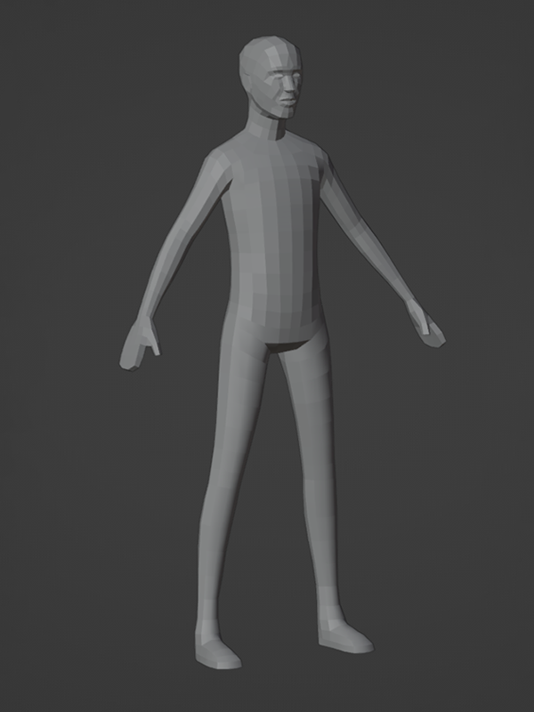
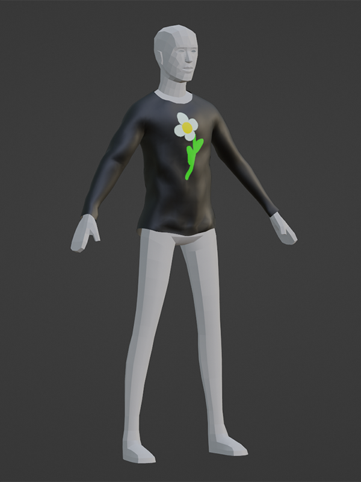

# Basic Clothing Creation

## 목차
- [Basic Clothing Creation](#basic-clothing-creation)
  - [목차](#목차)
  - [출처](#출처)
  - [다음](#다음)

---

Blender와 Roblox의 다운로드 가능한 프로젝트 템플릿을 사용하여 자신만의 맞춤 아바타 의상을 만들 수 있습니다. 이러한 프로젝트 템플릿에는 [레이어드 의상에 필요한 구성 요소](https://create.roblox.com/docs/art/accessories/layered-clothing#components-of-a-layered-clothing-accessory)가 포함되어 있으며, 의상 자산을 빠르게 형성하고 조각하기 위한 마네킹으로도 사용할 수 있습니다. 이 튜토리얼이 끝나면 마켓플레이스에 레이어드 의상 액세서리로 등록할 수 있는 모든 필수 구성 요소를 포함하는 의상 자산을 갖게 됩니다.

<Alert severity='info'>
이 콘텐츠와 제공된 예제는 Blender 워크플로우와 도구를 다루지만, 동일한 개념을 다른 서드파티 모델링 애플리케이션에 적용할 수 있습니다.
</Alert>

<!-- <GridContainer numColumns="2">
  <figure>
    
    <figcaption>제공된 Blender 마네킹 템플릿</figcaption>
  </figure>
  <figure>
    
    <figcaption>최종 Studio 준비 의상 자산</figcaption>
  </figure>
</GridContainer> -->

|Provided Blender mannequin template|Final Studio-ready clothing asset|
|---|---|
|||

이 튜토리얼은 Blender 경험이 중급인 제작자를 대상으로 하며, 다음 프로세스를 사용하여 의상 아이템을 만듭니다:

1. 기존 마네킹 모양을 사용하여 기본 의상 모델링.
2. 메시의 표면 외관과 색상을 변경하기 위해 텍스처링.
3. Roblox의 템플릿 케이지를 사용하여 의상 메시 케이지 설정.
4. Roblox의 골격 템플릿을 사용하여 의상 메시 리깅.
5. Blender에서 자산 내보내기.
6. Studio에서 모델을 액세서리로 가져오고 변환하기.

이 튜토리얼은 3D 의상 제작을 위한 **기본 워크플로우**를 다룹니다. 의상 제작을 위한 다양한 기법, 프로세스 및 정제 단계를 통합할 수 있는 많은 외부 리소스가 있으며, 여기에는 Blender의 다양한 재봉 및 천 시뮬레이션 도구와 PBR 텍스처 사용이 포함됩니다.

---
## 출처
 - [Basic Clothing Creation](https://create.roblox.com/docs/art/accessories/creating)

---
## [다음](./04_01_Modeling_Setup.md)