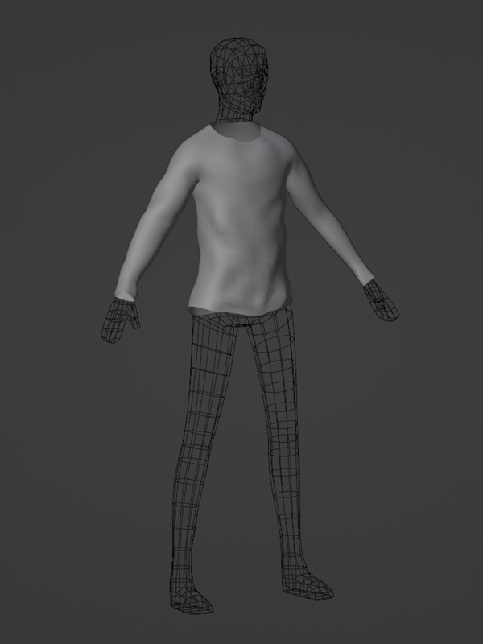
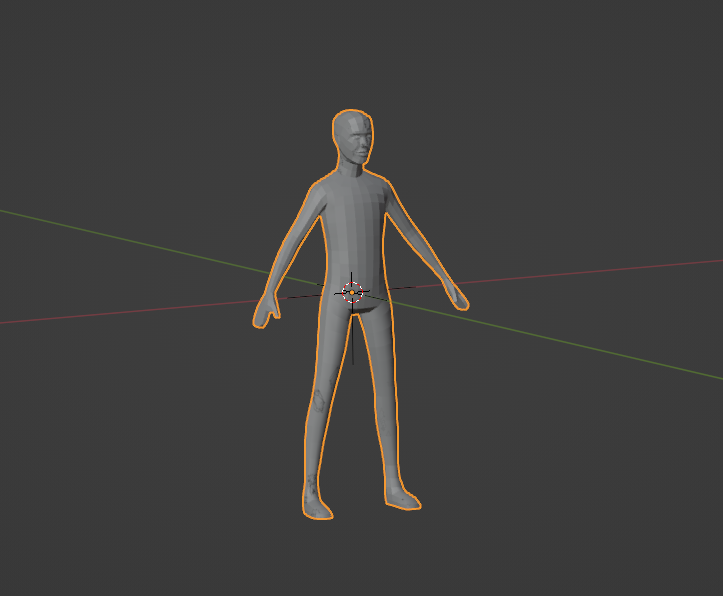
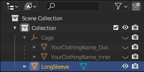
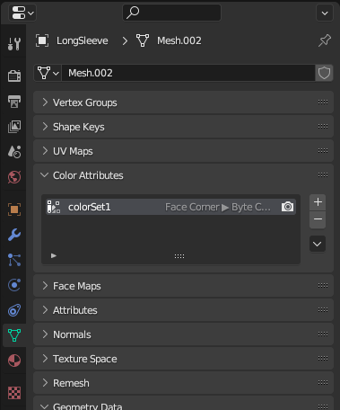

# Modeling Setup

## 목차
- [Modeling Setup](#modeling-setup)
  - [목차](#목차)
  - [메시 설정](#메시-설정)
  - [추가 속성 제거](#추가-속성-제거)
  - [출처](#출처)
  - [다음](#다음)

---

모델링, 때로는 조각(sculpting)이라고도 불리는 과정은 3D 기하학을 형성하는 것입니다. 이 튜토리얼에서는 Roblox의 템플릿 파일 중 하나를 사용하여 의상의 초기 형태를 만들고 그 기하학에 고유하고 의상 특유의 수정을 추가합니다. 이 튜토리얼의 기법과 과정을 응용하여 바지, 치마, 신발 등 다른 유형의 의상도 만들 수 있습니다.

<!-- <GridContainer numColumns="2">
  <figure>
    
    <figcaption>Roblox 제공 케이지 메시를 사용하는 기본 마네킹</figcaption>
  </figure>
  <figure>
    
    <figcaption>긴 소매 셔츠를 위한 조각된 의상 메시</figcaption>
  </figure>
</GridContainer> -->

|Roblox 제공 케이지 메시를 사용하는 기본 마네킹|긴 소매 셔츠를 위한 조각된 의상 메시|
|---|---|
|||

이 모델링 튜토리얼은 다음 과정을 다룹니다:

1. 프로젝트 설정 및 기본 메시 생성.
2. 중복된 메시의 추가 속성 제거.
3. 원하는 의상 유형에 맞게 모양 다듬기.
4. 의상 모양의 정점 추가 및 매끄럽게 하기.
5. 마네킹에 옷을 맞추고 위치 조정.
6. 메시 객체에 천과 기타 세부 사항 조각하기.
7. 메시의 구멍을 닫아 방수 처리하기.

## 메시 설정

프로젝트를 시작하려면 Roblox의 [Clothing_Cage.blend](https://prod.docsiteassets.roblox.com/assets/modeling/meshes/reference-files/Clothing_Cage_Template.blend) 프로젝트를 다운로드하고 열어 기본 프로젝트 객체를 설정하십시오.

<!-- <GridContainer numColumns="2">
  <figure>
    
    <figcaption>3D 뷰포트 - 중복된 케이지 메시 객체</figcaption>
  </figure>
  <figure>
    
    <figcaption>Outliner - "LongSleeve"라는 이름의 중복 객체</figcaption>
  </figure>
</GridContainer> -->

|3D 뷰포트 - 중복된 케이지 메시 객체|Outliner - "LongSleeve"라는 이름의 중복 객체|
|---|---|
|||

프로젝트와 초기 메시 객체를 설정하려면:

1. [Clothing_Cage.blend](https://prod.docsiteassets.roblox.com/assets/modeling/meshes/reference-files/Clothing_Cage_Template.blend) 프로젝트를 다운로드합니다. 이 프로젝트에는 임시 마네킹으로 사용할 내부 및 외부 케이지 메시가 포함되어 있습니다.
2. 이 파일을 열고 **다른 이름으로 저장**을 클릭하여 프로젝트를 새 이름으로 저장합니다. 이것이 의상 액세서리를 위한 주요 Blender 프로젝트가 됩니다.
3. Outliner에서 **InnerCage** 객체를 복사하여 붙여넣어 중복합니다.
4. 중복된 객체가 강조 표시된 상태에서 뷰포트에서 오른쪽 클릭하고 **부모 설정** > **부모 및 변환 유지**를 선택합니다.
5. Outliner에서 오른쪽 클릭하여 추가 **Cage.001 데이터 객체**를 삭제합니다.
6. 중복된 객체의 이름을 "LongSleeve"로 변경합니다.
7. 원래 케이지의 이름을 각각 "LongSleeve_OuterCage" 및 "LongSleeve_InnerCage"로 변경합니다.
8. 원래 \_OuterCage 및 \_InnerCage 객체를 **숨깁니다**. 이들은 나중에 케이지 단계에서 사용합니다.

   <video controls src="../img/04_01_Modeling_Setup/Modeling_00.mp4" width="100%"></video>

## 추가 속성 제거

템플릿의 케이지 메시 객체에는 의상 메시에서 제거해야 하는 도우미 정점 색상 속성이 포함되어 있습니다. 이를 남겨두면 Studio로 가져온 후 객체의 텍스처와 충돌할 수 있습니다.

추가 속성 데이터를 제거하려면:

1. LongSleeve 객체를 선택한 상태에서 **속성** 패널 > **객체 데이터 속성** > **색상 속성**으로 이동합니다.

   

2. **colorSet1**을 선택한 상태에서 **-** 버튼을 눌러 제거합니다.

   <video controls src="../img/04_01_Modeling_Setup/Modeling_01.mp4" width="100%"></video>

---
## 출처
 - [Modeling Setup](https://create.roblox.com/docs/art/accessories/creating/modeling-setup)

---
## [다음](./04_02_Trimming_Clothing_Shape.md)