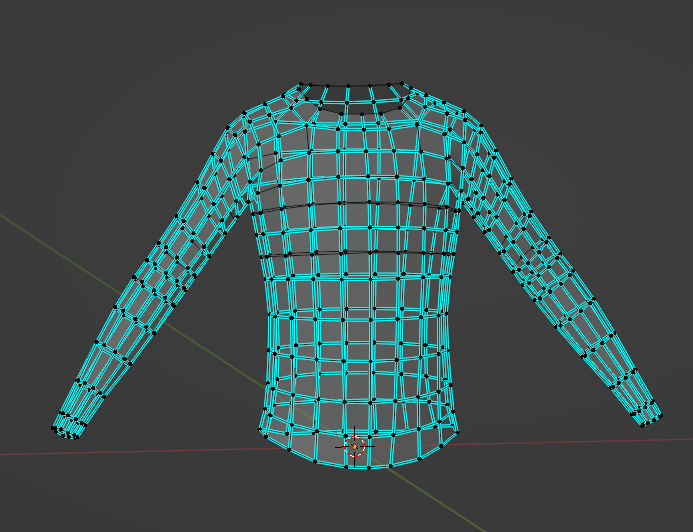
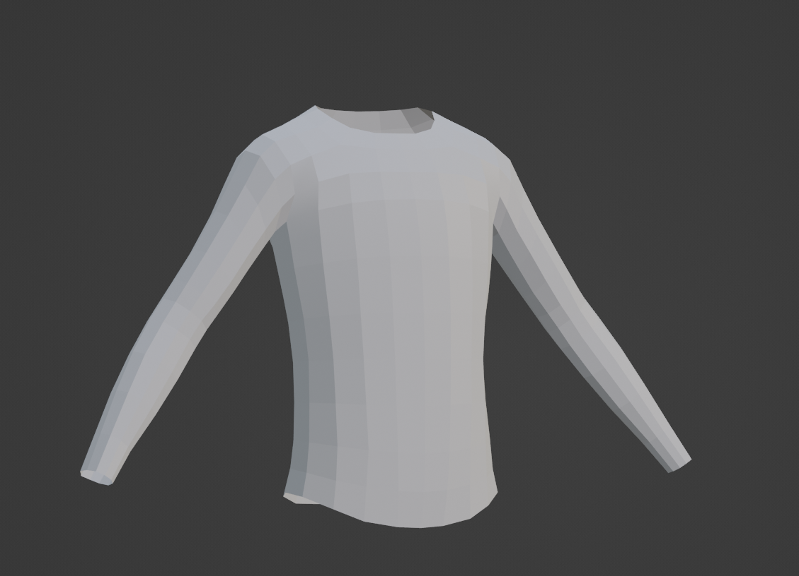
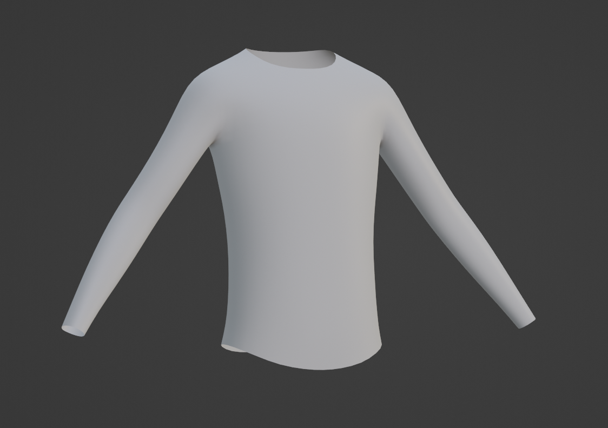
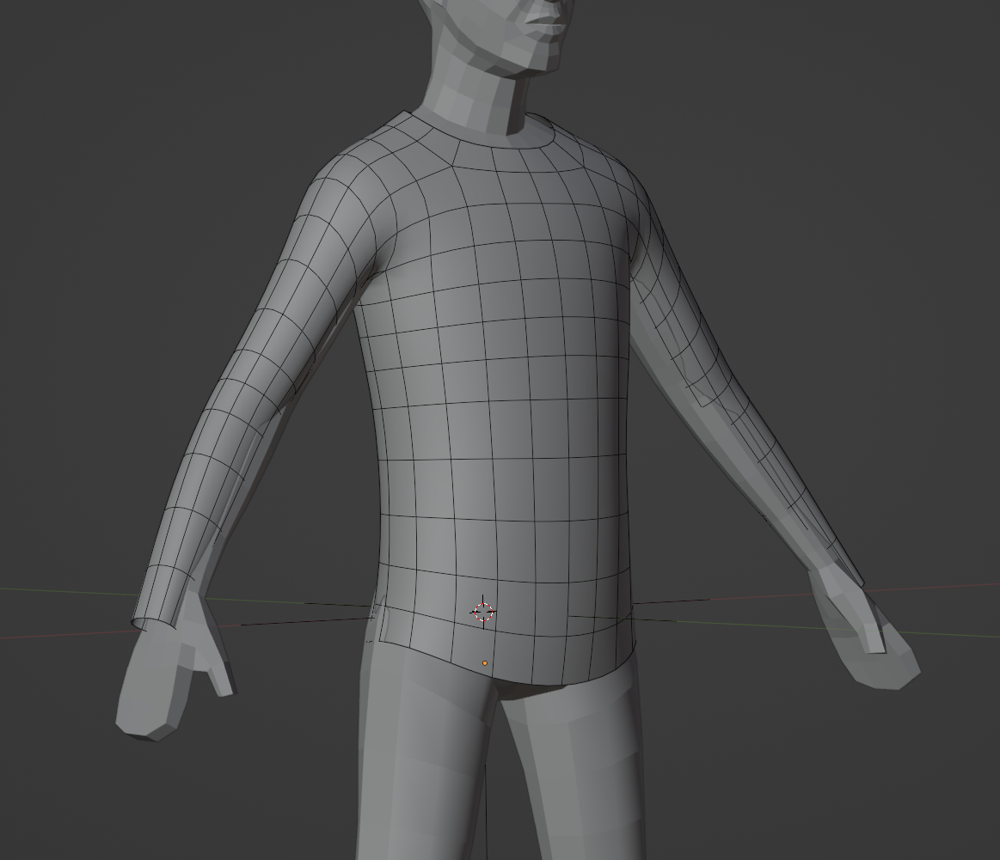

# Trimming Clothing Shape

## 목차
- [Trimming Clothing Shape](#trimming-clothing-shape)
  - [목차](#목차)
  - [의상 모양 다듬기](#의상-모양-다듬기)
  - [정점 추가 및 매끄럽게 하기](#정점-추가-및-매끄럽게-하기)
  - [크기 조정 및 위치 설정](#크기-조정-및-위치-설정)
  - [출처](#출처)
  - [다음](#다음)

---

깨끗한 메시 객체를 작업 대상으로 삼아, 만들고자 하는 의상 아이템의 기본 모양을 잘라내고 메시를 추가 조각 세부 작업을 할 수 있도록 준비하십시오. 이 튜토리얼에서는 다리, 팔, 머리 부분을 제거하고 메시를 평평한 캔버스로 만들기 위해 메시를 매끄럽게 하며 임시 마네킹에 메시를 재배치하여 긴 소매 셔츠 모양을 만듭니다.

<figure>
   
   <figcaption>전체 몸체 메시를 긴 소매로 다듬기.</figcaption>
</figure>

## 의상 모양 다듬기

복사한 마네킹 메시의 섹션을 잘라내어 의상의 일반적인 모양을 만듭니다.

의상 모양을 다듬으려면:

1. **LongSleeve** 객체를 선택합니다.
2. **편집 모드**로 전환합니다.
3. 뷰포트의 오른쪽 상단에서 **X-Ray 모드**를 활성화합니다.
4. 셔츠에 포함하고 싶지 않은 메시 부분을 클릭하고 드래그하여 선택합니다.
5. <kbd>X</kbd>를 누르고 **Vertices**를 선택하여 메시의 해당 섹션을 삭제합니다.
6. 원하는 의상 모양이 될 때까지 **4단계 반복**합니다.

   <video controls src="../img/04_02_Trimming_Clothing_Shape/Modeling_02.mp4" width="100%"></video>

## 정점 추가 및 매끄럽게 하기

기본 모양이 만들어지면 의상 메시의 표면을 세분화하여 정점을 추가하고 메시를 매끄럽게 합니다. 이 과정은 격자 모양의 표면을 제거하고 나중에 더 복잡한 조각 세부 사항을 적용할 수 있게 합니다.

<!-- <GridContainer numColumns="2">
  <figure>
    
    <figcaption>세분화 수정자와 Shade Smooth 적용 전</figcaption>
  </figure>
  <figure>
    
    <figcaption>세분화 수정자와 Shade Smooth 적용 후</figcaption>
  </figure>
</GridContainer> -->

|세분화 수정자와 Shade Smooth 적용 전|세분화 수정자와 Shade Smooth 적용 후|
|---|---|
|||

정점을 추가하고 매끄럽게 하려면:

1. **객체 모드**로 다시 전환합니다.
2. 의상 메시를 선택한 상태에서 **수정자 속성** 패널로 이동합니다.
3. **수정자 추가** > **세분화 표면 수정자**를 선택하고 기본 설정으로 **적용**을 클릭합니다.
4. 뷰포트에서 객체를 오른쪽 클릭하고 **Shade Smooth**를 선택하여 의상의 주름을 제거합니다.

   <video controls src="../img/04_02_Trimming_Clothing_Shape/Modeling_03.mp4" width="100%"></video>

## 크기 조정 및 위치 설정

기본 의상 모양이 만들어지면 다음 단계는 메시를 확대하고 마네킹 위에 재배치하는 것입니다.

<figure>
   
   <figcaption>재배치 및 크기 조정 후 마네킹에 맞춘 의상 메시</figcaption>
</figure>

의상을 마네킹에 맞추고 크기를 조정하려면:

1. **객체 모드**로 돌아갑니다.
2. 원래 케이지 메시 중 하나를 **숨김 해제**합니다.
3. 필터 드롭다운에서 **선택 가능** 토글을 활성화하고, 신체 메시를 선택 불가능하게 설정합니다. **선택 가능** 토글을 비활성화하면 마네킹을 실수로 편집하는 것을 방지할 수 있습니다.
4. 셔츠 메시를 선택하고 살짝 **크기 조정** 및 **위치 조정**하여 마네킹 위에 놓이도록 합니다.
5. <kbd>S</kbd>를 누르고 마우스를 사용하여 크기를 조정합니다. 대부분의 경우, 크기 조정은 약간의 변화만 필요합니다.
6. <kbd>G</kbd>를 누르고 클릭하여 셔츠를 잡아당기고, 셔츠가 마네킹 위에 느슨하게 놓이도록 합니다. 이 시점에서는 셔츠가 완벽하게 맞출 필요는 없습니다.

   <video controls src="../img/04_02_Trimming_Clothing_Shape/Modeling_04.mp4" width="100%"></video>

---
## 출처
 - [Trimming Clothing Shape](https://create.roblox.com/docs/art/accessories/creating/trimming)

---
## [다음](./04_03_Sculpting_Detail.md)