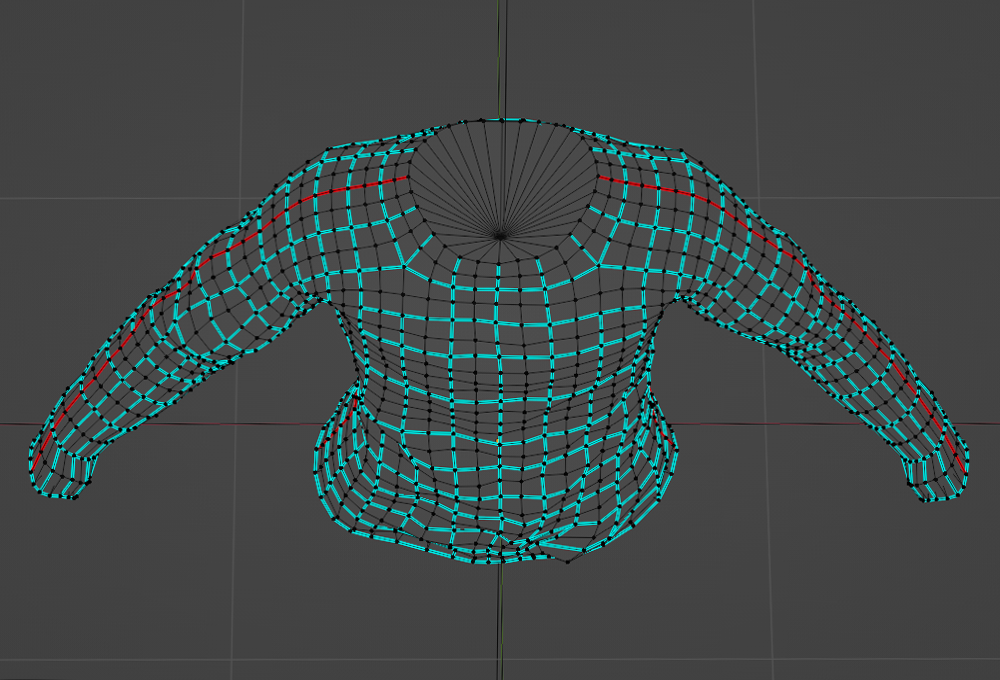
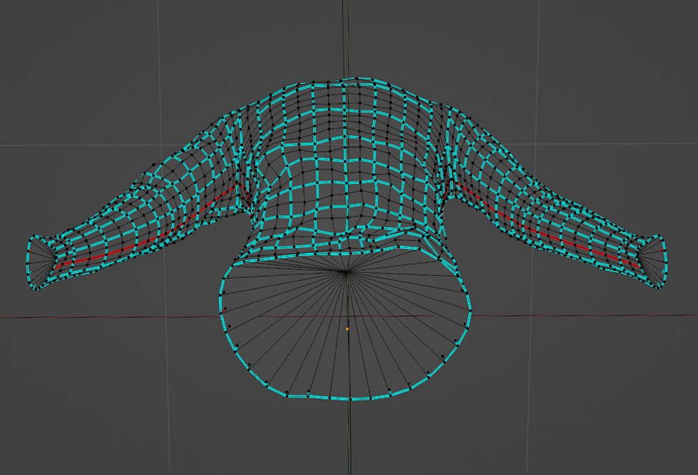

# Making Mesh Watertight

## 목차
- [Making Mesh Watertight](#making-mesh-watertight)
  - [목차](#목차)
  - [출처](#출처)
  - [다음](#다음)

---

셔츠 형태를 마무리한 후, 목, 허리, 손목의 구멍을 "밀봉"하여 메시를 **방수** 처리합니다. 방수 형태는 메시의 상단 가시 표면만이 어느 각도에서든 노출되도록 보장합니다. 자산이 방수 처리가 되어 있지 않으면 백페이스나 단일 면이 노출되어 자산의 렌더링과 장착 시 성능에 영향을 미칠 수 있습니다.

<!-- <GridContainer numColumns="2">
  <figure>
    
    <figcaption>방수 처리된 상단 보기</figcaption>
  </figure>
  <figure>
    
    <figcaption>방수 처리된 하단 보기</figcaption>
  </figure>
</GridContainer> -->

|방수 처리된 상단 보기|방수 처리된 하단 보기|
|---|---|
|||

메시를 방수 처리하려면:

1. 메시를 선택하고 **Edit Mode**로 전환합니다.
2. 메시의 구멍 중 하나를 시작으로 <kbd>Alt</kbd> 키를 누른 상태에서 **마지막 가장자리**를 클릭합니다. 전체 가장자리가 강조 표시됩니다.
3. <kbd>E</kbd>를 눌러 메시를 추출하고 짧은 길이를 추가한 후 클릭합니다.
4. 새 가장자리가 선택된 상태에서 마우스 오른쪽 버튼을 클릭하고 **Merge Vertices** > **At Center**를 선택합니다.
5. <kbd>G</kbd>를 눌러 새로운 정점을 잡고 의상 메시 내부로 재배치합니다.
6. **2-5 단계를 반복**하여 메시의 모든 내부 노출 구멍을 닫습니다.

   <!-- <video controls src="../img/04_04_Making_Mesh_Watertight/Modeling_08.mp4" width="100%"></video> -->
   

튜토리얼의 모델링 섹션을 완료했습니다. 원하는 경우, 이 단계의 [참조 프로젝트](https://prod.docsiteassets.roblox.com/assets/art/reference-files/checkpoint/1_LongSleeve-Modeling-Complete.blend)를 다운로드하여 작업과 비교해보세요.

의상을 만드는 다양한 기술이 있습니다. 다음 기술, 도구 및 프로세스를 실험하여 추가적인 독특한 자산을 만들어 보세요:

- 비대칭 의상 만들기.
- Blender의 [천 시뮬레이션](https://docs.blender.org/manual/en/latest/physics/cloth/examples.html#using-simulation-to-shape-sculpt-a-mesh) 및 기타 조각 도구.
- Blender에서 의상을 만들기 위한 다양한 커뮤니티의 바느질 및 직물 기술.

---
## 출처
 - [Making Mesh Watertight](https://create.roblox.com/docs/art/accessories/creating/watertight)

---
## [다음](./04_05_Creating_Seams_and_Unwrapping.md)