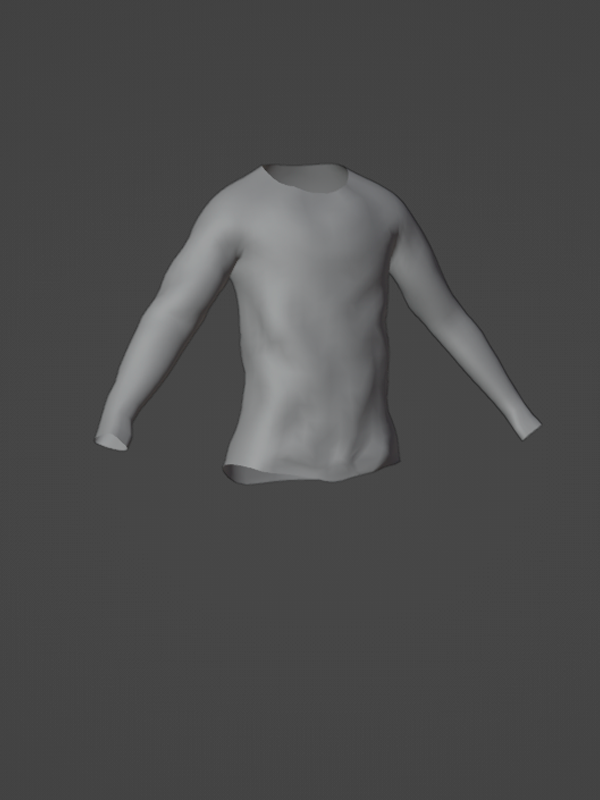
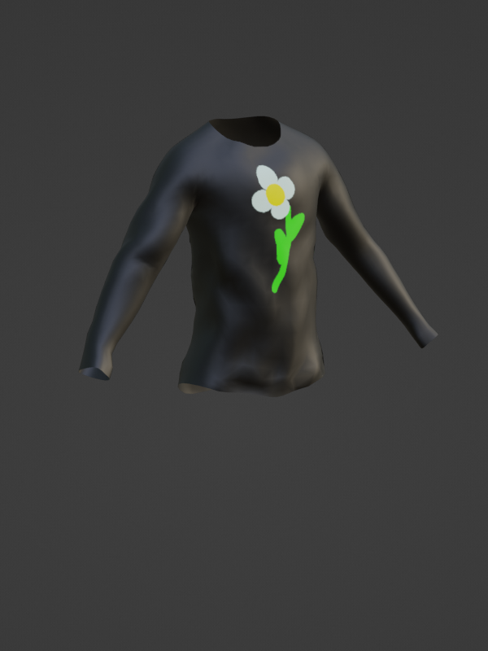
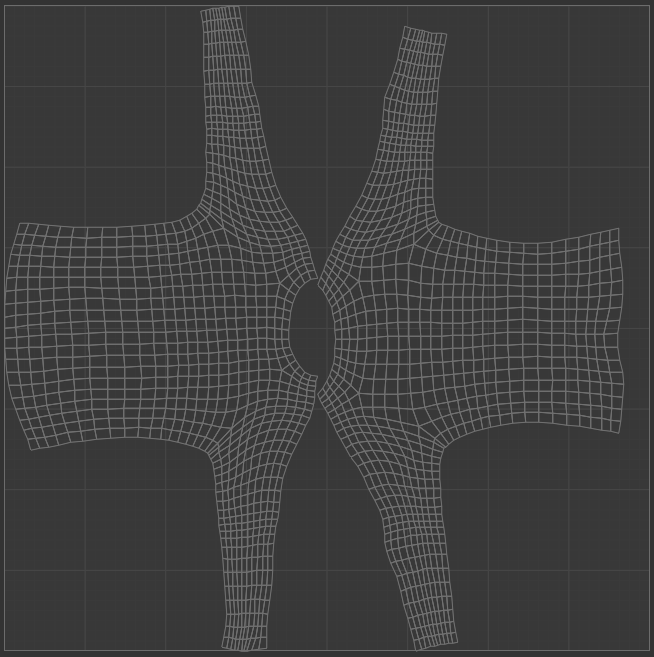

# Creating Seams and Unwrapping

## 목차
- [Creating Seams and Unwrapping](#creating-seams-and-unwrapping)
  - [목차](#목차)
  - [심 만들기](#심-만들기)
  - [UV 언래핑](#uv-언래핑)
  - [출처](#출처)
  - [다음](#다음)

---

**텍스처링**은 모델의 표면 색상, 톤, 음영을 맞춤화하는 과정입니다. 맞춤형 메시와 모델은 텍스처 맵이라는 2D 이미지를 사용하여 다양한 표면 외관 요소를 3D 객체에 투영합니다. 이 튜토리얼에서는 블렌더의 텍스처 페인트 모드를 사용하여 셔츠에 전체 색상을 적용하고 작은 디자인을 추가합니다.

이 튜토리얼은 반사율 및 표면 거칠기와 같은 현실 세계의 텍스처 속성을 재현할 수 있는 고급 텍스처인 [PBR 텍스처](https://create.roblox.com/docs/art/modeling/surface-appearance)를 다루지 않습니다. PBR 텍스처는 의류 항목에 창의성과 시각적 효과를 더해주는 데 권장되며 종종 Substance Painter와 같은 타사 응용 프로그램이 필요합니다.

<!-- <GridContainer numColumns="2">
  <figure>
    
    <figcaption>조각 후 의상 메시</figcaption>
  </figure>
  <figure>
    
    <figcaption>텍스처링 후 의상 메시</figcaption>
  </figure>
</GridContainer> -->

|조각 후 의상 메시|텍스처링 후 의상 메시|
|---|---|
|||

텍스처링 과정은 다음 단계로 구성됩니다:

1. 블렌더가 3D 객체를 펼칠 때 사용할 심을 정의하기 위해 메시에 심을 생성합니다.
2. 모델의 UV를 펼쳐서 심을 기반으로 텍스처를 적용할 앞뒤의 2D 표면을 생성합니다.
3. 2D 맵으로 저장할 새로운 텍스처 이미지를 만듭니다.
4. 블렌더의 텍스처 페인트 도구를 사용하여 맞춤형 텍스처를 페인트합니다.

## 심 만들기

텍스처링을 시작하려면 먼저 메시 표면의 **UV 맵** 또는 2D 투영을 생성해야 합니다. 이 UV 맵을 설정하기 위해 블렌더에 메시의 어느 가장자리를 심으로 사용할지 알려줍니다.

셔츠의 앞뒤를 자연스럽게 분리하는 심을 생성하려면:

1. 의상 객체를 선택한 상태에서 **Edit mode**로 전환합니다.
2. 왼쪽 상단에서 선택 모드로 이동하여 **Edge select**를 선택합니다.
3. <kbd>Alt</kbd> 키를 누른 상태에서 셔츠의 중앙 수직 가장자리를 클릭합니다. 감지된 가장자리가 강조 표시됩니다.
4. 완전한 가장자리가 선택되면 **오른쪽 클릭**하고 **Make Seam**을 선택합니다. 모델의 심을 나타내기 위해 가장자리가 강조 표시됩니다.
5. **3-4단계를 반복**하여 메시 전체에 연속적인 심을 만듭니다.
   <video controls src="../img/04_05_Creating_Seams_and_Unwrapping/Texturing_01.mp4" width="100%"></video>

## UV 언래핑

심을 적용한 후, 블렌더는 이제 메시 표면을 앞뒤 표면으로 2D 평면에 "펼칠" 방법을 알게 됩니다.

<figure>
   

   <figcaption>3D 의상 메쉬의 UV 매핑.</figcaption>
</figure>

선택한 심을 기준으로 객체의 UV를 언래핑하려면:

1. Edit 모드에서 <kbd>A</kbd>를 눌러 모든 정점을 강조 표시합니다.
2. 뷰포트 상단에서 **UV** > **Unwrap**을 선택합니다.
3. **Texture Paint** 모드로 전환하면, 객체를 선택했을 때 왼쪽 창에 UV가 표시됩니다.

   <video controls src="../img/04_05_Creating_Seams_and_Unwrapping/Texturing_02.mp4" width="100%"></video>

---
## 출처
 - [Creating Seams and Unwrapping](https://create.roblox.com/docs/art/accessories/creating/unwrapping)

---
## [다음](./04_06_Creating_Texture_Map.md)