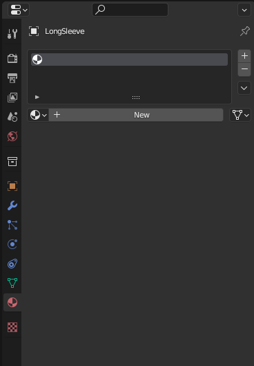
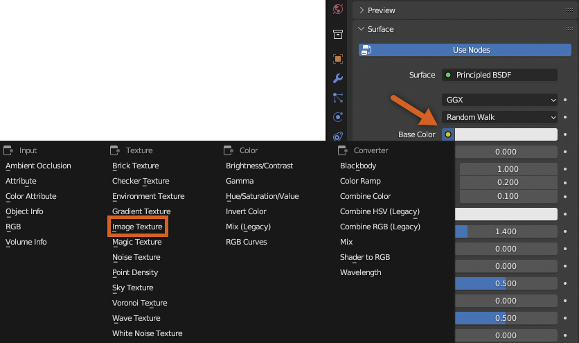

# Creating Texture Map

## 목차
- [Creating Texture Map](#creating-texture-map)
  - [목차](#목차)
  - [출처](#출처)
  - [다음](#다음)

---

심을 만들고 언래핑하는 과정은 블렌더가 의상 아이템의 3D 표면을 2D로 투영하는 방법을 알려줍니다. 텍스처 외관 변화를 적용하기 전에, 텍스처를 적용하고 저장할 특정 2D 이미지인 텍스처 맵을 생성해야 합니다.

새 텍스처 맵을 생성하려면:

1. 의상 메쉬를 선택한 상태에서 **속성 패널** > **재질 미리보기** 탭으로 이동합니다.
   

2. **+ 새로 만들기** 버튼을 선택합니다.
3. 기본 색상 옆의 **노란 점**을 선택하고 **이미지 텍스처**를 클릭합니다.
   
4. **+ 새로 만들기** 버튼을 클릭합니다.

   1. 텍스처 이미지의 이름을 의상 메쉬와 동일하게 하고 `_TXT` 접미사를 추가합니다.
   2. 색상을 검정색 또는 원하는 기본 색상으로 설정합니다.
   3. 나머지 기본 설정을 그대로 둡니다.
   4. 완료되면 **확인** 버튼을 누릅니다.

   <!-- <video controls src="../img/04_06_Creating_Texture_Map/Texturing_03.mp4" width="100%"></video> -->
   

---
## 출처
 - [Creating Texture Map](https://create.roblox.com/docs/art/accessories/creating/texture-map)

---
## [다음](./04_07_Texture_Painting.md)