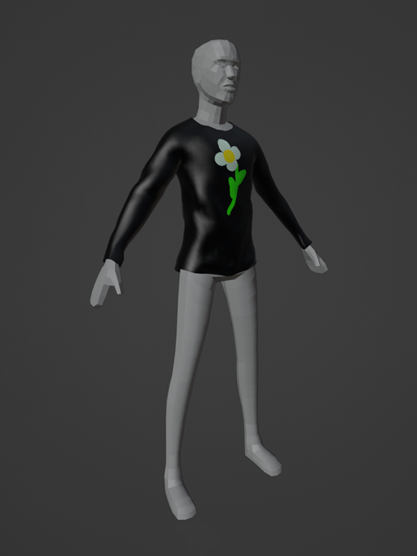
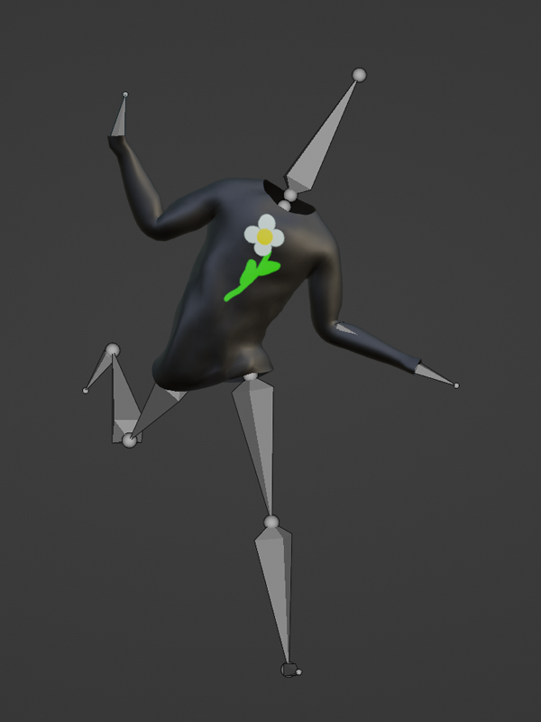
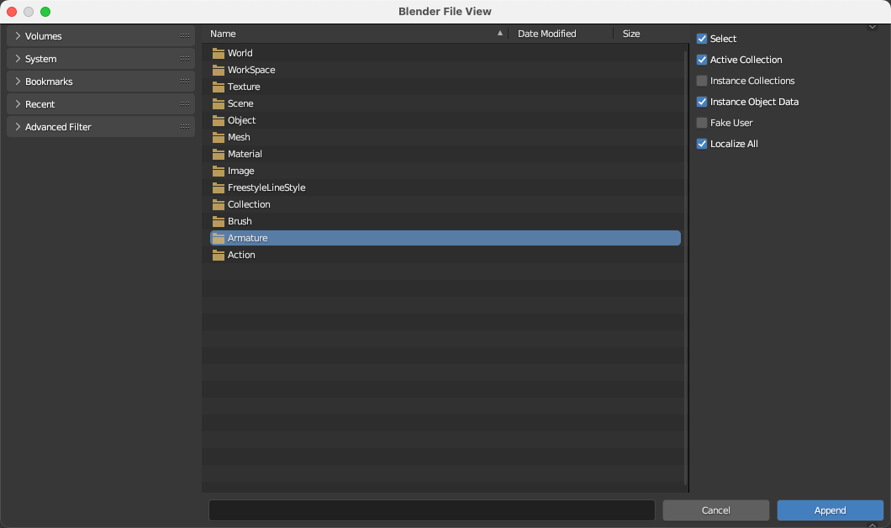
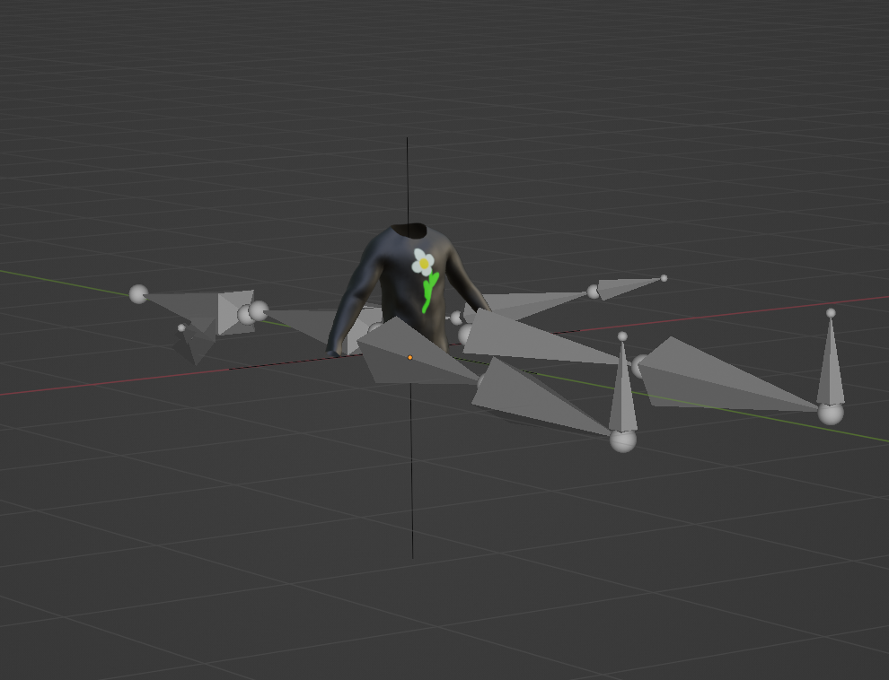
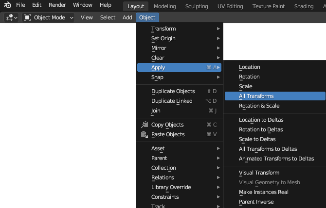
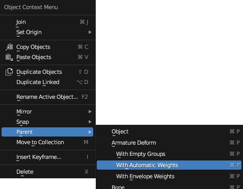

# Armature Setup

## 목차
- [Armature Setup](#armature-setup)
  - [목차](#목차)
  - [골조 전송](#골조-전송)
  - [골조 연결](#골조-연결)
  - [출처](#출처)
  - [다음](#다음)

---

**리깅**은 Roblox 캐릭터의 R15 리그와 함께 의상 객체가 움직이고 변형되도록 하는 과정입니다. 이 튜토리얼에서는 의상 아이템을 Roblox에서 제공하는 R15 골조에 연결하고 자동 스키닝 데이터를 확인합니다. 리깅을 완료한 후에는 기본 포즈를 테스트하여 의상이 캐릭터의 몸과 함께 올바르게 움직이고 늘어나는지 확인하십시오.

<!-- <GridContainer numColumns="2">
  <figure>
    
    <figcaption>리깅 데이터가 없는 의상 메쉬</figcaption>
  </figure>
  <figure>
    
    <figcaption>포즈 테스트를 수행하는 리깅 데이터가 포함된 의상 메쉬</figcaption>
  </figure>
</GridContainer> -->

|리깅 데이터가 없는 의상 메쉬|포즈 테스트를 수행하는 리깅 데이터가 포함된 의상 메쉬|
|---|---|
|||

리깅 과정은 다음과 같은 단계를 요구합니다:

1. R15 골조를 다운로드하여 프로젝트에 추가합니다.
2. Blender의 자동 가중치 기능을 사용하여 리그를 연결합니다.
3. 포즈를 테스트합니다.

## 골조 전송

Roblox는 R15 기본 골조를 제공하여 프로젝트에 가져올 수 있습니다. 직접 R15 골조 리그를 만들 수도 있지만, 미리 만들어진 리그를 가져오면 시간을 절약하고 오류 가능성을 줄일 수 있습니다.

R15 캐릭터 골조를 파일에 가져오려면:

1. Roblox의 [Rig_and_Attachments_Template.blend](https://prod.docsiteassets.roblox.com/assets/modeling/meshes/reference-files/Rig_and_Attachments_Template.blend)를 다운로드합니다. 이 프로젝트를 열지 마십시오.
2. 현재 의상 프로젝트에서 **오브젝트 모드**로 돌아갑니다.
3. **파일** > **추가**로 이동하여 저장된 **Rig_And_Attachment.blend** 파일을 선택합니다. 추가 폴더 구조가 나타납니다.

   

4. **Armature** > **Armature**를 선택하고 **추가**를 누릅니다. 작업 공간에 골조 객체가 추가됩니다.

   

5. 다음 단계로 골조를 재정렬해야 할 수 있습니다:

   1. 골조를 선택한 상태에서 **항목 도구** 사이드바를 엽니다.
   2. 골조가 메쉬와 올바르게 정렬되도록 회전을 조정합니다.
   3. 정렬 후 **오브젝트** > **적용** > **모든 변형**으로 이동하여 새로운 회전 값을 고정합니다.

      

<video controls src="../img/04_08_Armature_Setup/Rigging_01.mp4" width="100%"></video>

## 골조 연결

골조 리그가 준비되면 Blender의 **자동 가중치로 부모 연결** 기능을 사용하여 의상 메쉬를 골조의 자식으로 빠르게 설정할 수 있습니다. 이 기능은 또한 메쉬에 자동으로 버텍스 가중치, 즉 **스키닝**을 적용하여 수동으로 스키닝하는 시간을 절약할 수 있습니다.

의상을 리그에 연결하려면:

1. 의상 메쉬 객체를 선택합니다.
2. Shift를 누른 상태에서 **골조** 객체를 클릭합니다. 골조 객체가 마지막으로 선택된 객체인지 확인합니다.
3. 오른쪽 클릭하고 **부모** > **자동 가중치로**를 선택합니다.

<video controls src="../img/04_08_Armature_Setup/Rigging_02.mp4" width="100%"></video>

---
## 출처
 - [Armature Setup](https://create.roblox.com/docs/art/accessories/creating/armature-setup)

---
## [다음](./04_09_Testing_Poses.md)