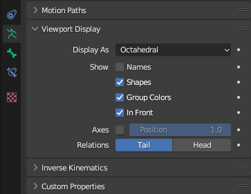

# Testing Poses

## 목차
- [Testing Poses](#testing-poses)
  - [목차](#목차)
  - [출처](#출처)
  - [다음](#다음)

---

의상 메쉬를 골조에 부모 연결한 후에는 이제 간단한 테스트를 수행하여 의상이 올바르게 변형되는지 확인할 수 있습니다.

<Alert severity ='warning'>
의상의 변형에 문제가 있는 경우, 메쉬에 스키닝 데이터를 수동으로 적용하는 기술인 가중치 페인팅으로 문제를 수정해야 할 수 있습니다.

이 튜토리얼은 가중치 페인팅 과정을 다루지 않습니다. 메쉬의 스키닝 데이터를 수동으로 페인팅하고 업데이트하는 방법에 대한 추가 리소스는 다음을 참조하십시오:

- [간단한 메쉬 스키닝](https://create.roblox.com/docs/art/modeling/skinning-a-simple-mesh)
- [휴머노이드 메쉬 스키닝](https://create.roblox.com/docs/art/modeling/skinning-a-humanoid-model)

</Alert>

의상의 움직임을 테스트하려면:

1. 골조를 선택한 상태에서 **속성 패널** > **골조 속성**으로 이동합니다.
2. **뷰포트 디스플레이** > **보기**에서 **앞에 표시**를 활성화합니다. **앞에 표시** 속성을 활성화하면 포즈를 설정할 때 쉽게 뼈를 볼 수 있고 접근할 수 있습니다.

   

3. 뷰포트에서 골조를 선택하고 **포즈 모드**로 이동합니다.
4. 다양한 뼈를 클릭하고 <kbd>R</kbd>을 눌러 회전하여 포즈를 설정합니다. <kbd>R</kbd>을 누른 후:

   1. 클릭하여 회전을 저장합니다.
   2. 저장되지 않은 회전을 취소하려면 오른쪽 클릭합니다.
   3. 회전을 저장한 경우, 뷰포트에서 오른쪽 클릭하고 **사용자 변형 지우기**를 선택하여 포즈를 재설정합니다.

5. 다양한 자연스러운 캐릭터 포즈를 시도하여 의상이 올바르게 늘어나고 맞는지 확인하십시오.

   <video controls src="../img/04_09_Testing_Poses/Rigging_03.mp4" width="100%"></video>

<Alert severity = 'success'>
튜토리얼의 리깅 섹션을 완료했습니다. 원하는 경우, 이 프로젝트의 [참조 샘플](https://prod.docsiteassets.roblox.com/assets/art/reference-files/checkpoint/3_LongSleeve-Rigging-Complete.blend)을 다운로드하여 비교할 수 있습니다.

</Alert>

---
## 출처
 - [Testing Poses](https://create.roblox.com/docs/art/accessories/creating/testing-poses)

---
## [다음](./04_10_Caging_Setup.md)