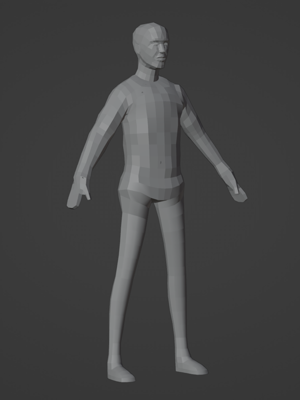
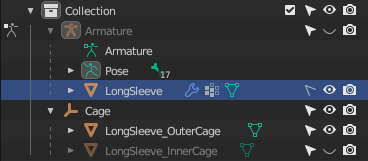
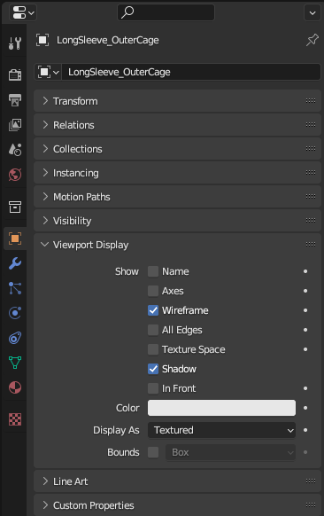

# Caging Setup

## 목차
- [Caging Setup](#caging-setup)
  - [목차](#목차)
  - [출처](#출처)
  - [다음](#다음)

---

**케이징**은 각각 내부 케이지와 외부 케이지로 불리는 의상의 내부 및 외부 표면을 설정하는 과정입니다. 이를 통해 의상이 기존 의상 및 몸 위에 층을 이루고, 추가 의상이 그 위에 층을 이룰 수 있습니다.

이 튜토리얼에서 셔츠는 케이지 템플릿을 마네킹으로 사용하여 만들어졌기 때문에, 의상 자산이 이미 맞는 내부 케이지를 조정할 필요가 없습니다. **새 의상 아이템에 맞도록 외부 케이지만 조정하면 됩니다.**

<!-- <GridContainer numColumns="2">
  <figure>
    
    <figcaption>케이징 전의 의상과 케이지 메쉬</figcaption>
  </figure>
  <figure>
    
    <figcaption>케이징 과정 후의 외부 케이지 메쉬</figcaption>
  </figure>
</GridContainer> -->

|케이징 전의 의상과 케이지 메쉬|케이징 과정 후의 외부 케이지 메쉬|
|---|---|
|||

케이징 과정은 다음 단계를 따릅니다:

1. 프로젝트에서 외부 케이지와 의상 메쉬를 분리하여 설정합니다.
2. 조각 도구를 사용하여 의상 메쉬를 감싸도록 외부 케이지를 수정합니다.

프로젝트를 설정하려면:

1. **오브젝트 모드**로 전환합니다.
2. 아웃라이너에서:
   1. 골조를 숨깁니다.
   2. LongSleeve_OuterCage 객체를 표시합니다.
3. 아웃라이너에서 **Armature** > **Long Sleeve**로 이동하여 **선택 비활성화** 아이콘을 전환합니다. 이는 의상 메쉬에 실수로 수정이 가해지는 것을 방지합니다.
   

4. OuterCage 객체를 선택하고, 오브젝트 속성으로 이동하여 **와이어프레임**을 활성화합니다. 이는 메쉬를 쉽게 시각화하고 접근하는 데 도움이 됩니다.
   

<!-- <video controls src="../img/04_10_Caging_Setup/Caging_01.mp4" width="100%"></video> -->

---
## 출처
 - [Caging Setup](https://create.roblox.com/docs/art/accessories/creating/caging-setup)

---
## [다음](./04_11_Modifying_Outer_Cage.md)