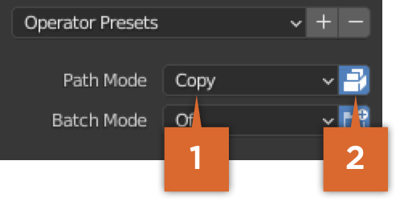
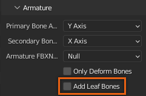
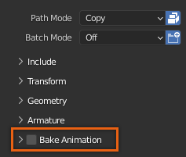

# Exporting

## 목차
- [Exporting](#exporting)
  - [목차](#목차)
  - [출처](#출처)
  - [다음](#다음)

---

스튜디오 호환 가능한 `.fbx` 파일을 보장하기 위해 Blender의 내보내기 설정을 따르는 것이 중요합니다. 파일을 내보내기 전에 조명, 카메라 또는 마네킹과 같은 여분의 객체를 제거하고 활성 수정자를 적용하거나 제거했는지 확인하십시오.

Blender에서 파일을 내보내려면:

1. 상단 메뉴에서 **파일**을 클릭합니다. 팝업 메뉴가 표시됩니다.
2. **내보내기**를 선택한 다음 `FBX (.fbx)`를 선택합니다. **Blender 파일 보기** 창이 표시됩니다.
3. 오른쪽에서 **경로 모드** 속성을 **복사**로 변경한 다음 **텍스처 포함** 버튼을 전환합니다.

   

4. 프로젝트에 .01 씬 단위 스케일이 없는 경우, **변환** > **스케일**을 `.01`로 설정합니다.

   

5. **골조** 섹션에서 **잎 뼈 추가**를 비활성화합니다.

   

6. **애니메이션 베이크**를 비활성화합니다.

     

7. **FBX 내보내기** 버튼을 클릭합니다.

이 튜토리얼의 내보내기 섹션을 완료했습니다. 원하는 경우, 내보낸 파일의 [참조 샘플](https://prod.docsiteassets.roblox.com/assets/art/accessories/creating/Long_Sleeve_Export.fbx)을 다운로드하여 비교할 수 있습니다. 다음 가져오기 단계에서 이 참조를 사용할 수 있습니다.

---
## 출처
 - [Exporting](https://create.roblox.com/docs/art/accessories/creating/exporting)

---
## [다음](./04_13_Importing.md)