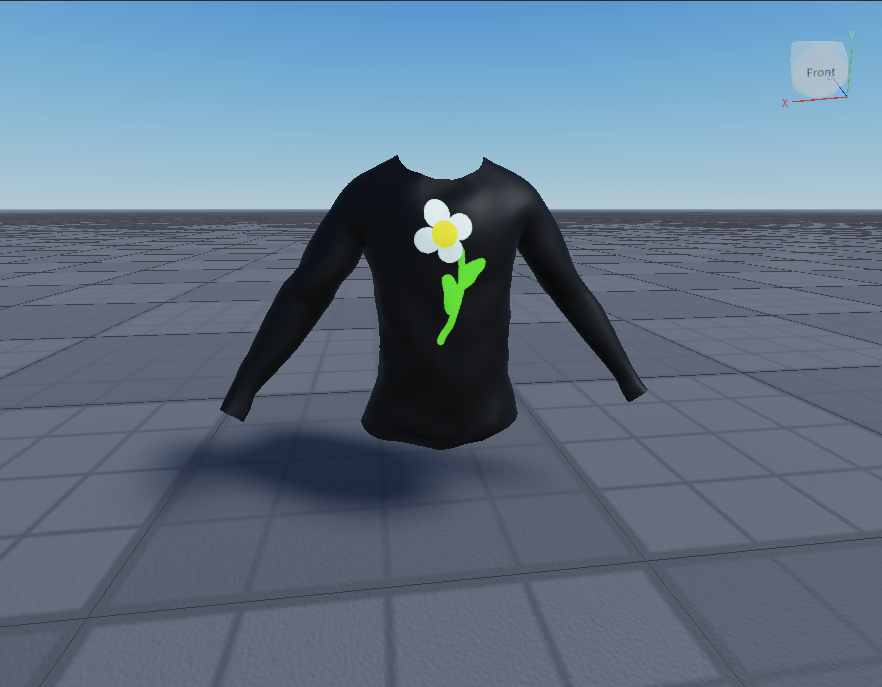

# Importing

## 목차
- [Importing](#importing)
  - [목차](#목차)
  - [출처](#출처)
  - [다음](#다음)

---

타사 모델링 도구에서 의류 아이템을 생성한 후, Studio의 3D Importer 도구를 사용하여 `.fbx` 파일을 가져와 프로젝트에 `Class.Model`로 추가합니다.

3D Importer를 사용하여 `.fbx` 파일을 Studio로 가져오려면:

1. Studio를 열고 **아바타** 탭으로 이동합니다.
2. **3D 가져오기** 버튼을 클릭합니다. 파일 탐색기가 표시됩니다.
3. 내보낸 `.fbx` 파일을 선택하고 경고나 오류가 있는지 확인합니다.
   1. 의류 메시와 관련된 경고나 오류가 있는 경우 Blender로 돌아가 해결해야 할 수 있습니다.
4. **가져오기**를 선택하여 모델을 작업 공간에 추가합니다.
   

---
## 출처
 - [Importing](https://create.roblox.com/docs/art/accessories/creating/importing)

---
## [다음](./04_14_Converting.md)