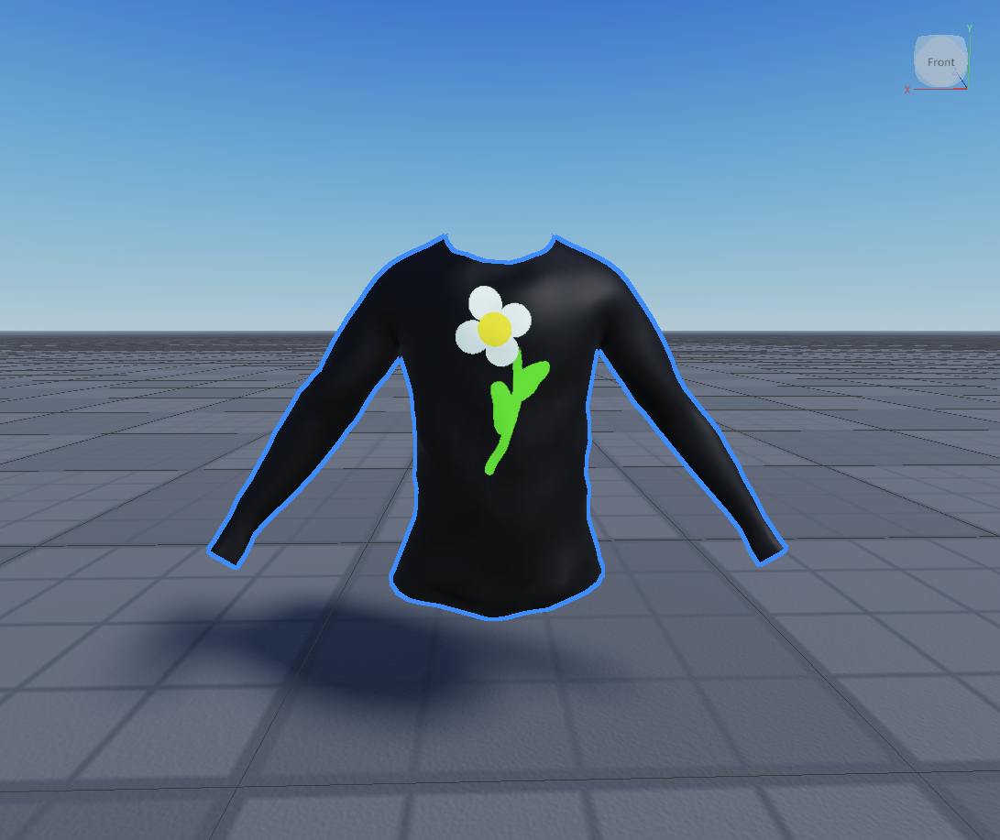
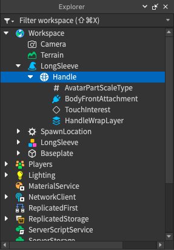

# Converting

## 목차
- [Converting](#converting)
  - [목차](#목차)
  - [출처](#출처)
  - [다음](#다음)

---

프로젝트에 `Model`을 추가한 후, 마지막 단계로 이 객체를 아바타가 장착할 수 있는 표준 `Accessory`로 변환해야 합니다. Accessory Fitting 도구를 사용하여 모델 객체를 `Accessory`로 변환한 후, 이를 경험에서 사용하거나 마켓플레이스에 게시할 수 있습니다.

액세서리 객체를 생성하려면:

1. 아바타 탭에서 **Accessory Fitting Tool**을 선택합니다. Accessory Fitting Tool 패널이 작업 공간의 왼쪽에 표시됩니다.
2. 뷰포트에서 의류 아이템의 `Model`을 선택합니다. 도구의 텍스트 필드에 선택된 객체의 이름이 채워집니다. 또는 탐색기 창에서 객체를 선택할 수도 있습니다.
3. 다양한 샘플 캐릭터, 의류 및 애니메이션을 테스트합니다. 자세한 정보는 [액세서리 테스트](https://create.roblox.com/docs/art/accessories/accessory-fitting-tool#testing-accessories)를 참조하십시오.
   - 필요한 경우 편집 기능을 사용하여 작은 케이지 조정을 수행합니다. 더 큰 케이지 변경이 필요한 경우 타사 모델링 소프트웨어로 돌아가서 자산을 다시 내보내야 할 수 있습니다.
4. 액세서리를 생성할 준비가 되면 **Generate MeshPart Accessory**를 클릭합니다. 모델이 포함된 액세서리 객체가 작업 공간에 표시됩니다.
   도구에 대한 추가 정보와 문서는 [Accessory Fitting Tool](https://create.roblox.com/docs/art/accessories/accessory-fitting-tool)을 참조하십시오.

<!-- <GridContainer numColumns="2">
  <figure>
    
    <figcaption>작업 공간의 의류 액세서리</figcaption>
  </figure>
  <figure>
    
    <figcaption>탐색기의 의류 액세서리</figcaption>
  </figure>
</GridContainer> -->

|작업 공간의 의류 액세서리|탐색기의 의류 액세서리|
|---|---|
|||

<Alert severity = 'success'>
축하합니다, 의류 튜토리얼을 완료하셨습니다. 이 액세서리를 통해 다음을 할 수 있습니다:

- 액세서리를 기존 모델에 드래그 앤 드롭하거나 [HumanoidDescription](https://create.roblox.com/docs/characters/appearance#humanoiddescription)을 사용하여 아바타 준비가 된 캐릭터에 장착할 수 있습니다.
- 나중에 경험에서 사용할 수 있도록 액세서리를 [아바타 자산](https://create.roblox.com/docs/projects/assets#for-avatars)으로 저장할 수 있습니다.
- 특정 계정 요구 사항을 충족하는 경우, [자산을 업로드](https://create.roblox.com/docs/art/marketplace/publishing-to-marketplace)하여 검토를 거쳐 마켓플레이스에서 판매를 시작할 수 있습니다.
</Alert>

---
## 출처
 - [Converting](https://create.roblox.com/docs/art/accessories/creating/converting)

---
## [다음](./05_00_Creating_with_Templates.md)