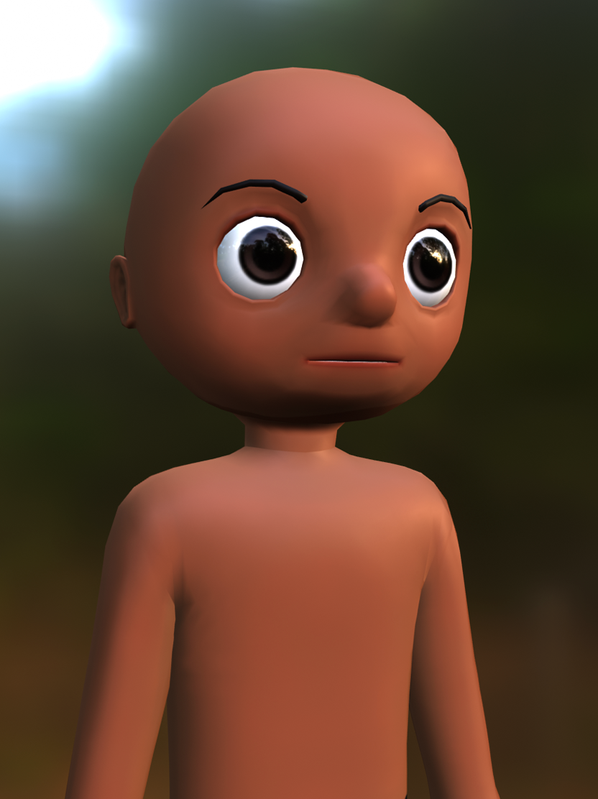
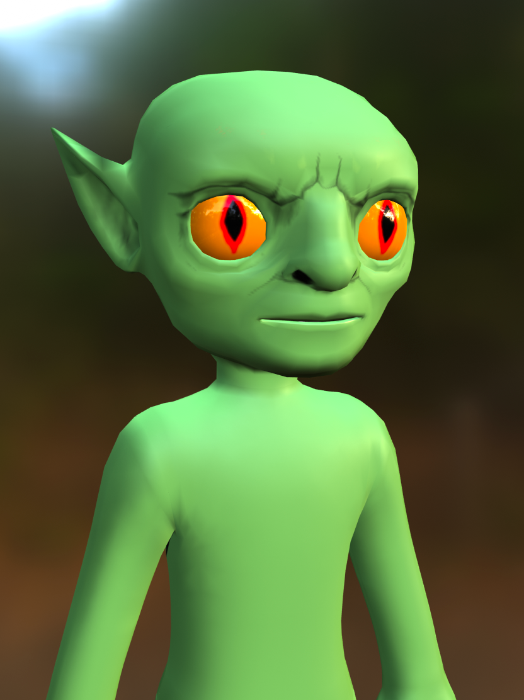

# Creating with Templates

## 목차
- [Creating with Templates](#creating-with-templates)
  - [목차](#목차)
  - [출처](#출처)
  - [다음](#다음)

---

Blender와 Roblox의 다운로드 가능한 템플릿 모델 중 하나를 사용하여 자신만의 커스텀 아바타 캐릭터를 만들 수 있습니다. 템플릿을 사용하면 아머처 설정, 리깅, 스키닝, 얼굴 애니메이션 설정과 같은 복잡한 과정을 건너뛰어 많은 시간을 절약할 수 있습니다.

이 튜토리얼은 모든 수준의 창작자를 대상으로 하며, 적당한 Blender 경험을 가진 사람이 독특한 캐릭터를 만들 수 있도록 구성되었습니다:

1. 시간 절약형 Blender 설정이 포함된 기본 템플릿 선택
2. 비파괴적 스컬핑 워크플로를 사용한 모델링
3. Blender의 텍스처 페인트 도구를 사용한 텍스처링
4. 템플릿의 케이지 메쉬 객체를 편집하여 자산 케이지 처리
5. 프로젝트를 내보낼 수 있도록 정리 및 준비
6. Studio에서 사용하거나 테스트하기 위해 자산 내보내기

<!-- <GridContainer numColumns="2">
  <figure>  <figcaption>시작 템플릿 모델</figcaption></figure>

  <figure><figcaption>수정 후 모델 예시</figcaption></figure>
</GridContainer> -->

|시작 템플릿 모델|수정 후 모델 예시|
|---|---|
|||

<Alert severity = 'info'>
이 가이드는 캐릭터 템플릿을 커스터마이징하기 위한 실용적인 예로 [Blender 3.4+](https://www.blender.org/download/releases/3-4/)를 사용합니다. 시작하기 전에 Blender의 인터페이스, 도구 및 보기 컨트롤에 대한 기본 지식을 갖추고 있어야 합니다.

다른 프로그램을 사용하는 경우에도 이 튜토리얼의 일반적인 워크플로를 해당 프로그램의 유사한 도구로 적용할 수 있습니다.
</Alert>

---
## 출처
 - [Creating with Templates](https://create.roblox.com/docs/art/characters/creating)

---
## [다음](./05_01_Template_Files.md)