# Template Files

## 목차
- [Template Files](#template-files)
  - [목차](#목차)
  - [출처](#출처)
  - [다음](#다음)

---

각 템플릿에는 맞춤형 아바타 캐릭터를 만드는 데 필요한 [필수 구성 요소](https://create.roblox.com/docs/art/characters#components-of-an-avatar)가 미리 포함되어 있어 시간을 절약하고 노력을 줄일 수 있습니다. 캐릭터를 처음부터 만드는 경우, 이러한 개별 구성 요소는 일반적으로 많은 시간과 모델링 애플리케이션에 대한 깊은 기술적 배경을 필요로 합니다. 템플릿을 사용하면 여러 단계를 건너뛰고 다양한 기본 캐릭터 형태로 작업할 수 있습니다.

<table>
<thead>
  <tr>
    <th>템플릿 프로토타입</th>
    <th></th>
    <th>샘플 커스터마이징</th>
  </tr>
</thead>
<tbody>
  <tr>
    <td>
    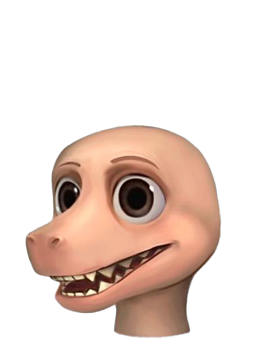 
머즐 헤드 템플릿

    </td>
    <td>
    </td>
    <td>
    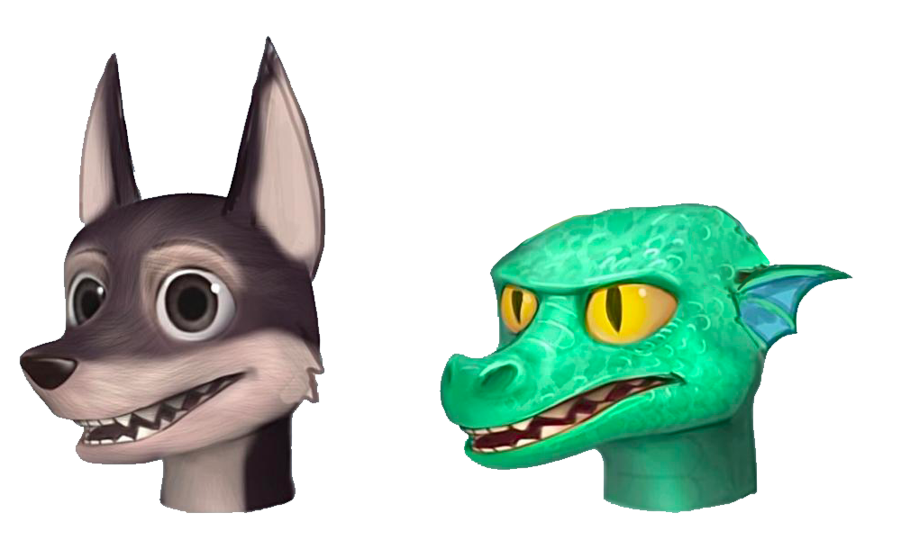 
    </td>
  </tr>
  <tr>
    <td>
    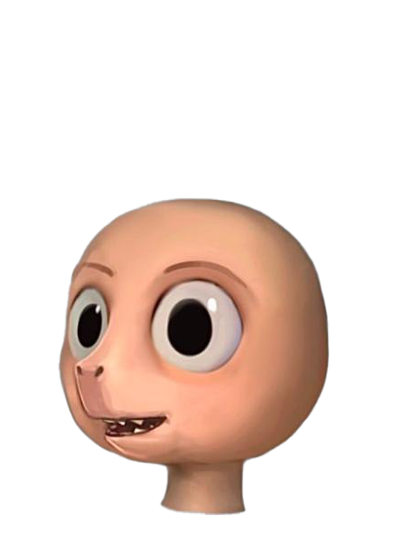 
라운드 헤드 템플릿

    </td>
   <td>
    </td>
    <td>
    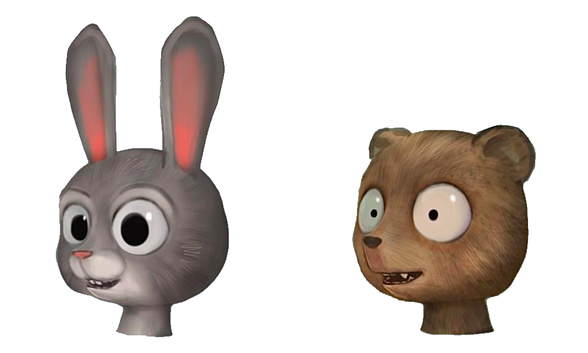 
    </td>
  </tr>
</tbody>
</table>

최종 디자인에 가장 잘 맞는 템플릿을 선택하고 기술적 구성 요소를 만드는 데 시간을 절약할 수 있습니다. 템플릿 튜토리얼의 예제에서는 [라운드 블렌더 템플릿](https://prod.docsiteassets.roblox.com/assets/art/reference-files/RoundMale.zip)을 사용합니다. 다른 템플릿을 실험하여 독특한 캐릭터와 최종 결과를 만들어 보세요.

각 `.zip` 파일에는 템플릿 모델에 대한 `.blend`, `.fbx`, 및 PBR 텍스처 `.png` 파일이 포함되어 있습니다. Blender를 사용하거나 [템플릿 생성 가이드](https://create.roblox.com/docs/art/characters/creating)를 따르는 경우 `.blend` 프로젝트를 사용하세요.

<!-- <Tabs>
  <TabItem label="Head Shapes">
  <GridContainer numColumns="2">
  <figure>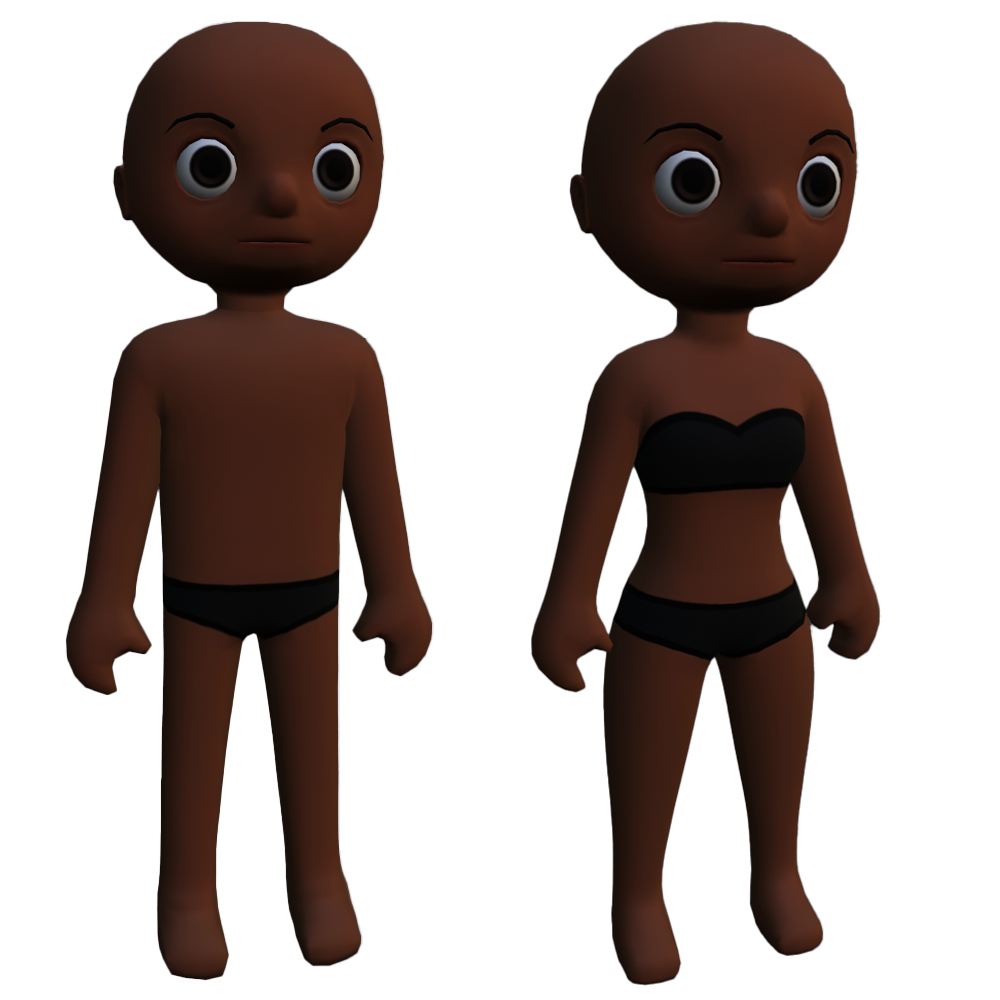<figcaption>
라운드
</figcaption></figure>
  <figure>
    
  Female: <a href="https://prod.docsiteassets.roblox.com/assets/art/reference-files/RoundFemale.zip">RoundFemale.zip</a>  
  Male: <a href="https://prod.docsiteassets.roblox.com/assets/art/reference-files/RoundMale.zip">RoundMale.zip</a>
  </figure>
  </GridContainer>
  <GridContainer numColumns="2">
  <figure>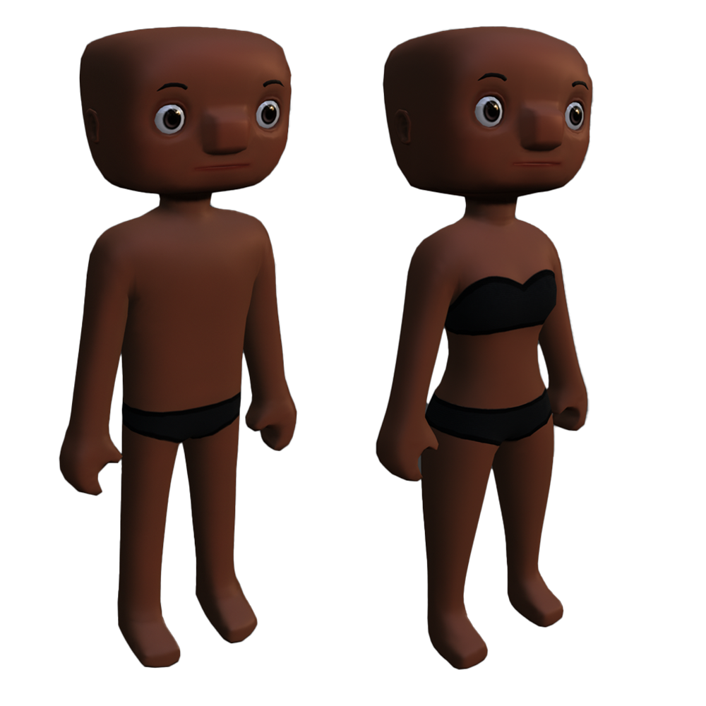<figcaption>
스퀘어
</figcaption></figure>
  <figure>
    
  Female: <a href="https://prod.docsiteassets.roblox.com/assets/art/reference-files/SquareFemale.zip">SquareFemale.zip</a>  
  Male: <a href="https://prod.docsiteassets.roblox.com/assets/art/reference-files/SquareMale.zip">SquareMale.zip</a>
  </figure>
  </GridContainer>
  <GridContainer numColumns="2">
  <figure>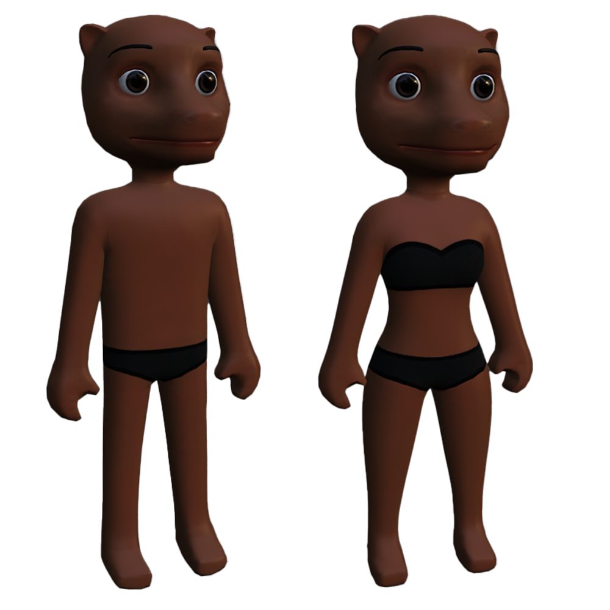<figcaption>
머즐
</figcaption></figure>
  <figure>
    
  Female: <a href="https://prod.docsiteassets.roblox.com/assets/art/reference-files/MuzzleFemale.zip">MuzzleFemale.zip</a>  
  Male: <a href="https://prod.docsiteassets.roblox.com/assets/art/reference-files/MuzzleMale.zip">MuzzleMale.zip</a>
  </figure>
  </GridContainer>
  </TabItem>
  <TabItem label="Realistic">
  <GridContainer numColumns="2">
  <figure>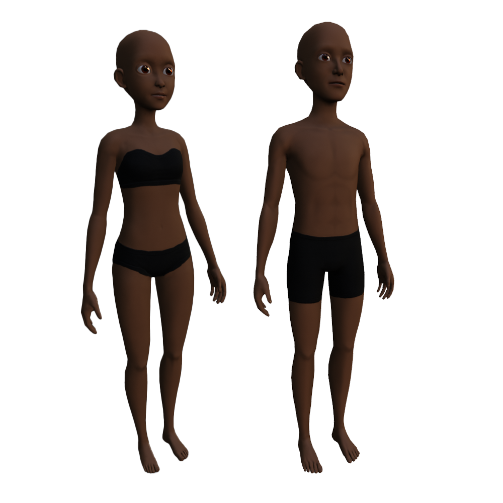<figcaption>
리얼리스틱
</figcaption></figure>
  <figure>
  Female: <a href="https://prod.docsiteassets.roblox.com/assets/art/reference-files/SemiRealisticFemale.zip">SemiRealisticFemale.zip</a>  
  Male: <a href="https://prod.docsiteassets.roblox.com/assets/art/reference-files/SemiRealisticMale.zip">SemiRealisticMale.zip</a>
  </figure>
  </GridContainer>
  </TabItem>
  <TabItem label="Anime">
  <GridContainer numColumns="2">
  <figure>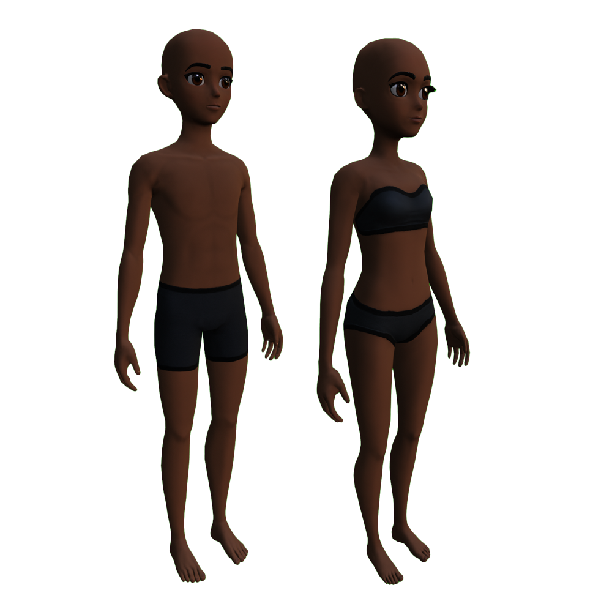<figcaption>
애니메
</figcaption></figure>
  <figure>
   Female: <a href="https://prod.docsiteassets.roblox.com/assets/art/reference-files/AnimeFemale.zip">AnimeFemale.zip</a>  
   Male: <a href="https://prod.docsiteassets.roblox.com/assets/art/reference-files/AnimeMale.zip">AnimeMale.zip</a>  
  </figure>
  </GridContainer>
  </TabItem>
    <TabItem label="Stylized">
  <GridContainer numColumns="2">
  <figure>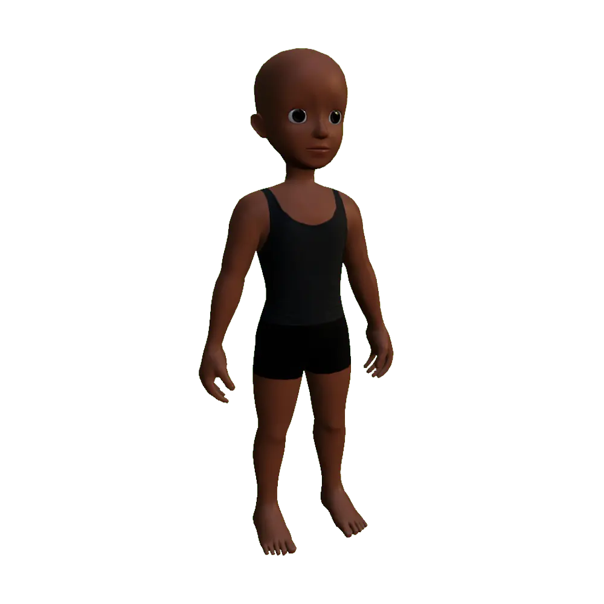<figcaption>
스타일라이즈드
</figcaption></figure>
  <figure>
   Single body: <a href="https://prod.docsiteassets.roblox.com/assets/art/reference-files/StylizedHuman.zip">Stylized.zip</a>  
  </figure>
  </GridContainer>
  </TabItem>
  <TabItem label="Caricature">
  <GridContainer numColumns="2">
  <figure>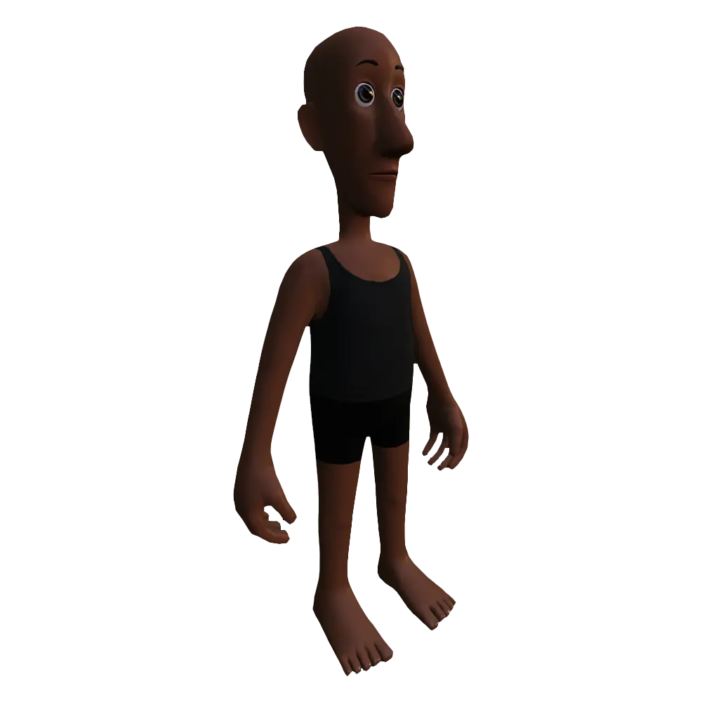<figcaption>
캐리커처
</figcaption></figure>
  <figure>
  Single body: <a href="https://prod.docsiteassets.roblox.com/assets/art/reference-files/Caricature.zip">Caricature.zip</a>
  </figure>
  </GridContainer>
  </TabItem>
</Tabs> -->

**Head Shapes**
|<figure><figcaption>
라운드
</figcaption></figure>|Female: <a href="https://prod.docsiteassets.roblox.com/assets/art/reference-files/RoundFemale.zip">RoundFemale.zip</a>    Male: <a href="https://prod.docsiteassets.roblox.com/assets/art/reference-files/RoundMale.zip">RoundMale.zip</a>|
|---|---|
|<figure><figcaption>
스퀘어
</figcaption></figure>|Female: <a href="https://prod.docsiteassets.roblox.com/assets/art/reference-files/SquareFemale.zip">SquareFemale.zip</a>  Male: <a href="https://prod.docsiteassets.roblox.com/assets/art/reference-files/SquareMale.zip">SquareMale.zip</a>|
|<figure><figcaption>
머즐
</figcaption></figure>|Female: <a href="https://prod.docsiteassets.roblox.com/assets/art/reference-files/MuzzleFemale.zip">MuzzleFemale.zip</a>  Male: <a href="https://prod.docsiteassets.roblox.com/assets/art/reference-files/MuzzleMale.zip">MuzzleMale.zip</a>|

**Realistic**

|<figure><figcaption>
리얼리스틱
</figcaption></figure>|Female: <a href="https://prod.docsiteassets.roblox.com/assets/art/reference-files/SemiRealisticFemale.zip">SemiRealisticFemale.zip</a>  Male: <a href="https://prod.docsiteassets.roblox.com/assets/art/reference-files/SemiRealisticMale.zip">SemiRealisticMale.zip</a>|
|---|---|

**Anime**

|<figure><figcaption>
애니메
</figcaption></figure>|Female: <a href="https://prod.docsiteassets.roblox.com/assets/art/reference-files/AnimeFemale.zip">AnimeFemale.zip</a>  Male: <a href="https://prod.docsiteassets.roblox.com/assets/art/reference-files/AnimeMale.zip">AnimeMale.zip</a>|
|---|---|

**Stylized**

|<figure><figcaption>
스타일라이즈드
</figcaption></figure>|Single body: <a href="https://prod.docsiteassets.roblox.com/assets/art/reference-files/StylizedHuman.zip">Stylized.zip</a>|
|---|---|

**Caricature**

|<figure><figcaption>
캐리커처
</figcaption></figure>|Single body: <a href="https://prod.docsiteassets.roblox.com/assets/art/reference-files/Caricature.zip">Caricature.zip</a>|
|---|---|

템플릿 파일을 다운로드한 후, [독특한 헤드 객체 구조](https://create.roblox.com/docs/art/characters/creating/head-objects) 및 내보내기 전에 조정해야 하는 [추가 Blender 설정](https://create.roblox.com/docs/art/characters/creating/blender-configurations)을 검토하세요. 이러한 개념을 이해하지 못하면 Roblox의 아바타 요구 사항과 충돌할 수 있으므로 변경하기 전에 반드시 이해하는 것이 중요합니다.

---
## 출처
 - [Template Files](https://create.roblox.com/docs/art/characters/creating/template-files)

---
## [다음](./05_02_Template_Head_Structure.md)