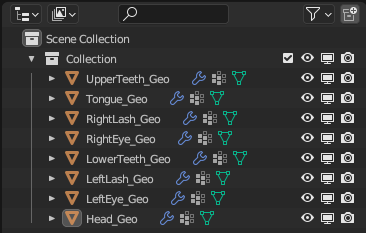
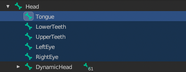

# Template Head Structure

## 목차
- [Template Head Structure](#template-head-structure)
  - [목차](#목차)
  - [출처](#출처)
  - [다음](#다음)

---

각 템플릿 파일에는 각 아바타 몸체에 추가 헤드 메시 객체와 얼굴 골격 뼈가 포함되어 있습니다. 템플릿 내에서 이러한 객체를 분리하면 텍스처링 단계에서 보여준 것처럼 각각의 객체를 더 쉽게 변경할 수 있습니다.

검증 오류를 피하기 위해서는 내보내기 전에 이러한 추가 객체를 [결합](https://create.roblox.com/docs/art/characters/creating/combining-head-geometry)하고 [제거](https://create.roblox.com/docs/art/characters/creating/removing-extra-bones)해야 합니다.

추가 헤드 메시 객체는 다음과 같습니다:
<!-- <GridContainer numColumns="2">

  <figure>
   - Head_Geo
   - UpperTeeth_Geo
   - LowerTeeth_Geo
   - Tongue_Geo
   - RightLash_Geo
   - RightEye_Geo
   - LeftLash_Geo
   - LeftEye_Geo
</figure>

  <figure><figcaption>블렌더의 아웃라이너에 있는 추가 헤드 관련 메시</figcaption></figure>
</GridContainer> -->

   - Head_Geo
   - UpperTeeth_Geo
   - LowerTeeth_Geo
   - Tongue_Geo
   - RightLash_Geo
   - RightEye_Geo
   - LeftLash_Geo
   - LeftEye_Geo

  <figure><figcaption>블렌더의 아웃라이너에 있는 추가 헤드 관련 메시</figcaption></figure>

추가 헤드 뼈 자식은 다음과 같으며 템플릿에 따라 다를 수 있습니다:

<!-- <GridContainer numColumns="2">

  <figure>
   - Tongue
   - LowerTeeth
   - UpperTeeth
   - LeftEye
   - RightEye
</figure>

  <figure><figcaption>블렌더의 아웃라이너에 있는 추가 헤드 관련 뼈</figcaption></figure>
</GridContainer> -->

   - Tongue
   - LowerTeeth
   - UpperTeeth
   - LeftEye
   - RightEye

<figure><figcaption>블렌더의 아웃라이너에 있는 추가 헤드 관련 뼈</figcaption></figure>

이러한 추가 객체들은 생성 및 수정 과정을 돕기 위해 존재하지만, 최종 내보내기 시 프로젝트에 남아있으면 이러한 자산을 마켓플레이스에 업로드할 때 검증 문제를 일으킬 수 있습니다.

---
## 출처
 - [Template Head Structure](https://create.roblox.com/docs/art/characters/creating/head-objects)

---
## [다음](./05_03_Blender_Configuration.md)