# Blender Configuration

## 목차
- [Blender Configuration](#blender-configuration)
  - [목차](#목차)
    - [계층 구조](#계층-구조)
    - [비활성화된 객체](#비활성화된-객체)
    - [사용자 지정 피부 톤](#사용자-지정-피부-톤)
      - [피부 톤 미리 보기](#피부-톤-미리-보기)
      - [내보내기 설정](#내보내기-설정)
    - [씬 스케일](#씬-스케일)
    - [애니메이션 범위](#애니메이션-범위)
  - [출처](#출처)
  - [다음](#다음)

---

각 템플릿의 Blender 프로젝트 파일에는 raw `.fbx` 템플릿 파일에 포함되지 않은 추가적인 헬퍼 설정이 포함되어 있습니다. Blender를 사용하여 캐릭터를 생성하려면 `.blend` 버전 템플릿에 포함된 추가 항목과 그 기능을 이해하는 것이 중요합니다.

### 계층 구조

다음은 각 Blender 템플릿 파일에 포함된 내용을 설명합니다:

- **Cage**: 캐릭터의 15개의 외부 바디 케이지 메시를 포함합니다.
- **Joints**: 다음 객체를 포함하는 부모 골격 객체:
  - 캐릭터의 리깅 골격을 구성하는 **뼈**.
  - 아바타의 외관을 구성하는 **_Geo** 메시 객체.
  - 액세서리를 장착할 때 부착 위치를 정의하는 **_Att** 부착 객체.
  - 얼굴 애니메이션 데이터와 포즈를 저장하는 **애니메이션 데이터**.
- **Fill** 및 **Sun**: 조명을 제공하여 Studio의 기본 조명과 유사한 중립 조명에서 캐릭터를 미리 볼 수 있도록 돕는 객체. 이는 아바타 캐릭터의 일부가 아닙니다.

<figure>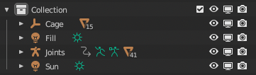<figcaption>Blender 프로젝트 계층 구조</figcaption></figure>

### 비활성화된 객체

Blender 템플릿 프로젝트 파일을 사용할 때 첨부 객체와 같은 일부 객체가 **뷰포트에서 비활성화** 아이콘 를 전환해도 뷰포트에서 영구적으로 숨겨져 있는 것을 볼 수 있습니다. 첨부 객체는 캐릭터 생성 과정의 끝까지 수정되지 않는 경우가 많기 때문에, 이러한 객체는 프로젝트의 효율적인 조직을 위해 **뷰포트에서 비활성화** 가 활성화되어 있습니다.

<figure>
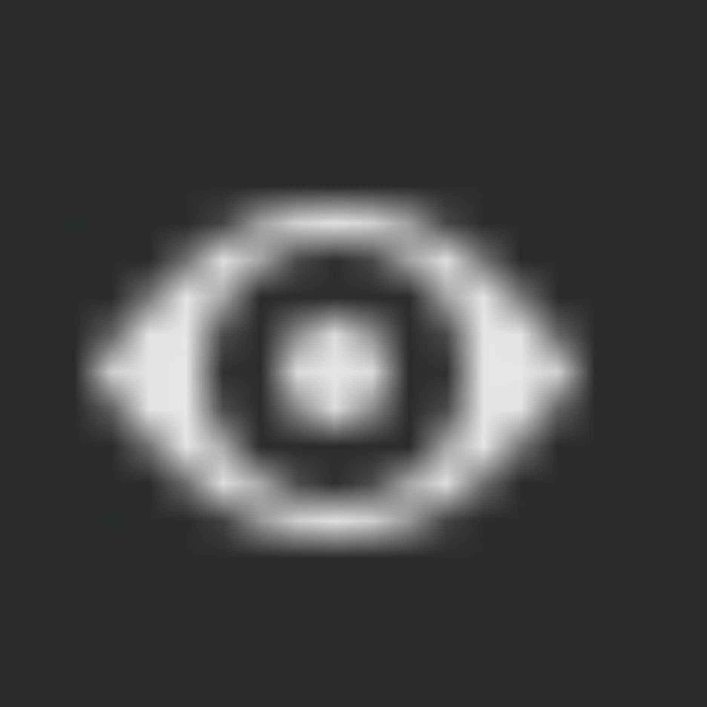
<figcaption>Visibility-Icon</figcaption>
</figure>
<figure>
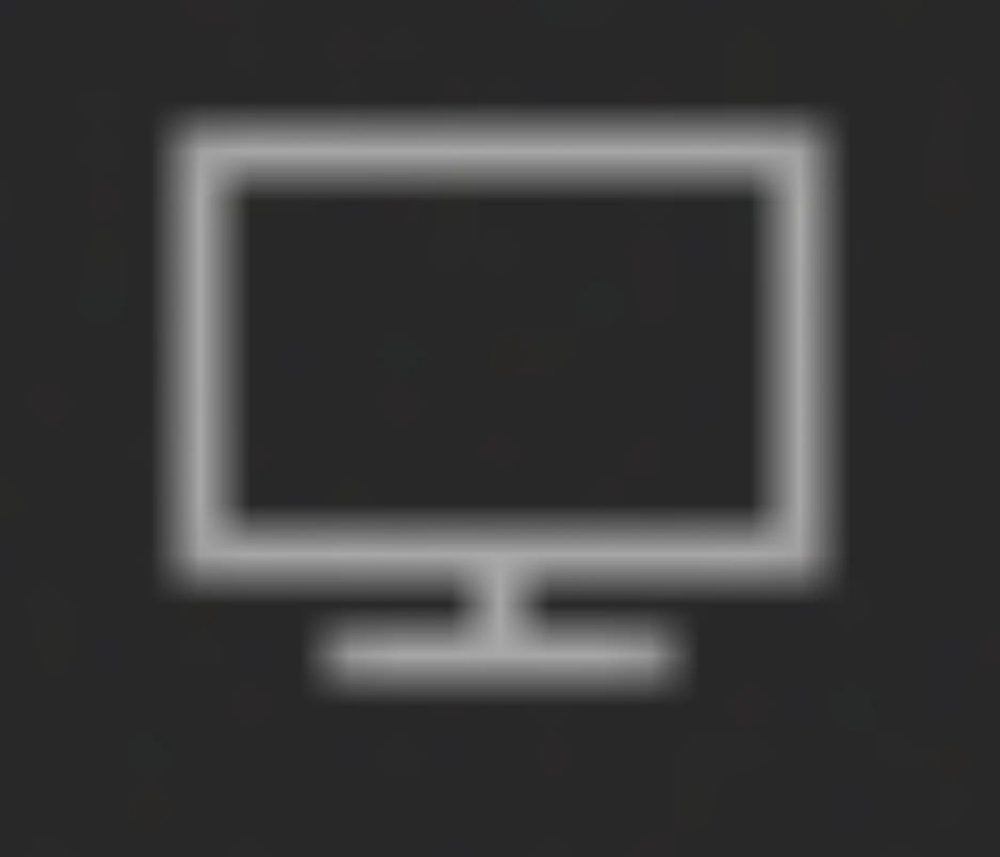
<figcaption>Disabled-Icon</figcaption>
</figure>

비활성화된 객체에 접근하려면 다음 지침을 따르십시오:

1. 아웃라이너에서 **필터** 드롭다운을 클릭합니다.

   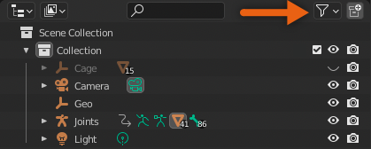

2. **뷰포트에서 비활성화** 필터를 활성화합니다.

   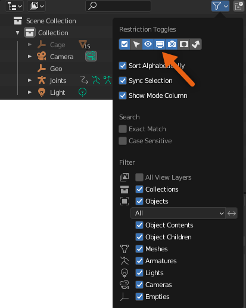

3. 이제 아웃라이너의 각 객체 옆에 **뷰포트에서 비활성화** 아이콘이 나타납니다. 아이콘을 전환하여 객체의 비활성 상태를 변경합니다.
   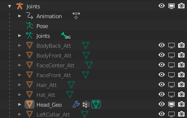

### 사용자 지정 피부 톤

Blender 프로젝트 파일에는 사용자가 피부 톤을 사용자 지정할 때 Roblox에서 표시되는 방식과 유사하게 사용자 지정 피부 톤을 미리 볼 수 있는 셰이더 구성이 포함되어 있습니다.

투명도가 전체 또는 부분적으로 포함된 텍스처는 기본 `Part.Color`를 통해 적용된 텍스처를 노출시켜 사용자가 사용자 지정 피부 톤으로 아바타 캐릭터를 개인화할 수 있습니다.

<!-- <GridContainer numColumns="2">
  <figure>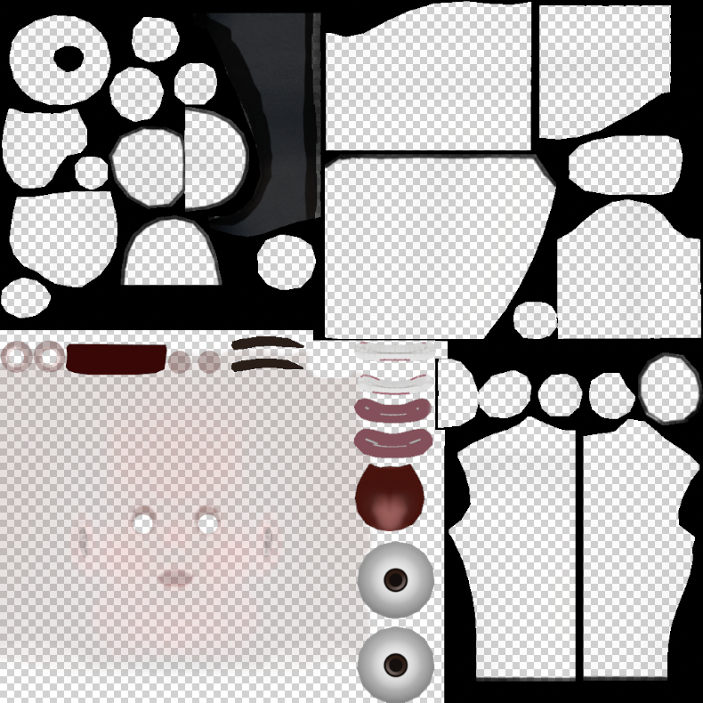 <figcaption>낮은 불투명도를 사용하여 기본 피부색을 드러내고 높은 불투명도를 사용하여 속옷, 눈썹, 입, 눈에 완전히 불투명한 색을 적용한 텍스처 맵 예시.</figcaption></figure>

  <figure>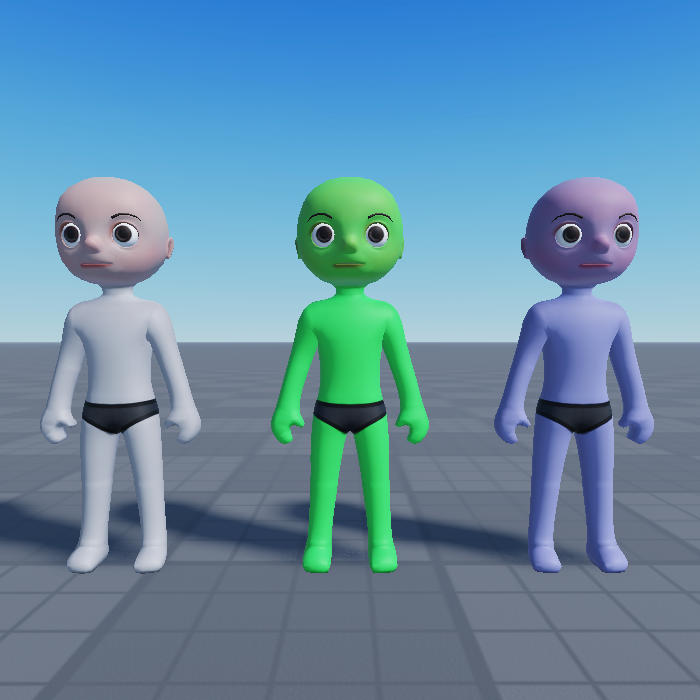<figcaption>동일한 텍스처 맵을 사용하는 동일한 아바타 캐릭터. 각 모델은 기본 부품 색상이 다르며, 텍스처 맵이 완전한 색상을 적용하는 곳은 예외.</figcaption></figure>
</GridContainer> -->

|<figure> <figcaption>낮은 불투명도를 사용하여 기본 피부색을 드러내고 높은 불투명도를 사용하여 속옷, 눈썹, 입, 눈에 완전히 불투명한 색을 적용한 텍스처 맵 예시.</figcaption></figure>|<figure><figcaption>동일한 텍스처 맵을 사용하는 동일한 아바타 캐릭터. 각 모델은 기본 부품 색상이 다르며, 텍스처 맵이 완전한 색상을 적용하는 곳은 예외.</figcaption></figure>|
|---|---|

#### 피부 톤 미리 보기

<Alert severity = 'warning'>
도움이 되는 셰이더 구성이 올바르게 렌더링되도록 하려면 **Blender 3.4+**를 사용해야 합니다. 이전 버전의 Blender를 사용하는 경우 텍스처가 예상대로 렌더링되지 않을 수 있습니다.
</Alert>

Blender 프로젝트 파일에는 사용자 지정 피부 톤이 Studio에서 표시되는 방식과 유사하게 미리 볼 수 있는 셰이더 구성이 포함되어 있습니다. 이러한 사용자 지정 색상은 모델과 함께 내보내지 않지만, 사용자 지정 피부 색상과 텍스처가 Roblox에서 어떻게 보일지에 대한 빠른 시각적 참조를 제공합니다.

이 Blender 셰이더 구성에 대해 다음 요구 사항을 염두에 두십시오:

- 텍스처가 예상대로 렌더링되도록 하려면 **뷰포트 셰이딩** 모드로 전환해야 합니다.
  <figure>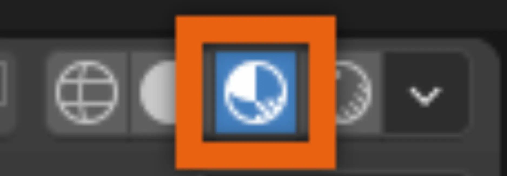</figure>
- 텍스처를 교체할 때, 노멀 맵의 색상 공간이 **NonColor** 대신 **SRGB**로 되돌아갈 수 있습니다. 이 경우, 노멀 맵이 올바르게 렌더링되도록 색상 공간을 다시 변경해야 할 수 있습니다.

Blender에서 캐릭터의 피부 톤을 미리 보려면:

1. **레이아웃**에서 **Head_Geo**와 같은 지오메트리 객체를 선택합니다.
2. **셰이딩** 탭으로 이동합니다.
3. 노드 패널에서 **객체**가 선택되어 있는지 확인합니다.
4. **Mix** 노드에 연결된 **PartColor** 노드를 찾습니다.
5. 노드에서 색상과 값을 선택하여 참조 사용자 지정 피부 톤을 적용합니다.
   <video
   controls
   src="../img/05_03_Blender_Configuration/Color_Picker_01.mp4"
   width="100%"></video>

#### 내보내기 설정

피부 톤 미리 보기 기능은 Roblox에서 템플릿의 색상 및 톤 호환성을 확인하는 중요한 요소이지만, 최종 `.fbx` 파일에 색상 텍스처 맵이 자동으로 포함되는 것을 방지합니다. 모델을 내보내기 전에 이를 해결하는 두 가지 방법이 있습니다:

1. 셰이딩 탭에서 **Mix** 노드를 분리하고 **ColorMap** 노드로 대체합니다.
2. 텍스처를 별도의 이미지 파일로 수동 내보내고 나중에 Studio에서 추가합니다.

두 가지 내보내기 워크플로 중 하나를 수행하는 방법에 대한 지침은 [텍스처 내보내기](../../../art/characters/creating/exporting-textures.md)를 참조하십시오.

### 씬 스케일

<Alert severity = 'warning'>
Blender 다운로드 템플릿을 사용하는 경우 이 섹션을 건너뛸 수 있습니다. 템플릿의 `.blend` 버전에는 Blender 프로젝트 설정을 설정할 때 필요한 많은 프로젝트 설정이 이미 포함되어 있습니다.
</Alert>

모델링 애플리케이션에서 Roblox 자산을 생성할 때, `.fbx` 내보내기 스케일이 올바른지 확인하는 것이 중요합니다. `.fbx` 파일 형식은 객체를 `100`으로 스케일링하므로 작업 스케일을 `.01`로 수정해야 합니다. 템플릿 파일에는 이미 이 스케일링이 적용되어 있습니다.

이 스케일링을 수행하는 두 가지 방법이 있습니다. 다음 단계로 프로젝트의 씬 스케일 속성을 수정할 수 있습니다:

1. 속성 패널에서 **씬 속성** 탭으로 이동합니다. 
   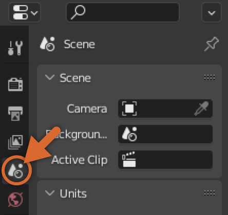
2. 단위 섹션에서 **단위 스케일**을 `0.01`로 변경하고 **길이**를 **센티미터**로 설정합니다.

또는 파일을 내보낼 때 스케일링을 수정할 수 있습니다:

1. **파일** > **내보내기** > FBX (.fbx)로 이동합니다.
2. **변환** > **스케일**을 `.01`로 설정합니다. 
   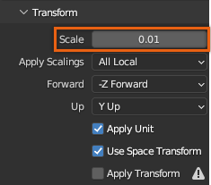

### 애니메이션 범위

<Alert severity = 'warning'>
Blender 다운로드 템플릿을 사용하는 경우 이 섹션을 건너뛸 수 있습니다. 템플릿의 `.blend` 버전에는 Blender 프로젝트 설정을 설정할 때 필요한 많은 프로젝트 설정이 이미 포함되어 있습니다.
</Alert>

얼굴 애니메이션이 포함된 사용자 지정 캐

릭터의 경우, 타임라인 범위가 0에서 330 사이로 설정되어 있는지 확인하십시오:

1. 애니메이션 패널의 오른쪽 상단에서 **시작**을 `0`으로 설정합니다.
2. 애니메이션 패널의 오른쪽 상단에서 **종료**를 `330`으로 설정합니다.

   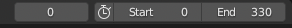

프로젝트 설정을 변경한 후에는 **파일** > **기본값** > **시작 파일 저장**으로 이동하여 이를 기본 Blender 프로젝트 설정으로 저장할 수 있습니다.

---
## 출처
 - [Blender Configuration](https://create.roblox.com/docs/art/characters/creating/blender-configurations)

---
## [다음](./05_04_Modeling_Best_Practices.md)