# Modeling Best Practices

## 목차
- [Modeling Best Practices](#modeling-best-practices)
  - [목차](#목차)
  - [비파괴 모델링](#비파괴-모델링)
  - [엣지 플로우](#엣지-플로우)
  - [출처](#출처)
  - [다음](#다음)

---

모델링, 때때로 **조각**이라고도 하는 것은 모델 또는 메시의 기하학적 모양을 형성하는 과정입니다. 이 가이드는 고유한 캐릭터 모양을 만들기 전에 검토해야 할 중요한 개념과 팁을 다룹니다.

가장 복잡한 구성 요소를 포함하는 캐릭터의 머리에 비파괴 조각 변경을 적용하는 방법을 이해하면 이러한 기술과 개념을 캐릭터 모델 본체의 다른 부분에도 계속 적용할 수 있습니다.

<!-- <GridContainer numColumns="2">
  <figure>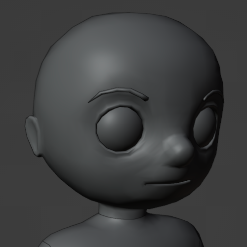  <figcaption>시작 템플릿 모델</figcaption></figure>

  <figure>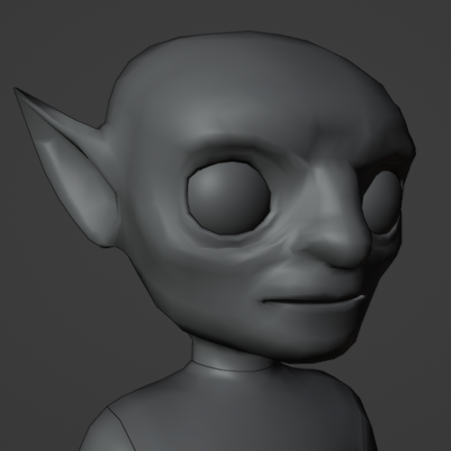<figcaption>커스텀 조각 후 모델</figcaption></figure>
</GridContainer> -->

|시작 템플릿 모델|커스텀 조각 후 모델|
|---|---|
|||

템플릿을 편집할 때 **캐릭터 본체에 꼭짓점(버텍스)을 삭제하거나 추가하지 마세요**. 이는 캐릭터의 스키닝 및 얼굴 애니메이션 데이터가 변경되지 않고 완전히 기능할 수 있도록 보장합니다. 아바타 템플릿의 기본 구조를 손상시키지 않고 캐릭터 본체를 사용자 정의하는 방법에 대한 추가 정보는 `최고의 실습`을 참조하십시오.

## 비파괴 모델링

비파괴 모델링은 기본 메시 객체의 물리적 모양이나 구조를 변경하지 않는 프로세스를 의미합니다. 템플릿 모델을 수정할 때 메시의 꼭짓점을 삭제하거나 추가하는 도구나 기능을 사용하지 마십시오. 대신 Blender의 조각 도구를 사용하여 **기존 꼭짓점의 위치만 변경**하여 캐릭터의 모양을 변경하십시오. 이는 스키닝 또는 애니메이션 데이터가 연결된 꼭짓점과 면이 중요한 캐릭터 데이터를 유지하도록 보장합니다.

<Alert severity = 'warning'>
꼭짓점이 삭제되지 않더라도 극단적인 기하학적 변화는 리깅 및 스키닝에 부정적인 영향을 미칠 수 있습니다. 최종 디자인과 가까운 시작 템플릿 파일을 선택하고 조각할 때 일관되고 비례적인 변화를 만드는 것이 중요합니다.
</Alert>

## 엣지 플로우

엣지 플로우는 모델의 꼭짓점이 모델의 유기적인 곡률을 자연스럽게 따르도록 하는 일반적인 모델링 개념입니다. 모델의 지형을 변경할 때 꼭짓점이 서로 비례 거리를 유지하고 모델의 일반적인 근육 그룹과 윤곽을 따르도록 하여 자연스러운 엣지 플로우를 유지해야 합니다.

엣지 플로우를 유지하더라도 캐릭터 모델의 특정 영역을 조각하는 것은 피해야 합니다. 다음은 자연스러운 엣지 플로우를 따르고 유사한 모양을 유지해야 하는 얼굴의 중요한 부분 예입니다:

<table>
<thead>
  <tr>
    <th>둥근 머리 영역 (Round)</th>
    <th>둥근 머리 영역 (Narrow)</th>
    <th>엣지 플로우 노트</th>
  </tr>
</thead>
<tbody>
  <tr>
    <td>
    <!-- <Tabs>
      <TabItem label="둥근">
        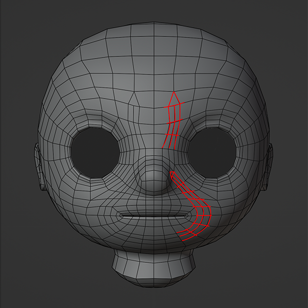
      </TabItem>
      <TabItem label = "좁은">
         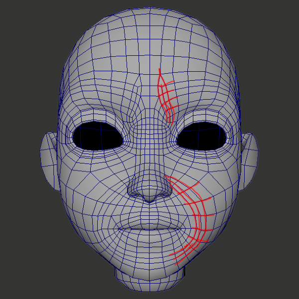
      </TabItem></Tabs> -->
      
      </td>
      <td></td>
    <td>이마 주름과 비구간 엣지: 이마 주름과 비구간 엣지의 엣지 라인은 입, 이마 찡그림, 눈썹 움직임, 볼 등 여러 표정에서 중요합니다. 이러한 지형 섹션을 수정하는 경우 가능한 한 원래 모양을 유지하고 서로 비슷한 상대적 관계를 유지하도록 하십시오.</td>
  </tr>
  <tr>
  <td>
    <!-- <Tabs>
      <TabItem label="둥근">
        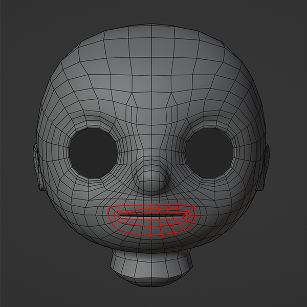
      </TabItem>
      <TabItem label = "좁은">
         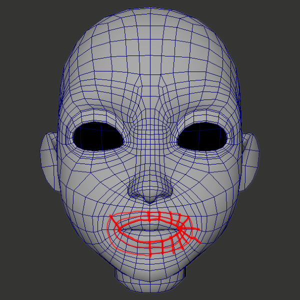
      </TabItem></Tabs> -->
      </td>
      <td></td>
    <td>입과 입술 엣지: 입과 입술을 둘러싼 지형은 입이 열리고 닫히도록 원형 메시 구조를 가지고 있습니다. 이 구조는 메시를 접어서 입술을 자연스럽게 *a*, *e*, *i*, *o*, *u* 모음을 시각화할 수 있습니다. 중립적인 모양은 닫힌 입이며, 엣지 플로우는 입 주위에서 연속적인 라인으로, 예상된 입 모양을 정확하게 접고 변형할 수 있습니다.  이 튜토리얼에서는 얼굴 지형의 이 영역을 수정하는 것이 추천되지 않습니다. 왜냐하면 이로 인해 기본 혀, 상악 및 하악, 저장된 얼굴 데이터에 부정적인 영향을 미칠 위험이 있기 때문입니다. 조각 마스크를 사용하여 이 영역이 모델링 변경에 영향을 받지 않도록 할 수 있습니다.</td>
  </tr>
  <tr>
    <td>
    <!-- <Tabs>
      <TabItem label="둥근">
        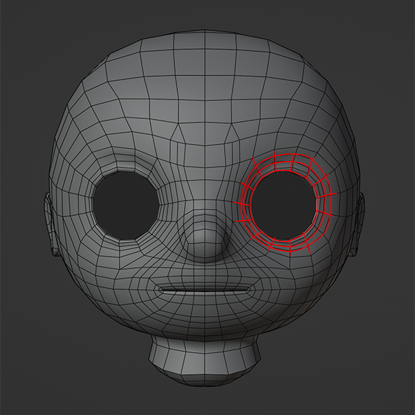
      </TabItem>
      <TabItem label = "좁은">
         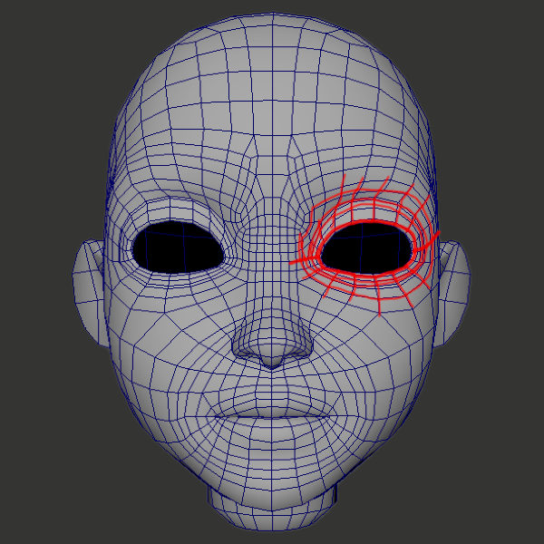
      </TabItem></Tabs> -->
      </td>
      <td></td>
    <td>눈: 눈꺼풀에는 눈을 감을 수 있을 만큼 충분한 메시 라인이 있습니다. 눈꺼풀의 연속적인 라인은 눈을 깜빡이거나 크게 뜰 때 눈꺼풀이 예상대로 변형되고 접힐 수 있도록 합니다.   이 튜토리얼에서는 얼굴 지형의 이 영역을 수정하는 것이 추천되지 않습니다. 왜냐하면 이로 인해 기본 안구 메시와 정확한 표현에 기여하는 저장된 얼굴 데이터에 부정적인 영향을 미칠 위험이 있기 때문입니다. 조각 마스크를 사용하여 이 영역이 모델링 변경에 영향을 받지 않도록 할 수 있습니다.</td>
  </tr>
  <tr>
    <td>
    <!-- <Tabs>
      <TabItem label="둥근">
        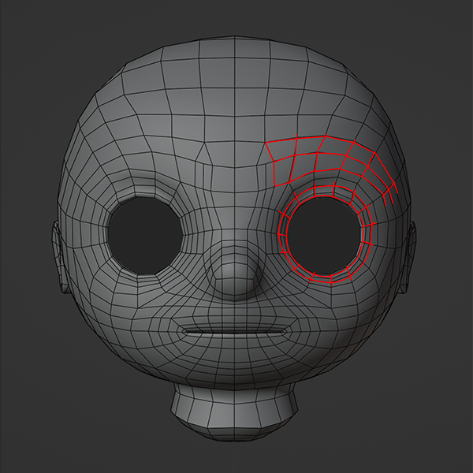
      </TabItem>
      <TabItem label = "좁은">
         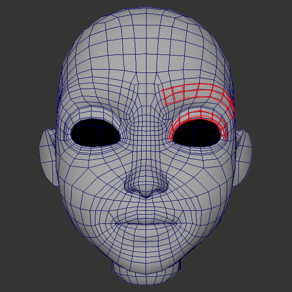
      </TabItem></Tabs> -->
      </td>
      <td></td>
    <td>눈꺼풀과 눈썹: 눈꺼풀과 눈썹 사이에는 충분한 공간이 필요합니다.  눈 위의 지형을 수정하는 경우, 눈꺼풀과 눈썹 사이에 자연스러운 공간이 필요하다는 점을 염두에 두십시오. 눈꺼풀과 눈썹은 다양한 얼굴 표정과 함께 위치를 변경하고 이동할 수 있으며, 잘못 모델링되면 얼굴 포즈 중에 서로 충돌할 수 있습니다.</td>
  </tr>
</tbody>
</table>

엣지 플로우 개념을 따르지 않으면 모델의 토폴로지가 애니메이션 중에 서로 충돌하여 때로는 충돌로 알려진 현상이 발생할 수 있습니다.

<figure>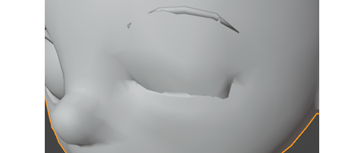 <figcaption>이 예에서는 눈꺼풀의 윗부분과 아랫부분이 닫힐 때 서로 지나가면서 꼭짓점이 충돌하고 충돌하여 톱니 모양의 인공물이 발생합니다.</figcaption></figure>

템플릿 메시를 신중하게 조각하여 나중에 이러한 토폴로지 충돌을 수정할 필요가 없도록 하십시오. 이는 종종 리그, 스키닝 및/또는 얼굴 애니메이션 데이터를 수동으로 수정해야 할 수 있습니다.

---
## 출처
 - [Modeling Best Practices](https://create.roblox.com/docs/art/characters/creating/modeling-best-practices)

---
## [다음](./05_05_Modeling_Tips.md)